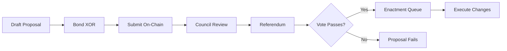

import { Aside, Card, CardGrid, LinkCard, Steps } from '@astrojs/starlight/components';

:::tip[Official Documentation]
This content reflects SORA governance as of December 2025.
[View SORA Wiki - Governance](https://wiki.sora.org/sora-governance.html)
:::

# SORA Governance

Governance is the process by which a decentralized network makes collective decisions. In SORA, this means deciding how newly minted [XOR](/glossary/xor) is allocated, which runtime upgrades are approved, and how the ecosystem evolves over time.

SORA's governance model is designed to be **democratic, transparent, and resistant to plutocracy**—ensuring that no single entity or wealthy minority can control the network's future.

## Current State: Governance V1

The SORA network currently operates under **Governance V1**, a system adapted from Polkadot's original governance framework (prior to OpenGov). This system provides stability and predictability while the more advanced [SORA Parliament](/glossary/soraparliament) is developed.

### Governance Bodies

Governance V1 consists of three primary bodies:

<CardGrid>
  <Card title="Council" icon="group">
    Elected representatives who propose referenda, cancel dangerous proposals, and represent the community's interests.
  </Card>
  <Card title="Technical Committee" icon="setting">
    Experts who can fast-track urgent proposals (like security fixes) without the normal voting period.
  </Card>
  <Card title="Parliament" icon="document">
    All XOR holders who vote on referenda to make final decisions on proposals.
  </Card>
</CardGrid>

### How Governance V1 Works

<Steps>
1. **Proposal Creation**
   
   Anyone can submit a proposal by bonding XOR. Proposals can include runtime upgrades, parameter changes, treasury spending, or other network modifications.

2. **Council Review**
   
   The Council reviews proposals and decides which ones to put forward as referenda. They can also create their own proposals.

3. **Referendum Period**
   
   Approved proposals enter a voting period where all XOR holders can vote. Votes are weighted by the amount of XOR held and the conviction (lock-up period) chosen.

4. **Enactment**
   
   Passed referenda are enacted after a delay period, giving the network time to prepare for changes.
</Steps>

### Voting Mechanics

Governance V1 uses **stake-weighted voting** with conviction multipliers:

| Lock Period | Conviction | Vote Weight |
|-------------|------------|-------------|
| No lock | 0.1x | 10% of stake |
| 1 week | 1x | 100% of stake |
| 2 weeks | 2x | 200% of stake |
| 4 weeks | 3x | 300% of stake |
| 8 weeks | 4x | 400% of stake |
| 16 weeks | 5x | 500% of stake |
| 32 weeks | 6x | 600% of stake |

This system rewards long-term commitment: voters who lock their XOR for longer periods have more influence on decisions.

---

## The SORA Parliament: Future Governance

The [SORA Parliament](/glossary/soraparliament) represents the future of SORA governance—a sophisticated multi-body system designed to be more inclusive, fair, and resistant to manipulation than traditional token-weighted voting.

### The Problem with Token Voting

Most blockchain governance systems use simple token-weighted voting, which leads to:

- **Plutocracy** — Wealthy holders dominate decisions
- **Voter apathy** — Small holders feel their vote doesn't matter
- **Centralization** — Exchanges and funds accumulate voting power
- **Short-termism** — Speculation over long-term ecosystem health

The SORA Parliament addresses these issues through **sortition-based democracy**.

### What is Sortition?

[Sortition](/glossary/sortition) is a governance mechanism where participants are **randomly selected** rather than elected or self-selected based on token holdings. This is how ancient Athenian democracy worked and has several advantages:

- **Fair representation** — Anyone can be selected, not just the wealthy
- **Prevents plutocracy** — Token holdings don't determine power
- **Resistant to bribery** — Random selection is harder to corrupt
- **Encourages participation** — Everyone has a real chance of being chosen

### Parliament Structure

The SORA Parliament will consist of multiple specialized bodies:

<Aside type="note" title="Parliament Bodies">
1. **Rules Committee** — Sets procedural rules for governance
2. **Agenda Council** — Prioritizes and schedules proposals
3. **Interest Panels** — Domain-specific groups (DeFi, bridges, etc.)
4. **Review Panel** — Evaluates proposal quality and compliance
5. **Policy Jury** — Makes final decisions on contested issues
</Aside>

### Citizenship and XOR Bonds

To participate in the SORA Parliament, individuals become **citizens** by posting [XOR bonds](/glossary/xorbonds):

1. **Bond XOR** — Lock XOR tokens as a commitment to good governance
2. **Become Eligible** — Enter the pool of potential governance participants
3. **Random Selection** — Be sortitioned into governance bodies
4. **Serve Terms** — Participate in governance duties
5. **Recover Bond** — Get your XOR back after honest participation

Bonds can be slashed for malicious behavior, creating economic incentives for honest participation.

### Main Task: XOR Allocation

The Parliament's primary responsibility is **allocating newly minted XOR to productive projects**. This includes:

- Development grants
- Ecosystem initiatives
- Infrastructure funding
- Community programs
- Strategic investments

Rather than arbitrary inflation, new XOR is directed toward value-creating activities chosen by the community through the Parliament.

---

## On-Chain Governance Mechanics

All SORA governance happens on-chain, meaning:

- **Transparency** — Every proposal and vote is publicly recorded
- **Immutability** — Past decisions can be audited and verified
- **Automation** — Approved changes execute automatically
- **No gatekeepers** — Anyone can participate according to the rules

### Proposal Lifecycle

### Types of Proposals

| Proposal Type | Description | Typical Timeline |
|---------------|-------------|------------------|
| Runtime Upgrade | Code changes to the network | 2-4 weeks |
| Parameter Change | Adjust network settings | 1-2 weeks |
| Treasury Spending | Allocate community funds | 2-3 weeks |
| Emergency Fix | Critical security patches | Fast-tracked |

### Governance Parameters

Key parameters that governance can modify:

- **Transaction fees** — Base fee levels and burn percentages
- **Staking parameters** — Validator counts, reward rates
- **Bridge settings** — Cross-chain configurations
- **Token parameters** — TBC reserve ratios, fee structures

---

## Governance in SORA Nexus (v3)

The transition to [SORA Nexus](/glossary/soranexus) brings significant governance enhancements:

### Hybrid DAO Framework

SORA v3 governance will be a **hybrid** model:

- **Parliamentary Structure** — Maintained for strategic oversight
- **Modular Logic** — Governance encoded in Iroha Special Instructions (ISIs)
- **Domain-Specific** — Different governance for different areas

### Governance Surfaces

[Governance surfaces](/glossary/governancesurfaces) in SORA Nexus define where and how governance applies:

1. **Configuration** — `iroha_config` is the source of truth
2. **Parameter Sets** — Versioned, on-chain governance parameters
3. **Attestations** — Cryptographic certificates for governance actions
4. **Data Spaces** — Each data space can have customized governance

### Council and Assembly

The Nexus governance structure includes:

- **Council** — Fixed seats filled by NPoS/appointment
- **Assembly** — Stake-weighted or one-person-one-vote participation

Selection uses VRF (Verifiable Random Function) sortition with defined thresholds, ensuring fair and verifiable randomness.

### Runtime Upgrades

Governance-controlled runtime upgrades in SORA Nexus:

<Steps>
1. **Governance Manifest**
   
   Proposal includes hashes, ABI versions, config, and activation slot

2. **Stage and Verify**
   
   Network prepares for upgrade, verifies manifests match

3. **Atomic Activation**
   
   At the specified slot, upgrade activates atomically

4. **Reject Mismatches**
   
   Any manifest mismatch causes rejection
</Steps>

---

## Participating in Governance

### As a Voter

Any XOR holder can participate in Governance V1:

1. Navigate to the governance portal
2. Review active proposals
3. Choose your vote (Aye/Nay)
4. Select conviction (lock period)
5. Submit your vote

### As a Proposer

To create a proposal:

1. Draft your proposal clearly
2. Bond the required XOR
3. Submit on-chain
4. Engage with the community
5. Respond to Council feedback

### As a Council Member

Council members are elected by the community and have additional responsibilities:

- Review incoming proposals
- Propose new referenda
- Cancel dangerous proposals
- Represent community interests

---

## Governance Best Practices

<Aside type="tip" title="For Successful Governance">
1. **Research thoroughly** — Understand proposals before voting
2. **Participate actively** — Governance works best with engagement
3. **Think long-term** — Consider ecosystem health over short gains
4. **Engage constructively** — Debate respectfully in community channels
5. **Verify information** — Check official sources, not just rumors
</Aside>

### Common Governance Questions

**Q: Can I change my vote?**
A: Yes, during the voting period you can update your vote.

**Q: What happens to my locked XOR?**
A: It remains locked for the conviction period you selected, then becomes available.

**Q: How do I get on the Council?**
A: Council members are elected by XOR holders. Announce your candidacy and campaign.

**Q: What's the minimum XOR needed to vote?**
A: There's no minimum, but gas fees apply to voting transactions.

---

## Summary

SORA governance evolves through three phases:

| Phase | System | Key Feature |
|-------|--------|-------------|
| Current | Governance V1 | Council + referendum model |
| Transition | Enhanced V1 | Preparation for Parliament |
| Future | SORA Parliament | Sortition-based democracy |

The goal is a governance system that is:

- **Fair** — No plutocracy, everyone has a voice
- **Efficient** — Decisions made in reasonable timeframes
- **Secure** — Resistant to attacks and manipulation
- **Transparent** — All actions visible on-chain
- **Evolutionary** — Can adapt and improve over time

---

## Learn More

<CardGrid>
  <LinkCard
    title="SORA Parliament"
    description="Deep dive into the future governance model"
    href="/glossary/soraparliament"
  />
  <LinkCard
    title="Sortition"
    description="How random selection creates fair governance"
    href="/glossary/sortition"
  />
  <LinkCard
    title="XOR Bonds"
    description="Citizenship bonds and governance staking"
    href="/glossary/xorbonds"
  />
  <LinkCard
    title="Governance V1"
    description="Current governance system details"
    href="/glossary/governancev1"
  />
</CardGrid>

---

## Next Steps

- [SORA Nexus](/docs/fundamentals/sora-nexus) — Governance enhancements in SORA v3
- [Tokenomics](/docs/fundamentals/tokenomics) — Economic model governed by Parliament
