2021 Year in Review

PRESS RELEASE

SORAMITSU Co., Ltd. 
Shibuya-ku, Tokyo, Japan

[info@soramitsu.co.jp](mailto:info@soramitsu.co.jp) 
[soramitsu.co.jp](https://soramitsu.co.jp)

**FOR IMMEDIATE RELEASE 
**Tuesday, Feb 1, 2022 

# 2021 Year in Review

## → SORAMITSU entered 2021 at a quick pace, and made significant progress toward a number of milestones. This report surveys the ground we’ve covered over the course of a challenging, yet inspiring year.

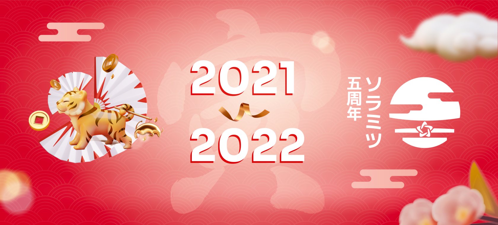

**Executive summary (TL;DR) 
** 
The report begins with an overview of our growth as a company and community, then summarises our achievements in two focal areas: digital asset management and decentralised finance/Web3. Our digital asset management projects include the National Bank of Cambodia's Bakong payment system, the Monetary Authority of Singapore's Global CBDC Challenge, and research and development cooperations with the Japan International Cooperation Agency (JICA), the NTT Data Institute of Management Consulting, and Datachain. Our decentralised finance/Web3 projects are diverse, with highlights including the multi-asset Fearless Wallet app and contributions to the SORA, Polkadot, and Kusama decentralised ecosystems. 
 
Alongside our development work, SORAMITSU made significant education and outreach efforts this year. Notable initiatives include the implementation of Bakong as a use case within the Wharton School's recently launched Economics of Blockchain and Digital Assets executive program, seminars with central banks and tech innovators, and ongoing cooperations with partners such as the Hyperledger Foundation, the Global Blockchain Business Council, and the World Economic Forum. The report concludes with a preview of 2022. 
 
Without further ado, please enjoy the 2021 SORAMITSU Year in Review. 
 
 

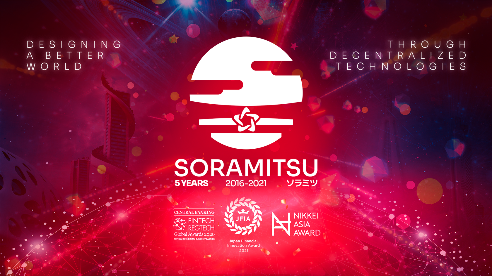

**SORAMITSU: A Growing Company and Community 
** 
SORAMITSU saw considerable growth in 2021, both as a company and a community. We are proud to have welcomed 70 new employees from numerous countries throughout the year, in business areas ranging from blockchain architecture to human resources. The SORAMITSU team is a reflection of the world we want to live in: culturally diverse, with a wide spectrum of skills and interests, united by both individual ambition and commitment to the common good. 

As well as bringing in new employees, [SORAMITSU welcomed Mr. Nobuyuki Idei](https://soramitsu.co.jp/idei-nobuyuki-press-release) to our Advisory Board. Mr. Idei founded the Quantum Leaps Corporation and was also a board member at Sony, which he helped develop into the technological powerhouse it is today. Drawing on Mr. Idei's expertise and global network, SORAMITSU will continue to advance the frontiers of blockchain engineering while solving challenges for its customers and society as a whole.

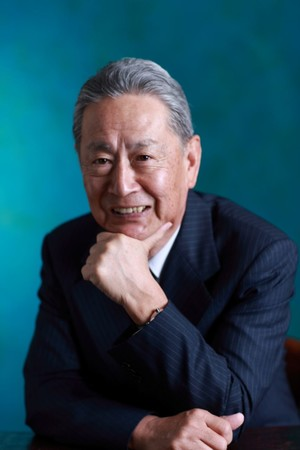 

On the community side, SORAMITSU has continued to expand mindshare and engagement. Our [LinkedIn community](https://www.linkedin.com/company/soramitsu) has grown by 572 followers in the past year, our [Twitter account](https://twitter.com/soramitsu_co) has attracted over 3,500 new followers, and developers around the world use, and contribute to, our open-source platforms. We thank you all for your continued support, and look forward to scaling our community and company even further in 2022. 

**Projects and Initiatives 
** 
**Digital Asset Management 
** 
History will remember 2021 as the year the concept of central bank digital currency (CBDC) went mainstream: according to the Bank for International Settlements, in 2019, around [42% of central banks](https://www.bis.org/publ/bppdf/bispap107.pdf) were conducting digital currency experiments or proof-of-concept tests; this rose to a [majority](https://www.bis.org/publ/bppdf/bispap114.pdf) in 2020, and a [supermajority](https://www.bis.org/publ/bppdf/bispap116.pdf) in 2021. 
 
SORAMITSU is a first mover in the digital asset space, having co-developed the enterprise-grade [Hyperledger Iroha](https://www.hyperledger.org/use/iroha) blockchain in 2017 and the National Bank of Cambodia's [Bakong](https://bakong.nbc.org.kh/en/) payment infrastructure in 2019. Recognition of Bakong spiked in 2021 among [financial](https://asia.nikkei.com/Business/Markets/Currencies/Cambodia-aims-to-wean-off-US-dollar-dependence-with-digital-currency) [journalists](https://www.reuters.com/markets/rates-bonds/cambodia-aims-hybrid-digital-currency-blockchain-unbanked-2021-12-22/), the [public sector](https://www.mas.gov.sg/-/media/MAS/Fintech/FDI/Foundational%20Digital%20Infrastructures%20for%20Inclusive%20Digital%20Economies.pdf), and the [private sector](https://www.pwc.com/gx/en/industries/financial-services/assets/pwc-cbdc-global-index-1st-edition-april-2021.pdf) alike, culminating in a prestigious [Nikkei Superior Products and Services Award](https://asia.nikkei.com/Business/Finance/Cambodia-s-digital-currency-reaches-nearly-half-the-population). In parallel to our ongoing work on Bakong, SORAMITSU has deepened our project portfolio in Asia, expanded into Oceania, and forged new relationships with public- and private-sector innovators, continually improving our skill set. 

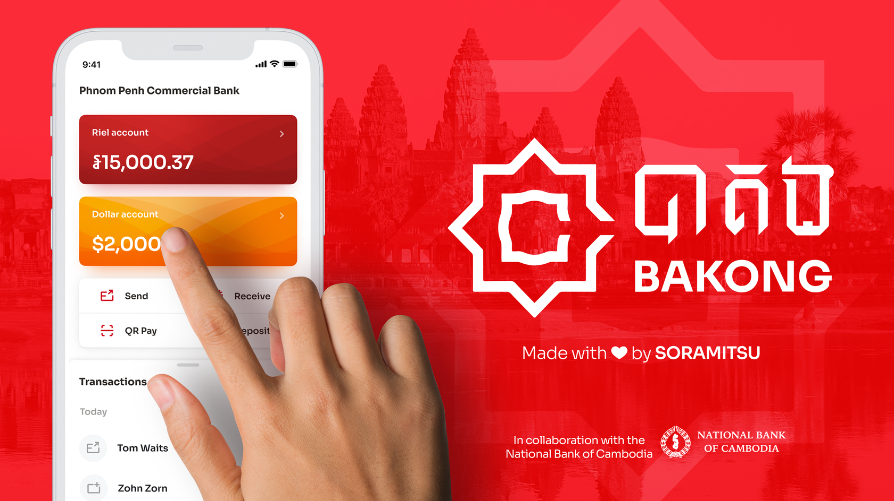

**[National Bank of Cambodia](https://soramitsu.co.jp/centralbanking): Bakong 
** 
Bakong is a digital currency and backbone payment infrastructure operated by the National Bank of Cambodia (NBC). Built by SORAMITSU on the basis of Hyperledger Iroha, it was piloted in 2019 and officially launched in 2020, making it the first system of its kind to go live. As of November 2021, around 270,000 previously unbanked or underbanked Cambodians had created Bakong wallets using a SORAMITSU-designed end-user app, while another 7.9 million – roughly half the population – were using the system indirectly via the commercial banks and payment service providers that it connects. Total transaction volume by November was equivalent to around $2.9 billion USD. 
 
Bakong's contributions to the Cambodian economy have received widespread recognition. In 2021, the system was awarded a [Nikkei Superior Products and Services Award](https://asia.nikkei.com/Business/Finance/Cambodia-s-digital-currency-reaches-nearly-half-the-population) for its "innovative technology and impact on the country's economic and social development." On the strength of Bakong and concurrent innovations, _The Banker_ named Governor of the NBC Chea Chanto [Central Banker of the Year Asia-Pacific](https://www.thebanker.com/Awards/Central-Bank-Governor-of-the-Year/Central-Banker-of-the-Year-2021), while _CoinDesk_ named deputy director general Serey Chea, who led the project, as one of the year's [most influential 50 fintech players](https://www.coindesk.com/policy/2021/12/09/most-influential-40-serey-chea/). SORAMITSU was similarly recognised with a [Japan Fintech Award](https://jfia.tokyo/), a notable follow-up to our 2020 [FinTech & RegTech Global Award](https://www.centralbanking.com/awards/7681581/central-bank-digital-currency-partner-soramitsu). 
 
Throughout this exciting year, SORAMITSU has designed and developed new Bakong features, while providing steady technical and operational support to the NBC. Major 2021 upgrades and innovations include a simplified registration process, more flexible management of user roles and permissions, QR payment by deep linking, in-app currency exchanges (KHR/USD, USD/KHR), and a cooperation with [Maybank](https://www.maybank2u.com.my/maybank2u/malaysia/en/personal/services/funds_transfer/overseas/maybank-bakong_transfer.page?) to make Bakong transfers available to Cambodian workers in Malaysia at a fraction of the cost of traditional remittance services. 2022 should also bring significant developments, including extended cross-border interoperability.

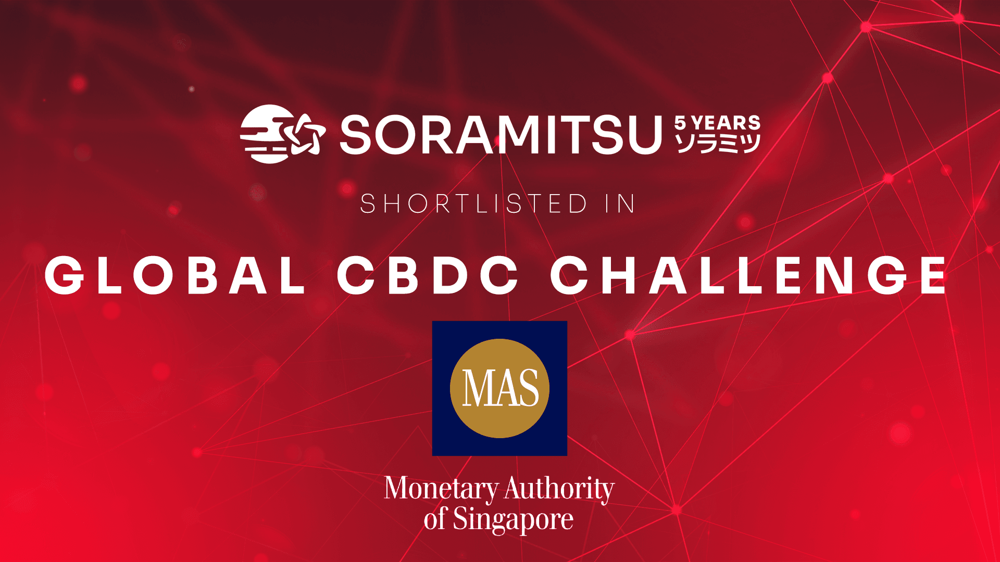

**[Monetary Authority of Singapore](https://soramitsu.co.jp/global-central-bank-digital-currency-challenge/): Global CBDC Challenge 2021 
** 
The Monetary Authority of Singapore (MAS) is both a [thought leader in the CBDC space](https://www.mas.gov.sg/development/fintech/central-bank-digital-currency) and a public-sector [blockchain innovator](https://www.mas.gov.sg/-/media/Jasper-Ubin-Design-Paper.pdf). It is thus a particular honour for SORAMITSU to have been [selected by MAS](https://www.mas.gov.sg/news/media-releases/2021/mas-announces-15-finalists-for-the-global-cbdc-challenge) to participate in its [2021 Global CBDC Challenge](https://soramitsu.co.jp/global-central-bank-digital-currency-challenge/). Out of over 300 applications, 15 finalists were chosen on the strength of proposals that ran the gamut from full systems, to hardware devices, to CBDC-based applications targeting specific socioeconomic problems. 
 
SORAMITSU's [entry in the Challenge](https://www.mas.gov.sg/-/media/MAS-Media-Library/development/fintech/CBDC/Global-CBDC-Challenge-Report-2021.pdf) was inspired by our experience working with Bakong and its commercial partners. Access to credit is requisite for MSMEs and entrepreneurs to participate fully in economic growth; however, in emerging markets like Cambodia, they often lack the documents and records required to verify creditworthiness. In a country using a CBDC or comparable payment system (like Bakong), historical payment data could in principle be used to fill this gap. A problem here is that providing lenders with transaction records could enable the formation of [data monopolies](https://www.un.org/en/desa/economic-properties-data-and-monopolistic-tendencies-data-economy-policies-limit) inimical to both competition and consumer trust. SORAMITSU's solution solves this problem by allowing lenders to query data relevant to credit underwriting in a Boolean (true/false) format. The app furthermore requires informed consent from the wallet being queried. It thus allows lenders to triangulate propensity to pay, while preserving the principle of data minimisation and the inviolability of user privacy. 
 
While the SORAMITSU app is designed for Bakong, it could sit atop any two-tiered CBDC or comparable payment system. As an engineer-led firm, we believe that building CBDC infrastructures is only the beginning; equally exciting are the wide range of apps that will leverage new systemic capacities to improve users' lives in targeted ways. The MAS Challenge gave us an invaluable opportunity to think and build in such a long-term, integrated manner. 

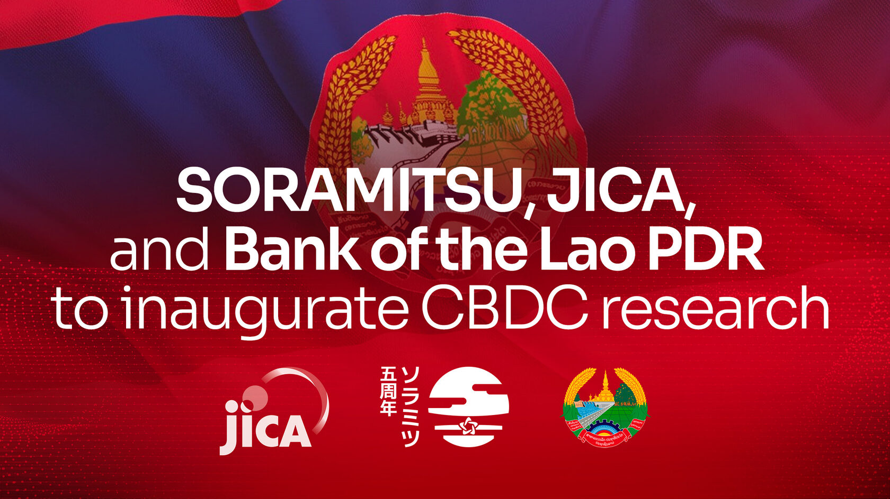

**[JICA and the Bank of the Lao PDR](https://soramitsu.co.jp/digital-currency-research): CBDC Research and Development in Laos 
** 
The Japan International Cooperation Agency (JICA) was [founded](https://www.jica.go.jp/english/about/mission/index.html) to "take the lead in forging bonds of trust across the world, aspiring for a free, peaceful and prosperous world where people can hope for a better future." This makes JICA a natural partner for SORAMITSU, which was founded to leverage advanced technology toward the same ends. In 2021, [JICA selected SORAMITSU](https://asia.nikkei.com/Business/Markets/Currencies/Laos-enlists-Japan-startup-for-study-on-digital-currency) to lead a feasibility study on central bank digital currency in Laos. The study will comprehensively survey local financial infrastructures and assess the potential of various CBDC models to contribute to inclusive, efficient, and sustainable economic growth. It will furthermore explore the applicability of cross-border schemes similar to those developed by the National Bank of Cambodia and Maybank, as well as [multi-CBDC (mCBDC) arrangements](https://www.bis.org/publ/bppdf/bispap115.pdf) involving numerous central banks. 

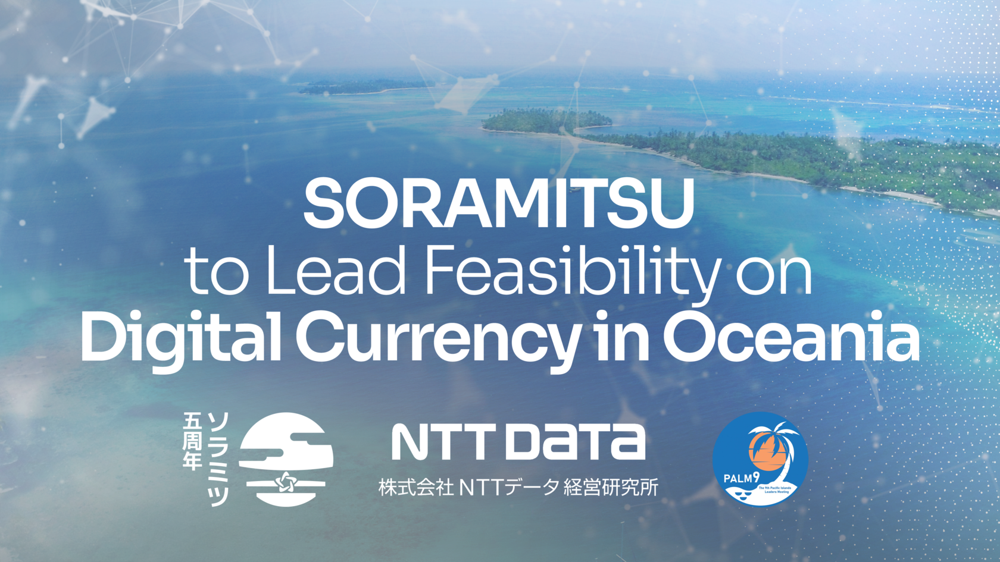

**[NTT Data Institute of Management Consulting](https://soramitsu.co.jp/digital-currency-oceania/): CBDC Research and Development in Oceania 
** 
As CBDC went global in 2021, it is fitting that SORAMITSU's digital currency work will open 2022 by expanding beyond Asia. We are honoured to have been selected by the NTT Data Institute of Management Consulting to lead a feasibility study on CBDC in four Pacific Island countries. Like the JICA-led project in Laos, this study represents Japan's commitment to public-private cooperation in the Pacific region. It is grounded on the policy objectives of the Cabinet Secretariat of Japan and the Ninth Pacific Island Leaders Meeting ["Joint Action Plan for Pacific Bonds \[_kizuna_\] and for Mutual Prosperity,"](https://www.mofa.go.jp/files/100208113.pdf) an ambitious agenda for strengthening the bonds – in Japanese, _kizuna_ (絆) – between Japan and its regional partners. The study, which is expected to focus on Fiji, Tonga, Solomon Islands, and Vanuatu, will investigate the current status of financial infrastructures, payment procedures between financial institutions, the market penetration of cashless payments, and the networks of actors (such as commercial banks and non-bank payment service providers) currently providing services. It will also evaluate the possibility of introducing central bank digital currencies, cryptocurrencies, and/or central bank-operated payment infrastructures – a question to which SORAMITSU's experience in the APAC region will contribute insight. 

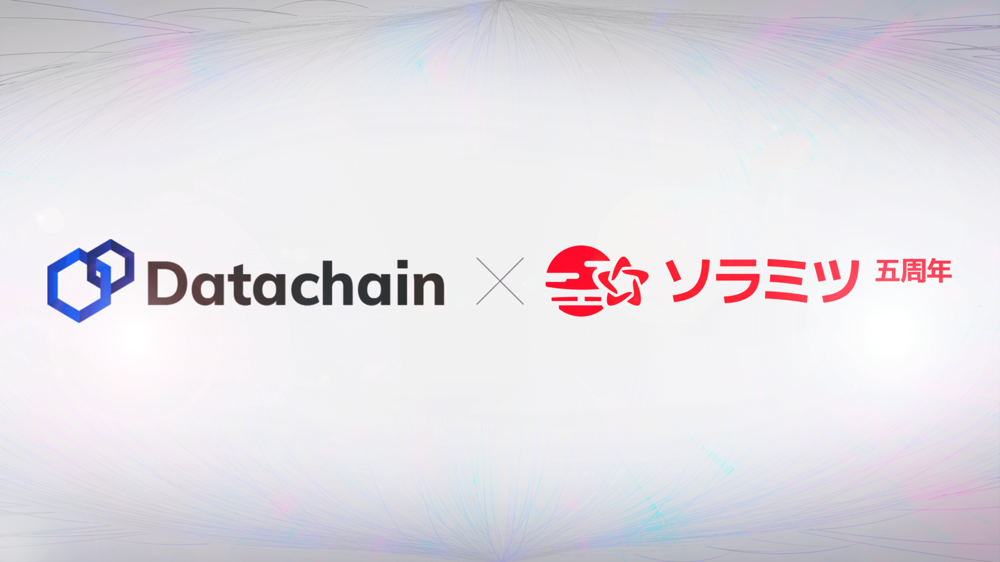

**[Datachain](https://soramitsu.co.jp/datachain-press-release): Interoperability Within the Hyperledger Ecosystem 
** 
SORAMITSU's flagship technology is [Hyperledger Iroha](https://www.hyperledger.org/use/iroha), an enterprise-grade distributed ledger technology (DLT) distinguished by its parsimonious and modular architecture, ease of implementation, emphasis on client application development, and performance. We co-developed Hyperledger Iroha in 2017 and contributed it to the [Hyperledger Foundation](https://www.hyperledger.org/). Because each DLT has a distinct design, set of features, and portfolio of use cases, improving cross-DLT interoperability is a high priority for the Hyperledger community. In November 2021, SORAMITSU began working toward this goal with fellow Japanese developers [Datachain](https://www.datachain.jp/). We will begin by building two Hyperledger Iroha blockchains and connecting them with [Hyperledger Lab YUI](https://github.com/hyperledger-labs/yui-docs) modules and middleware, which utilise the [Cosmos Inter-Blockchain Communication Protocol (IBC)](https://docs.cosmos.network/master/ibc/overview.html). This will allow data, including tokens representing various types of assets, to be bridged instantly and securely between the two blockchains. After achieving this milestone, SORAMITSU and Datachain will explore concrete use cases: for example, the instant exchange of multiple digital currencies (payment-versus-payment) or the purchase of tokenised assets using digital currencies (delivery-versus-payment). We will also consider extending the project to allow interoperability with other blockchains, such as Hyperledger Fabric and Ethereum. The experience gained on this project will allow SORAMITSU to more effectively bridge our enterprise work and our contributions to Web3, the emerging worldwide network of interconnected blockchains. 

~

**Decentralized Finance (DeFi) and Web3 
** 
Decentralization is an important aspect of the next phase in the evolution of the internet, known as Web3 or Web 3.0. Much has been written about the Web3 concept, with buzzwords such as the metaverse, DeFi, NFTs, and decentralization itself now entering the mainstream. From an everyday use perspective, the biggest [differences between Web2 and Web3](https://www.freecodecamp.org/news/what-is-web3/) is that users will own their data, privacy will become a default condition, and transparency and verifiability will be achievable on a "trustless" basis, meaning without the need for a universally trusted third party. 
 
In the current internet dynamic, known as Web2, companies such as Alphabet and the recently-rebranded Meta are the primary custodians and/or owners of user data. Such companies profit by harvesting every user interaction to build profiles usable for commercial purposes (e.g., ad delivery). They also act as intermediaries trusted by multiple parties to verify important transactions – the irony being that they do not always behave in a trustworthy way. Web3 aims to shift the paradigm to an internet on which users own and control their data, and on which apps and services allow verifiable transactions on a peer-to-peer basis, implementing pseudonymity by default to shield valuable personally identifying information from commercial use. Blockchain, which enables such transactions by design, is critical to the Web3 vision. 

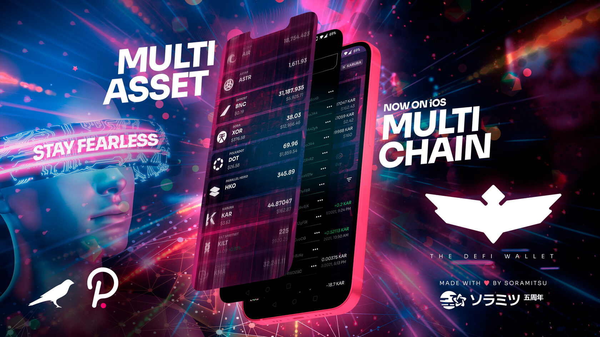

**Fearless Wallet 
** 
SORAMITSU is taking a holistic approach towards Web3, beginning with wallets. [Fearless Wallet](https://fearlesswallet.io/) is a SORAMITSU-designed app that gives the user an online presence and the power to interact with Web3 services using a simple and intuitive UX. 

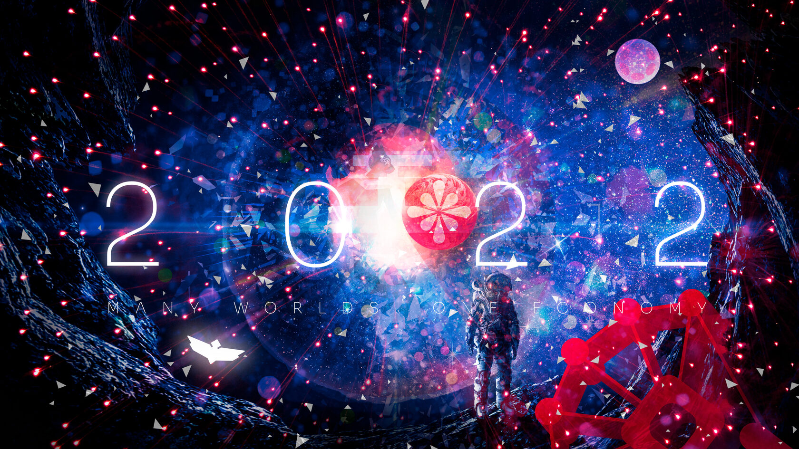

**SORA** 
 
SORAMITSU is confident that Web3 will become the dominant paradigm of the internet, and is playing a part in building this new reality as a contributor to SORA, a [new economic system](https://medium.com/sora-xor/sora-the-new-economic-order-3ec3f0327e5a) that decentralizes the concept of a central bank. SORA is also a network in the Polkadot ecosystem that [will connect to the Kusama relay chain](https://medium.com/sora-xor/the-sora-network-kusama-parachain-auction-5a6fe3a5f35f) and parachains, with built-in tools focused on DeFi application development. 
 
As the Internet shifts towards becoming a true metaverse, SORAMITSU will continue working towards achieving social and economic improvement and inclusion powered by technologies that respect people's rights to privacy and ownership of their personal data. Our contribution to transparent and decentralized platforms like SORA, as well as our participation in projects such as the [Pegasus World Kit metaverse](https://soramitsu.co.jp/pegasusworldkit/), built by JP Games, and the [SkyWhale](https://www.anahd.co.jp/group/en/pr/202105/20210520.html), powered by ANA, represent our commitment to this vision. 

**Polkaswap** 
 
SORAMITSU is also contributing to the DeFi platform [Polkaswap](https://polkaswap.io/), which empowers users to own and manage their own digital finances through liquidity provision and token swaps, and NFT platforms, which allow users to customize their online appearances and determine ownership of goods and services in the [many worlds that will be built to co-exist in our interconnected future](https://medium.com/sora-xor/many-worlds-one-economy-1ce709d4fb42). 

**For deeper insight into SORA and what it has achieved in 2021, we invite you to read the [2021 SORA, Polkaswap, and Fearless Wallet Year in Review](https://link.medium.com/GPnMLMDHgnb).**

~

**Education and Outreach 
** 
2021 has also been a year in which SORAMITSU has contributed its expertise to help foster education and awareness, through ongoing partnerships with stakeholders such as the Hyperledger Foundation, the Global Blockchain Business Council, and the World Economic Forum. 
 
**Wharton School of the University of Pennsylvania Executive Education Program 
** 
With support from the Hyperledger Foundation, the Wharton School recently launched the "[Economics of Blockchain and Digital Assets Executive Education Online Certificate Program](https://news.wharton.upenn.edu/press-releases/2021/10/wharton-launches-economics-of-blockchain-and-digital-assets-executive-education-online-certificate-program/)," which is the first of its kind with regard to its business model as well as its content (so far, it is the only Ivy league program to accept tuition payment in cryptocurrencies). The program is directed by [Dr. Cathy Barrera](https://twitter.com/cathybarreraphd), a Harvard economist and founder of Prysm Group, and is aimed at executives seeking to understand and leverage trends in digital finance and asset management. If you are interested in learning more about this program, [follow this link](https://www.blockchain.wharton.upenn.edu/). 
 
In collaboration with the Hyperledger Foundation and SORAMITSU, the Economics of Blockchain and Digital Assets program has included Bakong as a case study within its Digital Assets course module. The case study covers the concept and design aspects of central bank digital currencies and related digital currency models, the social and economic needs that Bakong was implemented to address, and the basic technical and organisational characteristics of the system, as well as providing an overview of the Cambodian historical economic context and future development outlook. 
 
In the lead-up to the Economics of Blockchain and Digital Assets program launch, Hyperledger Foundation Executive Director Daniela Barbosa hosted a fireside chat in which Dr. Cathy Barrera, SORAMITSU's Dr. James Edwards, and Emiliano Vernini of Poste Italiane spoke about several Hyperledger use cases presented within the program. You can watch the conversation here: 

**Invited Talks and Publications 
** 
As interest in digital currencies rose throughout 2020 and 2021, SORAMITSU has been invited to give workshops and talks to a number of central banks and international organisations, as well as to contribute to [white papers](https://www3.weforum.org/docs/WEF_Digital_Currency_Governance_Consortium_White_Paper_Series_2021.pdf) and [blogs](https://www.weforum.org/agenda/2021/08/cambodias-digital-currency-ishowing-other-central-banks-the-way/). We welcome all such opportunities to share our knowledge and experience with institutions seeking to chart a path forward in the brave new digital economy. 
 
SORAMITSU has also cooperated in outreach activities with other technology innovators such as [Kenja KK](https://kenja.com/news-13), which hosts the [Conversations on the Ledger](https://kenja.com/news-13) webinar series. In the SORAMITSU webinar, our CEO Makoto Takemiya, COO Andrew Wong, and social and market research lead Dr. James Edwards discussed the importance of financial inclusion and the potential socioeconomic impact of fintech powered by distributed ledger technology. You can watch the conversation here: 

Last but not least, we have worked with the World Economic Forum to raise awareness of the social impacts of fintech. Our CEO Makoto Takemiya contributed a post to the WEF's [Global Agenda series](https://www.weforum.org/agenda/2021/08/cambodias-digital-currency-ishowing-other-central-banks-the-way?utm_source=twitter&utm_medium=social_scheduler&utm_term=Financial+and+Monetary+Systems&utm_content=31/08/2021+11:00) explaining how Bakong helps foster financial inclusion by harnessing the power of technology to provide banking services to those who would not qualify for them in the traditional sense, while our research and consulting team contributed to and reviewed the WEF's recent [white paper](https://www3.weforum.org/docs/WEF_Digital_Currency_Governance_Consortium_White_Paper_Series_2021.pdf) on digital currency governance. 

**What's in Store for 2022**

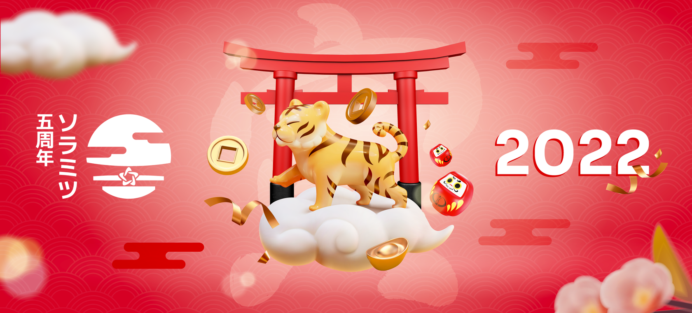

This year was special for the entire SORAMITSU family. Along with being our fifth anniversary, it brought unique opportunities to advance our mission: designing a better world through decentralized technologies. Our work on the Bakong digital currency has garnered a series of accolades, establishing a basis for collaborations throughout Asia and the Pacific. In parallel, our Web3 projects have helped set the pace for the evolution of the internet. 

Reiwa 3 (2021) was a year of incredible growth, during which our team developed significantly, as did the products that we released. We have a high level of talent and a unique vision to contribute to the liberation and empowerment of humanity. SORAMITSU has already accomplished a lot, but there is still much to do. We are committed to working hard and pushing human development forward every day. 
 
**—**_**Makoto Takemiya 
**__CEO and Co-Founder, SORAMITSU Group_ 

 

2021 saw tremendous successes for our team, which has worked hard on many fronts. I am very pleased with the progress we've made - together with our partners - to solidify our fundamentals, adapt to changing circumstances, and consistently fulfill our customers' needs. Our work in 2021 highlights the unique assets, both human and technological, that SORAMITSU brings to the shared challenge of building decentralized systems and empowering financial inclusion. 
**—**_**Andrew Wong 
**_COO, SORAMITSU Group__ 

 

~

**With several projects in the pipeline, 2022 – the Year of the Tiger – promises to be equally dynamic. Highlights will include:** 
 

* Significant improvements to the **Hyperleder Iroha DLT** 
 
 
* Ongoing support and feature development for **Bakong** (including improved know-your-customer procedures, nudges to assist with end-user password recovery, and a more robust backend maintenance mode) 
 
 
* First findings of our **CBDC research in Laos and Oceania** 
 
 
* New infrastructure projects, including in the **cross-border settlements** space 
 
 
* New joint ventures with public-private consortia 
 
 
* The next phase in the development of the **SORA DeFi ecosystem** 
 
 
* A wide range of outreach activities (beginning with CEO Makoto Takemiya's participation in a [**GBBC Virtual Blockchain Central Davos**](https://www.youtube.com/watch?v=InEZkyb-Syk&t=6862s) panel on "the future of money") 
 
 

**We look forward to sharing details on these and other projects in the coming months. Thank you for accompanying us through 2021, and our very best wishes for a healthy, joyful, and productive 2022.** 

**About SORAMITSU Co., Ltd. 
** 
SORAMITSU is a Japanese fintech company with expertise in developing blockchain-based solutions for digital asset and identity management. Our mission is to use blockchain to promote innovation to solve pressing societal challenges. 
 
SORAMITSU is the developer of and major contributor to the open-source blockchain platform Hyperledger Iroha, which is tailored for enterprise and public-sector use. Part of the Linux Foundation's Hyperledger Project, the Iroha blockchain's flexible permissions system and scalable, performant architecture suit it to digital asset and identity management in high-traffic, multi-stakeholder environments. 
 
Utilizing blockchain, SORAMITSU has developed a digital currency for the National Bank of Cambodia, a securities custody transfer system prototype for the Moscow Stock Exchange Group, a closed-loop payment system for the University of Aizu in Japan, and an identity verification system prototype for Bank Central Asia in Indonesia. We have also conducted proof-of-concept tests for several major Japanese enterprises, and are active contributors to open source projects, such as the SORA cryptoeconomic system, the Polkaswap DEX, and the DeFi wallet, Fearless Wallet. 
 
Based on these experiences, SORAMITSU aims to deploy cutting-edge technology on a global level in order to expedite financial inclusion and health, mitigate economic inefficiencies, and contribute to economic growth and development. 

[soramitsu.co.jp](https://soramitsu.co.jp/) | [@soramitsu\_co](https://twitter.com/soramitsu_co)
