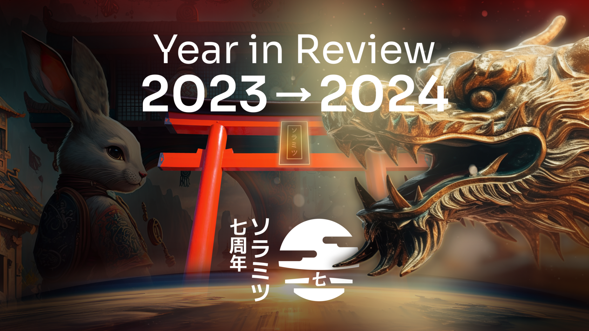
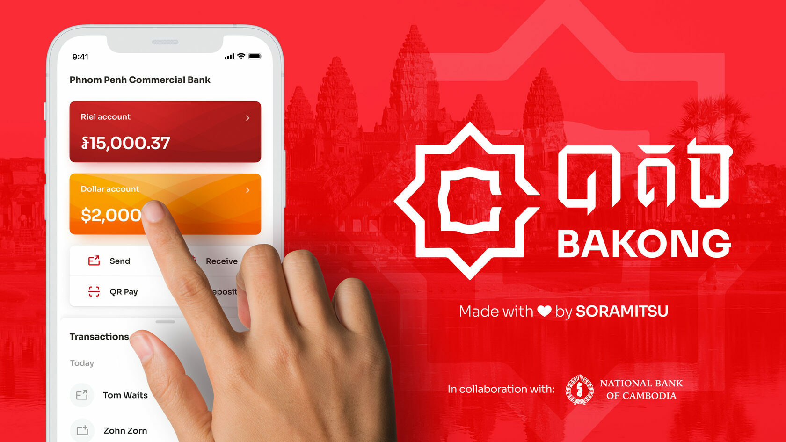
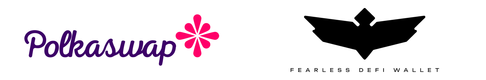

Celebrating a Year of Pioneering Blockchain Innovations and Global Impact — 2023 Year in Review

PRESS RELEASE

SORAMITSU Co., Ltd. 
Shibuya-ku, Tokyo, Japan

[info@soramitsu.co.jp](mailto:info@soramitsu.co.jp) 
[soramitsu.co.jp](https://soramitsu.co.jp)

**FOR IMMEDIATE RELEASE 
**Tuesday, January 2, 2024 

# Celebrating a Year of Pioneering Blockchain Innovations and Global Impact — 2023 Year in Review

## → As 2023 has drawn to a close, Soramitsu proudly reflects on a year marked by significant advancements and achievements in blockchain technology.

Every day presents an opportunity to continue working to improve the world and people's lives everywhere, bridging the gap brought about by legacy systems that have left people on the margins. Financial inclusion, social equality, and improving people's quality of life are drivers for Soramitsu, pushing the boundaries of blockchain applications and setting new standards in digital finance and asset management.

Our relentless dedication to leveraging blockchain technology to improve everyday life is evident in our diverse projects and initiatives, each playing a role towards our goal of enhancing global financial systems, including our contributions to the [Hyperledger Iroha](https://iroha.tech/) blockchain platform and the [SORA](https://sora.org/) decentralised world economic system. Here is a summary of the highlights achieved in 2023.

Hyperledger Iroha is a secure and scalable blockchain platform designed specifically for systemically important infrastructure and prominently featured in [Bakong](https://bakong.nbc.gov.kh/en/), a central bank digital currency (CBDC) platform developed by Soramitsu in cooperation with the National Bank of Cambodia. Bakong is the first blockchain-based retail payment system [launched by a central bank](https://soramitsu.co.jp/bakong-press-release).

Using Bakong, anyone with a Cambodian phone number and smartphone can send and receive payments instantly in either Khmer Riel or USD. Bakong is integrated with all other QR code-based payment services in Cambodia via the KHQR standard and marks a new stage in modernising the Cambodian financial system, creating new opportunities for those currently unbanked or underbanked. For Soramitsu, Bakong is an essential milestone toward empowering people with control over their assets and improving the efficiency, security, and accessibility of financial systems worldwide.

**The Digital Finance Platform Pioneering Connectivity Across Asia** 
In December, the official magazine of the Japanese government wrote about Soramitsu's work on Bakong and how it builds the tools needed by central banks around the world to digitally transform. 

[

Learn more

](https://www.japan.go.jp/kizuna/2023/12/pioneering_connectivity_across_asia.html)

Bakong has recently passed [ten million registered accounts](https://asia.nikkei.com/Business/Technology/Cambodia-chalks-up-10m-Bakong-digital-currency-accounts) and has transacted over $15 billion, processing retail and wholesale payments 24/7/365. Bakong has also made headlines this year, collaborating with neighboring countries such as [Vietnam](https://www.khmertimeskh.com/501401146/cambodia-vietnam-launch-cross-border-qr-code-payment/), [China](https://www.khmertimeskh.com/501392878/nbc-alipay-join-forces-to-allow-khqr-accept-worldwide/), [Japan, and India](https://asia.nikkei.com/Spotlight/Cryptocurrencies/Japan-blockchain-startup-seeks-to-build-Asian-digital-payment-network), to make QR code-based payment accessible for its users within those countries and vice-versa. These great strides are a sign of the emphasis the region has for supporting the growth of local economies that have been largely ignored by the global West, proving that technology can change lives for the better and support nation-states' financial inclusion and growth.

Soramitsu's work in Asia remains at the forefront of the blockchain-based digital currency domain, and in 2023, we conducted CBDC proof-of-concepts with the [Bank of the Lao PDR](https://soramitsu.co.jp/dlak-cbdc) and the [Central Bank of Solomon Islands](https://soramitsu.co.jp/bokolo-cash), which tested retail payment use cases enabling users to purchase goods and transfer funds effortlessly.

Bokolo Cash: The state-of-the-art, digital Solomon Islands dollar. Fast, easy, and innovative.

Additionally, the secure, fast, and efficient [SORA public blockchain](https://medium.com/sora-xor/the-sora-network-hosts-the-first-substrate-polkadot-based-cbdc-in-collaboration-with-the-central-6cc78e9b82b8) was utilised to simulate cost-effective international remittances in the Central Bank of Solomon Islands proof of concept, with a bridge allowing the [Bokolo Cash CBDC](https://solomons.gov.sb/govt-supports-bridging-gaps-in-technology-and-financial-inclusion/) to be moved from the closed system run by the Central Bank of Solomon Islands to the SORA blockchain network. While still experimental, linkages like this could someday prove crucial in facilitating international transfers and remittances, lowering costs and reducing barriers for migrant workers who send money home.

The SORA blockchain network is ideal for central banks to use for their CBDC projects because it is fast and secure, written in [Rust](https://www.rust-lang.org/), and unlike every other public blockchain network, end users do not need to buy or manage cryptocurrency to send CBDC transactions to other users—transaction fees are paid by the end users in the CBDC and are converted to a token accepted by the validators behind the scenes.

**Empowering Humanity** 
A novel CBDC solution allowing Central Banks to bridge their digital currencies to SORA, paving the way for seamless remittances between multiple jurisdictions. 

[

Learn more

](https://sora.org/cbdc)

Soramitsu's involvement extends to decentralized finance (DeFi), contributing to [SORA](https://sora.org/), a decentralized economic system designed for high economic growth and inclusivity, as well as support for CBDC remittances, allowing transactions on a public blockchain without requiring users to hold native network tokens, a novel approach. See also: [the SORA recap of 2023](https://medium.com/sora-xor/sora-2023-summary-554eb3e626e0?0)

Users of various technical backgrounds can effortlessly engage in decentralized finance through [Polkaswap](https://polkaswap.io/), while [Fearless Wallet](https://fearlesswallet.io/) offers secure and intuitive self-custodial asset management with DeFi integrations.

In 2023, Fearless Wallet witnessed a year of advancements and transformation, the most important being the integration of Polkaswap, participation in a CBDC PoC, and EVM compatibility. Check out the [Fearless Wallet 2023 recap](https://fearlesswallet.medium.com/2023-fearless-wallet-year-in-review-f223329c855d) and [Polkaswap Year in Review](https://medium.com/polkaswap/2023-polkaswap-year-in-review-179a4c93ad09) for more details.

Soramitsu is pioneering digital finance in Asia, aiming to make interbank transactions more efficient and cost-effective, leveraging the security of blockchain technology. Ongoing expansion includes leveraging integrations between payment apps in countries, including facilitating exchange between blockchain-based stable assets and traditional currencies.

**Technology Alliance to Enable Smooth Mutual Transfer and Exchange of a Wide Variety of Stablecoins in Japan** 
Datachain, Mitsubishi UFJ Trust and Banking Corporation, and SORAMITSU Announce a Technology Alliance to Enable Smooth Mutual Transfer and Exchange of a Wide Variety of Stablecoins to be Issued in Japan. 

[

Learn more

](https://soramitsu.co.jp/stablecoin-alliance)

Soramitsu also continued its close collaboration with the Korean-based Klaytn network after having developed the open-source [decentralized exchange infrastructure backbone](https://soramitsu.co.jp/klaytn-partnership-success-story), now a part of the [Awesome Klaytn developer resources](https://github.com/klaytn/awesome-klaytn/tree/main), Soramitsu also participated as a judge for the decentralized finance track in the [2023 edition of Klaymakers](https://developer.klaytn.foundation/klaymakers23/), a global hackathon aimed at fostering Web3 development, and remains a trusted technology partner to the Klaytn ecosystem.

Soramitsu's expertise is not limited to financial applications; our joint venture with Orillion has brought about the [Fraud Intelligence Limited](https://fraudintelligencelimited.com/) ([GitHub](https://github.com/fraud-intelligence-limited)), a Hyperledger Iroha 2-powered network for telcos to look up and supply data to combat several types of fraud. It is trusted by key players such as the MTN Group, Vodafone, LATRO Services and the Telia Company.

**Creating Ecosystems: How Soramitsu Builds to Help Humanity and the World** 
Ecosystems of cooperation are essential to achieving a company's mission and vision within the ever-evolving technology sector. As a cutting-edge blockchain technology provider, Soramitsu harnesses the power of ecosystems to develop solutions that aim to improve humanity. 

[

Learn more

](https://soramitsu.co.jp/creating-ecosystems)

Through these diverse initiatives, Soramitsu is dedicated to using innovative technologies to positively impact humanity, giving people control over their assets and improving the global financial system's efficiency, security, and accessibility.

A message from Soramitsu leaders:

* * *

__"We are creating a better and more sustainable world through decentralised technologies. A world where people are not held back artificially, but those with talent and motivation can go and meet their full potential. A world where property rights are respected and those who have assets can use them without barriers. A world where technology is a tool that enables people to accomplish their mission, and not a wall that holds people back. Our actions today can create this better world. By empowering humanity with the tools to work together in an unbiased and open manner we can achieve the full potential of what we are destined to become. Soramitsu is working hard on a steady course towards a truly sustainable future. What we have already achieved is significant, yet this is just the starting point on our mission to empower and elevate humanity."__

 

**Dr Makoto Takemiya**

Group CEO of Soramitsu

* * *

 

**Andrew Wong**

COO of Soramitsu

_"Soramitsu started 2023 with a clear-eyed view of our plan and goals. We have defined our path forward over the past year, and have begun to execute our strategy and evolution as a firm. All of which is underpinned by the exceptional talent of our employees; and together, with our partners, we are excited for the investments we are making to help Planet Earth now and into the future."_

* * *

__"Soramitsu may seem like another innovation-driven technology company, but our approach goes beyond that. We're deeply rooted in understanding human behaviour, economics, and global dynamics. While we certainly work hard on crafting intuitive product experiences and appealing visual aesthetics, we are just as focused on high level design thinking, with the goal of harmonising decentralised and open-source tech innovation with human-centric, sustainable, and inclusive financial solutions empowering financial freedom for everyone."__

 

**Tarmo Vannas**

CDO of Soramitsu

* * *

As we look back on a year filled with groundbreaking advancements and global collaborations, Soramitsu remains committed to harnessing innovative technologies to empower people and enhance the efficiency, security, and accessibility of financial systems worldwide. Our journey through 2023 is a vivid illustration of this commitment, setting the stage for even more ambitious projects and significant impacts in the years to come.

* * *

**About SORAMITSU**

[soramitsu.co.jp](https://soramitsu.co.jp)

SORAMITSU is an award-winning global financial technology company with expertise in developing blockchain-based solutions for digital asset and identity management. Our mission is to use blockchain to promote innovation and solve pressing societal challenges. 

Utilising blockchain, SORAMITSU has developed a digital currency infrastructure backbone for the [National Bank of Cambodia](https://soramitsu.co.jp/bakong-press-release), a CBDC Proof-of-Concept [with the Bank of the Lao PDR](https://soramitsu.co.jp/dlak-cbdc) and [with the Central Bank of Solomon Islands](https://soramitsu.co.jp/bokolo-cash), a closed-loop [payment system for the University of Aizu](https://soramitsu.co.jp/byacco) in Japan, an identity verification system prototype for Bank Central Asia in Indonesia, shortlisted in the [Monetary Authority of Singapore CBDC Challenge](https://soramitsu.co.jp/global-central-bank-digital-currency-challenge/), participated in Asia-Pacific's first proof-of-concept test of a cross-border multi-currency security settlement system using distributed ledger technology with the Asian Development Bank, and in collaboration with the Risk Assurance Group and Orillion Solutions developed the technology core of the [Fraud Intelligence Blockchain](https://soramitsu.co.jp/soramitsu-and-rag). 
 
SORAMITSU is an active contributor to many open source projects, such as [Klaytn](https://soramitsu.co.jp/klaytn-dex), South Korea's leading Layer-1 blockchain, [KAGOME](https://github.com/soramitsu/kagome), the C++ [Polkadot](https://polkadot.network/) Host implementation, the [SORA](https://sora.org/) crypto-economic system, the [Polkaswap](https://polkaswap.io/) DEX, and the DeFi wallet, [Fearless Wallet](https://fearlesswallet.io/). SORAMITSU also collaborated with Filecoin to develop FUHON, a C++ implementation of their protocol. In addition, SORAMITSU is the developer of and major contributor to the open-source blockchain platform [Hyperledger Iroha](https://www.hyperledger.org/use/iroha), a project of Hyperledger Foundation, part of the Linux Foundation, tailored for enterprise and public-sector use. As founding contributors to the Hyperledger Project and cooperation partners of the Web3 Foundation, SORAMITSU is building the digital infrastructure of the future. 
 
Based on these experiences, SORAMITSU aims to deploy cutting-edge technology on a global scale in order to expedite financial inclusion and health, mitigate economic inefficiencies, and contribute to the fulfilment of the Sustainable Development Goals. 

* * *

SEE ALSO:

**Fraud Intelligence Limited: 2023 in Review** 
What our customers say and do matters most. Their feedback inspired Fraud Intelligence Limited in ways both big and small, and in 2023, we accelerated our execution to take that feedback and transform it into a reality aligned with our partner's needs, which enabled us to build tools emboldening Fraud Intelligence Blockchain to become the undisputed leader and trusted source of shared fraud intelligence globally. 

[

Learn more

](https://soramitsu.co.jp/fil-2023-in-review)

Follow SORAMITSU's [news and latest partnerships and developments here](https://soramitsu.co.jp/#news)_._ 

GET IN TOUCH AND FOLLOW:

* 
* 
* 
* 
* 

* * *
