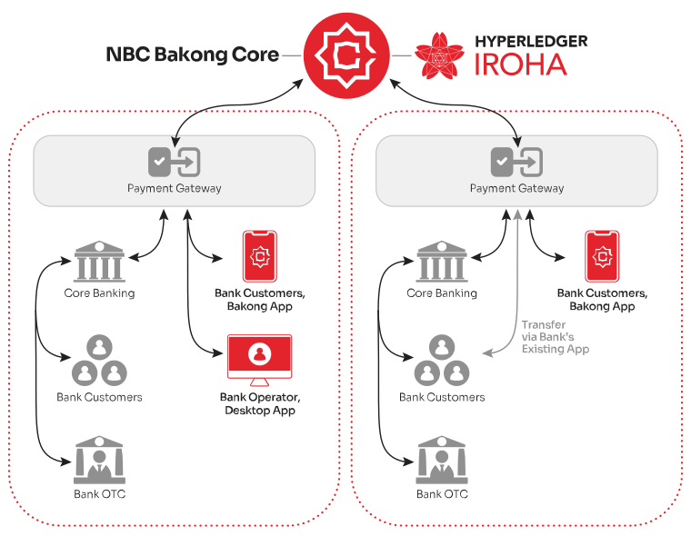
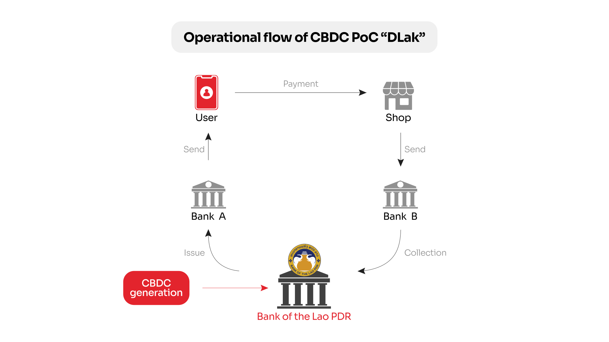

SORAMITSU 2016-2025 | Creating a Better World Through Decentralised Technologies

PRESS RELEASE

Soramitsu Co., Ltd. 
Shibuya-ku, Tokyo, Japan

[info@soramitsu.co.jp](mailto:info@soramitsu.co.jp) 
[soramitsu.co.jp](https://soramitsu.co.jp)

February, 2025

# SORAMITSU | 2016-2025

## → Over the last nine years, a lot has happened and we have contributed to many positive changes in the world! Just 2024 alone was a jam-packed year of hard work and many successes.

Just to summarize a few out of many, many things we have done over the last 9 years:

* Built [Hyperledger Iroha v1](https://soramitsu.co.jp/iroha)
* Built [Hyperledger Iroha v2](https://iroha.tech/)
* Built the [world's first blockchain-based retail CBDC system for a central bank](https://soramitsu.co.jp/bakong-press-release), in Cambodia

* Built [Kagome](https://soramitsu.co.jp/kagome-press-release?ref=blog.soramitsu.co.jp), a C++ runtime for Polkadot
* Built [Fuhon](https://filecoin.io/blog/posts/announcing-filecoin-implementations-in-rust-and-c/?ref=blog.soramitsu.co.jp), a C++ runtime for Filecoin
* Digital identity PoC with BCA
* Identity PoC with Rakuten Securities
* Weather Derivative PoC with SOMPO Holdings
* [Supply Chain Management PoC with TORAY](https://www.toray.com/global/news/details/20220127165136.html)
* Created [Fearless Wallet](https://fearlesswallet.io/) for the Kusama and Polkadot ecosystems + dozens of other chains — see [2024 Year in Review](https://fearlesswallet.io/blog/2024-in-review)
* Created [SORA Wallet](https://sora.org/wallet) for the SORA ecosystem
* Contributed to the [SORA decentralized economic system](https://sora.org/) and helped launch it — see [2024 Year in Review](https://sora-xor.medium.com/sora-2024-year-in-review-c47cba2d19de)
* Built [Polkaswap.io](https://polkaswap.io/), the greatest DEX in existence — see [2024 Year in Review](https://medium.com/polkaswap/polkaswap-2024-year-in-review-cc04b658a4d8)
* Proposed, built, and deployed the [Byacco payment system](https://soramitsu.co.jp/byacco) for the University of Aizu in Fukushima Prefecture, Japan
* Built [ADAR](https://adar.com/)
* Built a [DEX for Klaytn](https://soramitsu.co.jp/klaytn-dex)
* Won the [CBDC Partner of the Year](https://www.centralbanking.com/awards/7681581/central-bank-digital-currency-partner-soramitsu) award in 2020
* [Won the Japan Financial Innovation Award](https://jfia.tokyo/) for our work in Cambodia on the Bakong system
* [Nikkei award](https://www.khmertimeskh.com/501000809/nbcs-bakong-wins-nikkei-award-for-financial-inclusion/)
* [Kuramae award](https://x.com/soramitsu_co/status/1600770241218609152)
* Featured in [KIZUNA](https://www.japan.go.jp/kizuna/2023/12/pioneering_connectivity_across_asia.html), the official magazine of the Government of Japan, and [highlighted by former Japanese Prime Minister Fumio Kishida](https://soramitsu.co.jp/asia-bakong-innovation) in a speech during the Future of Asia forum in Tokyo
* [ADB Cross-Border Settlement PoC](https://soramitsu.co.jp/blockchain-based-cross-border-securities-settlement-system)
* [CBDC PoC for Laos](https://soramitsu.co.jp/dlak-cbdc) — Dlak

* [CBDC PoC for Solomon Islands](https://soramitsu.co.jp/bokolo-cash) — Bokolo Cash

* [CBDC PoC for Papua New Guinea](https://soramitsu.co.jp/bpng-poc) — Digital Kina

* Featured on [Advancements TV](https://youtu.be/DByicJqwvwc)
* [Fraud Intelligence Blockchain](https://soramitsu.co.jp/fil-blockchain-launch) release, a joint venture between Soramitsu and Orillion Solutions dedicated to combating telecom fraud and ensuring the integrity of telecommunications networks — [see 2024 Year in Review](https://fraudintelligencelimited.com/news/2024-in-review)
* Started collaboration as a [NISER knowledge partner](https://soramitsu.co.jp/niser-partnership)
* Worked on [tonswap.org](https://tonswap.org/) designs
* Started work on [Zenswap.io](https://zenswap.io/)
* Built a blockchain-based [Savings Bond system for Palau](https://soramitsu.co.jp/palauinvest)

* Worked with SORA Biome to launch [SORA Card](https://soracard.com/)
* Launched the [SORA v3 Fujiwara Testnet](https://wiki.sora.org/running-a-sora-testnet-node.html)

_Since Ryu Okada, Ikkei Matsuda, and I initially founded SORAMITSU nine years ago, we've tackled countless exciting challenges and seized remarkable opportunities. We've transformed from a tiny two-person startup into a thriving group of companies with over 100 employees. But at the core our mission stays the same—_**_to use blockchain technology to create the tools to power a more efficient economic system for the world._** 
 
_As co-founder and Group CEO, leading SORAMITSU has been an extraordinary honor. Our journey at SORAMITSU is transforming the world, and I eagerly anticipate the amazing results we'll achieve over the next nine years!_

 

**Dr Makoto Takemiya**

Group CEO and Co-Founder of Soramitsu

* * *

**About Soramitsu**

[soramitsu.co.jp](https://soramitsu.co.jp)

Soramitsu is an award-winning global financial technology company with expertise in developing blockchain-based solutions for digital asset and identity management. Our mission is to use blockchain to promote innovation and solve pressing societal challenges.

Utilising blockchain, Soramitsu has developed a digital currency infrastructure backbone for the [National Bank of Cambodia](https://soramitsu.co.jp/bakong-press-release), CBDC Proof-of-Concepts with the [Bank of the Lao PDR](https://soramitsu.co.jp/dlak-cbdc), the [Central Bank of Solomon Islands](https://soramitsu.co.jp/bokolo-cash) and the [Bank of Papua New Guinea](https://soramitsu.co.jp/bpng-poc), a blockchain-based digital savings bond system [Palau Invest](https://soramitsu.co.jp/palauinvest) in collaboration with the Government of Palau, a closed-loop [payment system for the University of Aizu](https://soramitsu.co.jp/byacco) in Japan, an identity verification system prototype for Bank Central Asia in Indonesia, shortlisted in the [Monetary Authority of Singapore CBDC Challenge](https://soramitsu.co.jp/global-central-bank-digital-currency-challenge/), participated in Asia-Pacific's first proof-of-concept test of a cross-border multi-currency security settlement system using distributed ledger technology with the Asian Development Bank, and in collaboration with the Risk Assurance Group and Orillion Solutions developed the technology core of the [Fraud Intelligence Blockchain](https://fraudintelligencelimited.com/). 
 
Soramitsu is a contributor to many open source projects, such as Klaytn (now [Kaia](https://kaia.io/)), South Korea's leading Layer-1 blockchain; [Zenswap](https://zenswap.io/), a cross-chain liquidity platform being developed by Soramitsu as a joint venture with Analog; the [SORA](https://sora.org/) crypto-economic system; the [Polkaswap](https://polkaswap.io/) DEX; and the DeFi wallet, [Fearless Wallet](https://fearlesswallet.io/). Soramitsu also collaborated with Filecoin to develop FUHON, a C++ implementation of their protocol; and with the Web3 Foundation to develop [KAGOME](https://github.com/soramitsu/kagome), the C++ [Polkadot](https://polkadot.network/) Host implementation. In addition, Soramitsu is the developer of and major contributor to the open-source blockchain platform [Hyperledger Iroha](https://iroha.tech/), a project of Hyperledger Foundation, now part of the [LF Decentralized Trust](https://lfdecentralizedtrust.org/), tailored for enterprise and public-sector use. As founding contributors to the Hyperledger Project, Soramitsu is building the digital infrastructure of the future. 
 
Based on these experiences, Soramitsu continues to deploy cutting-edge technology on a global scale in order to expedite financial inclusion and health, mitigate economic inefficiencies, and contribute to the fulfilment of the Sustainable Development Goals.

* * *

SEE ALSO:

**Bank of Papua New Guinea, Japan’s METI, and Soramitsu Complete CBDC Proof of Concept in Port Moresby** 
The Bank of Papua New Guinea, in collaboration with Soramitsu and Japan’s Ministry of Economy, Trade and Industry (METI), marked the successful completion of the Digital Kina Proof of Concept (PoC) for the country’s Central Bank Digital Currency (CBDC), with a ceremony held at the Papua New Guinea Hilton Hotel in Port Moresby.

[Learn more](https://soramitsu.co.jp/bpng-poc)

**A Year of Progress: Soramitsu’s Role in Advancing Blockchain Globally in 2024** 
Soramitsu continued its mission to enhance financial inclusion and drive digital transformation globally in 2024.

[Learn more](https://soramitsu.co.jp/2024-in-review)

Follow Soramitsu's [news and latest partnerships and developments here](https://soramitsu.co.jp/#news)_._

GET IN TOUCH AND FOLLOW:

* 
* 
* 
* 
* 

* * *

## Ready to explore innovative solutions?

Get in touch with us today! Email us at [service@soramitsu.co.jp](mailto:service@soramitsu.co.jp) or fill out the form to schedule a free consultation with one of our experts. Let's bring your vision to life!

Send

By clicking Send you agree to our [Terms and Conditions](/terms) and [Privacy Policy](/privacy)

[Japan Blockchain 
Association](http://www.jba-web.jp)

[Global Blockchain 
Business Council](https://gbbcouncil.org)

[LF Decentralized Trust](https://www.lfdecentralizedtrust.org/)

[Fintech association of Japan](http://www.fintechjapan.org)

Proud member of:

Soramitsu Co. Ltd., Link Square Shinjuku 16F, 5-27-5, Sendagaya, Shibuya-ku, Tokyo, Japan, 151-0051 
 
Soramitsu Helvetia AG c/o Diego Compostella, Oberneuhofstrasse 5, 6341 Baar, Switzerland 
 
[Privacy Policy](/privacy) 
[Terms and Conditions](/terms) 
 
© 2016-2025 SORAMITSU. 
All Rights Reserved.

* [About](/#about)
* [Services](/#services)
* [Awards](/#awards)

* [Case Studies](/#casestudies)
* [Partners](/#partners)
* [Team](/#team)

* [News](/#news)
* [Careers](/jobs)
* [Contact](/#contact)

* 
* 
* 
* 
* 

Back to top
