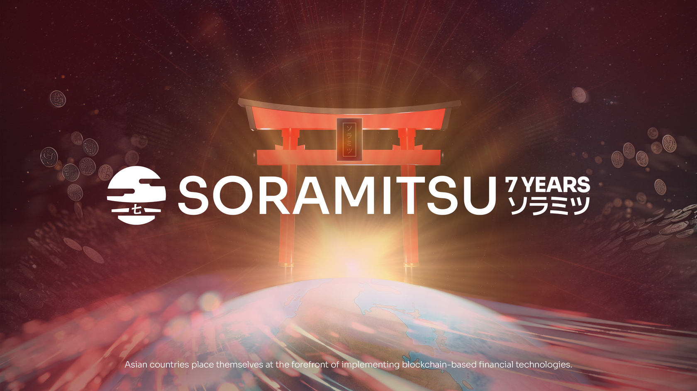
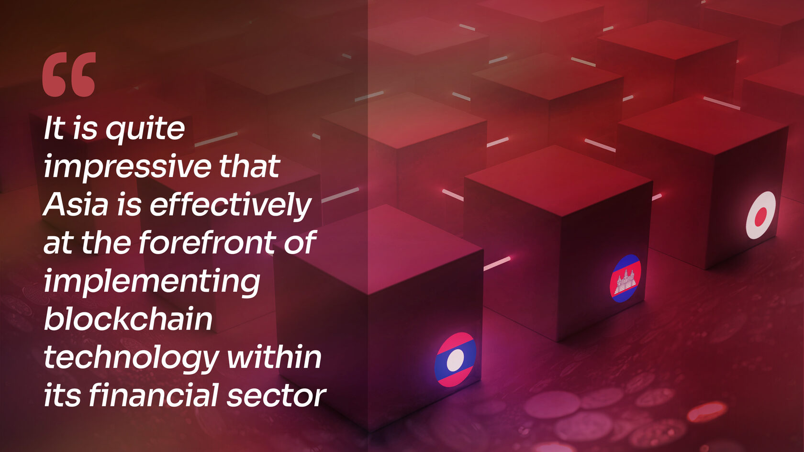

Supporting the Asian Fintech Momentum Through Central Bank Digital Assets and Digital Risk Management

PRESS RELEASE

SORAMITSU Co., Ltd. 
Shibuya-ku, Tokyo, Japan

[info@soramitsu.co.jp](mailto:info@soramitsu.co.jp) 
[soramitsu.co.jp](https://soramitsu.co.jp)

**FOR IMMEDIATE RELEASE 
**Monday, February 27, 2023 

# Supporting the Asian Fintech Momentum Through Central Bank Digital Assets and Digital Risk Management

## → As the West lags behind with innovation and policy, Asian countries such as Cambodia and Lao PDR place themselves at the forefront of implementing blockchain-based financial technologies.

On the 10th of February 2023, the [CommsRisk publication](https://commsrisk.com/asia-is-racing-ahead-with-digital-currencies-and-risk-management-too/) released an article covering the fantastic strides that Asia has made compared to America and Europe regarding implementing blockchain technology. In this article, CommsRisk mentions the work that has been done in Cambodia through the implementation of Bakong, and more recently the work that has just begun in Lao PDR, as the MOU to start [project DLak](https://soramitsu.co.jp/dlak-cbdc) was signed in early February. 

In a bid to strengthen the local currency and increase the availability of banking services to a larger number of people, as well as the informal commerce sectors, countries such as Cambodia and India are finding a great solution in central bank digital assets. This is not the same as a CBDC however. What people normally refer to as a CBDC is a token emitted by the central bank, whereas central bank digital assets are tokenized representations of the money circulating. The difference between these two is non-trivial, as CBDCs are separate tokens backed by central bank assets, but central bank digital assets are on-chain representations of these assets. 

As G8 countries ponder the pros and cons of such tech, it is quite impressive that Asia is effectively at the forefront of implementing blockchain technology within its financial sector. The CommsRisk publication makes an interesting point, in the mention that the British Central Bank refers to CBDC as "[monetary science fiction](https://www.bbc.co.uk/news/technology-64536593)", while other publications such as [Decrypt claim that G8 countries are at the forefront of fintech](https://decrypt.co/121584/japan-announces-launch-new-cbdc-pilot-april). If anything, these assessments are proof of the little information users have regarding the functioning of central banks and digital assets. 

There are also some points that are wildly inaccurate, such as governments being in charge of CBDC DLT and nodes, these are actually run by central banks and other commercial banks and payment service providers

While the Decrypt article has points that are accurate, such as Japan's investment in CBDC feasibility trials (of which SORAMITSU is a collaborator), there are also some points that are wildly inaccurate, such as governments being in charge of CBDC DLT and nodes, these are actually run by central banks and other commercial banks and payment service providers. 
 
While on the topic of debunking CBDC myths, the common misconception that a government or central bank would have access to all of your transactions as a private person is false. Commercial banks have the account information of their users, this being a product of the necessary KYC and AML measures put in place to avoid fraud and financial crimes. 

**Japanese Next-Gen Developer Builds New Technology Core for the RAG Fraud Blockchain** 
SORAMITSU are experts at creating blockchains that are secure and scalable whilst supporting tokenization and permissioned access. 

[

Learn more

](https://soramitsu.co.jp/soramitsu-and-rag)

The CommsRisk article mentions the technological advantage that Asia has while combatting fraud, within the banking sector, but also within the telecommunications sector, where "\[t\]he amount being spent on preventing fraud is trivial compared to the economic harm done by fraudsters." This is a very serious claim, and it would appear that little is being done to prevent it in Western countries. 
 
On the other hand, in Asia, SORAMITSU is developing a Fraud Intelligence Blockchain that will allow telecom providers to have access to a constantly increasing database of fraud intelligence that is accessed and populated by its contributors, through the use of Hyperledger Iroha technology that allows subscribed telcos to provide information in exchange for tokens that will allow access to the database, therefore ensuring accuracy and security of the information available. 

* * *

“

_To maintain its core values and long-term competitiveness, the Asia-Pacific region has invested in the foundations that can enable it to build a culture of innovation and entrepreneurship. At SORAMITSU, we are humbled and honored to support this effort in a meaningful way._

**[Andrew Wong](https://www.linkedin.com/in/andrew-o-wong-2ab209/),** COO of SORAMITSU Group

* * *

**All things considered, the Asia-Pacific region still has plenty of lessons to teach to the global West, and as technology continues to evolve, there is much catching up to do in order to thrive in an ever-evolving world that is always active and always connected.** 
 

* Read more about the [Fraud Intelligence Blockchain](https://soramitsu.co.jp/soramitsu-and-rag), a collaboration between SORAMITSU and the Risk Assurance Group 
 
 
* Follow SORAMITSU's [news and latest partnerships and developments here](https://soramitsu.co.jp/#news)_._ 
 

* * *

**About SORAMITSU**

[soramitsu.co.jp](https://soramitsu.co.jp)

SORAMITSU is an award-winning global financial technology company with expertise in developing blockchain-based solutions for digital asset and identity management. Our mission is to use blockchain to promote innovation and solve pressing societal challenges. 
 
SORAMITSU is the developer of and major contributor to the open-source blockchain platform [Hyperledger Iroha](https://www.hyperledger.org/use/iroha), which is tailored for enterprise and public-sector use. Hyperledger Iroha, a project of Hyperledger Foundation, part of the Linux Foundation, has a permissions system that is scalable and performant. 

Utilizing blockchain, SORAMITSU has developed a digital currency for the [National Bank of Cambodia](https://soramitsu.co.jp/bakong-press-release), a CBDC Proof-of-Concept [with the Bank of the Lao PDR](https://soramitsu.co.jp/dlak-cbdc), a closed-loop payment system for the University of Aizu in Japan, an identity verification system prototype for Bank Central Asia in Indonesia, we were finalists in the [Monetary Authority of Singapore CBDC Challenge](https://soramitsu.co.jp/global-central-bank-digital-currency-challenge/), and are currently participating in Asia-Pacific's first proof-of-concept test of a cross-border, multi-currency security settlement system using distributed ledger technology with the Asian Development Bank. We have also conducted proof-of-concept tests for several major Japanese enterprises, and are active contributors to open source projects, such as [Klaytn](https://soramitsu.co.jp/klaytn-dex), South Korea's leading Layer-1 blockchain, [KAGOME](https://github.com/soramitsu/kagome), the C++ [Polkadot](https://polkadot.network/) Host implementation, the [SORA](https://sora.org/) crypto-economic system, the [Polkaswap](https://polkaswap.io/) DEX, and the DeFi wallet, [Fearless Wallet](https://fearlesswallet.io/). 
 
Based on these experiences, SORAMITSU aims to deploy cutting-edge technology on a global level in order to expedite financial inclusion and health, mitigate economic inefficiencies, and contribute to the fulfilment of the Sustainable Development Goals. 

GET IN TOUCH AND FOLLOW:

* * *
