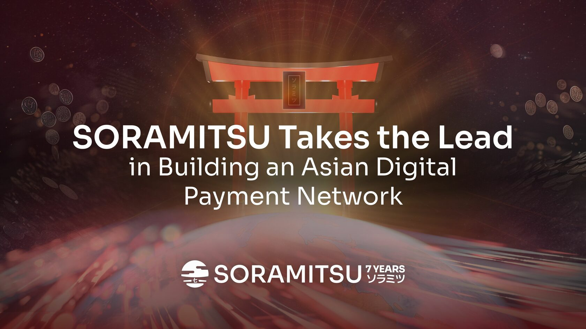

SORAMITSU Takes the Lead in Building an Asian Digital Payment Network

PRESS RELEASE

SORAMITSU Co., Ltd. 
Shibuya-ku, Tokyo, Japan

[info@soramitsu.co.jp](mailto:info@soramitsu.co.jp) 
[soramitsu.co.jp](https://soramitsu.co.jp)

**FOR IMMEDIATE RELEASE 
**Tuesday, August 22, 2023 

# SORAMITSU Takes the Lead in Building an Asian Digital Payment Network

## → Following the [recent article by Nikkei Asia](https://asia.nikkei.com/Spotlight/Cryptocurrencies/Japan-blockchain-startup-seeks-to-build-Asian-digital-payment-network), SORAMITSU is pleased to confirm its active involvement in pioneering a cross-border payment system for Asian countries, anchored by [Bakong](https://bakong.nbc.gov.kh/en/), Cambodia's central bank blockchain infrastructure-based offering. This forms a crucial part of a rapidly expanding international financial web.

SORAMITSU has been integral in launching the Asian blockchain-based central bank infrastructure, starting with Bakong in Cambodia and the [Digital Lao Kip in Laos](https://soramitsu.co.jp/dlak-cbdc). The effectiveness of this initiative is evident, with Bakong being already used for QR code-based digital transactions across Cambodia, Malaysia, Thailand, and Vietnam. As of 2022, Bakong has seen an impressive adoption rate with 8.5 million users and has facilitated payments totaling approximately $15 billion. 
 
Our focus now shifts to streamlining cross-border payments for major players like India and China. We're also enthusiastically exploring integrating Japan into this promising network. 
 
In line with this, SORAMITSU is in the process of setting up a [stablecoin exchange](https://soramitsu.co.jp/stablecoin-alliance) in Japan. This ensures that a consumer in Thailand, for instance, can effortlessly purchase from a Japanese online store using a QR code-based payment. The payment, once made, would be transmitted to the exchange as USD via Bakong and then seamlessly converted into a yen-denominated stablecoin. 
 
The beauty of this system lies in its cost-effectiveness. Transactions can circumvent the traditional interbank payment networks, eliminating exorbitant fees usually associated with intermediary banks. Our preliminary estimates indicate that such stablecoin exchange fees would be nominal, a mere fraction of the typical cost incurred in cross-border transactions. 
 
Our technological prowess in blockchain allows us to exchange stablecoins on the same blockchain smoothly. However, we've employed sophisticated technology for differing blockchains to [conduct transactions simultaneously across multiple blockchains](https://soramitsu.co.jp/datachain-and-soramitsu). 
 
Our collective vision is to leverage tokenised central bank assets and stablecoins to seamlessly connect Japanese SMEs with individual consumers and businesses in Southeast Asia, a region with a high smartphone penetration but limited access to traditional banking facilities. 
 
As the Bank for International Settlements 2021 report highlighted, CBDC payment trials have dramatically reduced cross-border payment times from several days to mere seconds. We're proud to affirm that our payment solutions, using Bakong and the stablecoin exchange, will achieve this unparalleled speed. 

* * *

**About SORAMITSU**

[soramitsu.co.jp](https://soramitsu.co.jp)

SORAMITSU is an award-winning global financial technology company with expertise in developing blockchain-based solutions for digital asset and identity management. Our mission is to use blockchain to promote innovation and solve pressing societal challenges. 

Utilizing blockchain, SORAMITSU has developed a digital currency infrastructure backbone for the [National Bank of Cambodia](https://soramitsu.co.jp/bakong-press-release), a CBDC Proof-of-Concept [with the Bank of the Lao PDR](https://soramitsu.co.jp/dlak-cbdc), a closed-loop [payment system for the University of Aizu](https://soramitsu.co.jp/byacco) in Japan, an identity verification system prototype for Bank Central Asia in Indonesia, shortlisted in the [Monetary Authority of Singapore CBDC Challenge](https://soramitsu.co.jp/global-central-bank-digital-currency-challenge/), participated in Asia-Pacific's first proof-of-concept test of a cross-border multi-currency security settlement system using distributed ledger technology with the Asian Development Bank, and in collaboration with the Risk Assurance Group and Orillion Solutions developed the technology core of the [Fraud Intelligence Blockchain](https://soramitsu.co.jp/soramitsu-and-rag). 
 
SORAMITSU is an active contributor to many open source projects, such as [Klaytn](https://soramitsu.co.jp/klaytn-dex), South Korea's leading Layer-1 blockchain, [KAGOME](https://github.com/soramitsu/kagome), the C++ [Polkadot](https://polkadot.network/) Host implementation, the [SORA](https://sora.org/) crypto-economic system, the [Polkaswap](https://polkaswap.io/) DEX, and the DeFi wallet, [Fearless Wallet](https://fearlesswallet.io/). SORAMITSU also collaborated with Filecoin to develop FUHON, a C++ implementation of their protocol. In addition, SORAMITSU is the developer of and major contributor to the open-source blockchain platform [Hyperledger Iroha](https://www.hyperledger.org/use/iroha), a project of Hyperledger Foundation, part of the Linux Foundation, tailored for enterprise and public-sector use. As founding contributors to the Hyperledger Project and cooperation partners of the Web3 Foundation, SORAMITSU is building the digital infrastructure of the future. 
 
Based on these experiences, SORAMITSU aims to deploy cutting-edge technology on a global level in order to expedite financial inclusion and health, mitigate economic inefficiencies, and contribute to the fulfilment of the Sustainable Development Goals. 

* * *

SEE ALSO:

**Technology Alliance to Enable Smooth Mutual Transfer and Exchange of a Wide Variety of Stablecoins in Japan** 
Datachain, Mitsubishi UFJ Trust and Banking Corporation, and SORAMITSU Announce a Technology Alliance to Enable Smooth Mutual Transfer and Exchange of a Wide Variety of Stablecoins to be Issued in Japan. 

[

Learn more

](https://soramitsu.co.jp/stablecoin-alliance)

Follow SORAMITSU's [news and latest partnerships and developments here](https://soramitsu.co.jp/#news)_._ 

GET IN TOUCH AND FOLLOW:

* 
* 
* 
* 
* 

* * *
