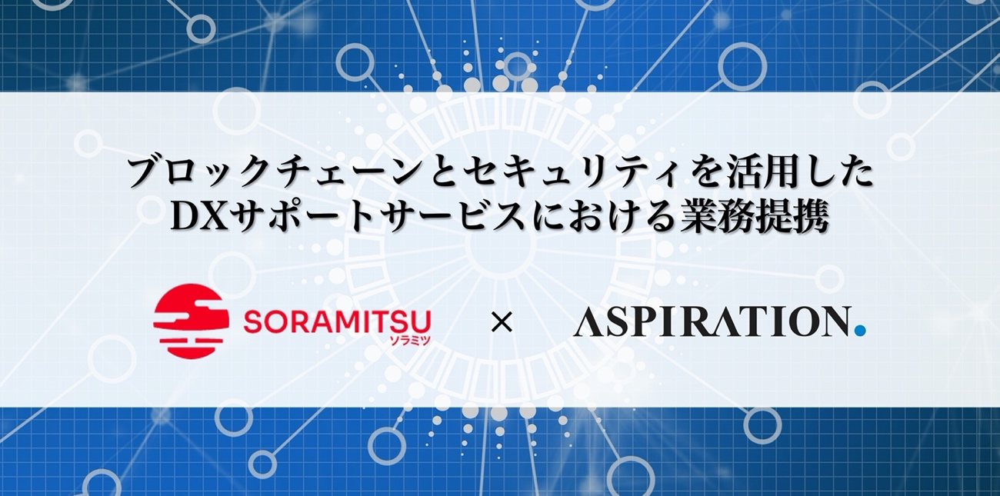

ソラミツとアスピレイション、ブロックチェーンとセキュリティを活用したDXサポートサービスにおいて業務提携

**PRESS RELEASE** 
2020年8月24日 
ソラミツ株式会社 
アスピレイション株式会社 
 
**ソラミツとアスピレイション、ブロックチェーンとセキュリティを活用したDXサポートサービスにおいて業務提携** 
 
 
〜ブロックチェーン関連システムや社内運用体制などのセキュリティレベルを総合的に診断し、企業の安全なDXを支援〜 
 
 
ソラミツ株式会社（本社：東京都渋谷区、代表取締役社長：宮沢和正 以下ソラミツ）とアスピレイション株式会社（本社：東京都港区、代表取締役社長：石塚 宏一 以下、アスピレイション）は、オープンソースブロックチェーン「ハイパーレジャーいろは」を活用してソラミツが開発、提供を行う様々なブロックチェーン・ソリューションと、アスピレイションが提供するサイバーセキュリティサービスを活用した安全で利便性の高いブロックチェーン関連のサービスを提供し、企業や組織のDX（デジタルトランスフォーメーション）の促進を支援することにおいて業務提携を行うことを発表します。 
 
新型コロナウイルスの世界的感染拡大などにより、企業や自治体などあらゆる組織において新しい時代に合わせた働き方、いわゆるニューノーマルへの対応が求められています。それに伴い、テレワークの導入やクラウドシステムの活用なども含めた業務のデジタル化が急務となっています。 
 
その中で、ブロックチェーンはデータの改ざん防止や真正性を担保する技術として、またスマートコントラクトやデジタル地域通貨としての活用による新たなビジネス機会を創造する手段として有効性が注目されております。 
 
ただし、ブロックチェーンシステム「ハイパーレジャーいろは」そのものは高セキュリティの信頼性の高いシステムとして知られる一方、それをビジネスや有効なシステムとして運用するためには、ブロックチェーンの外部に構築されるアプリケーションやウェブサイト、認証システムなど外部のシステムとの連携が必須となり、それらのアプリケーションなどにセキュリティ上の脆弱性があった場合にはその点を標的とされたサイバー攻撃の被害に遭う可能性が高まります。また、運営社内での顧客情報や機密情報の管理に不備があった場合にも、内部からアカウント情報を操作されるなどのリスクが発生します。 
 
このような背景から、企業や組織がより安全にブロックチェーンシステムの導入及び運用を行っていただくため、両社の協業により安全で利便性の高いブロックチェーンシステムの提供と同時に、組織全体のセキュリティ環境を客観的に診断し、改善のためのアドバイスを行うセキュリティ診断サービスを組み合わせた包括的なコンサルティングサービスの提供を開始します。 
 
一秒間に数千件の処理が可能な世界最高水準の性能やセキュリティ、JavaやPython等の開発言語によりどなたでも高い品質を確保し、容易な開発を可能とするオープンソースブロックチェーン「ハイパーレジャーいろは」を活用して、ソラミツが開発・提供を行うデジタル地域通貨、本人認証システムなどのアイデンテティ、サプライチェーン・マネジメントのトレーサビリティなどの様々なブロックチェーン・ソリューションと、アスピレイションの提供するイスラエルを始めとした世界最先端の技術と知見を活用した第三者セキュリティ診断により、高品質で安全安心なブロックチェーンシステムをご利用いただき、組織のDXの推進のサポートを行ってまいります。 
 
【ソラミツ株式会社について】 
 
ソラミツは、ブロックチェーンの技術開発、デジタル資産管理、アイデンティティ、トレーサビリティに関するソリューションを提供する専門知識を持つ日本のフィンテック企業です。ブロックチェーン技術を活用し産業にイノベーションを起こし社会課題を解決する事をミッションとしています。 
これまでにブロックチェーン技術を活用し、会津大学のデジタル地域通貨、カンボジア国立銀行の中央銀行デジタル通貨、モスクワ証券取引所グループの証券保管振替システム、インドネシアBCA銀行の本人確認システムなどを開発してまいりました。 
 
ソラミツは、企業や金融機関によるデジタル資産管理やアイデンテティ管理に最適なオープンソースのコンソーシアム型ブロックチェーン・プラットフォームである「ハイパーレジャーいろは」の元々の開発であり、現在 「ハイパーレジャーいろは」はThe Linux FoundationのHyperledger Projectの一部になっております。 
 
ソラミツは、カンボジア国立銀行のデジタル通貨システム開発の経験に基づいてこれらの最先端の金融技術をグローバルに展開し、世界の銀行口座を保有していない人々が簡単・安全に価値を移転できる仕組みを構築し、SDGs（持続可能な開発目標）に貢献することを目指しています。また、ソラミツ・グループのスイス法人であるソラミツ・ヘルベチアAGは、暗号資産ソラ(Sora.org)の開発・運用に貢献しています。 
 
[https://soramitsu.co.jp/ja](https://soramitsu.co.jp/ja) 
[https://www.sora.org/ja](https://www.sora.org/ja) 
 
【アスピレイション株式会社について】 
 
アスピレイションは最新のセキュリティ技術や攻撃手法を想定したセキュリティ診断／第三者監査サービスや、GDPRなど個人情報保護基準への準拠支援サービス、ダークウェブ上のサイバー攻撃の予兆を検知するインテリジェンス、セキュリティ人材育成の為のトレーニングシステムなどの最先端のセキュリティサービスの他、カウンタードローンシステムである「ドローン・ドーム」や、ビックデータマネジメントシステムである「Wisdom Stone」等の提供を行う総合的セキュリティ・コンサルティング、及びソリューションの提供企業です。 最先端の智慧により、セキュリティの強化に貢献することがミッションです。 
 
サイバーセキュリティに関して、イスラエル最大の防衛及びセキュリティ企業Rafael Advanced Defense Systems社と、イスラエル政府機関や五輪選手団トレーニングセンターへのCISOサービス等を行うIntegrity Consulting ＆ Risk Management社と国内販売独占契約を締結。その他複数のグローバルセキュリティ企業とも契約しています。 
 
アスピレイションは一部上場企業や省庁などへのサービスの実績を多数持ち、「電子認証における改ざん防止システム」についての、独自特許を保有しています。 
 
[https://aspirationcorp.com/](https://aspirationcorp.com/) 
 
 
当プレスリリースに関するお問い合わせ先 
アスピレイション株式会社 
メール： info@aspirationcorp.com 
ソラミツ株式会社 
メール： info@soramitsu.co.jp 
 
※ 本プレスリリースに記載されている会社名、製品名、サービス名は、当社または各社、各団体の商標もしくは登録商標です。
