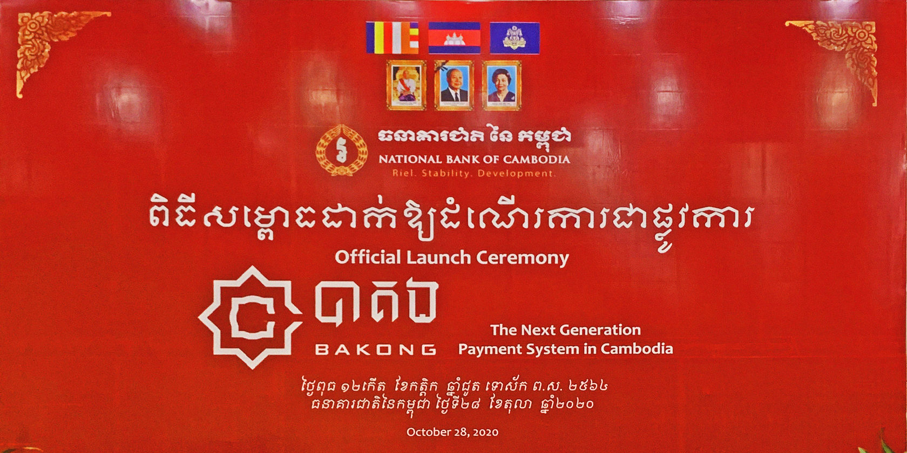
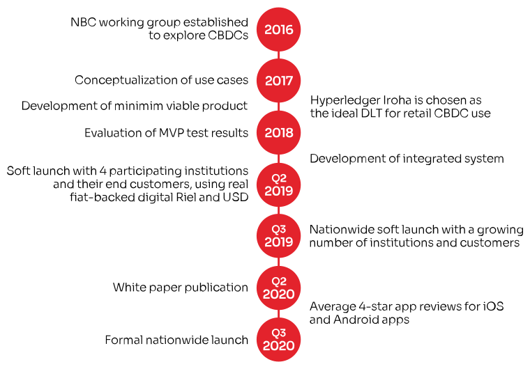
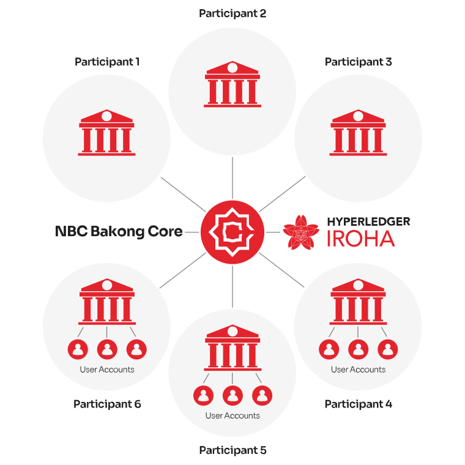

Bakong Official Launch, Press Release, SORAMITSU

PRESS RELEASE

Soramitsu Co., Ltd. 
Tokyo, Japan

[info@soramitsu.co.jp](mailto:info@soramitsu.co.jp) 
[soramitsu.co.jp](https://soramitsu.co.jp)

[

**Download PDF**

](https://soramitsu.co.jp/bakong-press-release/pdf)

**FOR IMMEDIATE RELEASE** 
Wednesday, October 28, 2020 

# Kingdom of Cambodia Launches Central Bank Digital Currency, Co-Developed with Fintech Company SORAMITSU

## — In use nationwide since July 2019, and recognized with a Central Banking Award in October 2020, the Bakong system will act as the backbone of the Cambodian payment and settlement infrastructure.

_Bakong is a multi-stakeholder system that enables instant and final transactions using digital Cambodian Riel (KHR) or United States Dollars (USD). Co-developed by the National Bank of Cambodia and Japanese/Swiss fintech company SORAMITSU, it is built to handle the needs of numerous banks and 17 million consumers. 
_ 
Bakong works seamlessly and securely in concert with Cambodia's legacy payment systems, and has already been embraced by 18 financial institutions nationwide. A user-friendly smartphone app allows anyone with a domestic phone number and bank account to maintain a digital Riel or USD wallet, transfer between accounts, and make person-to-person and point-of-sale payments via phone number or EMVCo-compatible QR code scan. 
 
For Cambodian consumers and small businesses, Bakong means faster and more secure payments without onerous fees. For bankers, it represents a confident and judicious step into the brave new world of fully digitalized economies––an achievement recognized by Central Banking journal with its inaugural award for Central Bank Digital Currency Partner, presented to SORAMITSU at the [2020 FinTech & RegTech Global Awards](https://www.centralbanking.com/awards/7681581/central-bank-digital-currency-partner-soramitsu). 

Why a CBDC in the Kingdom of Cambodia? 
 
CBDC has been widely acknowledged as a high-potential means of improving financial system efficiency, resilience, and inclusion: a 2020 Bank for International Settlements (BIS) survey of 66 central banks found that 80% were engaged in some kind of CBDC research or experimentation. 
 
The National Bank of Cambodia (NBC) began its CBDC work in 2016 with the inauguration of Project Bakong, named for a temple of the ancient Khmer Empire dedicated to Lord Shiva. The Project's aim was to explore the capacity of digital payment systems to mitigate burdens for banks, to encourage the use of the Riel, and––most importantly––to enhance financial inclusion among underserved citizens. 
 
The NBC concluded that fulfilling these criteria would require a retail CBDC, i.e., a fiat-backed digital currency designed for everyday citizen use as well as large-transaction interbank (wholesale) use. Distributed ledger technologies (DLT) were deemed the most promising way of implementing such a system. In 2017, the NBC selected Hyperledger Iroha––a blockchain platform, commissioned by the Linux Foundation Hyperledger Project, which SORAMITSU maintains and develops––as the ideal DLT for retail CBDC use. Effective cooperation between the NBC and SORAMITSU teams made an ambitious three-year implementation timeline possible. 

Bakong System Design 
 
The system consists of a Bakong Core maintained by the NBC; domains or "payment gateways" assigned by the NBC to commercial financial institutions; and digital wallets assigned by commercial institutions to end users. Commercial institutions access their domains via a desktop app, while end users access their wallets via iOS/Android apps. Permissions can be set for all system functions on a user-by-user basis, thus preserving the NBC's regulatory authority and control. 
 
Bakong Core is powered by Hyperledger Iroha, a permissioned append-only distributed ledger or blockchain, which records all transactions immutably in a chronological chain of records stored in multiple nodes. The Core runs on physical infrastructure maintained by NBC, but identical ledger copies are shared with selected institutions; this ensures redundancy and resilience. Byzantine fault tolerant consensus is used to validate transactions across the ledger copies, eliminating the double-spending problem, the risk of fraud, and counterparty risk. 

Features and Advantages 
 
Bakong was designed to capitalize upon infrastructure investments made by the NBC during the 2010s. It upgrades a legacy interbank transfer system (FAST) by replacing its relational database with the Iroha distributed ledger, which is resilient by design against hardware failures, tampering, and cyberattacks. It also augments a legacy point-of-sale payment system (CSS) and various private services by allowing much faster and more convenient payments at no cost. 
 
As in all financial systems, participating institutions are expected to play their part in preventing financial crime by complying with Know-Your-Customer (KYC) regulations. Bakong supports a tiered KYC system: end users can open a low-transfer-limit account using SMS verification, but higher-limit tiers require the user to register a government-issued ID at a bank branch. Tier limits can be dictated by NBC in accordance with current laws and best practices. 
 
With regards to monetary policy, Bakong is currently neutral: the digital Riel and USD are fully backed by cash and do not bear interest. Bakong will not change the fundamental structure of the financial system, and because all digital Riel and USD wallets are backed by assets held at the central bank, bank runs are no more likely and liquidity risks are minimal. 
 
From a broader economic perspective, Bakong is expected to yield benefits for consumers, MSMEs, financial institutions, and the central bank alike. These include: 

* Cost efficiency. Transactions by end users will be free. Financial institutions will save on the cost of separate infrastructure and networks, and will be able to access the Bakong APIs to enrich their online banking offers. The NBC itself will benefit from a much more streamlined nationwide system.
* Financial inclusion. Bakong will reduce cost, access, and convenience barriers to financial inclusion. It will incentivize banks to develop services for underprivileged citizens, especially the young and digitally-oriented.
* Speed and scalability. Due to the inherent efficiency of Hyperledger Iroha, Bakong's transaction time stands at around 3-5 seconds and its throughput at nearly 2,000 transactions per second. These rates promise scalability at acceptable costs.
* Security and resilience. Hyperledger Iroha has been audited by Nettitude. Its Byzantine fault tolerant consensus algorithm guarantees that the integrity of the ledger can be maintained even if nodes are compromised by accidents or bad actors.

**Next Steps** 
 
Since Bakong's 2019 soft launch, its network of partners and users has steadily grown. Its official launch marks a new stage in the modernization and democratization of the Cambodian financial system. NBC and its partner institutions will take full advantage of the Bakong infrastructure to promote the digital Riel and create new opportunities for citizens––especially those who are currently unbanked or underbanked. These citizens' entrance into the financial system will engender new opportunities for Cambodian businesses in turn. 
 
_"We aim to improve financial inclusion, efficiency, and safety, as well as promote the use of our local currency. Bakong will play a central role in bringing all players in the payment space in Cambodia under the same platform, making it easy for end-users to pay each other regardless of the institutions they bank with." Her Excellency Madam Chea Serey, Director General, National Bank of Cambodia 
 
"Bakong will eventually create financially inclusive ecosystems that all the stakeholders in the industry can benefit from." Shin Chang Moo, President, PPCBank_ 
 
For SORAMITSU, Project Bakong is an important milestone on the path toward our end goal of improving the efficiency, security, and accessibility of financial systems worldwide. SORAMITSU believes that well-designed distributed ledgers can hasten progress toward this goal––and by doing so, increase human flourishing. Bakong's official launch and our recognition by Central Banking journal substantiate this belief. 
 
_"We have been diligently building solutions with the National Bank of Cambodia for over three years now, and are currently readying the technology for deployment in other countries and new markets. It is an extraordinary honor to receive an award from Central Banking recognizing our technical contributions to the practical realization of central bank digital currencies." Makoto Takemiya, CEO, Soramitsu Holdings AG_ 
 
For in-depth information on Project Bakong, please read the National Bank of Cambodia's [white paper](https://bakong.nbc.org.kh/download/NBC_BAKONG_White_Paper.pdf), visit the [website](https://bakong.nbc.org.kh/), and follow the conversation on [Facebook](https://www.facebook.com/bakongsystem). 

**About SORAMITSU** 
 
SORAMITSU is a Japanese fintech company with expertise in creating blockchain-based infrastructure, payment systems, and identity solutions. 
 

* Together with the National Bank of Cambodia, SORAMITSU developed [Bakong](https://bakong.nbc.org.kh/), the world's first blockchain-based CBDC and retail payments system to be launched by a central bank.
* SORAMITSU is the original developer of and main contributor to [Hyperledger Iroha](https://www.hyperledger.org/use/iroha), an open-source permissioned blockchain platform aimed at helping businesses and financial institutions manage their digital assets and identities. Hyperledger Iroha is part of the Linux Foundation's Hyperledger Project.
* SORAMITSU received a Web3 Foundation grant to develop [KAGOME](https://medium.com/web3foundation/w3f-grants-soramitsu-to-implement-polkadot-runtime-environment-in-c-cf3baa08cbe6), the C++ implementation of the Polkadot Host, as well as [Polkaswap](https://polkaswap.io/), a decentralized token exchange platform. The Kusama treasury has also awarded SORAMITSU a grant to create the [Fearless Wallet](https://fearlesswallet.io).
* SORAMITSU has also developed SORA, a groundbreaking decentralized economic system aimed at changing the way goods and services are brought to market. See [sora.org](https://sora.org) for more information, then download the app from the Google Play Store or the AppStore on iOS.

To learn more about SORAMITSU's technologies and vision, visit [soramitsu.co.jp](https://soramitsu.co.jp). 

* * *
