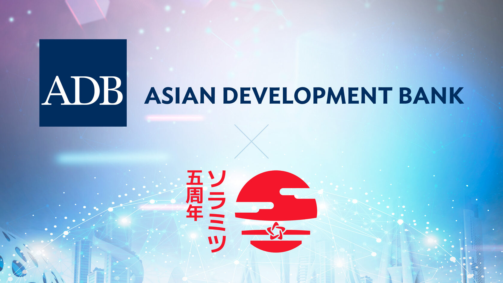

Asian Development Bank enlists SORAMITSU to test cross-border securities settlements using blockchain

PRESS RELEASE

SORAMITSU Co., Ltd. 
Shibuya-ku, Tokyo, Japan

[info@soramitsu.co.jp](mailto:info@soramitsu.co.jp) 
[soramitsu.co.jp](https://soramitsu.co.jp)

**FOR IMMEDIATE RELEASE 
**Wednesday , Jan 26, 2022 

# Asian Development Bank Enlists SORAMITSU to Test Cross-Border Securities Settlements Using Blockchain

## → SORAMITSU will join the first proof-of-concept test of a blockchain-based cross-border securities settlement system in APAC, an ambitious public-private cooperation between ASEAN+3 member states and blockchain technology leaders.

The Asian Development Bank (ADB) has [announced](https://www.adb.org/news/adb-develop-prototype-cross-border-securities-transaction-system-using-blockchain) that together with SORAMITSU, ConsenSys, Fujitsu, and R3, it will conduct the Asia-Pacific's first proof-of-concept test of a cross-border, multi-currency security settlement system using distributed ledger technology (DLT, i.e., blockchain). The system will advance the aims of the [Asian Bond Markets Initiative's (ABMI's)](https://asianbondsonline.adb.org/abmi.php) [Cross-Border Settlement Infrastructure Forum (CSIF)](https://www.adb.org/publications/basic-principles-establishing-regional-settlement-intermediary-next-steps), which was formed by the central banks and central securities depositories of the member states of the Association of Southeast Asian Nations (ASEAN) as well as Japan, the People's Republic of China, and the Republic of Korea—collectively known as ASEAN+3. While several member states have tested DLT for domestic securities settlements or cross-border payments, this project will be the first in which securities are delivered instantly across borders, versus payment in multiple currencies, on a network of distributed ledgers. 

**Proven Expertise in Blockchain-Based Asset Management 
** 
SORAMITSU has established itself as a leader in the digital assets space over the past several years. In cooperation with the National Bank of Cambodia (NBC), SORAMITSU designed and built [Bakong](https://bakong.nbc.org.kh/en/), a blockchain-based digital currency and payments infrastructure that enables instant wholesale and retail transactions. As of November 2021, payment rails linked by Bakong have been in use by nearly 8 million Cambodians, and over 270,000 users have on-boarded to Bakong directly via a SORAMITSU and NBC-designed mobile app. Recently, the National Bank of Cambodia and Maybank have demonstrated the cross-border utility of digital currencies by [making Bakong available to Cambodian workers in Malaysia](https://www.maybank2u.com.my/maybank2u/malaysia/en/personal/services/funds_transfer/overseas/maybank-bakong_transfer.page?), at a fraction of the cost of traditional remittances. 
 
Since its launch, Bakong has been recognized with a number of awards: a [2020 FinTech & RegTech Global Award](https://www.centralbanking.com/awards/7681581/central-bank-digital-currency-partner-soramitsu) and a [2021 Japan Financial Innovation Award](https://jfia.tokyo/) for SORAMITSU, and a 2021 [Nikkei Superior Products and Services Award](https://asia.nikkei.com/Business/Finance/Cambodia-s-digital-currency-reaches-nearly-half-the-population) for the system itself. 
 
Based on this experience, SORAMITSU was recently [selected](https://soramitsu.co.jp/digital-currency-research) by the Japan International Cooperation Agency (JICA) to conduct a feasibility study on central bank digital currency (CBDC) in Laos, as well as by the NTT Data Institute of Management Consulting to conduct a [similar study in Oceania](https://soramitsu.co.jp/digital-currency-oceania). Both studies analyse local financial infrastructures and assess the suitability of various CBDC models and implementations, drawing on lessons learned in Cambodia, as well as experience gained a [finalist](https://www.mas.gov.sg/news/media-releases/2021/mas-announces-15-finalists-for-the-global-cbdc-challenge) in the Monetary Authority of Singapore's recent Global CBDC Challenge. 

**Toward Instant Securities Settlements With Fewer Risks and Costs 
** 
SORAMITSU's experience in Cambodia and concurrent work in Laos and Oceania have confirmed the efficiency, security, and resilience benefits of DLT-based asset management. The Asian Development Bank's forthcoming project will assess these and other benefits in a globally relevant context. Cross-border securities settlements are currently conducted using a network of custodians and correspondent banks, which are linked via centres located primarily in the United States and Europe. The numerous time zones and operating schedules involved mean that although the ASEAN+3 markets themselves are in close proximity, intra-regional securities transactions generally take at least two days to settle. 
 
To reduce the risks and costs involved in such cross-border settlements, this project will directly connect central banks and CSDs in the ASEAN+3 region using a network of distributed ledgers. It will utilise a novel SORAMITSU technology called a relay chain, which is a blockchain capable of bridging and facilitating transactions across multiple other blockchains. Participants who already use blockchain-based systems – such as the National Bank of Cambodia – will be assisted in bridging these systems to the relay chain. Those participants not currently using blockchain-based systems will work with the four technology providers to design and test such systems, which will facilitate connecting to the relay chain in turn. Once all participants are connected to the relay chain, the instant cross-border delivery of tokenised securities versus payment in multiple tokenised currencies will be possible. 

**Two Project Phases and Numerous Potential Paths Forward 
** 
The ADB has planned this project in two phases: design, scheduled to be completed by mid-2022, and prototyping, scheduled for the second half of 2022. 
 
Designing a network of sovereign, yet interconnected, blockchains involves numerous engineering and governance possibilities, which the participating institutions and technology providers will cooperate to explore. The project results will be discussed with Cross-Border Settlement Infrastructure Forum members and ASEAN+3 officials, and a project report outlining potential future directions for the regional market infrastructure will be published. Alongside other groundbreaking cross-border settlements experiments such as [Project Dunbar](https://www.bis.org/about/bisih/topics/cbdc/dunbar.htm), this project is expected to contribute significantly to the planning and development of the next generation of intra-regional market linkages. 
 
"SORAMITSU's expertise in blockchain interoperability, stems from years of open source contributions in the Polkadot, SORA, and Polkaswap ecosystems. Applying concepts from permissionless blockchains to systemically important financial markets infrastructure is both challenging and rewarding," said Makoto Takemiya, the CEO of SORAMITSU Holdings and SORAMITSU co-founder. 
 
This initiative is financed by the [ADB Digital Innovation Sandbox Program](https://www.adb.org/business/digital-innovation-sandbox-engagement-new), a platform established in 2018 to foster cooperation between partners such as start-ups, academia, and the public and private sectors focusing on digital solutions for Asia and the Pacific. 
 
 

**About SORAMITSU Co., Ltd. 
** 
SORAMITSU is a Japanese fintech company with expertise in developing blockchain-based solutions for digital asset and identity management. Our mission is to use blockchain to promote innovation and solve pressing societal challenges. 
 
SORAMITSU is the developer of and major contributor to the open-source blockchain platform Hyperledger Iroha, which is tailored for enterprise and public-sector use. Part of the Linux Foundation's Hyperledger Project, the Iroha blockchain's flexible permissions system and scalable, performant architecture suit it to digital asset and identity management in high-traffic, multi-stakeholder environments. 
 
Utilizing blockchain, SORAMITSU has developed a digital currency for the National Bank of Cambodia, a securities custody transfer system prototype for the Moscow Stock Exchange Group, a closed-loop payment system for the University of Aizu in Japan, and an identity verification system prototype for Bank Central Asia in Indonesia. We have also conducted proof-of-concept tests for several major Japanese enterprises, and are active contributors to open source projects, such as the SORA cryptoeconomic system, the Polkaswap DEX, and the DeFi wallet, Fearless Wallet. 
 
Based on these experiences, SORAMITSU aims to deploy cutting-edge technology on a global level in order to expedite financial inclusion and health, mitigate economic inefficiencies, and contribute to the fulfilment of the Sustainable Development Goals. 

* * *
