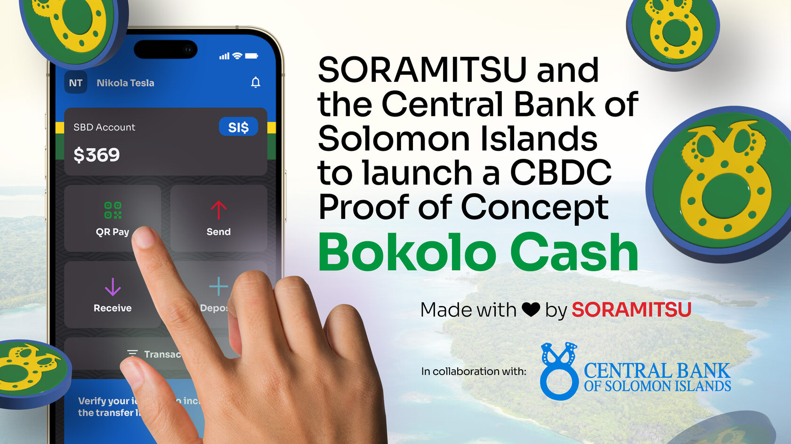
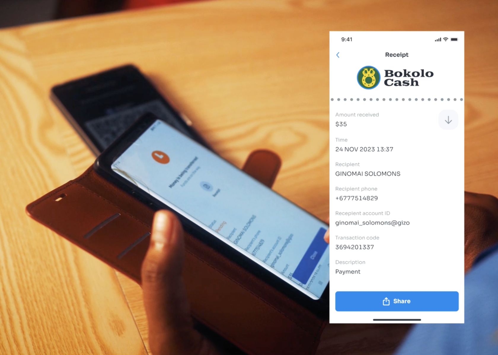

Central Bank of Solomon Islands Collaborates with Soramitsu on CBDC PoC Project

PRESS RELEASE

SORAMITSU Co., Ltd. 
Shibuya-ku, Tokyo, Japan

[info@soramitsu.co.jp](mailto:info@soramitsu.co.jp) 
[soramitsu.co.jp](https://soramitsu.co.jp)

**FOR IMMEDIATE RELEASE 
**Wednesday, November 29, 2023 

# Central Bank of Solomon Islands Collaborates with Soramitsu on CBDC PoC Project

## → The Central Bank of Solomon Islands (CBSI) and Soramitsu have begun a Proof-of-Concept (PoC) for a Central Bank Digital Currency (CBDC).

Starting from November 1, 2023, the CBSI has been testing Bokolo Cash, provided by Soramitsu, for use cases related to domestic and foreign payments, including testing simulated international remittances.

The Bokolo Cash CBDC system comprises a Hyperledger Iroha 2-based permissioned blockchain network. Bokolo Cash is named after Bokolo, a currency made from shells used for unique purposes in the Solomon Islands. The CBSI issues the Bokolo Cash currency as a digital representation of the Solomon Dollar, available as tokens that PoC participants can buy. 

Each Bokolo is worth $1 Solomon Islands dollar, accepted as legal tender within the confines of the PoC, with individual participants and businesses able to send and receive Bokolo Cash between each other and get Bokolo Cash for payments. Bokolo Cash will be accepted at selected merchants in Honiara by PoC participants. 

Interbank payments between his CBSI and commercial banks and between commercial banks (wholesale CBDC) can also use Bokolo cash. Users will undergo two-tier Know Your Customer (KYC) identity verification, including eKYC, in line with international regulations.

A ceremony for the CBDC demonstration experiment took place on November 28, 2023; Soramitsu gave speeches to the participants, cut the tape, and provided screened and practical CBDC demonstrations. Soramitsu also explained the results of the CBDC experiment, the benefits that arise from introducing the CBDC to the Pacific island countries and its effects on individuals, the financial and industrial sector, the government, and others. 

The Solomon Islands Prime Minister Manasseh Sogabare, Finance Minister Harry Kuma, Central Bank Governor Luke Forau, Ambassador Extraordinary and Plenipotentiary of Japan to the Solomon Islands Miwa Yoshiaki, the Cabinet Secretariat of the Government of Japan, and JICA attended the ceremony. The central banks of Fiji, Vanuatu, Samoa, Tonga, Australia, New Zealand and Papua New Guinea were also present in the ceremony. 

Prime Minister Sogavare said: 

* * *

__"CBDC will improve safety, credibility, and privacy, provide financial services that leave no one behind, and bring sustainable economic development and technological development to the Solomon Islands, enabling a new era."__

* * *

Additionally, to simulate cross-border payment feasibility, a public blockchain, which offers global reach and interoperability, will be tested to complement the features of a private Iroha-based blockchain explicitly tailored to the regulatory framework of its managing jurisdiction.

Bokolo Cash users will be able to bridge their CBDC tokens to the SORA network, a decentralised Substrate-based public blockchain network, where they can transfer Bokolo Cash tokens to other users within the network using QR codes through the Fearless Wallet mobile app that is compatible with SORA public blockchain and is also developed by Soramitsu, taking advantage of public blockchain security, availability, and speed.

Within the scope of the PoC, Fearless Wallet is used to simulate cross-border transactions. Because no country owns SORA, it is ideal for central banks to use it without worrying about political exposure. In the future, other central banks could also bridge their CBDCs to SORA, which will aid remittances between multiple jurisdictions. 

By embracing state-of-the-art blockchain technology and working with Soramitsu and the Hyperledger Iroha blockchain framework, the CBSI reiterates its commitment to modernising the financial landscape of the Solomon Islands and fostering greater financial inclusion and connectivity in global economic systems. 

The Bokolo Cash PoC will provide valuable data to aid decision-making by CBSI as it endeavours to take full advantage of the latest technology for the good of the Solomon Islands. A regulatory sandbox for innovative solutions and amendments to relevant sections of the CBSI Act 2012 to accommodate digital currency developments in the Solomon Islands have enabled the modernisation of the Solomon Islands' financial landscape. 

* * *

* * *

****About the Central Bank of Solomon Islands****

Established as the central bank and principal financial institution of the Solomon Islands, CBSI continues to promote monetary stability, foster a sound financial infrastructure, and maintain internal and external monetary stability conducive to the nation's economic development.

**About SORAMITSU**

[soramitsu.co.jp](https://soramitsu.co.jp)

Soramitsu is an award-winning, global financial technology company with expertise in developing blockchain-based solutions for central banks, multilateral financial institutions, and decentralised cryptoeconomic ecosystems. Soramitsu's mission is to use blockchain to promote innovation and solve pressing societal challenges. 

* * *

SEE ALSO:

**SORAMITSU & the Bank of the Lao PDR to launch a CBDC PoC** 
The Bank of the Lao PDR Payment Systems Department and SORAMITSU Co., Ltd have signed an MOU for a CBDC Proof of Concept 

[

Learn more

](https://soramitsu.co.jp/dlak-cbdc)

Follow SORAMITSU's [news and latest partnerships and developments here](https://soramitsu.co.jp/#news)_._ 

GET IN TOUCH AND FOLLOW:

* 
* 
* 
* 
* 

* * *
