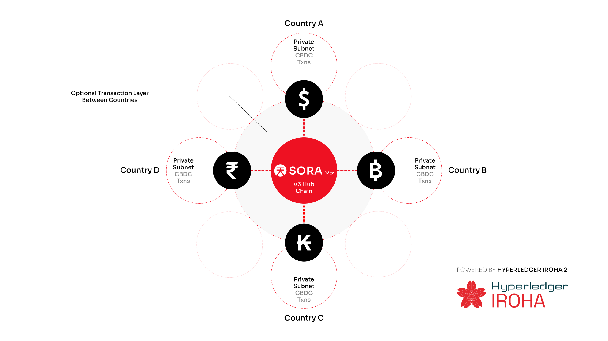

Bank of Papua New Guinea, Japan’s METI, and Soramitsu Complete CBDC Proof of Concept in Port Moresby

PRESS RELEASE

Soramitsu Co., Ltd. 
Shibuya-ku, Tokyo, Japan

[info@soramitsu.co.jp](mailto:info@soramitsu.co.jp) 
[soramitsu.co.jp](https://soramitsu.co.jp)

**FOR IMMEDIATE RELEASE** 
Port Moresby, Papua New Guinea, January 28, 2025

# Bank of Papua New Guinea, Japan’s METI, and Soramitsu Complete CBDC Proof of Concept in Port Moresby

## → Today, the Bank of Papua New Guinea, in collaboration with Soramitsu and Japan’s Ministry of Economy, Trade and Industry (METI), marked the successful completion of the Digital Kina Proof of Concept (PoC) for the country’s Central Bank Digital Currency (CBDC), with a ceremony held at the Papua New Guinea Hilton Hotel in Port Moresby.

The event brought together leaders and representatives from Papua New Guinea and Japan, including Elizabeth Genia, Governor of the Bank of Papua New Guinea; Hisanobu Mochizuki, Japanese Ambassador to Papua New Guinea; officials from the Japanese Cabinet Secretariat; and the Japanese fintech corporation Soramitsu. The agenda included opening remarks, technical presentations on the Digital Kina system, and discussions about its potential impact on financial inclusion in Papua New Guinea. 
 
"The rationale for the Proof-of-Concept study stems from the rapid advancements 
in digital financial technologies globally, which have opened up opportunities to 
enhance payment systems and improve financial inclusion. Many Central Banks 
around the world are exploring digital currencies to meet the evolving needs of the 
communities we serve," said **Governor Elizabeth Genia** during her remarks at the ceremony.

**Event highlights:**

**George Awap**, Assistant Governor of the Bank of Papua New Guinea, introduced the project and its significance to financial development.

**Hisanobu Mochizuki**, Japanese Ambassador to Papua New Guinea; **Nobuhisa Nishigata**, Counsellor of the Cabinet Secretariat of Japan; and **Hideaki Matsuoka**, Chief Representative of the Papua New Guinea Office of the Japan International Corporation Agency, shared their perspectives on the collaboration as representatives of the Japanese government.

**Dr. Makoto Takemiya**, Group CEO of Soramitsu, and **Takayuki Himeno**, Mitsubishi Research Institute, presented the technological framework of the Digital Kina system, followed by a Q&A session with attendees.

**George Awap**, **Hideaki Matsuoka**, **Nobuhisa Nishigata**, **Elizabeth Genia**, **Hisanobu Mochizuki**, **Makoto Takemiya**, **Takayuki Himeno**, and **Taketoshi Mori** pose for a commemorative photo after the ceremony.

The **Digital Kina PoC** leverages Soramitsu’s cutting-edge technology, which is used in the **[SORA](https://sora.org/) v3 Hub Chain**, a global platform powered by the open-source **[Hyperledger Iroha 2](https://iroha.tech/)** blockchain. This breakthrough initiative demonstrates how blockchain can address Papua New Guinea’s most urgent financial challenges, including limited banking access, security vulnerabilities, and underdeveloped financial infrastructure.

 

Kazumasa Miyazawa

President of Soramitsu Japan

_“Soramitsu is dedicated to modernizing and advancing Papua New Guinea’s financial system while fostering the development of a digital economy. With the support of the Japanese government, we aim to leverage cutting-edge blockchain technology, proven in various countries, to make a meaningful contribution to this mission.”_

The PoC required a secure, round-the-clock payment infrastructure that supports instant settlement and cross-border transactions. Using SORA v3 Hub Chain, the Bank of Papua New Guinea and local businesses in Port Moresby conducted real-time payments and individual remittances via a user-friendly mobile app. The platform’s enhanced security features—such as the ability to recover funds in cases of theft or loss—were also tested successfully in partnership with the Bank of Papua New Guinea.

_“The Digital Kina PoC with the Bank of Papua New Guinea represents the latest technology we have been working on for the last five years. We are excited to see how this project can bring modern financial solutions for the people of Papua New Guinea that will improve their lives and empower them with greater control over their money.”_

 

**Dr Makoto Takemiya**

Group CEO and Co-Founder of Soramitsu

Moving forward, the Bank of Papua New Guinea will expand testing with a broader user base to refine the system and gather additional feedback. This will pave the way for a broader rollout in the near future. This next phase will optimize the platform’s speed, security, and regulatory compliance features, bringing Papua New Guinea closer to a more inclusive and resilient financial future.

 

**George Awap**

Assistant Governor of the Bank of Papua New Guinea

_“Today’s ceremony is a testament to what can be achieved when innovative ideas meet practical execution. The Digital Kina CBDC Proof of Concept is a glimpse into how we can reshape financial interactions in Papua New Guinea. By addressing long-standing challenges, we’re setting the stage for a system that reflects the resilience of our people.”_

* * *

* * *

**About Soramitsu**

[soramitsu.co.jp](https://soramitsu.co.jp)

Soramitsu is an award-winning global financial technology company with expertise in developing blockchain-based solutions for digital asset and identity management. Our mission is to use blockchain to promote innovation and solve pressing societal challenges.

Utilising blockchain, Soramitsu has developed a digital currency infrastructure backbone for the [National Bank of Cambodia](https://soramitsu.co.jp/bakong-press-release), CBDC Proof-of-Concepts with the [Bank of the Lao PDR](https://soramitsu.co.jp/dlak-cbdc), the [Central Bank of Solomon Islands](https://soramitsu.co.jp/bokolo-cash) and the [Bank of Papua New Guinea](https://soramitsu.co.jp/bpng-poc), a blockchain-based digital savings bond system [Palau Invest](https://soramitsu.co.jp/palauinvest) in collaboration with the Government of Palau, a closed-loop [payment system for the University of Aizu](https://soramitsu.co.jp/byacco) in Japan, an identity verification system prototype for Bank Central Asia in Indonesia, shortlisted in the [Monetary Authority of Singapore CBDC Challenge](https://soramitsu.co.jp/global-central-bank-digital-currency-challenge/), participated in Asia-Pacific's first proof-of-concept test of a cross-border multi-currency security settlement system using distributed ledger technology with the Asian Development Bank, and in collaboration with the Risk Assurance Group and Orillion Solutions developed the technology core of the [Fraud Intelligence Blockchain](https://fraudintelligencelimited.com/). 
 
Soramitsu is a contributor to many open source projects, such as Klaytn (now [Kaia](https://kaia.io/)), South Korea's leading Layer-1 blockchain; [Zenswap](https://zenswap.io/), a cross-chain liquidity platform being developed by Soramitsu as a joint venture with Analog; the [SORA](https://sora.org/) crypto-economic system; the [Polkaswap](https://polkaswap.io/) DEX; and the DeFi wallet, [Fearless Wallet](https://fearlesswallet.io/). Soramitsu also collaborated with Filecoin to develop FUHON, a C++ implementation of their protocol; and with the Web3 Foundation to develop [KAGOME](https://github.com/soramitsu/kagome), the C++ [Polkadot](https://polkadot.network/) Host implementation. In addition, Soramitsu is the developer of and major contributor to the open-source blockchain platform [Hyperledger Iroha](https://iroha.tech/), a project of Hyperledger Foundation, now part of the [LF Decentralized Trust](https://lfdecentralizedtrust.org/), tailored for enterprise and public-sector use. As founding contributors to the Hyperledger Project, Soramitsu is building the digital infrastructure of the future. 
 
Based on these experiences, Soramitsu continues to deploy cutting-edge technology on a global scale in order to expedite financial inclusion and health, mitigate economic inefficiencies, and contribute to the fulfilment of the Sustainable Development Goals.

* * *

SEE ALSO:

**A Year of Progress: Soramitsu’s Role in Advancing Blockchain Globally in 2024** 
Soramitsu continued its mission to enhance financial inclusion and drive digital transformation globally in 2024.

[Learn more](https://soramitsu.co.jp/2024-in-review)

**Central Bank of Solomon Islands Collaborates with Soramitsu on CBDC PoC Project** 
The Central Bank of Solomon Islands (CBSI) and Soramitsu have begun a Proof-of-Concept (PoC) for a Central Bank Digital Currency (CBDC).

[Learn more](https://soramitsu.co.jp/bokolo-cash)

Follow Soramitsu's [news and latest partnerships and developments here](https://soramitsu.co.jp/#news)_._

GET IN TOUCH AND FOLLOW:

* 
* 
* 
* 
* 

* * *

## Ready to explore innovative solutions?

Get in touch with us today! Email us at [service@soramitsu.co.jp](mailto:service@soramitsu.co.jp) or fill out the form to schedule a free consultation with one of our experts. Let's bring your vision to life!

Send

By clicking Send you agree to our [Terms and Conditions](/terms) and [Privacy Policy](/privacy)

[Japan Blockchain 
Association](http://www.jba-web.jp)

[Global Blockchain 
Business Council](https://gbbcouncil.org)

[LF Decentralized Trust](https://www.lfdecentralizedtrust.org/)

[Fintech association of Japan](http://www.fintechjapan.org)

Proud member of:

Soramitsu Co. Ltd., Link Square Shinjuku 16F, 5-27-5, Sendagaya, Shibuya-ku, Tokyo, Japan, 151-0051 
 
Soramitsu Helvetia AG c/o Diego Compostella, Oberneuhofstrasse 5, 6341 Baar, Switzerland 
 
[Privacy Policy](/privacy) 
[Terms and Conditions](/terms) 
 
© 2016-2025 SORAMITSU. 
All Rights Reserved.

* [About](/#about)
* [Services](/#services)
* [Awards](/#awards)

* [Case Studies](/#casestudies)
* [Partners](/#partners)
* [Team](/#team)

* [News](/#news)
* [Careers](/jobs)
* [Contact](/#contact)

* 
* 
* 
* 
* 

Back to top
