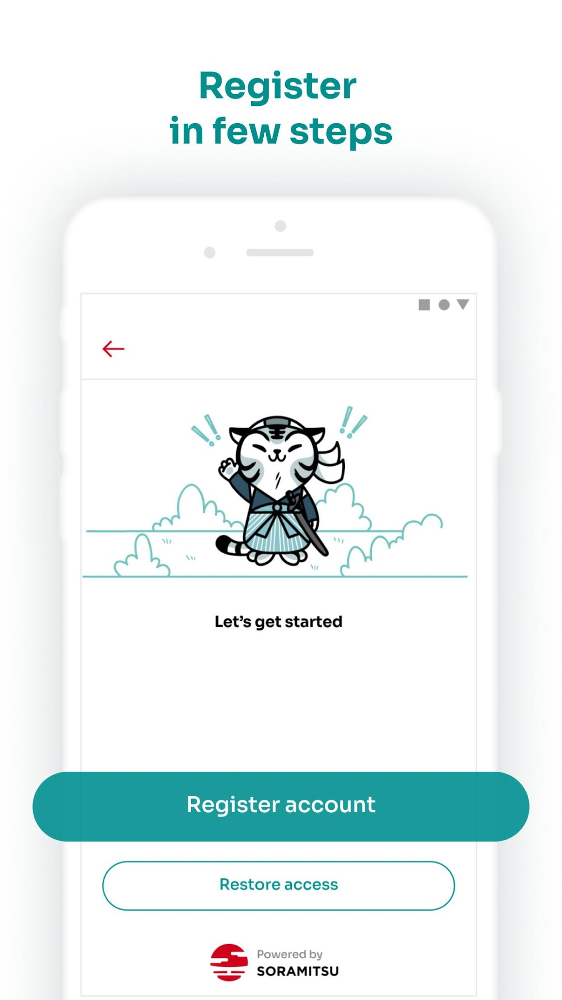
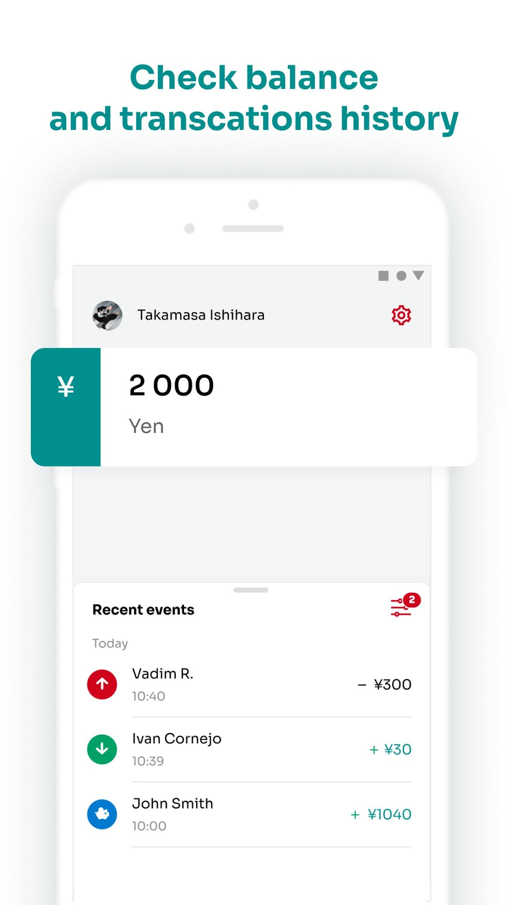
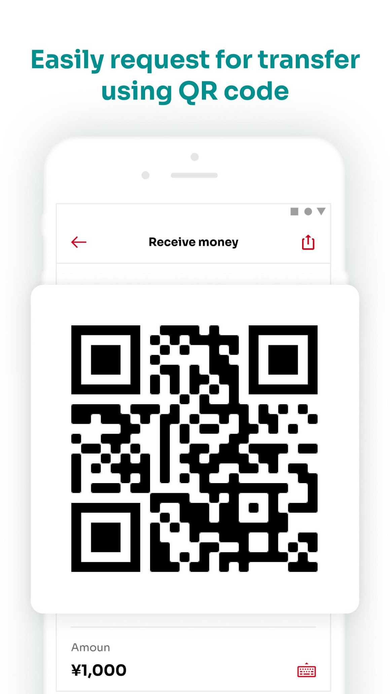
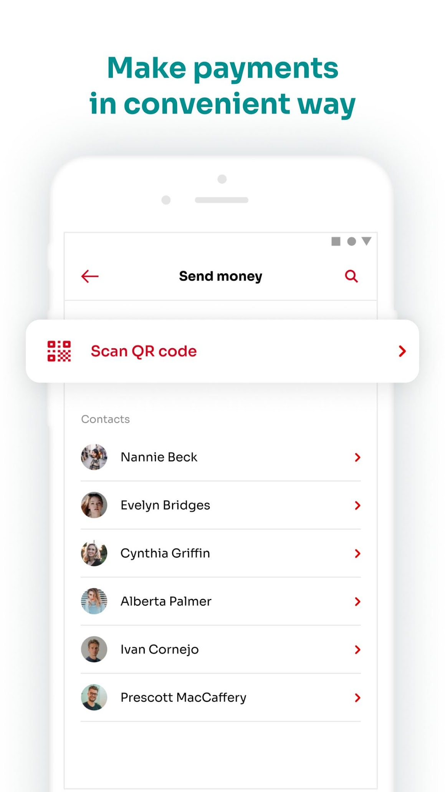

Byacco

[

**Byacco**

](https://soramitsu.co.jp/byacco)

* [About](https://soramitsu.co.jp/byacco)
* [Customer Manual](https://soramitsu.co.jp/eng/byacco/manual)
* [Team](https://soramitsu.co.jp/byacco/team)
* [Contact](https://soramitsu.co.jp/byacco#rec209182761)
* [Support Desk](https://soramitsusupport.atlassian.net/servicedesk/customer/portal/3)
* EN
 
 * [日本語](https://soramitsu.co.jp/byacco/ja)
 

[

**Byacco**

](https://soramitsu.co.jp/byacco)

[About](https://soramitsu.co.jp/byacco) [Customer Manual](https://soramitsu.co.jp/eng/byacco/manual) [Team](https://soramitsu.co.jp/byacco/team) [Contact](https://soramitsu.co.jp/byacco#rec209182761) [Support Desk](https://soramitsusupport.atlassian.net/servicedesk/customer/portal/3) EN

* [日本語](https://soramitsu.co.jp/byacco/ja)

 
Byacco

Introducing Byacco — a unique local payment system for the University of Aizu, Japan. 
Join us in the future of cashless payments! 
 

 
 
Byacco

 
Introducing Byacco — a unique local payment system for the University of Aizu, Japan. Join us in the future of cashless payments! 
 

Byacco is the first local digital coin originally developed for the University of Aizu, Japan. It is based on blockchain technology for more secure and reliable payments. Byacco is the first local payment solution based on a high-end Distributed Ledger Technology designed and developed by [SORAMITSU](https://soramitsu.co.jp). 

**WITH THE BYACCO APP YOU CAN:**

Add digital money 
to your account

Pay for local goods and services using your digital wallet

Split the bill at the University cafeteria and stationary shop

Send and receive money with the lowest possible fee (1 ¥)

WHAT'S NEW

 
From now on you can use your phone to: 
 
• Pay in the cafeteria – yourself or by splitting the bill with your friends 
• Buy groceries 
• Transfer funds to your friends 
 
All transactions will be securely stored in a decentralised ledger based on Hyperledger Iroha – technology that was originally developed within the walls of the University. 
 
Welcome to the next generation of payments! 
 
Download the app and check out our Customer Manual for a guided registration. 
 

[

Customer Manual

](https://soramitsu.co.jp/eng/byacco/manual)

****Inquiries****:

Please go to [Service Desk](https://soramitsusupport.atlassian.net/servicedesk/customer/portal/3) for inquiries on use or issues with the Byacco App. 
 
Please check [FAQ in Service Desk](https://soramitsusupport.atlassian.net/servicedesk/customer/portal/3) before you create an inquiry. 

****Inquiries you're not sure where to ask:** 
**

Soramitsu Co., Ltd. 
Link Square Shinjuku 16F 
5-27-5 Sendagaya, Shibuya-ku 
Tokyo 151-0051 
 
Email: [byacco.support@soramitsu.co.jp](mailto:byacco.support@soramitsu.co.jp) 
 
It may take a few days to answer according to the inquiry. 
 
Website: [https://soramitsu.co.jp/](https://soramitsu.co.jp/) 

****Inquires on stores where you can use Byacco App:****

Student Life Support Ltd. 
Aizu University, Kamiiawase 90, 
Itsukimachi Oaza Tsuruga, Aizuwakamatsu-shi, 
Fukushima 965-0006, Japan 
 
Tel (domestic): 0242-33-0771 
 
Email: [sis@gakushoku.com](mailto:sis@gakushoku.com) 
 
Website: [http://www.gakushoku.com/](http://www.gakushoku.com/) 

AiYUMU Co., Ltd. 
Higashisakaemachi1-77, 
Aizuwakamatsu-shi, 
Fukushima 965-0872, Japan 
 
Website 
[https://aizu-aiyumu.co.jp/en/](https://aizu-aiyumu.co.jp/en/)

© 2022 SORAMITSU CO., LTD.

* [Byacco Privacy Policy](https://soramitsu.co.jp/byacco/privacy)

© 2022 SORAMITSU CO., LTD.

Back to top
