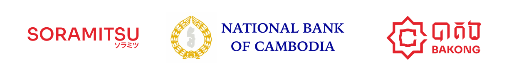
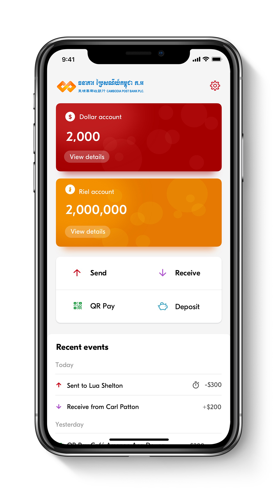
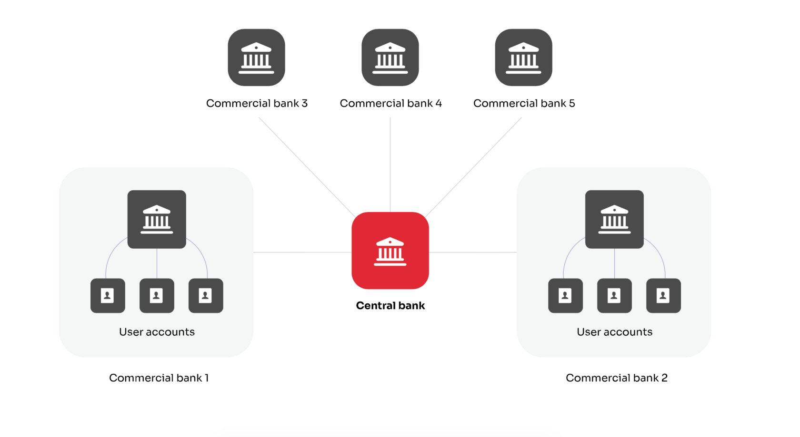
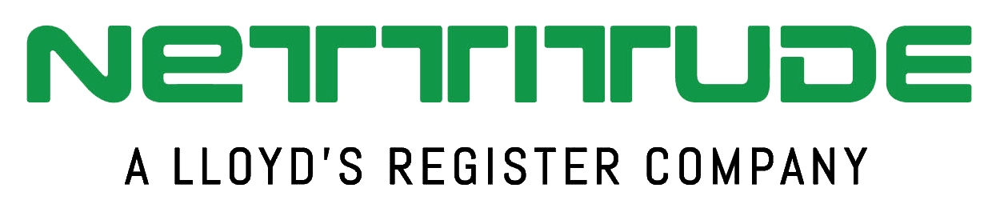
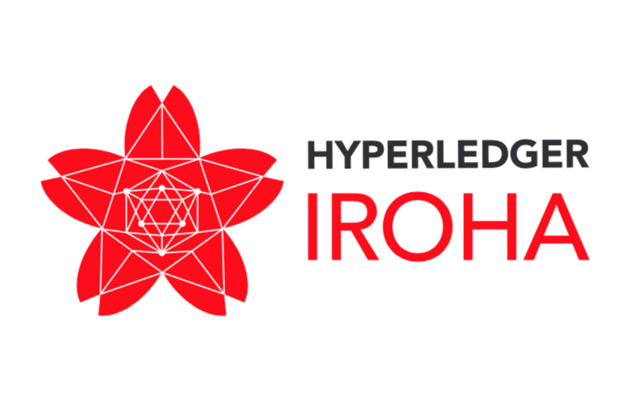

Central Banking (En)

Bakong: A Real Time Gross Payment System

**We are pleased to announce Bakong, the collaboration between Soramitsu and the National Bank of Cambodia. Bakong is Cambodia's only integrated payment system that allows you to do everything - e-wallets, mobile payments, online banking and financial applications - all in one place. Bakong is a next-generation Real-Time Gross Payments system already in production, that promotes financial inclusion through a friendly yet powerful [iOS](https://apps.apple.com/us/app/bakong/id1440829141) and [Android](https://play.google.com/store/apps/details?id=jp.co.soramitsu.bakong&hl=en_US) app.** 

[

Bakong White Paper

](/bakong/whitepaper)

Download the Bakong App, Cambodia's only integrated payment system that allows you to do everything - e-wallets, mobile payments, online banking and financial applications - all in one place. 
 
 

Our Solution in Action 

The revolutionary and unique DLT core solution allows for real-time gross domestic and cross-border payments between any and all account holders on a single platform. 
 
The optional digital currency is a secure alternative to paper bank notes designed to function within the parameters required by the banking system. Using a secure and standardized digital currency as a means of payment can increase trust and confidence in the payment system. 
 

[

View the Case Study

](https://www.hyperledger.org/learn/publications/soramitsu-case-study)

Core Product Features

* 
 
 End Consumer Features:
 
 * Deposits and withdrawals to and from a traditional bank account or a digital account
 * EMVCo-compatible QR codes for near instantaneous money transfers between users and merchant banks or digital accounts
 * Support for sovereign digital currencies, foreign currencies, and additional digital assets
 * User-friendly KYC using physical ID document scan and ID photo check with biometric liveness detection
 

* 
 
 Admin Features (Banks & Payment Providers):
 
 * Out-of-the box automated reporting, and back-office monitoring application
 * A single universal mobile application that can be customized by any commercial bank or payment provider, or embedded into existing applications to be used by all account holders on iOS and Android
 * Multi-language support
 * Manage users' limits
 

Users and banks can seamlessly transfer and exchange 
multiple currencies using Bakong.

AWARDS

The journal _Central Banking_ recognised SORAMITSU's work on Bakong with their inaugural FinTech & RegTech Global Award for Central Bank Digital Currency Partner for 2020:

Bakong's contributions to the Cambodian economy have received widespread recognition. In 2021, the system was awarded a [Nikkei Superior Products and Services Award](https://asia.nikkei.com/Business/Finance/Cambodia-s-digital-currency-reaches-nearly-half-the-population) for its "innovative technology and impact on the country's economic and social development." 
 
On the strength of Bakong and concurrent innovations, _The Banker_ named Governor of the NBC Chea Chanto [Central Banker of the Year Asia-Pacific](https://www.thebanker.com/Awards/Central-Bank-Governor-of-the-Year/Central-Banker-of-the-Year-2021), while _CoinDesk_ named deputy director general Serey Chea, who led the project, as one of the year's [most influential 50 fintech players](https://www.coindesk.com/policy/2021/12/09/most-influential-40-serey-chea/). 
 
SORAMITSU was similarly recognised with a [Japan Fintech Award](https://jfia.tokyo/), a notable follow-up to our 2020 [FinTech & RegTech Global Award](https://www.centralbanking.com/awards/7681581/central-bank-digital-currency-partner-soramitsu).

Our DLT Core Solution is based on Hyperledger Iroha, a fast and effective permissioned blockchain and distributed ledger. Iroha can handle millions of account holders making tens of millions of transactions every day, as fast or faster than any modern bank transfer. 
Iroha's crash-fault tolerant consensus protocol keeps information about every account and transaction securely and reliably. 
 
There are different possible configurations of the system with respect to the number of nodes and location of the payment gateways. 
 

**The Technology**

Relevant code base for existing Soramitsu projects have been audited by Nettitude

Contact Us

To receive a case study on the first deployment of our payment 
solution in the Kingdom of Cambodia please fill out this form.

[info@soramitsu.co.jp](mailto:info@soramitsu.co.jp)

Thank you! Someone from our team will be in touch with you soon.

Send

[Japan Blockchain 
Association](http://www.jba-web.jp)

Global Blockchain 
Business Council

[Fintech association of Japan](http://www.fintechjapan.org)

Proud member of:

* [日本語](https://soramitsu.co.jp/ja/centralbanking)
* [Русский](https://soramitsu.co.jp/ru/centralbanking)
* [ភាសាខ្មែរ](https://soramitsu.co.jp/kh/centralbanking)

This website uses cookies to ensure you get the best experience

OK
