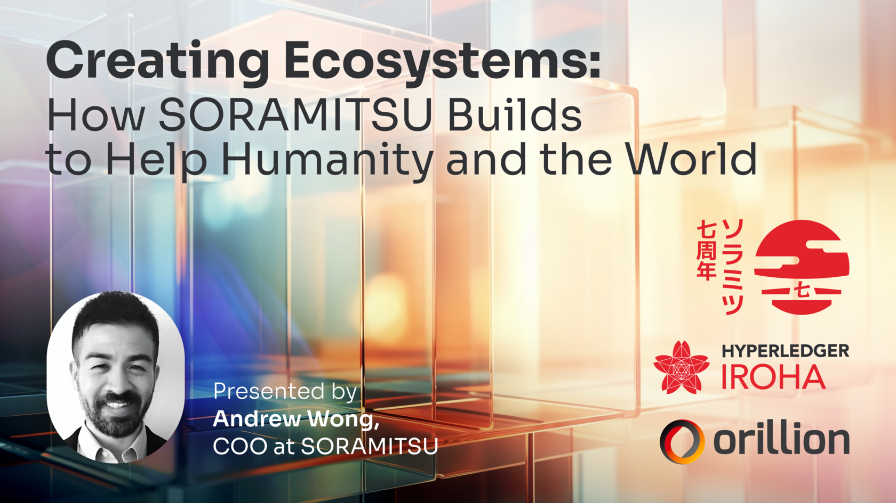

Creating Ecosystems: How Soramitsu Builds to Help Humanity and the World

PRESS RELEASE

SORAMITSU Co., Ltd. 
Shibuya-ku, Tokyo, Japan

[info@soramitsu.co.jp](mailto:info@soramitsu.co.jp) 
[soramitsu.co.jp](https://soramitsu.co.jp)

**FOR IMMEDIATE RELEASE 
**Friday, December 14, 2023 

# Creating Ecosystems: How Soramitsu Builds to Help Humanity and the World

## → Ecosystems of cooperation are essential to achieving a company’s mission and vision within the ever-evolving technology sector. As a cutting-edge blockchain technology provider, Soramitsu harnesses the power of ecosystems to develop solutions that aim to improve humanity.

Maintaining leadership in the business world is hard. It is cut-throat, and anyone who says it isn't hasn't worked a proper corporate job in his/her life. Companies around the world are working day and night, ideating on how to solve their target customer needs, writing and shipping code, manufacturing new products, investing in R&D, and driving process automation and financial planning, all while orchestrating these efforts under a cohesive corporate vision that drives financial performance and promotes performance excellence. 

Soramitsu is no different. We are invested heavily in building cutting-edge technologies and grasping their humanity-changing applications, varying from our relationship with leading Web3 Ecosystems to the work we are pioneering in the telecommunications arena to our public sector cooperative efforts. 

Our technology model is built fundamentally on (the) Open Source Philosophy. The belief is that while we must initially concentrate on the technology and grasp its applications in the market, we must also identify the challenges the technology creates and work with many other like-minded parties to build an **ecosystem of cooperation** to see the impact of our technology on the world.

**Why Ecosystems?** 
 
Ecosystems bring many clear benefits, including access to talent, technical capabilities, and scale that results when all parties are aligned together towards a common purpose. According to [a study by Ernst and Young in Spring 2023](https://www.ey.com/en_gl/strategy/what-possibilities-will-you-unleash-by-mastering-an-ecosystem-strategy) of more than 800 business leaders: _"Ecosystems make up on average 13.7% of the annual revenue of organisations using at least one ecosystem business model, as well as driving 12.9% in cost savings and 13.3% in incremental earnings."_ 

Yet, despite these benefits, the ecosystem business model can also create challenges and discomforts, ranging from commercial legal structures to decision-making mind shifts, questions that C-Level executives and leaders are asking themselves and revisiting in their annual planning and board meetings. I will briefly touch on our work within the telecommunications sector, Web3 and its groundbreaking applications to the public sector and the impact of ecosystems supporting their success; 

**Fraud Intelligence Limited** 
 
One of an ecosystem model's most powerful use cases is Soramitsu's investment in the Joint Venture [Fraud Intelligence Limited](https://fraudintelligencelimited.com/). In recent years, businesses have been criticised as a major cause of social, environmental, and economic problems. Companies are widely thought to be prospering at the expense of their communities. Trust in business has fallen to new lows, leading government officials to set policies that undermine competitiveness and economic growth. Focusing on short-term financial performance results in short-term decision-making, often at the expense of customers' well-being. 

Fraud Intelligence Limited promotes the belief that both business and society can come together in a way, through a redefined purpose of creating 'shared value' - which is to generate economic value in a way that also produces value for an industry or society, by addressing challenges, and which can connect the company success with that of its customers and more broadly, society. This method balances the short term with the long term. 

Fraud Intelligence Limited recognises that to combat sophisticated fraudsters, we need cooperation amongst all parties in the industry and that cooperation must be supported by technology which is agnostic to any single party and whose value is built and derived from the 'shared value' of all participants who contribute and share data. This ecosystem thesis underpinned the decision to build the next generation of the Fraud Intelligence Blockchain on Hyperledger Iroha, a cutting-edge open-source blockchain. It also catalyses the building of a conduit that enables telcos to participate using their native workflow contained in their preferred fraud management system provider, driving further the shared value ecosystem model.

**Web 3 and the Public Sector** 
 
The elephant in the room when it comes to blockchain is crypto. This word is almost taboo due to the recent run-ins with law enforcement and the contrasting opinions from daily headlines scattered with scams and technological breakthroughs. Soramitsu contributes to Web3 through the [SORA blockchain](https://wiki.sora.org/), a public network within the Polkadot ecosystem of interoperable and interconnected networks that competes with Ethereum through its speed, reliability and low transaction costs. 

The community is a guiding force here, as we provide the technology for the SORA network to continue expanding its ecosystem reach at the behest of the users. We map this using an [integrated plan](https://wiki.sora.org/integrated-plan.html) that considers network requirements, user needs, market trends, and the ever-changing and ever-evolving blockchain technologies available across networks. We do not believe in the limitations that one network presents for users by building an ecosystem that takes the best of all worlds to provide an experience that is as seamless, easy to use and great-looking as those provided by Google or Meta. 

We have harnessed our expertise and community collaboration to build a decentralised finance platform on the SORA network called [Polkaswap](https://polkaswap.io/). As an [AMM dex](https://chain.link/education-hub/what-is-an-automated-market-maker-amm), it further highlights the role of the community and ecosystem, where users are incentivised to participate. There are bridges within the DEX that can connect to other chains and use the marketplace to benefit users and projects, embracing the ecosystem-building benefits of decentralised finance. 

Ultimately, the goal is to provide a chain-agnostic ecosystem that allows users to access services across networks and harness the full capability of decentralised finance to improve people's lives. Fortunately, our discerning community includes computer science professionals and seasoned traders who provide valuable insights to help us build and deliver better solutions. 

Finally, as a proverbial "full circle", we are working on technologies that will allow Central Bank Digital Currencies and cryptocurrencies to coexist, harnessing the SORA technology to power a proof of concept to simulate cross-border remittances that are faster, cheaper, and more efficient than the legacy banking. As main contributors to [Hyperledger Iroha](https://hyperledger.github.io/iroha-2-docs/guide/introduction.html), we are at the forefront of CBDC development. We have supported implementing the Bakong payment system in Cambodia, which has [recently announced an MoU with Alipay](https://coingeek.com/cambodia-bakong-goes-cross-border-with-alipay-integration/), extending its capabilities into China. 

Our work has not stopped there, as we are working on a [CBDC PoC with the Central Bank of Solomon Islands](https://soramitsu.co.jp/bokolo-cash) that is trialling cross-border remittances using a public blockchain. We are actively contributing to the [financial development of Asia](https://soramitsu.co.jp/asian-digital-payment-network) with support from the Japanese government. 

**Conclusion** 
 
Thanks to our ecosystem-based work with different blockchain applications on different platforms, with completely different applications and customer segments, we can tackle the problems present from different angles and with pooled expertise that allows a wider vision to better achieve our goal of improving humanity through the technology we develop. 

Ecosystem models are the lifeblood of businesses looking to benefit from the collective wisdom of their customers/community while also creating avenues in which it can optimise both the financial top and bottom line. Creating new forms of value is not a one-person show. While multiple business ecosystem models can exist, Soramitsu has taken steps to integrate ecosystem business models into its company's broader operating model and culture. 

* * *

**About Soramitsu**

[soramitsu.co.jp](https://soramitsu.co.jp)

Soramitsu is an award-winning, global financial technology company with expertise in developing blockchain-based solutions for central banks, multilateral financial institutions, and decentralised cryptoeconomic ecosystems. Soramitsu's mission is to use blockchain to promote innovation and solve pressing societal challenges. 

* * *

SEE ALSO:

**Fraud Intelligence Limited Insights - What is Tokenization and How is it Important? 
**Understanding the utility of blockchain tokens to help combat fraud within the telecommunications industry 

[

Learn more

](https://soramitsu.co.jp/fil-insights)

Follow Soramitsu's [news and latest partnerships and developments here](https://soramitsu.co.jp/#news)_._ 

GET IN TOUCH AND FOLLOW:

* 
* 
* 
* 
* 

* * *
