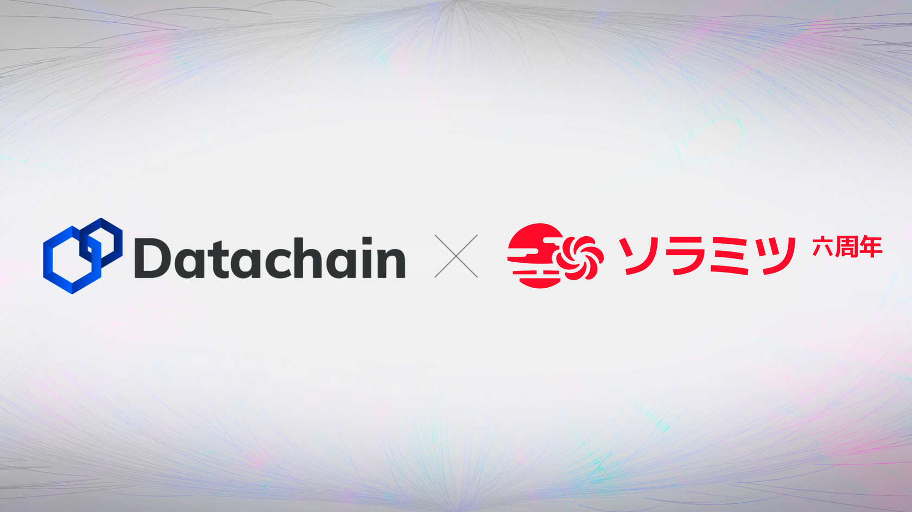

Datachain and Soramitsu Successfully Achieve Interoperability Between Hyperledger Iroha Blockchains for Simultaneous Exchange of Different Digital Currencies

PRESS RELEASE

SORAMITSU Co., Ltd. 
Shibuya-ku, Tokyo, Japan

[info@soramitsu.co.jp](mailto:info@soramitsu.co.jp) 
[soramitsu.co.jp](https://soramitsu.co.jp)

**FOR IMMEDIATE RELEASE 
**Thursday, April 21, 2022 

# Datachain and Soramitsu Successfully Achieve Interoperability Between Hyperledger Iroha Blockchains for Simultaneous Exchange of Different Digital Currencies

## → Datachain, Inc. and Soramitsu Co., Ltd. have successfully completed a demonstration that achieves interoperability using IBC for Hyperledger Iroha, to which Soramitsu initially contributed. The primary use case is the simultaneous exchange of different digital currencies.

In recent years, there have been plenty of developments around digital currencies, for example; many municipalities in Japan already offer digital currencies and Osaka Super City is also considering introducing digital currencies. Various blockchains such as Iroha and Corda are used as the platforms for these digital currencies. Therefore, there is a growing need for PVP settlement among different digital currencies by interconnecting multiple Iroha or Iroha and heterogeneous blockchains. 
 
In the future, we will also support interoperability with different blockchains such as Corda to realize a world where various digital currencies and local currencies are connected. 

**Overview 
 
**Since the beginning of the technology collaboration in November 2021, Datachain and Soramitsu have jointly promoted efforts to achieve interoperability for Iroha, one of the Linux Foundation's Hyperledger projects which was initially contributed by Soramitsu. 
 
As a result of these efforts, Datachain and Soramitsu have now successfully connected multiple blockchains (interoperability) built on Iroha. 
 
Technically, we used "yui-ibc-solidity" (Solidity implementation of IBC) of Hyperledger Lab YUI, an interoperability project led by Datachain. On top of that, we implemented ICS-20 (a standard that defines token transfer in IBC) in Iroha, as well as a web3-gateway implementation to support the web3 API. 
 
yui-ibc-solidity 
[https://github.com/hyperledger-labs/yui-ibc-solidi...](https://github.com/hyperledger-labs/yui-ibc-solidity) 
 
iroha-ibc-modules 
[https://github.com/datachainlab/iroha-ibc-modules](https://github.com/datachainlab/iroha-ibc-modules) 

**Use Cases 
** 
Hyperledger Iroha has already been put to practical use in digital currency projects such as: 
 
● Bakong, the CBDC in the Kingdom of Cambodia 
 
● Byacco, the regional digital currency in the University of Aizu, Japan 
 
● Digital Tokutoku Gift Certificate, a digital gift certificate of Bandai-Cho, Fukushima 
Prefecture, Japan 
 
● Digital Gift Certificate with Toyonon Premium, a Digital gift certificate for the Osaka Toyono-cho Smart City 
 
Other initiatives by the Osaka Prefectural Government to achieve a public-private partnership to realize a super city include the introduction of a digital currency using LITA, a digital currency-issuing SaaS platform built using Iroha. 
 
In addition, stable coins have been defined as an electronic means of payment by the Working Group on Funds Settlement of the Financial System Council. The Payment Services Act and related laws and regulations are expected to be amended by as early as 2023. 
 
This has led the Mitsubishi UFJ Trust and Banking Corporation to announce "Progmat Coin" an infrastructure that enables the issuance and management of stable coins. In addition, the digital currency "DCJPY (tentative name)" promoted by the Digital Currency Forum, in which 74 major Japanese companies are participating, is also under consideration. 
 
As these digital currency-related activities accelerate and the circulation of digital currencies goes into full swing, the need for simultaneous exchange between different digital currencies (PVP settlement) will increase. Datachain and Soramitsu see this kind of exchange between digital currencies and local digital currencies as a major use case. 

**Future Plans 
 
**In the future, Datachain and Soramitsu aim to apply Iroha to specific use cases, focusing on the aforementioned expected use cases. In addition, Datachain and Soramitsu will expand use cases by supporting interoperability with heterogeneous blockchain infrastructures, such as Corda, mainly used in financial projects, including digital currencies. 
 
We have also released the modules and other components we have implemented in this effort as OSS. We will consider upstreaming to Iroha in the future. 
 
**What is YUI, a Hyperledger Lab?** 
 
YUI is a Hyperledger Lab that achieves interoperability between multiple heterogeneous blockchain platforms through IBC. As YUI adopts IBC, it enables different blockchains to communicate with each other without requiring trust in any third-party intermediaries. 
 
Not only does YUI support Hyperledger Iroha, but also Ethereum and other major enterprise blockchains such as Hyperledger Fabric, Hyperledger Besu, and Corda. 
 
For more information about Hyperledger Lab YUI, please visit the link below. 
[https://github.com/hyperledger-labs/yui-docs 
](https://github.com/hyperledger-labs/yui-docs) 
**What is Hyperledger Iroha? 
** 
Hyperledger Iroha was released as a blockchain platform from Japan and is now used worldwide as OSS by The Linux Foundation. It is not only used for financial applications in digital currency such as CBDC in the Kingdom of Cambodia, but also for blockchain applications such as Digital ID and traceability due to its eatures such as easy management of assets, provision of a library for mobile app development, and easy integration into IoT devices. 
 
\*1 IBC: Inter-Blockchain Communication. A specification standard to ensure interoperability between blockchains, is being developed by the Interchain Foundation and the Cosmos Project. 
 
\*2 PVP settlement: Abbreviation for Payment Versus Payment settlement. Simultaneous settlement of transactions between different currencies. 

* * *
