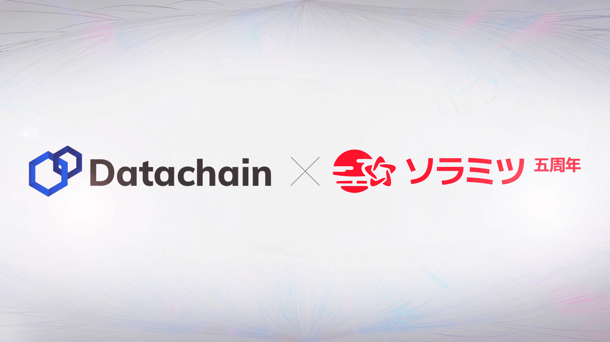

SORAMITSU Teams Up With Datachain to enable the Simultaneous Exchange of Multiple Digital Currencies by Ensuring Interoperability With Hyperledger Iroha

PRESS RELEASE

SORAMITSU Co., Ltd. 
Shibuya-ku, Tokyo, Japan

[info@soramitsu.co.jp](mailto:info@soramitsu.co.jp) 
[soramitsu.co.jp](https://soramitsu.co.jp)

**FOR IMMEDIATE RELEASE 
**Friday, Nov 5, 2021 

# SORAMITSU Teams Up With Datachain to Enable the Simultaneous Exchange of Multiple Digital Currencies by Ensuring Interoperability With Hyperledger Iroha

## → Datachain, Inc. has launched a technology collaboration with SORAMITSU Co., Ltd., the initial contributor of Hyperledger Iroha, hosted by The Linux Foundation.

In this initiative, two technologies from the Hyperledger ecosystem, [Hyperledger Iroha](https://www.hyperledger.org/use/iroha) initially contributed by SORAMITSU and YUI, a Hyperledger Lab that [Datachain](https://www.datachain.jp/) contributed and is working to develop, enable the interoperability through Cosmos' IBC protocol to allow the simultaneous exchange of digital currencies between different blockchains built with Hyperledger Iroha. 

Hyperledger Iroha has been used for various digital currency projects worldwide, including the CBDC (Central Bank Digital Currency) Bakong in the Kingdom of Cambodia, and Byacco, in the University of Aizu (Digital Regional Currency) in Fukushima Prefecture, Japan. In the future, we will consider applying it to projects that have already been put to practical use exchanging such digital currencies. 

Datachain and SORAMITSU have started a technology collaboration to achieve interoperability through Cosmos' IBC in Hyperledger Iroha. 
 
We have prepared two different blockchains built on Hyperledger Iroha and digital currencies on each blockchain in this initiative. To connect the blockchains to each other, we use YUI and the IBC protocol which allows the digital currencies on each blockchain to exchange simultaneously (atomic swap). 
 
Technically, as Hyperledger Iroha has EVM compatibility, we use IBC-Solidity (the Solidity implementation of IBC), which Datachain is developing with a grant from the Interchain Foundation. On top of that, we will support ICS-20 (the standard for token transfer in IBC) in Hyperledger Iroha, as well as design and implement a Relayer that connects Hyperledger Iroha blockchains. 
 
The IBC support in Hyperledger Iroha will be implemented as part of work being done to advance YUI within the Hyperledger Labs. 

**Use Cases** 
 
Hyperledger Iroha has already been put to practical use in digital currency projects such as: 
 

* [Bakong](https://soramitsu.co.jp/bakong-press-release), the CBDC in the Kingdom of Cambodia
* Byacco, the regional digital currency in the University of Aizu, Japan
* Digital Tokutoku Gift Certificate, a digital gift certificate of Bandai-Cho, Fukushima Prefecture, Japan

As shown in the examples above, when various digital currencies are in full circulation in the future, there will be a need for the simultaneous exchange of digital currencies (PVP settlement). 
 
Datachain and SORAMITSU are working on this project to realize such PVP settlement with multiple different digital currencies. 

**Future Plans** 
 
After achieving interoperability of Hyperledger Iroha with IBC using YUI, Datachain will work with SORAMITSU to apply Hyperledger Iroha to specific use cases. 
 
We will also consider the interoperability with other blockchain platforms such as Hyperledger Fabric and Hyperledger Besu, depending on the use case needs. 

**What is YUI, a Hyperledger Lab?** 
 
YUI is a Hyperledger Lab that achieves interoperability between multiple heterogeneous blockchain platforms through IBC. As YUI adopts IBC, it enables different blockchains to communicate with each other without requiring trust in any third-party intermediaries. 
 
Not only does YUI support Hyperledger Iroha, the targets of this initiative, but also Ethereum and other major enterprise blockchains such as Hyperledger Fabric, Hyperledger Besu and Corda. 
 
For more information about Hyperledger Lab YUI, please visit [https://github.com/hyperledger-labs/yui-docs](https://github.com/hyperledger-labs/yui-docs) 

**About SORAMITSU** 
 
SORAMITSU is a Japanese fintech company with expertise in creating blockchain-based infrastructure, payment systems, and identity solutions. 
 

* Together with the National Bank of Cambodia, SORAMITSU developed [Bakong](https://bakong.nbc.org.kh/), the world's first blockchain-based CBDC and retail payments system to be launched by a central bank. Central Banking journal recognised this achievement by presenting SORAMITSU with its [inaugural Central Bank Digital Currency Partner Award](https://www.centralbanking.com/awards/7681581/central-bank-digital-currency-partner-soramitsu).
* SORAMITSU is the original developer of and main contributor to [Hyperledger Iroha](https://www.hyperledger.org/use/iroha), an open-source permissioned blockchain platform aimed at helping businesses and financial institutions manage their digital assets and identities. Hyperledger Iroha is part of the Linux Foundation's Hyperledger Project.
* SORAMITSU received a Web3 Foundation grant to develop [KAGOME](https://medium.com/web3foundation/w3f-grants-soramitsu-to-implement-polkadot-runtime-environment-in-c-cf3baa08cbe6), the C++ implementation of the Polkadot Host, as well as [Polkaswap](https://polkaswap.io/), a decentralized token exchange platform.
* The company also received grants from the Kusama Treasury to develop [Fearless Wallet](https://fearlesswallet.io/), a mobile client tailor-made for peer-to-peer, non-custodial transactions on the Kusama and Polkadot networks with premium features and user experience.
* SORAMITSU was contracted by Filecoin developer Protocol Labs to develop [FUHON](https://filecoin.io/blog/posts/announcing-filecoin-implementations-in-rust-and-c/), the C++ implementation of the Filecoin platform.
* The company has also developed SORA, a groundbreaking decentralized economic system using the XOR and VAL tokens, aimed at changing the way goods and services are brought to market. See [sora.org](https://sora.org/) for more information, then download the app from the Google Play Store or the AppStore on iOS.

To learn more about SORAMITSU's technologies and vision, visit [soramitsu.co.jp](https://soramitsu.co.jp/).

* * *
