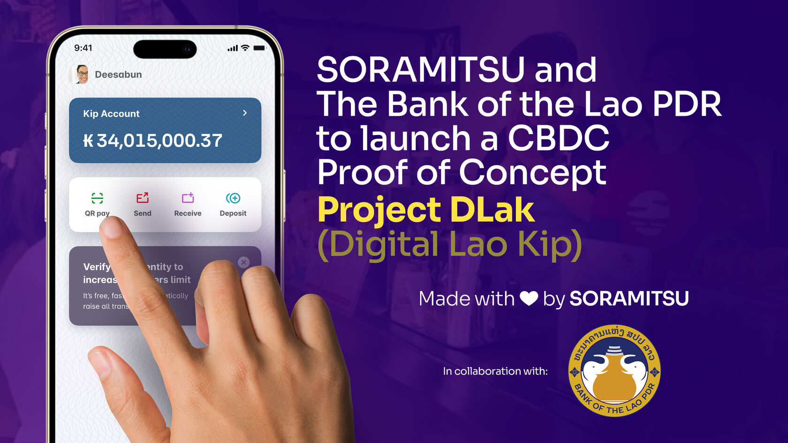
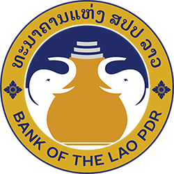

SORAMITSU and The Bank of the Lao PDR to launch a CBDC Proof of Concept

PRESS RELEASE

SORAMITSU Co., Ltd. 
Shibuya-ku, Tokyo, Japan

[info@soramitsu.co.jp](mailto:info@soramitsu.co.jp) 
[soramitsu.co.jp](https://soramitsu.co.jp)

**FOR IMMEDIATE RELEASE 
**Monday, February 6, 2023 

# SORAMITSU & the Bank of the Lao PDR to launch a CBDC PoC

## → The Bank of the Lao PDR Payment Systems Department and SORAMITSU Co., Ltd have signed an MOU for a CBDC Proof of Concept

**The Bank of the Lao PDR Payment Systems Department and SORAMITSU Co., Ltd. have signed a Memorandum of Understanding (_MOU_) to launch a Central Bank Digital Currency (_CBDC_) Proof of Concept (_PoC_) on the 6th of February, 2023 
** 

Starting from the 7th of February, the Bank of the Lao PDR will commence the CBDC PoC using a system developed by SORAMITSU. The Bank of the Lao PDR will also proceed with further research toward the official launch of a CBDC based on the result of the PoC. 
 
SORAMITSU completed a feasibility study of a blockchain-based modern payment infrastructure in Lao PDR that took one year, from December 2021 under the project initiated by the Japan International Cooperation Agency (JICA). After that, the Bank of the Lao PDR and SORAMITSU jointly continued researching CBDC until an agreement to start the CBDC PoC was reached. The project name of the CBDC PoC is **"DLak"** (_Digital Lao Kip_). 
 
At the ceremony that took place on the 6th of February, The Bank of the Lao PDR and SORAMITSU signed an MOU marking the commencement of the PoC, speeches were delivered by representatives of the Bank of the Lao PDR, the Embassy of Japan in the Lao PDR, the Ministry of Economy, Trade and Industry, JICA, and SORAMITSU. A CBDC demonstration was also performed in this ceremony. 

From the 7th of February, officials from the Bank of the Lao PDR, the Embassy of Japan in the Lao PDR, and JICA will all contribute to the CBDC PoC in Laos. For this PoC, SORAMITSU has provided Lao PDR with a modified system based on the proven "[Bakong](https://soramitsu.co.jp/bakong-press-release)" system, which has been operating smoothly for two years since its official launch in Cambodia, in October 2020. 
 
As for the operational flow of the CBDC PoC, the Bank of the Lao PDR will generate CBDC, then issue it to a temporary commercial bank. The temporary commercial bank will then send CBDC to an individual, allowing said individual to pay at the store. Then, the store sends CBDC to a commercial bank. Finally, the Bank of the Lao PDR will collect CBDC from the commercial bank, as shown in the figure below. 

**The conclusion drawn from the PoC will be used to further adjust the CBDC requirements to best respond to the challenges presented by the financial landscape of the Lao PDR. 
** 

Additionally, the result of the PoC will influence and be a prerequisite to any consideration by the Bank of Lao for the official launch of a CBDC system in Lao PDR. 
 
The objectives of a CBDC implementation by the Bank of the Lao PDR are: 
 
1) **Financial inclusion to the broader population**, in order to provide digital financial services to people who do not have access to bank accounts; 
 
2) **Cross-border remittances**, to reduce remittance times and costs from migrant destinations such as neighboring countries; 
 
3) **CBDC is a way to advance the sophistication of payment systems**, as well as ensuring economic security through a local currency that does not depend on other countries. 

**SORAMITSU was selected for the "FY2022 Feasibility Study Project for Overseas Development of High-Quality Infrastructure and Energy Infrastructure" by the Ministry of Economy, Trade and Industry ([METI](https://www.meti.go.jp/english/), the Government of Japan). We have been conducting preliminary CBDC research in [Lao PDR](https://soramitsu.co.jp/digital-currency-research/), [Fiji, Vietnam, and the Philippines](https://soramitsu.co.jp/meti-soramitsu-cbdc).** 

SORAMITSU also participated in the Cabinet Secretariat's financial system research project for Pacific island countries such as Fiji, Tonga, Vanuatu, and the Solomon Islands. The aim of these research projects is to contribute to the sophistication of payment systems utilizing blockchain-based CBDC in ASEAN and Pacific island countries.

* * *

* * *

**About the Bank of the Lao PDR**

[The Bank of the Lao PDR](https://www.bol.gov.la/)

The Bank of the Lao PDR is a state agency equivalent to a ministry, which is a component of the government structure. 
 
The Bank of the Lao PDR serves as a secretariat for the Lao Government in the sectors of monetary management, the supervision of financial institutions, and the efficient development of payment systems to support national social-economic development. 

* * *

**About SORAMITSU**

[soramitsu.co.jp](https://soramitsu.co.jp)

SORAMITSU is an award-winning global financial technology company with expertise in developing blockchain-based solutions for digital asset and identity management. Our mission is to use blockchain to promote innovation and solve pressing societal challenges. 
 
SORAMITSU is the developer of and major contributor to the open-source blockchain platform [Hyperledger Iroha](https://www.hyperledger.org/use/iroha), which is tailored for enterprise and public-sector use. Hyperledger Iroha, a project of Hyperledger Foundation, part of the Linux Foundation, has a permissions system that is scalable and performant. 
 
Utilizing blockchain, SORAMITSU has developed a digital currency for the [National Bank of Cambodia](https://soramitsu.co.jp/bakong-press-release), a closed-loop payment system for the University of Aizu in Japan, an identity verification system prototype for Bank Central Asia in Indonesia, we were finalists in the [Monetary Authority of Singapore CBDC Challenge](https://soramitsu.co.jp/global-central-bank-digital-currency-challenge/), and are currently participating in Asia-Pacific's first proof-of-concept test of a cross-border, multi-currency security settlement system using distributed ledger technology with the Asian Development Bank. We have also conducted proof-of-concept tests for several major Japanese enterprises, and are active contributors to open source projects, such as [KAGOME](https://github.com/soramitsu/kagome), the C++ Polkadot Host implementation, the [SORA](https://sora.org/) crypto-economic system, the [Polkaswap](https://polkaswap.io) DEX, and the DeFi wallet, [Fearless Wallet](https://fearlesswallet.io). 
 
Based on these experiences, SORAMITSU aims to deploy cutting-edge technology on a global level in order to expedite financial inclusion and health, mitigate economic inefficiencies, and contribute to the fulfilment of the Sustainable Development Goals. 

* 
* 
* 
* 
* 

* * *
