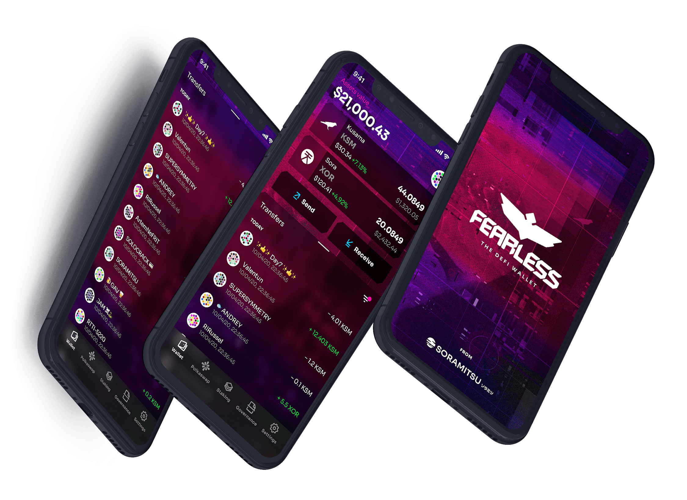
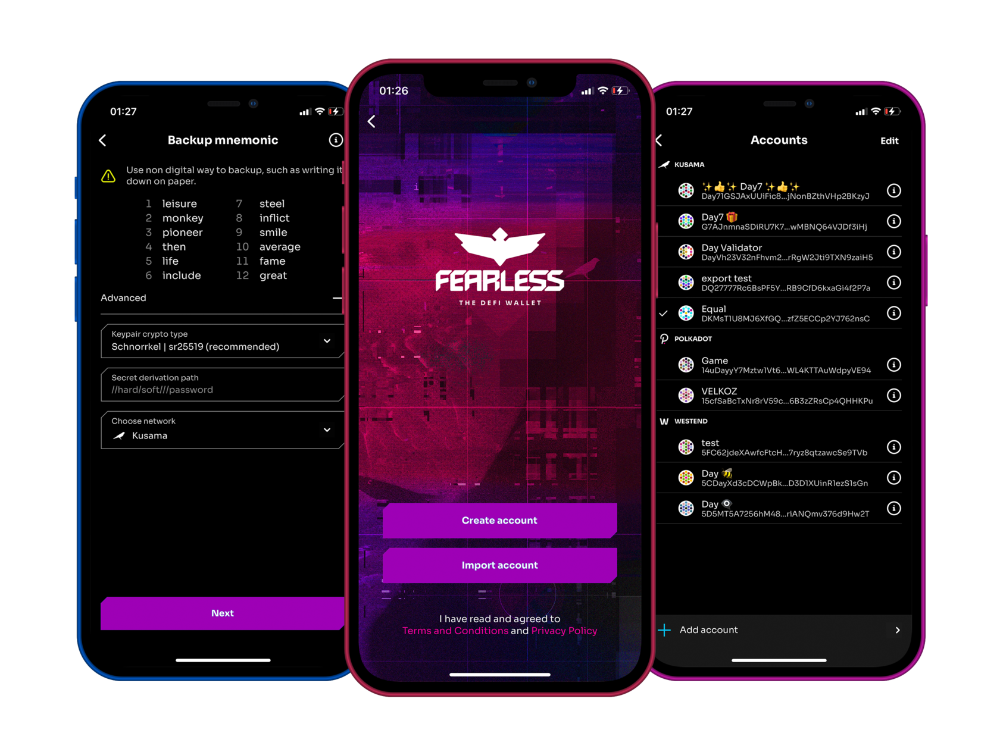
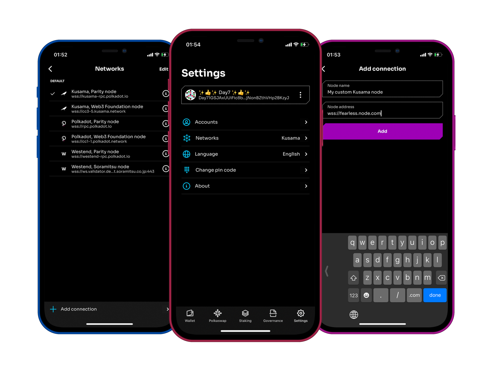
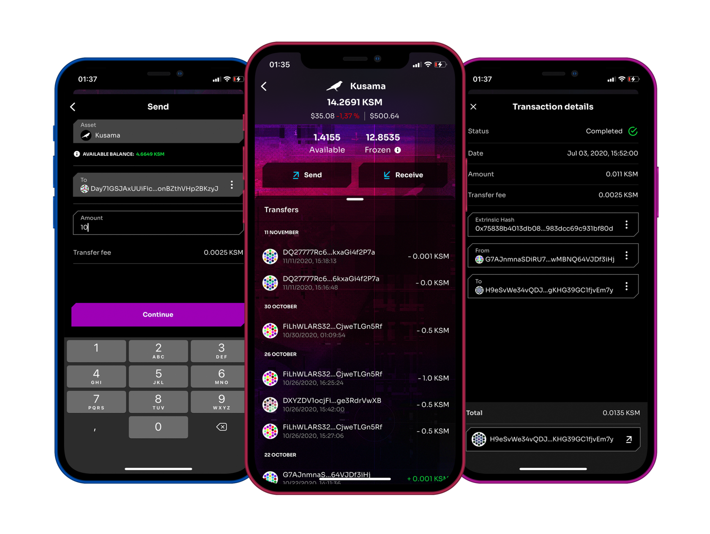
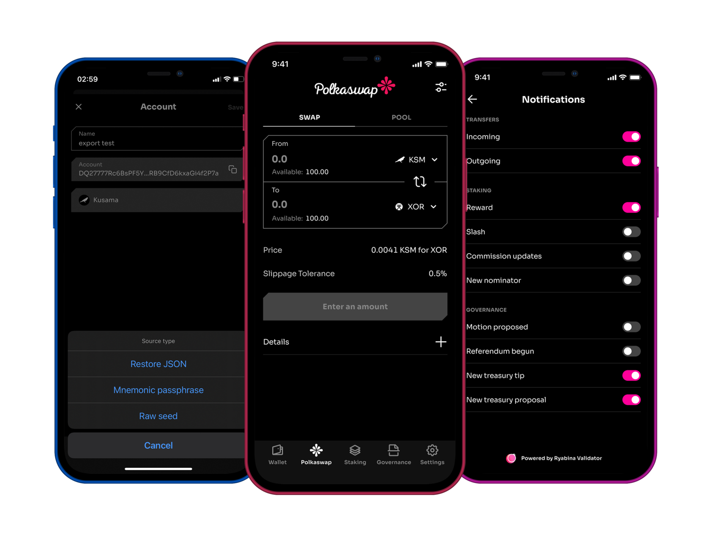
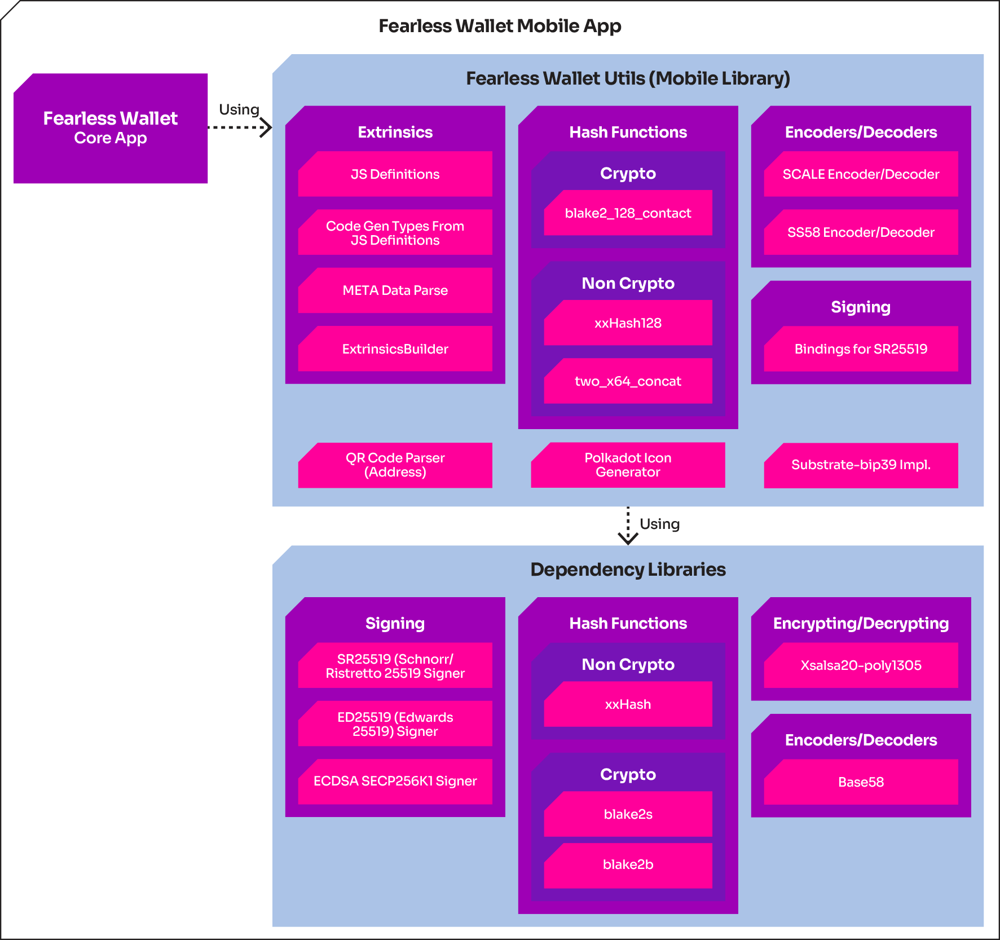

Fearless Wallet, Press Release, SORAMITSU

PRESS RELEASE

Soramitsu Co., Ltd. 
Tokyo, Japan

[info@soramitsu.co.jp](mailto:info@soramitsu.co.jp) 
[soramitsu.co.jp](https://soramitsu.co.jp)

[

**Download PDF**

](https://soramitsu.co.jp/fearless-wallet-release/pdf)

**FOR IMMEDIATE RELEASE** 
25 November, 2020 

# SORAMITSU Releases Fearless Wallet

## — The DeFi Wallet for the Kusama and Polkadot Networks That Anyone Can Use

_SORAMITSU, a fintech company experienced in creating blockchain solutions for enterprises, governments, and the crypto community, received funding from the Kusama Treasury to build a mobile client for the Kusama network: [Fearless Wallet](https://fearlesswallet.io/). Available for [Android](https://play.google.com/store/apps/details?id=jp.co.soramitsu.fearless) and [iOS](https://apps.apple.com/us/app/fearless-wallet/id1537251089), it aims to bring decentralized finance to the people._

 

SORAMITSU is excited to announce the release of Fearless Wallet, a mobile client tailor-made for peer-to-peer, non-custodial transactions on the Kusama and Polkadot networks. 
 
Fearless Wallet is unique on both the technical and user-experience levels. It combines best-in-class wallet functionality with robust network management features, all within the context of a simple and elegant user interface. Future revisions will also incorporate advanced features such as staking, governance, Polkaswap DEX functionality, and the ability to buy KSM/DOT via credit card or payment service (e.g., Apple or Google Pay). 
 
The goal of Fearless Wallet is to radically expand access to decentralized finance (DeFi) by making complex functions much easier to use and understand. 
 
This goal intersects with the experimental vision of Kusama, a scalable network of specialized blockchains built using the same [development platform](https://substrate.dev/en/) as the Polkadot network. Both Kusama and Polkadot are supported by the Web3 Foundation, an NPO established by Ethereum co-founder Dr. Gavin Wood. Because Kusama and Polkadot share a [core architecture](https://polkadot.network/kusama-polkadot-comparing-the-cousins/), Fearless Wallet is optimal for use on both networks. 

_"Kusama is an exciting network that aims to push the bounds of what is possible on the decentralized web, and we have created a mobile wallet that can be as bold and, dare I say, fearless as the Kusama network. Receiving funding from the Kusama Treasury after a decentralized voting process by the Assembly and KSM token holders is also a deep honor that the community has bestowed upon us, and we hope that we were able to exceed expectations."_ _Soramitsu Holdings CEO Makoto Takemiya_ 

Fearless Wallet Features 
 
Fearless Wallet incorporates robust functionality designed to take full advantage of the exciting possibilities of DeFi. In brief, its features include: 
 
1) Account Creation and Import 
 
Fearless Wallet users can create accounts on the Kusama, Polkadot, and Westend networks. Once an account name has been entered and a mnemonic has been generated and confirmed, the user is prompted to set a six-digit PIN code, and, if desired, enable biometric authentication for hassle-free account access. 
 
The sr25519, ed25519, and ECDSA crypto algorithms are supported, as are hierarchical deterministic wallet addresses. Users can also import existing Kusama, Polkadot, and Westend accounts into Fearless Wallet using mnemonic phrases, seeds, or restore JSON files. 

2) Account and Network Management 
 
Fearless Wallet offers users a convenient way to manage multiple accounts within a single app. Since Fearless Wallet is a non-custodial mobile application, all accounts are stored securely within a private app space on the user's device. Account names can be modified, accounts can be rearranged or removed, and accounts can be exported in mnemonic, seed, or JSON formats. 
 
In addition to standard account management functions, Fearless Wallet enables in-app network management. Users can view lists of default Kusama, Polkadot, and Westend connections (Parity and W3F nodes); add, update, rearrange, and remove custom nodes; and easily switch between accounts, networks, and nodes. 

3) Wallet Functions 
 
Fearless Wallet offers a full palette of wallet functions: 
 
● Users can view their total, available, and frozen (bonded, unbonding, locked, redeemable, and reserved) token balances––all in realtime via WebSocket connections to the selected Kusama and Polkadot nodes. 
 
● Token fiat rates and total balance fiat equivalents (in USD) can also be viewed within the application using the Subscan REST API. 
 
● Users can send and receive tokens via account address or QR code. 
 
● Existential deposit information is displayed and warnings are given, helping ensure that users do not accidentally void their own accounts. 
 
● Users can view their transaction histories, both in summary and in detail. 

4) Application Settings, Application Info, and Upcoming Features 
 
Users can easily change application settings such as PIN code and display language; currently, eight languages are supported. Fearless Wallet is committed to cooperation and transparency. Our website, terms and conditions, Github repositories, and social media accounts are all accessible within the app––as are roadmap and dev status information on upcoming features, such as: 
 
● Staking: Fearless Wallet users will be able to nominate validators and bond tokens on the Kusama and Polkadot networks. 
 
● Polkaswap decentralized exchange: Fearless Wallet will enable token swaps and liquidity pool management within the Kusama and Polkadot ecosystems. 
 
● Governance: Fearless Wallet will enable participation in democratic decision-making forums within the Kusama and Polkadot communities. 

The Fearless Wallet Mobile Library 
 
Fearless Wallet is the first native mobile application to support all Kusama and Polkadot network features, including advanced features such as staking and governance. In order to achieve this level of support, the Fearless Wallet team implemented native mobile libraries to build mobile apps for Substrate-based networks. 
 
These libraries are available in open source, and the Fearless Wallet team welcomes community contributions. The libraries include hash algorithms, encoders and decoders, signing methods, and implementations of features specific to the Kusama and Polkadot ecosystems, such as icon generation for network-specific addresses.

**Inside the Fearless Wallet Development Process** 
 
In keeping with the Kusama spirit, the Fearless Wallet team has prioritized cooperation and transparency throughout the development process. 
 
To learn more about this process, check out our [dev status](https://soramitsucoltd.aha.io/shared/343e5db57d53398e3f26d0048158c4a2) and [roadmap](https://soramitsucoltd.aha.io/shared/97bc3006ee3c1baa0598863615cf8d14), view our [public demos](https://docs.google.com/document/d/1bpX1SPqXfvqbngTZq9j5nBHOinR48LTAHmAbnBUyI8Y/edit?usp=sharing) and [mock-ups](https://www.figma.com/file/JiH4V3cdsg9CQapULr2Vd8/FEARLESS-Mobile-APP-\(iOS%2FAndroid\)?node-id=122%3A0), follow our conversation on [Telegram](https://t.me/fearlesswallet), and dive deeper into our repositories at: 
 
● [https://github.com/soramitsu/fearless-Android](https://github.com/soramitsu/fearless-Android) 
● [https://github.com/soramitsu/fearless-iOS](https://github.com/soramitsu/fearless-iOS) 
● [https://github.com/soramitsu/fearless-utils-Android](https://github.com/soramitsu/fearless-utils-Android) 
● [https://github.com/soramitsu/fearless-utils-iOS](https://github.com/soramitsu/fearless-utils-iOS) 
 
General updates can be also found on the [Fearless Wallet website](https://fearlesswallet.io/). 

**Fearless Wallet Logo** 

**About SORAMITSU** 
 
SORAMITSU is a Japanese fintech company with expertise in creating blockchain-based infrastructure, payment systems, and identity solutions. 
 

* Together with the National Bank of Cambodia, SORAMITSU developed [Bakong](https://bakong.nbc.org.kh/), the world's first blockchain-based CBDC and retail payments system to be launched by a central bank. Central Banking journal recognised this achievement by presenting SORAMITSU with its [inaugural Central Bank Digital Currency Partner Award](https://www.centralbanking.com/awards/7681581/central-bank-digital-currency-partner-soramitsu).
* SORAMITSU is the original developer of and main contributor to [Hyperledger Iroha](https://www.hyperledger.org/use/iroha), an open-source permissioned blockchain platform aimed at helping businesses and financial institutions manage their digital assets and identities. Hyperledger Iroha is part of the Linux Foundation's Hyperledger Project.
* SORAMITSU received a Web3 Foundation grant to develop [KAGOME](https://medium.com/web3foundation/w3f-grants-soramitsu-to-implement-polkadot-runtime-environment-in-c-cf3baa08cbe6), the C++ implementation of the Polkadot Host, as well as [Polkaswap](https://polkaswap.io/), a decentralized token exchange platform.
* The company has also developed SORA, a groundbreaking decentralized economic system using the XOR and VAL tokens, aimed at changing the way goods and services are brought to market. See [sora.org](https://sora.org/) for more information, then download the app from the Google Play Store or the AppStore on iOS.

To learn more about SORAMITSU's technologies and vision, visit [soramitsu.co.jp](https://soramitsu.co.jp/). 

* * *
