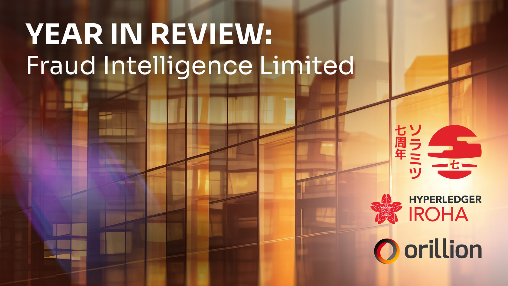

Fraud Intelligence Limited: 2023 in Review

PRESS RELEASE

SORAMITSU Co., Ltd. 
Shibuya-ku, Tokyo, Japan

[info@soramitsu.co.jp](mailto:info@soramitsu.co.jp) 
[soramitsu.co.jp](https://soramitsu.co.jp)

**FOR IMMEDIATE RELEASE 
**Tuesday, December 12, 2023 

# Fraud Intelligence Limited: 2023 in Review

## → What our customers say and do matters most. Their feedback inspired Fraud Intelligence Limited in ways both big and small, and in 2023, we accelerated our execution to take that feedback and transform it into a reality aligned with our partner's needs, which enabled us to build tools emboldening Fraud Intelligence Blockchain to become the undisputed leader and trusted source of shared fraud intelligence globally.

****Listening and Expanding** 
** 
2023 was a year of listening to our customers; the more we listened to them, the more we could build capabilities that put us in the shoes of Fraud Intelligence Professionals globally. In these uncertain economic times, costs are under a magnifying glass. The ability to generate ROI is under intense scrutiny. Investors want more for less. We heard you loud and clear, and Fraud Intelligence Limited was up for the task of delivering something novel to address these concerns.

******Freemium Pay Per Use** 
**** 
Now, with a few taps, customers can gain access to a freemium pay-per-use model that removes the cost equation from customers who want to gain access to a diverse set of fraud types _(Wangiri, IRSF, Stolen Device, IP address, and SMS A2P)_ to combat problems such as Simbox Fraud. Our freemium pay-per-use subscription allows customers to earn and spend essentially internal digital credit tokens through their contributions and downloads from the ledger. This flexibility enables a fair and inclusive ecosystem for all participants and promotes the right behaviour for consortium-led initiatives. 

We also understand that some organisations may wish to pay to access the data (or be granted visibility of strictly limited subsets of the data on the blockchain). So, we also built a subscription capability, which is available for customers who prefer to retrieve data without contributing. This modest subscription fee is used to support ongoing development.

********A New Machine-to-Machine API** 
****** 
Among other things, we've worked with customers such as Vodafone Group, Six Degrees, Telia Company, Latro Services, MTN Group, and more to understand that these kinds of tools are necessary to create a path whereby fraud intelligence professionals can get away from a world of 'hands on keyboard' and 'manual data uploads', and move towards a world of automation and integrated conduits that remove human error and reduce time spent on unnecessary tasks. 

As a consequence of that effort, we are pleased to announce the release of a new "machine-to-machine" API that gives telcos an uninterrupted ability to access this crowdsourced data seamlessly. We also embedded fraud data in analytics and scoring, ensuring that fraud intelligence professionals can be confident in the accuracy of data flagged as fraudulent in a crowd-sourced environment. 

We also set up the API to be extensible with existing Fraud Management System providers, such as Mobileum and Six Degrees, so that we can make real and meaningful changes. We are looking forward to accelerating these conversations in 2024.

**********Enterprise Grade Infrastructure** 
******** 
Fraud Intelligence Blockchain operates on a community-led project called Hyperledger Iroha under the Linux Foundation's Hyperledger Foundation. This gives Hypeledger Iroha the strength and legitimacy to support the vision of a consortium agnostic platform for fraud intelligence sharing. It is worth mentioning that the same technology backbone used to power the Fraud Intelligence Blockchain is also used to power the World's first blockchain-based central bank-operated national payment infrastructure known as Bakong (for Cambodia), a system to date that runs over $10B of transactions and touches on 60% of the general population. 

As the telecommunications landscape evolves, there is great potential to direct this experience towards expanding cross-consortia collaborative intelligence sharing, not only for telcos but also capabilities that can improve the protection for end customers and as Hyperledger Iroha is an open source contribution to the Hyperledger Project.

************What's next?** 
********** 
The Fraud Intelligence Blockchain boasts more than 5M records, and we know that it is one of many tools that Fraud Intelligence Professionals use to grind it out and get stuff done. Going forward, our teams will continue to strengthen and digitise the customer journey with security by design at the core and with further enhancements to the user navigation and UX so that we can positively impact the entire telecommunications industry. 

We also wish to announce that we are giving our customers worldwide the opportunity to learn more about the Fraud Intelligence Blockchain - for free- with a one-time special bonus of 1,000 tokens to register for the service. As we head into 2024, we want to keep listening to and doing more for telcos, regulators, and our FMS partners to build on the spirit of collaboration and precision to strengthen our platform work further.

* * *

We look forward to sharing new initiatives in the New Year. 
 
Enthusiastically, 
Anthony Sani, Danie Maritz, Andrew Wong, Bogdan Mingela, Travin Keith, Katsuhiro Otake 

* * *

**Fraud Intelligence Limited links: 
**[GitHub 
](https://github.com/fraud-intelligence-limited)[Documentation](https://fraud-intelligence-limited.github.io/)

* * *

**About Soramitsu**

[soramitsu.co.jp](https://soramitsu.co.jp)

Soramitsu is an award-winning global financial technology company with expertise in developing blockchain-based solutions for digital asset and identity management. Our mission is to use blockchain to promote innovation and solve pressing societal challenges.

* * *

 

**Andrew Wong**

COO, Soramitsu

__"When you look at our strategy, talent, and track record, we're incredibly well-positioned to serve our partners and clients worldwide. Our customers' trust is our greatest asset, built through hard work and over a long period of time. As we go forward, we are focused on the success of our clients and building tools and capabilities that enable us to help fraud intelligence professionals. And I believe if we stay true to our values and strategy, the best days are yet to come." 
__

* * *

__"Our unwavering commitment to innovation and groundbreaking technologies has revolutionized how fraud prevention is approached. The decentralized nature of blockchain has improved end-user service quality and brought in financial savings for our customers. Relying on HL Iroha has paved the way for the industry's more secure and robust future. At the same time, our trailblazing solution has gained credibility among renowned professionals, recognising its potential in combating fraud. Their validation has fueled our determination to further push the boundaries, embracing more innovative technologies and methodologies in the upcoming year. We are poised to expand our reach and enhance our capabilities, raising the bar in the ongoing fight against fraud."__

 

**Bogdan Mingela**

Software Engineering Manager, Soramitsu

* * *

******About Orillion** 
****

[orillionsolutions.com](https://orillionsolutions.com/) 

Orillion Solutions is committed to delivering products that solve industry problems by leveraging deep data insights and modern technology. Our focus on disruptive and innovative solutions allows us to protect and create real value for our customers, placing us at the forefront of risk management and operational assurance. Our solutions empower our clients with advanced fraud insights and prevention capabilities, helping them mitigate the risks of financial loss and reputational damage.

* * *

 

**Anthony Sani**

CEO, Co-founder, Orillion

__"The joint venture was founded on the principle that tackling telco fraud requires a collective yet creative effort. We're incredibly pleased by the progress in 2023 and are excited about what we can bring to strengthen the lives of fraud intelligence professionals everywhere and to protect users globally."__

* * *

__"Fighting fraud requires a cooperative approach; and its these principles that fuel our desire to bring innovative solutions that drive radical change. We're excited for 2024 and listening to our customers with an open mind."__

 

**Danie Maritz**

Co-founder, CFO, Orillion

* * *

SEE ALSO:

**Fraud Intelligence Limited Insights - What is Tokenization and How is it Important? 
**Understanding the utility of blockchain tokens to help combat fraud within the telecommunications industry. 

[

Learn more

](https://soramitsu.co.jp/fil-insights)

Follow SORAMITSU's [news and latest partnerships and developments here](https://soramitsu.co.jp/#news)_._ 

GET IN TOUCH AND FOLLOW:

* 
* 
* 
* 
* 

* * *
