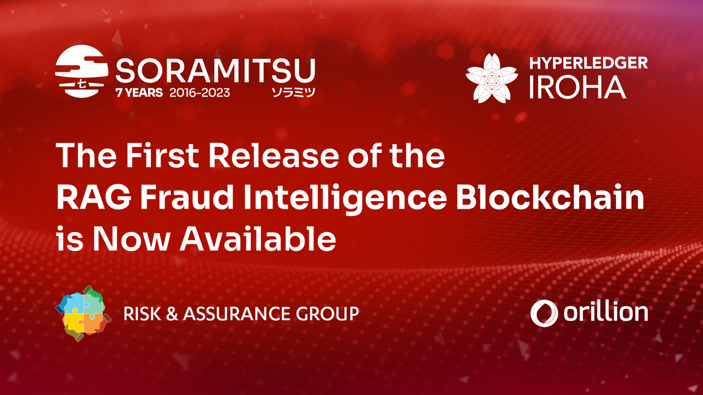
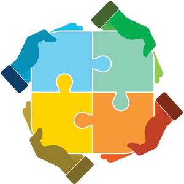

The First Release of the RAG Fraud Intelligence Blockchain is Now Available

PRESS RELEASE

SORAMITSU Co., Ltd. 
Shibuya-ku, Tokyo, Japan

[info@soramitsu.co.jp](mailto:info@soramitsu.co.jp) 
[soramitsu.co.jp](https://soramitsu.co.jp)

**FOR IMMEDIATE RELEASE 
**Thursday, April 27, 2023 

# The First Release of the RAG Fraud Intelligence Blockchain is Now Available

## → The joint venture between the Risk & Assurance Group, Orillion and SORAMITSU, Fraud Intelligence Limited (FIL) launches the first major release of the Hyperledger Iroha-powered Fraud Intelligence Blockchain

**The FIL Blockchain, powered by Hyperledger Iroha technology, seeks to be a key source of innovative and collaborative intelligence gathering to combat wangiri and other forms of telecom fraud. 
** 
After the [initial announcement](https://soramitsu.co.jp/soramitsu-and-rag) introducing the Fraud Intelligence Limited joint venture with the [Risk & Assurance Group](https://riskandassurancegroup.org/) and Orillion, SORAMITSU is happy to announce the first release of the FIL blockchain. 
 
Through the implementation of [Hyperledger Iroha](https://soramitsu.co.jp/iroha) technology, the FIL blockchain will be a useful tool for telecommunication companies to look up and supply data about fraudulent entities and thus support the entire industry combatting Wangiri and other forms of fraud. 
 
The team building the FIL blockchain is working on novel mechanisms to encourage data upload from participating entities through tokenization, which will reward participants who contribute fraud information via the FIL API. Tokens issued automatically as data is added function as credits to access data supplied by other contributors. 
 
The joint venture, which began in October 2022, has seen close collaboration between the Risk & Assurance Group, Orillion and SORAMITSU. Their shared goal is to ensure that the release implements cutting-edge technology that will combat an issue that affects the entire telecom industry, and subsequently, its users. The partners continue to work on building and improving the solution for all industry players to have a trustworthy and effective tool against fraud. 

“

_We are incredibly pleased to expand the capabilities of the RAG Fraud blockchain.__This pivotal product release gives our customers access to a powerful yet easy-to-understand set of tools that will help customers improve the productivity of their fraud management efforts, and achieve business outcomes quickly._

**Andrew Wong,** COO of SORAMITSU Group

On the technology side, Andrew mentions: 

“

_We built the technology core on Hyperledger Iroha (a permissioned based blockchain). Hyperledger Iroha expands Fraud Intelligence Limited's ability to issue tokens to logically incentivize customers to contribute fraud data to the shared ecosystem for the benefit of all, while also receiving actionable insights and value-added services for their involvement; enabling fraud intelligence professionals to unlock new methods to generate revenue and protect CSR._ 
 
_The combination of assets with RAG and Orillion moves us forward on the common mission to empower the telecommunications industry to work together to fight our common enemy of criminals and fraudsters._

**Andrew Wong,** COO of SORAMITSU Group

“

_The joint venture was founded on the principles that tackling telco fraud requires both a collective yet creative effort. Through our partners at SORAMITSU and RISK & ASSURANCE GROUP: We're excited about what we can bring to strengthen the lives of fraud intelligence professionals everywhere, and to protect users globally_

**Orillion**

“

__As more telcos become users of the blockchain, criminals will no longer be able to dupe users or telcos into activities that cost the industry millions of Dollars. The RISK & ASSURANCE GROUP is excited about this strategic product release. It represents a historic step and we will continue to work tirelessly with our partners and colleagues to advance the principles of improving risk management, fraud management and more.__

**RAG**

**For more information on the FIL blockchain and to apply, [register here](https://fraudblockchain.riskandassurancegroup.org/#/Index). To get started, here is the [FIL Github repo](https://github.com/fraud-intelligence-limited), a [guide on the FIL API](https://fraud-intelligence-limited.github.io/) and [the T&C of use](https://github.com/fraud-intelligence-limited/fil-legal).** 

* * *

**About SORAMITSU**

[soramitsu.co.jp](https://soramitsu.co.jp)

SORAMITSU is an award-winning global financial technology company with expertise in developing blockchain-based solutions for digital asset and identity management. Our mission is to use blockchain to promote innovation and solve pressing societal challenges. 
 
SORAMITSU is the developer of and major contributor to the open-source blockchain platform [Hyperledger Iroha](https://www.hyperledger.org/use/iroha), which is tailored for enterprise and public-sector use. Hyperledger Iroha, a project of Hyperledger Foundation, part of the Linux Foundation, has a permissions system that is scalable and performant. 

Utilizing blockchain, SORAMITSU has developed a digital currency for the [National Bank of Cambodia](https://soramitsu.co.jp/bakong-press-release), a CBDC Proof-of-Concept [with the Bank of the Lao PDR](https://soramitsu.co.jp/dlak-cbdc), a closed-loop payment system for the University of Aizu in Japan, an identity verification system prototype for Bank Central Asia in Indonesia, we were finalists in the [Monetary Authority of Singapore CBDC Challenge](https://soramitsu.co.jp/global-central-bank-digital-currency-challenge/), and are currently participating in Asia-Pacific's first proof-of-concept test of a cross-border, multi-currency security settlement system using distributed ledger technology with the Asian Development Bank. We have also conducted proof-of-concept tests for several major Japanese enterprises, and are active contributors to open source projects, such as [Klaytn](https://soramitsu.co.jp/klaytn-dex), South Korea's leading Layer-1 blockchain, [KAGOME](https://github.com/soramitsu/kagome), the C++ [Polkadot](https://polkadot.network/) Host implementation, the [SORA](https://sora.org/) crypto-economic system, the [Polkaswap](https://polkaswap.io/) DEX, and the DeFi wallet, [Fearless Wallet](https://fearlesswallet.io/). 
 
Based on these experiences, SORAMITSU aims to deploy cutting-edge technology on a global level in order to expedite financial inclusion and health, mitigate economic inefficiencies, and contribute to the fulfilment of the Sustainable Development Goals. 

****About Risk & Assurance Group****

[riskandassurancegroup.org](https://riskandassurancegroup.org/)

The Risk & Assurance Group (RAG) is dedicated to improving the practice of risk management, business assurance, fraud management and security within the providers of electronic communications services. 
 
RAG is run by experts in the field of risk and assurance within telcos. Its goal is to facilitate the education and networking of professionals in order to improve standards of performance, reduce waste, and better serve customers. 

******About Orillion******

[orillionsolutions.com](https://www.orillionsolutions.com/)

Orillion Solutions are committed to delivering products that solve industry problems by leveraging deep data insights and modern technology use. 
 
Our focus on disruptive and innovative solutions allows us to protect and create real value for our customers, placing us at the forefront of risk management and operational assurance. 
 
Our solutions empower our clients with advanced fraud insights and prevention capabilities, helping them mitigate the risks of financial loss and reputational damage. 

* * *

SEE ALSO:

**Japanese Next-Gen Developer Builds New Technology Core for the RAG Fraud Blockchain** 
SORAMITSU are experts at creating blockchains that are secure and scalable whilst supporting tokenization and permissioned access. 

[

Learn more

](https://soramitsu.co.jp/soramitsu-and-rag)

Follow SORAMITSU's [news and latest partnerships and developments here](https://soramitsu.co.jp/#news)_._ 

GET IN TOUCH AND FOLLOW:

* * *
