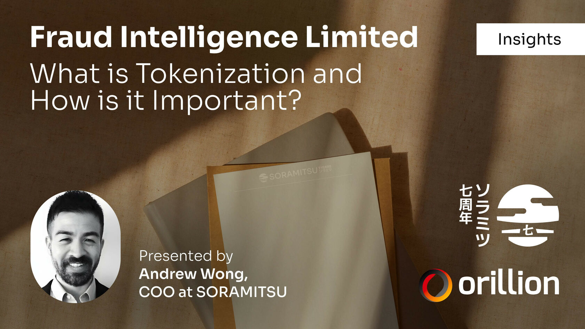

Fraud Intelligence Limited Insights – What is Tokenization and How is it Important?

PRESS RELEASE

SORAMITSU Co., Ltd. 
Shibuya-ku, Tokyo, Japan

[info@soramitsu.co.jp](mailto:info@soramitsu.co.jp) 
[soramitsu.co.jp](https://soramitsu.co.jp)

**FOR IMMEDIATE RELEASE 
**Tuesday, September 5, 2023 

# Fraud Intelligence Limited Insights - What is Tokenization and How is it Important?

## → Understanding the utility of blockchain tokens to help combat fraud within the telecommunications industry.

**TL;DR** 
 

* Tokenization is converting an asset or the ownership rights of an asset to a unique unit. 
 
* The Fraud Intelligence Blockchain is built using Hyperledger Iroha, a DLT that supports advanced features while providing the highest level of security. 
 
* Through tokenization, the information provided is stored securely on a Hyperledger Iroha-based distributed ledger, while the tokens awarded for contributions are also used to query the information available.

 
 
An advantage of Blockchain technology is being able to indicate ownership of an asset through a token. This article will define tokenization and its relation to the Fraud Intelligence Blockchain. We will also highlight the difference between a cryptocurrency and a utility token, and finally, we will describe the underlying importance that tokens have in a cooperative information-sharing ecosystem. 
 
 
**What is Tokenization?** 
 
There are public and private blockchains. There are many differences between both, including the types of nodes being run and the ability to program and manage user roles and authorisations to access nodes in private blockchains, while public blockchains are available for any entity to verify the transactions ( through nodes); however, the entities verifying public blockchain transactions are spread across the world and (ideally) have no relation with each other or with the network; private blockchains have nodes verifying transactions within a specific organisation or consortium. This is also known as Distributed Ledger Technology (DLT) as several entities have a copy of the ledger, which can be updated by one entity but has to be verified by all other entities on the network. 
 
The Fraud Intelligence Blockchain is built using Hyperledger Iroha, a DLT that supports advanced features while providing the highest level of security. 
 
In the blockchain space, tokenization is converting an asset or the ownership rights of an asset to a unique unit. The blockchain contains essential information, such as when a unit was "minted" (created), and the token contains information about who the unit belongs to. Tokens are a representation or substitute for real-world information or assets\[[1](https://www.nasdaq.com/articles/what-is-tokenization-and-how-does-it-work)\]. 
 
In the case of the Fraud Intelligence Blockchain, by being on a database that only allows for addition, the information shared by the contributing member is recorded, and a token is emitted. This token represents a contribution; at the same time, contributors are granted loyalty points that can be used to query the blockchain for contributions from others. It cannot be freely available to anyone to maintain the high value and quality of the data supplied by members. In this case, using tokens helps secure the network and the information contained within as it avoids access from entities without permission. 
 
Tokens will be connected to the records of who contributes fraud reports and who queries the network, thus ensuring consistency and safety for all the participants. 
 
 
 
**What Kind of a Token Does the Blockchain Use?** 
 
There are four main types of blockchain tokens, fungible (crypto assets such as BTC, ETH, XOR), non-fungible (NFT), governance tokens (used to vote in DAOs, etc), and utility tokens. The FIL token is the latter. 
 
As mentioned in the previous section, the token's utility will be access to the fraud intelligence available on the Fraud Intelligence Blockchain DLT. The other utility of the token is to reward contributions of fraud intelligence from members. 
 
This token will not have economic value, so it will not be traded on markets such as Binance or Polkaswap.io, nor will it have a price or tokenomics. The value attributed to this token is the information contained within the Fraud Intelligence Blockchain. This means that no risk is normally associated with blockchain-based tokens, such as financial losses or regulatory issues. Ultimately, this is a distributed ledger application to secure data. 
 
 
**A Cooperative Information Sharing Ecosystem** 
 
After outlining the technicalities of the FIL token, it is essential to outline its main objectives, which is to foster a cooperative information-sharing ecosystem. Using innovative technology such as Hyperledger Iroha, FIL aims to provide high-quality information to combat an expensive and constant issue such as fraud. By sharing information between key players in the telecommunications industry, FIL hopes to support the fight against this issue that affects all areas of the industry. 
 
Thanks to tokenization, members will be assured that the information contained within is not publicly available, which would be detrimental to the cause, as fraudsters would evolve and change their M.O. and thus cost the industry more resources to catch up. The information is also high quality, as the organisation vets contributions, and tokens are awarded to valuable contributions. Likewise, tokens are necessary to access this information, resulting in a cooperative information-sharing ecosystem of high value. 
 
 
**To Conclude** 
 
The entire FIL team is working hard to deliver a network that harnesses innovative technologies to provide valuable intelligence to help combat an issue that affects the entire telecommunications industry. 
 
Through tokenization, the information provided is stored securely on a Hyperledger Iroha-based distributed ledger, while the tokens awarded for contributions are also used to query the information available. Teams will benefit from high-quality insights provided by key industry players and experts that will be mutually beneficial. 
 
On Tokenization, Anthony Sani, Co-Founder and CEO of Orillion mentions; 

* * *

__We understand there needs to be a hard financial incentive for retail, wholesale telcos and FMS vendors to invest their time, and contribute to the Fraud Intelligence Blockchain. Tokenization is a powerful scheme that can make that ROI conversation easier to understand. The ability to encourage and incentivize the RIGHT kinds of behavior is crucial when building out an ecosystem that is predicated on bringing hard value to everyone who benefits.__

 

Anthony Sani

Co-Founder and CEO of Orillion

* * *

Regarding tokenisation, Andrew Wong, COO of SORAMITSU, mentions;

* * *

 

**Andrew Wong**

COO of SORAMITSU Group

__SORAMITSU was founded on the idea of how \[to\] bring the power of decentralized technologies and blockchain to people to improve their lives at a vast scale. The fight against fraudsters requires a modern yet cost-effective technology infrastructure. Tokenization is a powerful tool which leverages the innovation we've developed on Hyperledger Iroha, and will encourage peer contribution for telcos safely and ethically.__

* * *

Talking about Hyperledger Iroha and Tokenization, Bogdan Mingela, Software Engineering Manager at SORAMITSU, mentions;

* * *

__Recent advancements in distributed ledger technology have created powerful possibilities for governments, law enforcement, and the telecommunications space to invest in efforts to combat fraud worldwide constructively. Tokenization is a cutting-edge and secure technology that is the ideal platform for innovative projects that will help tackle a massive issue like fraud. Hyperledger Iroha is a trusted world-leading enterprise-grade blockchain perfectly suited for such an effort. We are honoured and committed to helping our customers work together to solve a problem for which there is no silver bullet.__

 

Bogdan Mingela

Software Engineering Manager at SORAMITSU

* * *

For more information on the Fraud Intelligence Blockchain or to sign up, please visit the [Fraud Intelligence Limited website](https://blockchain.fraudintelligencelimited.com). 

* * *

******About Orillion******

[orillionsolutions.com](https://www.orillionsolutions.com/)

Orillion Solutions are committed to delivering products that solve industry problems by leveraging deep data insights and modern technology use. 
 
Our focus on disruptive and innovative solutions allows us to protect and create real value for our customers, placing us at the forefront of risk management and operational assurance. 
 
Our solutions empower our clients with advanced fraud insights and prevention capabilities, helping them mitigate the risks of financial loss and reputational damage. 

**About SORAMITSU**

[soramitsu.co.jp](https://soramitsu.co.jp)

SORAMITSU is an award-winning global financial technology company with expertise in developing blockchain-based solutions for digital asset and identity management. Our mission is to use blockchain to promote innovation and solve pressing societal challenges. 
 
SORAMITSU is the developer of and major contributor to the open-source blockchain platform [Hyperledger Iroha](https://www.hyperledger.org/use/iroha), which is tailored for enterprise and public-sector use. Hyperledger Iroha, a project of Hyperledger Foundation, part of the Linux Foundation, has a permissions system that is scalable and performant. 

Utilizing blockchain, SORAMITSU has developed a digital currency for the [National Bank of Cambodia](https://soramitsu.co.jp/bakong-press-release), a CBDC Proof-of-Concept [with the Bank of the Lao PDR](https://soramitsu.co.jp/dlak-cbdc), a closed-loop payment system for the University of Aizu in Japan, an identity verification system prototype for Bank Central Asia in Indonesia, we were finalists in the [Monetary Authority of Singapore CBDC Challenge](https://soramitsu.co.jp/global-central-bank-digital-currency-challenge/), and are currently participating in Asia-Pacific's first proof-of-concept test of a cross-border, multi-currency security settlement system using distributed ledger technology with the Asian Development Bank. We have also conducted proof-of-concept tests for several major Japanese enterprises, and are active contributors to open source projects, such as [Klaytn](https://soramitsu.co.jp/klaytn-dex), South Korea's leading Layer-1 blockchain, [KAGOME](https://github.com/soramitsu/kagome), the C++ [Polkadot](https://polkadot.network/) Host implementation, the [SORA](https://sora.org/) crypto-economic system, the [Polkaswap](https://polkaswap.io/) DEX, and the DeFi wallet, [Fearless Wallet](https://fearlesswallet.io/). 
 
Based on these experiences, SORAMITSU aims to deploy cutting-edge technology on a global level in order to expedite financial inclusion and health, mitigate economic inefficiencies, and contribute to the fulfilment of the Sustainable Development Goals. 

* * *

SEE ALSO:

**The First Release of the RAG Fraud Intelligence Blockchain is Now Available** 
The joint venture between the Risk & Assurance Group, Orillion and SORAMITSU, Fraud Intelligence Limited (FIL) launches the first major release of the Hyperledger Iroha-powered Fraud Intelligence Blockchain 

[

Learn more

](https://soramitsu.co.jp/fil-blockchain-launch)

Follow SORAMITSU's [news and latest partnerships and developments here](https://soramitsu.co.jp/#news)_._ 

GET IN TOUCH AND FOLLOW:

* 
* 
* 
* 
* 

* * *
