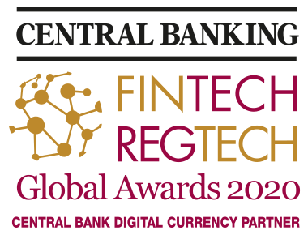

FinTech & RegTech Award, Press Release, SORAMITSU

PRESS RELEASE

Soramitsu Co., Ltd. 
Tokyo, Japan

[info@soramitsu.co.jp](mailto:info@soramitsu.co.jp) 
[soramitsu.co.jp](https://soramitsu.co.jp)

[

**Download PDF**

](https://soramitsu.co.jp/fintech-regtech-award-press-release/pdf)

**FOR IMMEDIATE RELEASE** 
Wednesday, February 24, 2021 

# SORAMITSU Wins FinTech & RegTech Award for Pioneering Payment System

## — Together with the National Bank of Cambodia, SORAMITSU has built the world’s first blockchain-powered national payment infrastructure

* _Instant digital payments are becoming a global norm_
* _What does this mean for emerging economies?_
* _How can central banks harness the benefits of digital payment systems, while circumnavigating monopolies and mitigating risks?_

These are the questions that drove the National Bank of Cambodia (NBC) to begin research into central bank digital currencies (CBDCs). In 2016, NBC founded a working group to delve into the CBDC concept. One year later, NBC selected [Hyperledger Iroha](https://www.hyperledger.org/use/iroha), designed by [SORAMITSU](https://soramitsu.co.jp/), as an ideal platform upon which to build an inclusive national payment system. SORAMITSU began work with NBC in 2018, and a pilot national payment system, called [Bakong](https://bakong.nbc.org.kh/), was soft-launched in 2019. In October 2020, Bakong was formally launched as the backbone of the Cambodian payment infrastructure. As of January 2021, over 50,000 users based at 20 financial institutions have used Bakong to transact over USD $20mm. 

In the short time since its introduction, Bakong has excelled on both technical and socioeconomic levels. After a systematic assessment of competing systems, the Central Banking journal decided to honour SORAMITSU with its **inaugural FinTech & RegTech Global Award for Central Bank Digital Currency Partner**. For SORAMITSU, this is a milestone on the path toward our goal of iteratively improving financial systems worldwide.

 

Next Steps 
 
Since Bakong's 2019 soft launch, its network of partners and users has steadily grown. The National Bank of Cambodia has taken a prudent approach to promotion, allowing SORAMITSU to iteratively improve the system in response to real market conditions that cannot be simulated in a sandbox environment. Early input from a range of stakeholders ensured the system's relevance, and ongoing consultation during its growth phase will prove crucial to its future-orientation. 

_"Bakong will eventually create financially inclusive ecosystems that all the stakeholders in the industry can benefit from." 
__Shin Chang Moo, President, PPCBank_

For SORAMITSU, Bakong is an important milestone on the path toward our end goal of improving the efficiency, security, and accessibility of financial systems worldwide. SORAMITSU believes that well-designed distributed ledgers can hasten progress toward this goal––and by doing so, increase human flourishing. Bakong's official launch and our recognition by _Central Banking_ journal substantiate this belief. 

_"We are elated to receive this recognition, especially as Bakong is a system that will make a positive impact on the daily lives of all Cambodians. Decentralized technology will revolutionize the global banking industry and SORAMITSU is committed to leading that progress with projects like Bakong." 
__Makoto Takemiya, CEO, Soramitsu Holdings AG_

For in-depth information on Project Bakong, please read the National Bank of Cambodia's [white paper](https://bakong.nbc.org.kh/download/NBC_BAKONG_White_Paper.pdf), visit the [website](https://bakong.nbc.org.kh/), and follow the conversation on [Facebook](https://www.facebook.com/bakongsystem). 

**About SORAMITSU** 
 
SORAMITSU is a Japanese fintech company with expertise in creating blockchain-based infrastructure, payment systems, and identity solutions. 
 

* Together with the National Bank of Cambodia, SORAMITSU developed [Bakong](https://bakong.nbc.org.kh/), the world's first blockchain-based CBDC and retail payments system to be launched by a central bank. Central Banking journal recognised this achievement by presenting SORAMITSU with its [inaugural Central Bank Digital Currency Partner Award](https://www.centralbanking.com/awards/7681581/central-bank-digital-currency-partner-soramitsu).
* SORAMITSU is the original developer of and main contributor to [Hyperledger Iroha](https://www.hyperledger.org/use/iroha), an open-source permissioned blockchain platform aimed at helping businesses and financial institutions manage their digital assets and identities. Hyperledger Iroha is part of the Linux Foundation's Hyperledger Project.
* SORAMITSU received a Web3 Foundation grant to develop [KAGOME](https://medium.com/web3foundation/w3f-grants-soramitsu-to-implement-polkadot-runtime-environment-in-c-cf3baa08cbe6), the C++ implementation of the Polkadot Host, as well as [Polkaswap](https://polkaswap.io/), a decentralized token exchange platform.
* The company also received grants from the Kusama Treasury to develop [Fearless Wallet](https://fearlesswallet.io), a mobile client tailor-made for peer-to-peer, non-custodial transactions on the Kusama and Polkadot networks with premium features and user experience.
* SORAMITSU was contracted by Filecoin developer Protocol Labs to develop [FUHON](https://filecoin.io/blog/posts/announcing-filecoin-implementations-in-rust-and-c/), the C++ implementation of the Filecoin platform.
* The company has also developed SORA, a groundbreaking decentralized economic system using the XOR and VAL tokens, aimed at changing the way goods and services are brought to market. See [sora.org](https://sora.org/) for more information, then download the app from the Google Play Store or the AppStore on iOS.

To learn more about SORAMITSU's technologies and vision, visit [soramitsu.co.jp](https://soramitsu.co.jp/). 

* * *
