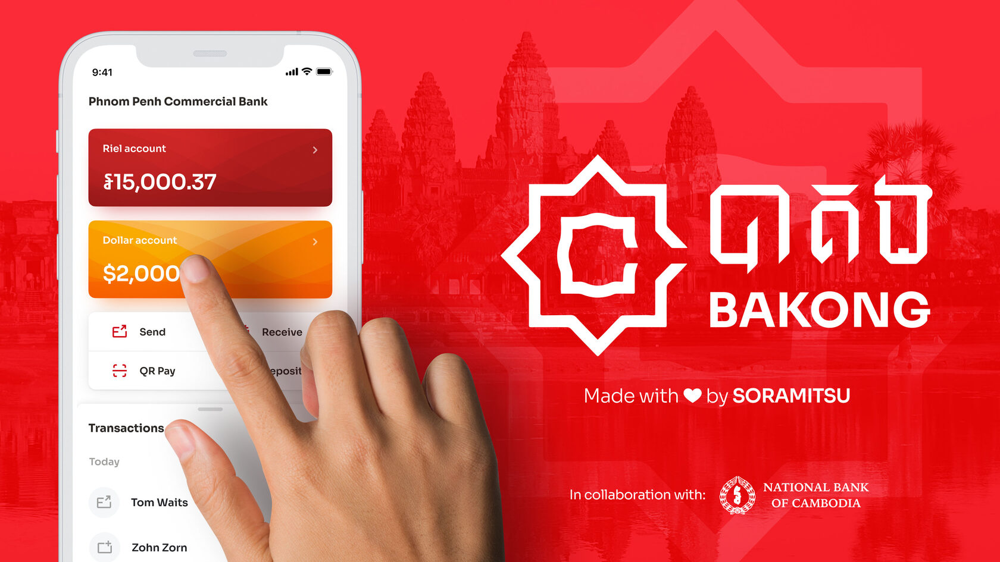
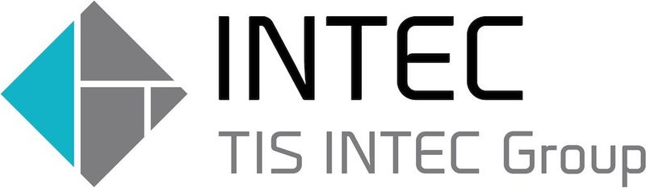
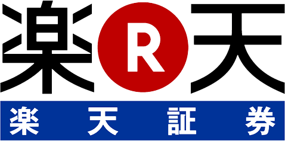
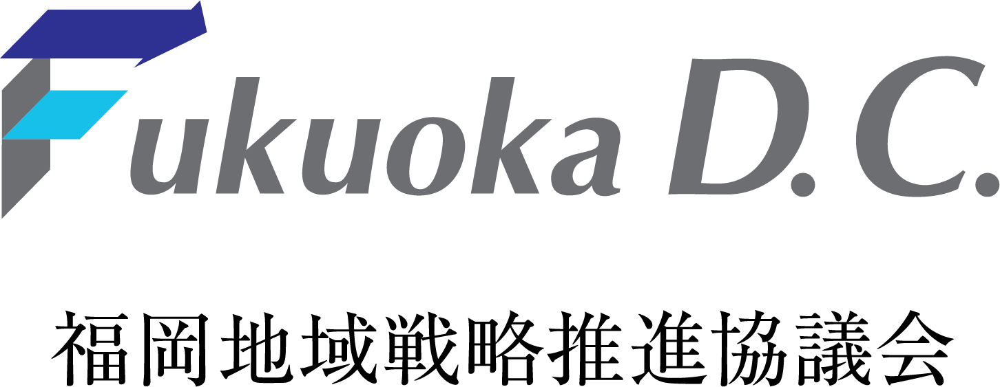
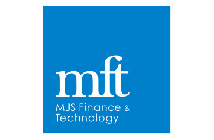
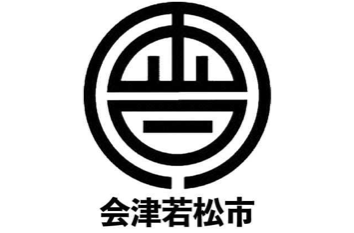
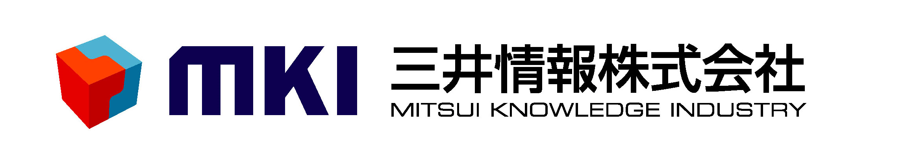
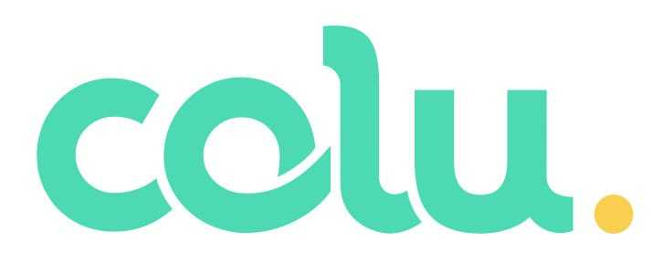

SORAMITSU (Fr)

**SORAMITSU** — Designing a Better World Through Decentralized Technologies

Our clients count on us to help them design and launch their next-generation financial applications, at a lower cost and in record time.

Introducing Bakong

We are pleased to announce Bakong, the collaboration between SORAMITSU and the National Bank of Cambodia. Bakong is Cambodia's only integrated payment system that allows you to do everything — digital wallets, mobile payments, online banking and financial applications — all in one place.

SORAMITSU est une entreprise japonaise de technologie qui produit des solutions basées sur la blockchain pour les entreprises, les universités et les gouvernements. De la création de systèmes de paiements nationaux et internationaux au développement de notre propre système économique autonome et décentralisé, nos projets et nos études de cas d'usage représentent la prochaine génération de la technologie financière. 

Nos projets et études de cas

[

Hyperledger Iroha

](https://soramitsu.co.jp/iroha)

Hyperledger Iroha est une plateforme blockchain permissionnée de nouvelle génération, conçue pour aider les professionnels et les institutions financières à gérer leurs actifs digitaux. 
Hyperledger Iroha est la contribution de Soramitsu, son développeur original, au Hyperledger Project de la Linux Foundation. 
 
Hyperledger Iroha est programmé en C++, pour être parfaitement adapté aux cas d'usage nécessitant une haute performance et une haute fiabilité, ainsi qu'aux systèmes embarqués. 
 
Soramitsu utilise Hyperledger Iroha pour créer des services pour les utilisateurs, et notamment des applications mobiles pour gérer les actifs digitaux, l'identité, et les contrats. À travers l'utilisation d'Hyperledger Iroha, nous espérons contribuer à une société plus sûre et plus efficace. 
 
En tant que son développeur original et principal contributeur, Soramitsu propose un soutien technique et commercial sur Hyperledger Iroha. 
 
[Contactez-nous](mailto:info@soramitsu.co.jp) si vous avez besoin d'aide avec Hyperledger Iroha. 

En savoir plus

[

Github

](https://github.com/hyperledger/iroha)

[

Bakong

](https://soramitsu.co.jp/centralbankingfr)

Collaboration entre Soramitsu et la National Bank of Cambodia, Bakong est le système de Paiement Brut en Temps Réel nouvelle génération, qui promeut l'inclusion financière grâce à une application à la fois simple et puissante pour [iOS](https://apps.apple.com/us/app/bakong/id1440829141) et [Android](https://play.google.com/store/apps/details?id=jp.co.soramitsu.bakong&hl=en_US). 
 
**RTGPS** (Real-Time Gross Payment System, Système de Paiement Brut en Temps Réel) est une solution unique et révolutionnaire qui s'appuie sur la Distributed Ledger Technology (DLT), pour permettre des paiements bruts en temps réel aussi bien nationaux qu'internationaux, entre n'importe quels propriétaires de comptes, sur une plateforme unique. 
 
La monnaie digitale optionnelle est une alternative sécurisée aux billets de banque, conçue pour fonctionner dans le cadre des règles qui régissent le système bancaire. 
 
Utiliser une monnaie digitale sécurisée et standardisée comme moyen de paiement permet d'accroître la confiance dans le système de paiement. 
 

En savoir plus

[

Medium

](https://medium.com/tokyo-fintech/soramitsu-builds-cambodian-digital-currency-payments-system-137a06d341f0)

[

Sora

](https://sora.org)

Nous sommes heureux d'annoncer le lancement de la nouvelle Sora App pour [iOS](https://apps.apple.com/us/app/sora-dae/id1457566711) et [Android](https://play.google.com/store/apps/details?id=jp.co.soramitsu.sora), nouvelle étape dans la création de l'Écosystème Sora. 
 
Sora est la première Économie Autonome Décentralisée ouverte à tous, où de nouveaux tokens XOR sont créés pour permettre la création de nouveaux biens et services. 
 
Avec la Sora App, les utilisateurs peuvent envoyer et recevoir des tokens XOR, et se tenir informés de toutes les dernières activités concernant Sora. 
Les utilisateurs de l'application peuvent aussi accumuler des points de réputation, gagner des tokens XOR en votant pour les projets ajoutés sur Sora par des producteurs, et ainsi décider quels projets doivent être financés. 
 
Plus un utilisateur vote et invite d'autres utilisateurs à rejoindre Sora, plus il accumule de points de réputation et gagne de tokens XOR. 
 
Rejoignez notre [Chat Telegram](https://t.me/sora_xor). 

En savoir plus

[

Github

](https://github.com/sora-xor)

[

BCA

](https://www.newswire.com/news/applications-of-soramitsus-sora-platform-and-hyperledger-iroha-for-20902012)

Soramitsu and PT Bank Central Asia Tbk (BCA) tested a self-sovereign identity solution for companies in the BCA Group, using the open source distributed ledger (blockchain) Hyperledger Iroha. The solution is based on the advanced concepts of decentralized digital identifiers, verifiable claims and cryptographic algorithms that will lower the costs of the KYC procedures while speeding up the customer onboarding process and other business processes. 
 
BCA is one of the leading commercial banks in Indonesia with a core focus on transaction banking business and providing loan facilities and solutions to the corporate, commercial and SME and consumer segments. At the end of September 2018, BCA had the privilege of serving 18.5 million customer accounts, processing millions of transactions every day through 1,243 branches, 17,440 ATMs and more than 500,000 EDC machines, as well as transactions made over the 24-hour internet and mobile banking systems. 

En savoir plus

[

Kagome

](https://www.youtube.com/watch?v=181mk2xvBZ4&list=PLOyWqupZ-WGsfympTCEcAd42zTXT3xxTO&index=5)

Kagome est l'implémentation C++ de l'[Environnement d'Exécution Polkadot](https://wiki.polkadot.network/docs/en/learn-polkadot-host#docsNav), développée par Soramitsu et financée par une [Bourse de la Web3 Foundation](https://github.com/w3f/Web3-collaboration/blob/master/grants/grants.md). 
 
Grâce à Kagome, tous les projets SORAMITSU peuvent être connectés aux blockchains supportant Polkadot, et ainsi faire partie du web décentralisé de nouvelle génération.. 

Vidéo

[

Github

](https://github.com/soramitsu/kagome)

[

Fuhon

](https://filecoin.io/blog/announcing-filecoin-implementations-in-rust-and-c++/)

[Filecoin](https://filecoin.io/blog/announcing-filecoin-implementations-in-rust-and-c++/) has announced two additional implementations of the Filecoin protocol: [forest](https://github.com/ChainSafe/forest) – being implemented in Rust by ChainSafe, and [fuhon](https://github.com/filecoin-project/cpp-filecoin) – being implemented in C++ by SORAMITSU. These implementations are in active development, and are now fully open for anyone to use or contribute to. Check them out on GitHub! 

En savoir plus

[

Github

](https://github.com/filecoin-project/cpp-filecoin)

[

Byacco

](https://soramitsu.co.jp/byacco)

Byacco est une monnaie digitale locale créée pour l'université d'Aizu au Japon. À l'aide d'applications mobiles, les utilisateurs peuvent facilement et instantanément envoyer et recevoir de l'argent. 
 
Cette monnaie a été testée sur le campus d'Aizu, dans le magasin de l'université et à la cafeteria. Une version de production de ce système est actuellement en développement et sera lancée prochainement. 

En savoir plus

Recent news

[view more NEW](https://soramitsu.co.jp/page8085384.html)s \>

Nos partenaires utilisateurs d'Hyperledger Iroha

[

Devenir partenaire

](#popup:myform)

Notre cœur d'équipe

* [Makoto Takemiya, PhD](https://www.linkedin.com/in/makoto-takemiya/)
 
 CEO | Ingénieur blockchain 
 
 Makoto Takemiya est le CEO et co-fondateur de Soramitsu. Avant de fonder Soramitsu, il a travaillé comme ingénieur-chercheur au Département de Neuroinformatique d'ATR, l'Advanced Telecommunications and Research Institute International. Il a en outre contribué à d'autres projets blockchain. Il est titulaire d'un doctorat de l'Université de Tokyo. 
 
* [Ryu Okada](https://www.linkedin.com/in/ryu-okada-69080628/)
 
 Co-Fondateur 
 
 Ryu Okada est le co-fondateur et président de Soramitsu. Il a travaillé comme consultant pour Deloitte, a fondé une start-up d'e-commerce et une entreprise de consulting financier, et possède une licence japonaise de Certified Public Accountant (CPA). 
 
* [Ikkei Matsuda](https://www.linkedin.com/in/ikkei-matsuda-松田一敬-74549735/)
 
 Co-Fondateur | Directeur SORA 
 
 Tsukasa Ojima est le CEO de SARR, LLC, un accélérateur pour start-ups high-tech, et le fondateur et ancien CEO de Hokkaido Venture Capital. 
 
* [Kazumasa Miyazawa](https://www.linkedin.com/in/kazumasa-miyazawa-52955564/)
 
 CEO of Soramitsu (Japan) 
 
 Kazumasa Miyazawa est le créateur de Edy Electronic Money, et ancien membre du Conseil d'Administration de Rakuten Edy. 
 

* [Dmitriy Creed](https://www.linkedin.com/in/creed-2/) 
 
 CEO of Soramitsu Labs 
 
 Head of the DevOps and Security departments. Professor of Practice in the Innopolis University. M.S. in SNE, Innopolis University. 
 
* [Andrew Wong](https://jp.linkedin.com/in/andrew-o-wong-2ab209) 
 
 Chief Operating Officer 
 
 Andrew is a product focused technology leader, serving in management roles at both Liquid Group Inc, Yahoo! and 8 Securities (acquired by Sofi). He is an advisor and board member to several Silicon Valley based startups. 
 
* [Katsuhiro Otake](https://jp.linkedin.com/in/katsuhiro-otake-4166359b) 
 
 Chief Financial Officer 
 
 Katsuhiro Otake is the former CFO of Liquid Group Inc. after serving as managing roles in finance and operations for international financial institutions, such as Goldman Sachs, Merrill Lynch, Royal Bank of Scotland, and Australia and New Zealand Bank. 
 
* [Tarmo Vannas](https://www.linkedin.com/in/tarmovannas/)
 
 Chief Design Officer 
 
 Tarmo has over 25 years professional experience across various roles focusing on design and technology. He was the former Head of Design & Brand for a high-end branding and crypto consultancy firm before joining SORAMITSU. 
 

* [Tsukasa Ojima](https://www.linkedin.com/in/tsukasa-ojima-309b1b90/)
 
 Directeur SORA 
 
 Tsukasa Ojima a été vice-président de la Sanwa Bank California, et cadre chez Nomura Securities. 
 
* [Satoshi Hirota](https://www.linkedin.com/in/satoshihirota/)
 
 Conseiller 
 
 Satoshi Hirota est partenaire fondateur de HCA Law Office. 
 
* Nobuo Nakamura 
 
 Conseiller
 
* [T](https://www.linkedin.com/in/yoshimitsu-homma-5a2480b/)ravin Keith
 
 Conseiller indépendant 
 
 Travin Keith is the CTO of Consortio Group and Co-Founder of STOKR. He also co-authored the Hyperledger White Paper and participated in the Blockchain4EU Initiative with the European Commission.
 

* Masayuki Shimura
 
 Conseiller indépendant pour Sora 
 
 Masayuki Shimura est CEO de Shimura&Partners, Directeur de BASE Inc., et ancien Directeur Général de la Sumitomo Mitsui Banking Corporation. 
 
* Hideto Ozaki
 
 Conseiller indépendant pour Sora 
 
 Hideto Ozaki is Outside Director of Sanden Holdings Corporation, Dean of School of Lean Management, Shanghai Jiao Da Education Group and Management Advisor of Nile Corporation (China). He also was former General Manager of Finance Div. of Toyota Motor Corporation and former CEO of Toyota Financial Services Corporation. 
 
* Haraguchi Tsunekazu
 
 Conseiller indépendant pour Sora 
 
 Tsunekazu Haraguchi is Advisor and former CEO of AEON Bank, Ltd. and former CEO of AEON Financial Service Co., Ltd. He also was Director-General of the Financial Bureau of Ministry of Finance, Director-General of the Planning and Coordination Bureau of Financial Services Agency and Vice President of the former National Life Finance Corporation. 
 

Nous contacter

Link Square 16F, 5-27-5 Sendagaya, Shibuya-ku, Tokyo, Japan, 151-0051 
 
Email: [info@soramitsu.co.jp](mailto:info@soramitsu.co.jp)

* 
* 
* 
* 
* 

[Japan Blockchain 
Association](http://www.jba-web.jp)

[Global Blockchain 
Business Council](https://gbbcouncil.org)

[Fintech association of Japan](http://www.fintechjapan.org)

Proud member of:

© 2023 SORAMITSU CO., LTD.

* [Termes & Conditions](https://soramitsu.co.jp/terms)

© 2023 SORAMITSU CO., LTD.

Haut de page
