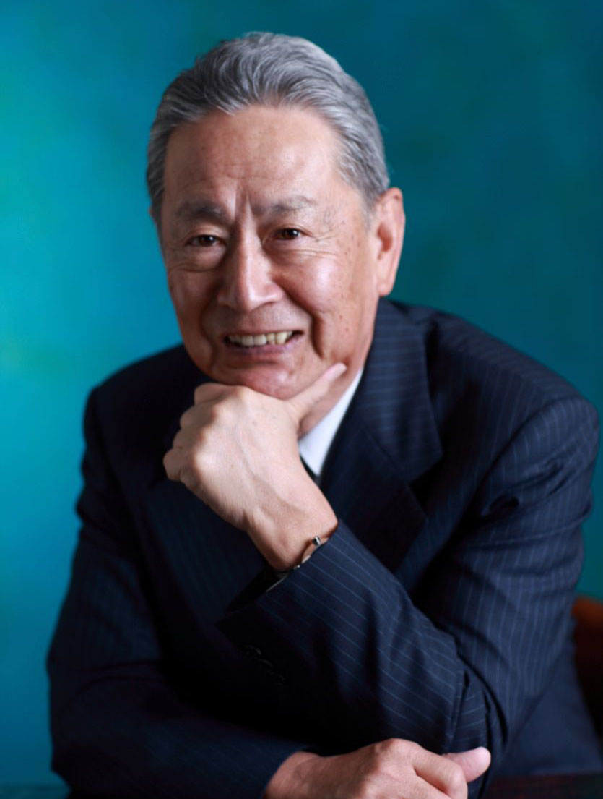

Former Sony Chairman Nobuyuki Idei Appointed as SORAMITSU Advisor, Press Release, SORAMITSU

PRESS RELEASE

Soramitsu Co., Ltd. 
Tokyo, Japan

[info@soramitsu.co.jp](mailto:info@soramitsu.co.jp) 
[soramitsu.co.jp](https://soramitsu.co.jp)

[

**Download PDF**

](https://soramitsu.co.jp/idei-nobuyuki-press-release/PDF)

**FOR IMMEDIATE RELEASE 
**Wednesday, April 27, 2021 

# Quantum Leaps Corporation Founder and Former Sony Chairman Idei Nobuyuki Joins SORAMITSU Advisory Board

## → Together, SORAMITSU and Nobuyuki Idei will work to resolve social challenges worldwide using blockchain technology developed in Japan.

__SORAMITSU, a developer of cutting-edge blockchain technology founded in Japan, is honoured to welcome Nobuyuki Idei to its Advisory Board.__ 

Born in Tokyo in 1937, Mr. Idei graduated from Waseda University in 1960, and joined Sony, where he helped develop it from a local electronics company into a global tech powerhouse. After serving as General Manager of the Audio Business Division, Computer Business Division, and Home Video Business Division, he was appointed President in 1995. For the next 10 years, he led Sony's transformation in a series of top management roles. After retiring, he established Quantum Leaps Corporation in September 2006, served on the boards of Accenture and Lenovo, and became chairman of the NPO Asia Innovators Initiative. 

 

Mr. Idei's passion for IT product development and willingness to shake up established markets makes him a natural fit for the SORAMITSU Advisory Board, which he joined in April 2020. Founded in 2016 by University of Tokyo PhD student Takemiya Makoto and technology entrepreneurs Okada Ryu and Dr. Matsuda Ikkei, SORAMITSU quickly established itself as an innovator by developing the open-source blockchain platform _Hyperledger Iroha_ for the Linux Foundation's Hyperledger Project. In 2019 and 2020, SORAMITSU launched two major projects based on Hyperledger Iroha: [Bakong](https://bakong.nbc.org.kh/), an integrated fast payment system designed with the National Bank of Cambodia, and Byacco, a private digital currency created for the University of Aizu. SORAMITSU was recognised for its work on Bakong with a [2020 FinTech & RegTech Global Award and a 2021 Japan Financial Innovation Award](https://www.centralbanking.com/awards/7681581/central-bank-digital-currency-partner-soramitsu). 
 
 
[SORAMITSU](https://soramitsu.co.jp/) and Mr. Idei both believe that the skillful application of blockchain across sectors can lead to quantum leaps in human well-being. Drawing on Mr. Idei's expertise and global network, SORAMITSU will continue to advance the frontiers of blockchain engineering while solving challenges for its customers and society as a whole. 

_"SORAMITSU-designed systems have been taken up by governments, financial institutions, and corporations worldwide because they improve upon the processing speed and performance of conventional blockchains, as well as solving problems in the areas of power consumption, privacy, and scalability \[...\] I fully support the activities undertaken by SORAMITSU to solve social issues such as financial inclusion while pursuing sustainable development goals on a global basis, and look forward to working together."_ 
 
**—** _**Idei Nobuyuki, Founder and Director of Quantum Leaps, Ltd.**_

_"SORAMITSU has broken new ground in developing blockchain-based financial infrastructure, winning awards for our work on the National Bank of Cambodia's Bakong payment system and opening up conversations worldwide on technology in governance. These achievements would not have been possible without the expertise of our advisory board, to which we are honoured to welcome Mr. Idei. Together, we hope to reach new milestones on the path toward a more efficient and inclusive world financial system."_ 
 
**—** _**Takemiya Makoto, CEO, SORAMITSU Holdings**_ 

_"I am a Sony alumnus, and had the good fortune to work with Mr. Idei there on many occasions. While I was developing Edy -- Japan's first e-money system -- I talked through my business plan with Mr. Idei several times before winning Sony's approval for investment. At SORAMITSU, I often think back on the guidance I received from Mr. Idei; it inspired me to start a kind of business nobody had seen before, as well as to think globally from the start. Combining SORAMITSU's blockchain technology with Mr. Idei's global network, product design and marketing expertise, and wealth of experience in business operations will allow us to more effectively address social challenges and bring innovation to numerous industries."_ 
 
**—** _**Miyazawa Kazumasa, President and CEO of SORAMITSU**_ 

**About SORAMITSU** 
 
SORAMITSU is a Japanese fintech company with expertise in creating blockchain-based infrastructure, payment systems, and identity solutions. 
 

* Together with the National Bank of Cambodia, SORAMITSU developed [Bakong](https://bakong.nbc.org.kh/), the world's first blockchain-based CBDC and retail payments system to be launched by a central bank. Central Banking journal recognised this achievement by presenting SORAMITSU with its [inaugural Central Bank Digital Currency Partner Award](https://www.centralbanking.com/awards/7681581/central-bank-digital-currency-partner-soramitsu).
* SORAMITSU is the original developer of and main contributor to [Hyperledger Iroha](https://www.hyperledger.org/use/iroha), an open-source permissioned blockchain platform aimed at helping businesses and financial institutions manage their digital assets and identities. Hyperledger Iroha is part of the Linux Foundation's Hyperledger Project.
* SORAMITSU received a Web3 Foundation grant to develop [KAGOME](https://medium.com/web3foundation/w3f-grants-soramitsu-to-implement-polkadot-runtime-environment-in-c-cf3baa08cbe6), the C++ implementation of the Polkadot Host, as well as [Polkaswap](https://polkaswap.io/), a decentralized token exchange platform.
* The company also received grants from the Kusama Treasury to develop [Fearless Wallet](https://fearlesswallet.io/), a mobile client tailor-made for peer-to-peer, non-custodial transactions on the Kusama and Polkadot networks with premium features and user experience.
* SORAMITSU was contracted by Filecoin developer Protocol Labs to develop [FUHON](https://filecoin.io/blog/posts/announcing-filecoin-implementations-in-rust-and-c/), the C++ implementation of the Filecoin platform.
* The company has also developed SORA, a groundbreaking decentralized economic system using the XOR and VAL tokens, aimed at changing the way goods and services are brought to market. See [sora.org](https://sora.org/) for more information, then download the app from the Google Play Store or the AppStore on iOS.

To learn more about SORAMITSU's technologies and vision, visit [soramitsu.co.jp](https://soramitsu.co.jp/).

* * *
