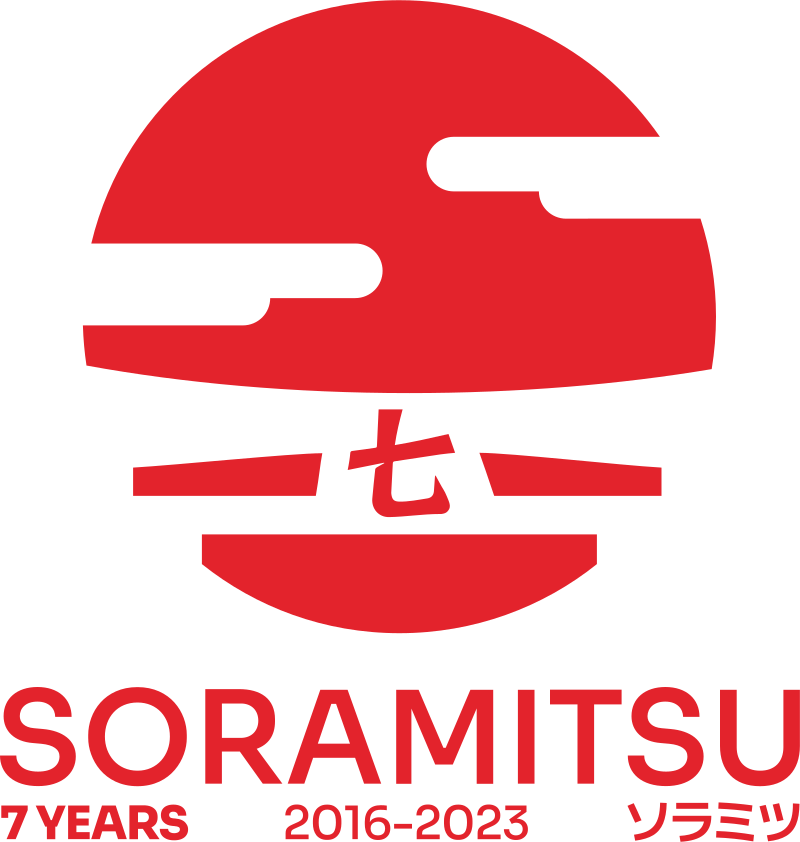
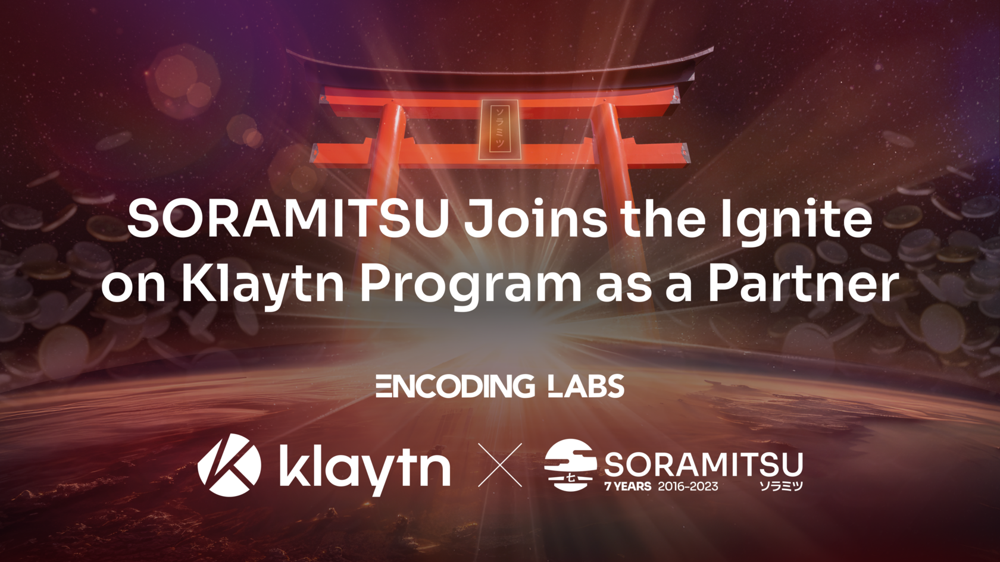
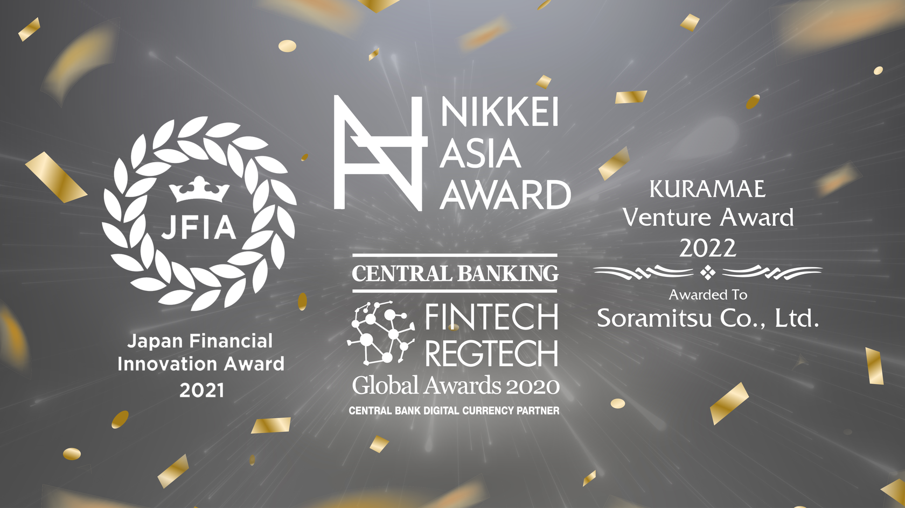

SORAMITSU Partners with Klaytn for the Ignite on Klaytn Program

PRESS RELEASE

SORAMITSU Co., Ltd. 
Shibuya-ku, Tokyo, Japan

[info@soramitsu.co.jp](mailto:info@soramitsu.co.jp) 
[soramitsu.co.jp](https://soramitsu.co.jp)

**FOR IMMEDIATE RELEASE 
**Friday, October 27, 2023 

# SORAMITSU Partners with Klaytn for the Ignite on Klaytn Program

## → Klaytn onboards its trusted technology partner SORAMITSU to the Ignite on Klaytn program that will provide technical, economic, and business support for potential dApp builders to bring their creations to life on the Klaytn network.

SORAMITSU is happy to announce it is participating in the [Ignite on Klaytn Program](https://klaytn.foundation/ignite-on-klaytn-announcement/) as a partner, providing support to potential dApp builders. Partners in this program have a wide array of expertise within web3, ranging from wallets, security, GameFi, on-chain data, oracles, DeFi services and NFT marketplaces, to security, marketing and community building, development outsourcing, infrastructure and acceleration incubation. 

This will make the program a one-stop for all the needs a team may have and allow them to focus on product development while key industry players provide their support through the aforementioned areas of expertise. Each participating team will also have access to at least two options per category, providing more flexibility and choice. 

Having collaborated with the Klaytn ecosystem to build the open-source decentralised exchange SDK for builders within Klaytn, SORAMITSU is a prime candidate to participate as a partner supporting developers in making their ideas a reality. For the purpose of this program, SORAMITSU will be providing DeFi service and development outsourcing support.

Participants in the Ignite on Klaytn program will be able to harness SORAMITSU's experience as a trusted technology partner for technical, economic, and business support to make their ideas a reality and enrich the Klaytn ecosystem with dApps built for and by the community.

Bill, CEO of Encoding Labs, mentioned:

* * *

__"Encoding Labs is extremely pleased with the traction and quality of the IOK partnership. SORAMITSU's inclusion will drive towards a healthy ecosystem of quality development, driven by ethics, innovation and more."__

 

Bill Byeon

CEO of Encoding Labs

* * *

Dr Sam Seo, Representative Director of the Klaytn Foundation, mentioned:

* * *

 

Dr Sangmin Seo

Representative Director of the Klaytn Foundation

__"We are thrilled to be working with SORAMITSU to advance our shared goals to give developers choice and tools to build for the decentralized tomorrow."__

* * *

Sergey Poslavskiy, SORAMITSU's Senior Smart Contract Developer, mentioned the partnership:

* * *

__"The Klaytn Blockchain is spearheading the advancement of web3, enhancing the ecosystem with its cutting-edge technology stack and progressive approaches to eliminating barriers between the Web2 and Web3 realms. As a technology partner of the Klaytn Foundation, SORAMITSU is honoured to be part of this groundbreaking movement. I am personally delighted that SORAMITSU is at the forefront of this transformation, as the Ignite on Klaytn platform provides dApp builders with an exceptional opportunity to collaborate with trusted and capable partners and develop groundbreaking products that will shape the future."__

 

Sergey Poslavskiy

Senior Smart Contract Developer at SORAMITSU

* * *

Andrew Wong, SORAMITSU COO, mentioned the partnership:

* * *

 

**Andrew Wong**

COO of SORAMITSU Group

__"The Joint expertise of both SORAMITSU as a global technology leader and Klaytn's (a visionary ecosystem, grounded in values to advance blockchain technology to solve real-world problems) will ensure that Web 2 and Web3 developers are well positioned to innovate and deliver tangible, cutting edge use cases to its customers. 
We are absolutely thrilled to join forces with the Klaytn Foundation during these transformative times to accelerate and strengthen our digital ecosystems across the world." 
__

* * *

**Participants interested in the Ignite on Klaytn Program can find [more information](https://developer.dev.klaytn.net/IOK-onboarding-program/) and [apply here](https://developer.dev.klaytn.net/IOK-onboarding-program/).**

* * *

****About Klaytn****

[klaytn.foundation](https://klaytn.foundation/)

Klaytn is an open-source, public blockchain designed for tomorrow's on-chain world. With the lowest latency amongst leading blockchains and a developer-friendly environment, Klaytn provides a seamless experience for developers and users alike. Since its launch in June 2019, Klaytn has grown to become South Korea's de-facto Web3 ecosystem and one of the largest in the world, with a user base of millions generating over a billion transactions across over 300 DApps.

About Encoding Labs

[encodinglabs.org](https://encodinglabs.org/)

Encoding Labs contributes to the healthy growth of the industry by incubating early-stage WEB 3.0 services. Supporting early-stage projects such as investment guides, business development operations, technical support, go-to-the-market strategy guides, community management, and legal and financial consulting.

**About SORAMITSU**

[soramitsu.co.jp](https://soramitsu.co.jp)

SORAMITSU is an award-winning global financial technology company, and a member of the [Global Blockchain Business Council](https://gbbcouncil.org/), with expertise in developing blockchain-based digital asset and identity management solutions, aiming to use blockchain to promote innovation and solve pressing societal challenges. 
 
SORAMITSU is the developer of and major contributor to the open-source blockchain platform [Hyperledger Iroha](https://www.hyperledger.org/use/iroha), which is tailored for enterprise and public-sector use. Hyperledger Iroha, a project of Hyperledger Foundation, part of the Linux Foundation, has a permissions system that is scalable and performant. 

Utilizing blockchain, SORAMITSU has developed a digital currency for the [National Bank of Cambodia](https://soramitsu.co.jp/bakong-press-release), a CBDC Proof-of-Concept [with the Bank of the Lao PDR](https://soramitsu.co.jp/dlak-cbdc), a closed-loop payment system for the University of Aizu in Japan, an identity verification system prototype for Bank Central Asia in Indonesia, finalists in the [Monetary Authority of Singapore CBDC Challenge](https://soramitsu.co.jp/global-central-bank-digital-currency-challenge/), and participated in Asia-Pacific's first proof-of-concept test of a cross-border, multi-currency security settlement system using distributed ledger technology with the Asian Development Bank. Hyperledger Iroha is also the infrastructure backbone for the [Fraud Intelligence Blockchain](https://soramitsu.co.jp/fil-blockchain-launch), a joint venture of SORAMITSU and Orillion, combatting telecom fraud through tokenized fraud intelligence. SORAMITSU has also conducted proof-of-concept tests for several major Japanese enterprises and are active contributors to open source projects, such as [Klaytn](https://soramitsu.co.jp/klaytn-dex), South Korea's leading Layer-1 blockchain, [KAGOME](https://github.com/soramitsu/kagome), the C++ [Polkadot](https://polkadot.network/) Host implementation, the [SORA](https://sora.org/) crypto-economic system, the [Polkaswap](https://polkaswap.io/) DEX, and the DeFi wallet, [Fearless Wallet](https://fearlesswallet.io/). 
 
Based on these experiences, SORAMITSU aims to deploy cutting-edge technology globally to expedite financial inclusion and health, mitigate economic inefficiencies, and contribute to fulfilling the Sustainable Development Goals. 

* * *

SEE ALSO:

**SORAMITSU Takes the Lead in Building an Asian Digital Payment Network** 
Following the recent article by Nikkei Asia, SORAMITSU is pleased to confirm its active involvement in pioneering a cross-border payment system for Asian countries, anchored by Bakong, Cambodia's central bank blockchain infrastructure-based offering. This forms a crucial part of a rapidly expanding international financial web. 

[

Learn more

](https://soramitsu.co.jp/asian-digital-payment-network)

Follow SORAMITSU's [news and latest partnerships and developments here](https://soramitsu.co.jp/#news)_._ 

GET IN TOUCH AND FOLLOW:

* 
* 
* 
* 
* 

* * *
