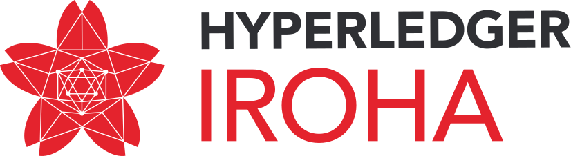
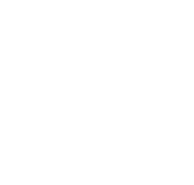
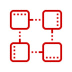
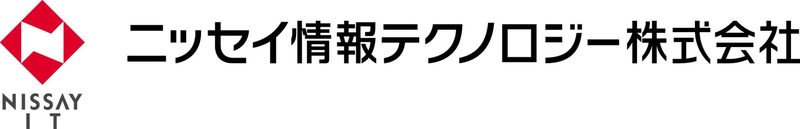
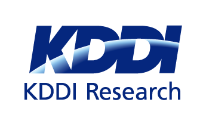
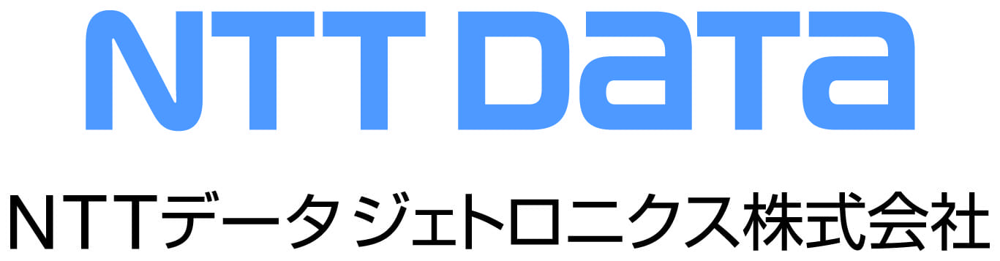
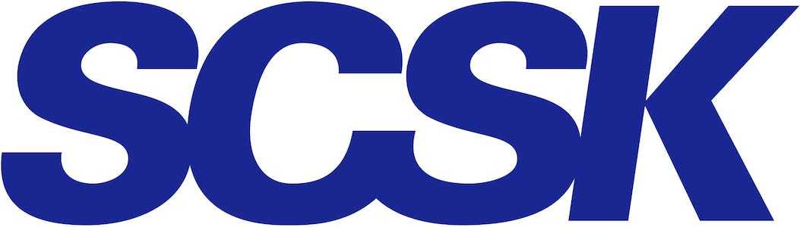
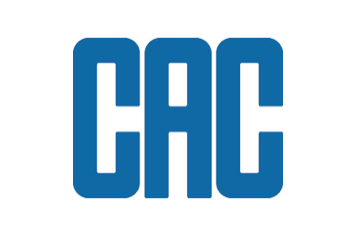
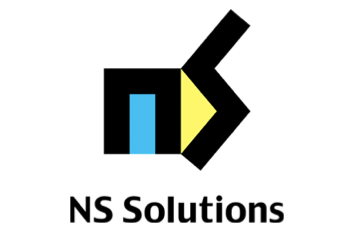
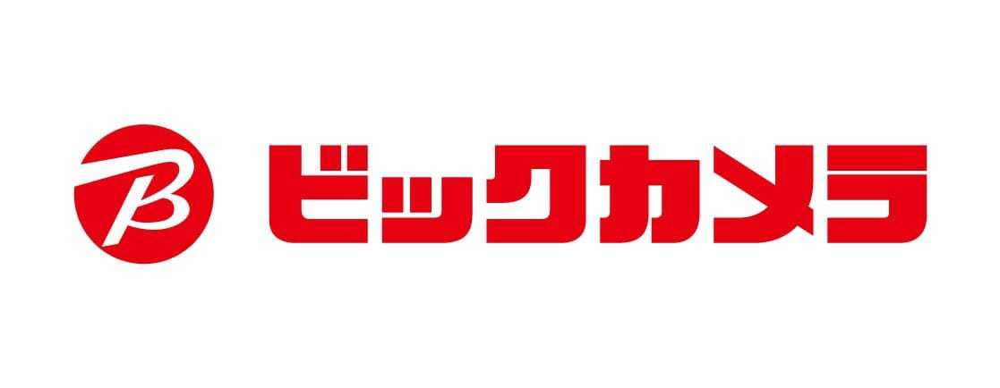

Hyperledger Iroha

[Contact us](#rec103186435)

[Get on GitHub](https://github.com/hyperledger/iroha)

* [Advantages](#rec103186411)
* [Features](#rec103186412)
* [Use cases](#rec103186413)
* [Resources](#rec103186414)
* [Community](#rec103186416)
* [FAQ](#rec103186428)
* 
* 
* 
* 
* 
* 
* 
* 
* 
* 
* 
* 
* 
* [En](#submenu:language)

[

.

](#)

* [Advantages](#rec103186411)
* [Features](#rec103186412)
* [Use cases](#rec103186413)
* [Resources](#rec103186414)
* [Community](#rec103186416)
* [FAQ](#rec103186428)

* [En](#submenu:language)

[Advantages](#rec103186411) [Features](#rec103186412) [Use cases](#rec103186413) [Resources](#rec103186414) [Community](#rec103186416) [FAQ](#rec103186428) [Contant us](#rec103186435) • [日本語](https://soramitsu.co.jp/ja/iroha) [English](#) [Russian](https://soramitsu.co.jp/ru/iroha) [ភាសាខ្មែរ](https://soramitsu.co.jp/kh/iroha)

Blockchain for enterprise 

SORAMITSU is a member of Hyperledger and a proud contributor company for Hyperledger Iroha framework. 

# Hyperledger Iroha 

Hyperledger Iroha Kaizen

Hyperledger Iroha is a straightforward DLT, inspired by Japanese Kaizen principle — eliminate excessiveness (muri). Iroha has essential functionality for your asset and identity management needs, at the same time being an efficient and trustworthy byzantine fault-tolerant tool for your enterprise needs.

Advantages

What makes Iroha different from other solutions?

Open-source under Apache 2.0 licence

Hyperledger project of Linux Foundation owns that code. 
Which means that you can create any applications based on Iroha - both open sourced and private.

Easy to understand - quick to deploy

It only takes around 10 minutes to start your own Iroha node

Reliable API for any basic operations

The commands are safe and tested by professionals

Iroha is 
client-oriented

With many examples and libraries, it's easy to create Iroha-based applications in different languages.

Features

Private blockchains

Easily create private robust blockchains

Decentralization

Help you easily decentralise your business data for secure and unfailing access to it

Client applications

Provide a base for client applications on a variety of platforms, e.g iOS and Android

Community

Make you a part of an international open-source community

Easy to deploy

Give you access to a set of out-of-the-box commands and queries sufficient for almost any blockchain use-case . 

Smart contracts

Supporting HL Burrow EVM for smart contracts (available since v1.2) 

SORAMITSU Use-Cases for Hyperledger Iroha

Hyperledger Iroha allows you to tokenize almost any information and easily bring blockchain into your business. Here is how we use it:

Payment solutions: Bakong

Often enough, truly decentralized solutions are not available for payment due to delays in receiving confirmations or due to overcomplexity of the technology. 
 
Hyperledger Iroha provides fast and clear payment options using built-in commands, permissions, roles, multi-signature accounts and batches. Asset management is easy as in centralized systems while providing necessary security guarantees. By simplifying the rules and commands required to create and transfer assets, we lower the barrier to entry, while at the same time maintaining high-security guarantees. Bakong is a payment system that is developed in collaboration with the National Bank of Cambodia (NBC) using Hyperledger Iroha blockchain. 
 
 

Fund management: D3 Ledger

With the support of multi-signature transactions, it is possible to maintain a fund by many managers. The fund assets should be held at one account. Its signatories should be fund managers, who are dealing with investments and portfolio distributions. 
 
One of the managers can confirm a deal by sending the original transaction and one of the managers' signatures. Iroha will maintain the transaction pending so that the deal will not be completed until it receives the required number of confirmations, which is parametrized with the transaction quorum parameter. 
 

Identity Management: SORA

Hyperledger Iroha has intrinsic support for identity management. Each user in the system has a uniquely identified account with personal information, and each transaction is signed and associated with a certain user. This makes Hyperledger Iroha perfect for various application with KYC (Know Your Customer) features. 
 
Sora is a decentralized economy that provides its citizens various opportunities to decide which projects and ideas should be supported and which ones should not - that way everyone benefits from making the economy stronger and the world - better. 
 

Use case partners

[

Become a partner

](#popup:myform)

Resources

[Repository](https://github.com/hyperledger/iroha)

[Documentation](https://iroha.readthedocs.io/)

[Getting Started guide](https://iroha.readthedocs.io/en/latest/getting_started/index.html)

[YouTube channel with tutorials](https://www.youtube.com/channel/UCYlK9OrZo9hvNYFuf0vrwww)

Here are some community materials to get you started

Chats: [Telegram](https://t.me/hyperledgeriroha), [Hyperledger Rocket](https://chat.hyperledger.org/channel/iroha), [Gitter](https://gitter.im/hyperledger-iroha/Lobby)

[Iroha Sandbox](https://www.katacoda.com/lebdron/scenarios/iroha-transfer-asset)

**Examples**

Code snippets and community projects

[

Iroha messenger

One use-case for Iroha is a decentralised messaging app.

Learn more

](https://github.com/x3medima17/twitter)

[

Java example

Want to create a genesis block and send transactions or maybe retrieve information and send it into logs? You name it! 

Learn more

](https://github.com/hyperledger/iroha-java/tree/master/client/src/test/java/jp/co/soramitsu/iroha/java)

[

Python examples

Code that can send transactions, return information from the ledger and creates transaction batches.

Read manual

](https://github.com/hyperledger/iroha-python/tree/master/examples)

[

JS example

Set account details or choose to get the information calling different commands from the library. 

Read

](https://github.com/hyperledger/iroha-javascript/blob/master/example/example.js)

[

iOS example 

The application that connects to a fully deployed Iroha and can create an account and send a transaction to another user using the library.

Read

](https://github.com/hyperledger/iroha-ios/tree/master/Example/IrohaExample)

Community

**Join** 
 
Join [Telegram chat](https://t.me/hyperledgeriroha), [Gitter](https://gitter.im/hyperledger-iroha/Lobby) or [Hyperledger RocketChat](https://chat.hyperledger.org/channel/iroha) where the maintainers, contributors and fellow users are ready to help you.

**Submit 
** 
You can submit issues and improvement suggestions via [Hyperledger Jira](https://jira.hyperledger.org/secure/CreateIssue!default.jspa).

**Subscribe** 
 
Subscribe to our [mailing list](https://lists.hyperledger.org/g/iroha) to receive the latest and most important news and spread your word within Iroha community.

**Ask and answer** 
 
You can also leave your questions on StackOverflow with \[[hyperledger-iroha](https://stackoverflow.com/questions/tagged/hyperledger-iroha)\] tag.

News

2021.10.04

SORAMITSU with its experience in creating solutions on HL Iroha, JICA, and Bank of the Lao PDR to [Inaugurate CBDC Research](https://soramitsu.co.jp/digital-currency-research) 

2021.09.01

SORAMITSU shortlisted in Global Central Bank Digital Currency Challenge with [a proposal based on HL Iroha](https://soramitsu.co.jp/global-central-bank-digital-currency-challenge/)

2020.06.10

Smart-contracts with HL Burrow EVM integration, Multihash format for public keys together with HL Ursa integration and many other exciting new features – in [new HL Iroha 1.2 Release Candidate](https://github.com/hyperledger/iroha/releases/tag/1.2.0-rc.1)

2020.06.4

Byacco - local university payment system based on HL Iroha [launched its production testing.](https://cointelegraph.com/news/soramitsu-starts-testing-white-tiger-digital-currency-in-japan)

2020.05.14

Check out the [video about SORAMITSU projects on HL Iroha](https://vimeo.com/415384555) that we prepared for [Consensus 2020](https://www.coindesk.com/events/consensus-2020).

2020.03.19

5 HL Iroha projects were selected for [HL Internship Project 2020](https://wiki.hyperledger.org/display/INTERN/Hyperledger+Mentorship+Program)!

2019.07.24

[HL Iroha 1.1](https://github.com/hyperledger/iroha/releases/tag/1.1.0) is released. New features and other improvements are here to make your blockchain applications better.

2019.05.6

[Hyperledger Iroha v 1.0](https://github.com/hyperledger/iroha/releases/tag/1.0.0) is here! Reliability and effectiveness of Hyperledger Iroha are now production-ready!

2018.11.15

Developing solutions for insurance on Hyperledger Iroha: new PoC project made in collaboration by SORAMITSU, [CAC Corporation](https://www.cac.co.jp/news/topics_181115.html) and [Aioi Nissay Dowa Insurance Co., Ltd.](https://www.aioinissaydowa.co.jp/corporate/about/news/pdf/2018/news_2018111500535.pdf)

2018.06.27

Take part in Iroha hackathon at [Hyperledger Hackfest Amsterdam 2018](https://events.linuxfoundation.org/events/hyperledger-hackfest-amsterdam-2018/)

Frequently asked questions

Q: What is Hyperledger Iroha?

A: Iroha is a framework on which you can write your own private blockchains (also known as decentralised ledgers). Iroha is not a network but a framework on which you can create your own blockchain networks. 

Q: How is it different from other options for creating blockchains? 

A: Hyperledeger Iroha is very simple, fast, written on C++. It has an amazing and reliable crash fault tolerant consensus algorithm called YAC. You can even deploy an Iroha node on simple ARM devices!

Q: What are the main perks of Iroha?

A: We are very proud of the following features that really make Iroha special: 
 
**YAC** - a real consensus that will make sure of the safety of the ledger 
 
**Multisignature** - option for transactions when you need not only one signature to get transaction settled but more than that. If you need your operations to be, for example, signed by several people, this would be a great choice for you! 
 
**Client libraries** - you can write applications on almost any platform - on your mobile phone or tablet or anything else. Moreover, with C++ and neat architecture you can even deploy a real node using just a simple ARM device! 

Q: Why would I use Hyperledger Iroha and not other Hyperledger frameworks?

A: As we see it, Hyperledger technologies are not competitors but different options tailored for specific tasks. Iroha is simple - it is easy to start using it, has some options that are very good for asset transactions and change of simple account data. 
 

Q: Does Hyperledger Iroha have Smart contracts at the moment?

A: Iroha only has a set of predefined contracts called "commands" at the moment. So there are some simple to use instructions that can already be used for a diverse range of operations with user data and assets. HL Iroha is also integrated with HL Burrow that allows you to run Solidity contracts on Iroha!

Q: What projects already use Hyperledger Iroha?

A: Iroha is used in payment systems, D3Ledger project that provides safekeeping of digital assets and some of our community members use it for healthcare related projects - to create tokens and provide transportation of data. You can also find a new way to use Iroha in your project!

Contacts

[info@soramitsu.co.jp](mailto:info@soramitsu.co.jp) 

© 2016-2022 [SORAMITSU](http://soramitsu.co.jp/)

Become use case partner

Company Name

Last name

First name

Department

E-mail

Phone

Company logo

Upload your logo image

WebPage for logo link

Release date

If you have release date, please write.

Use cases under consideration

I agree to [Terms and conditions](https://soramitsu.co.jp/en/terms)

Send

* [日本語](https://soramitsu.co.jp/ja/iroha)
* [Русский](https://soramitsu.co.jp/ru/iroha)
* [ភាសាខ្មែរ](https://soramitsu.co.jp/kh/iroha)

This website uses cookies to ensure you get the best experience

OK
