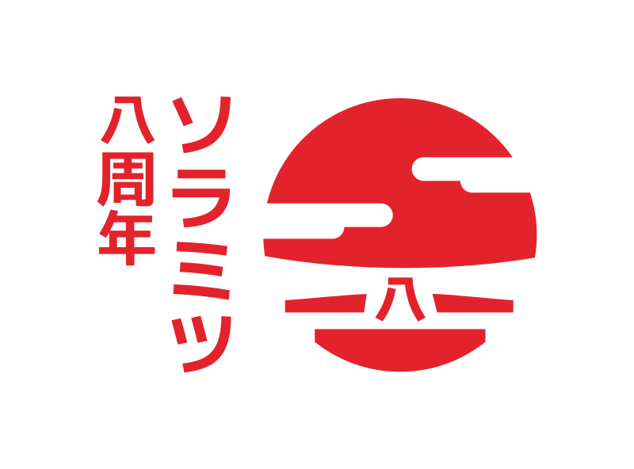
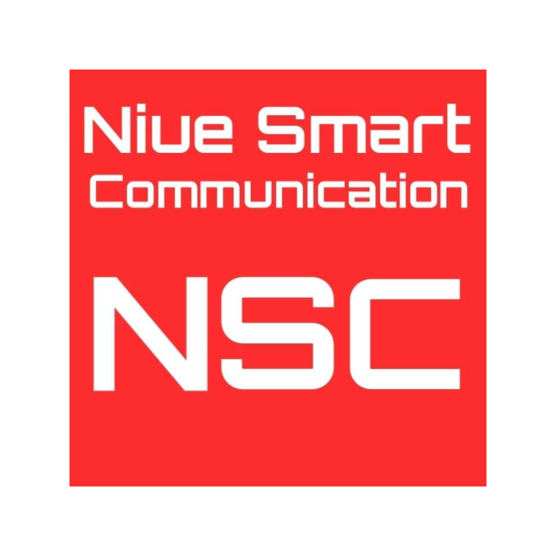

SORAMITSU — Designing a Better World Through Decentralized Technologies

* * *

Designing a Better World Through Decentralized Technologies

クライアントがソラミツに期待するのは、次世代の金融アプリケーションをより低いコストかつ記録的な速さで開発·ローンチすることのサポートです。

[バコン(Bakong)の紹介 
](https://soramitsu.co.jp/centralbanking)

ソラミツとカンボジア国立銀行(カンボジア王国の中央銀行及び金融監督当局)の合作である「バコン」を喜んで発表いたします。バコンはカンボジアの統一的決済システムであり、電子ウォレット、モバイル決済、オンラインバンキングや金融関連の申請など、全てを一つのアプリケーションで行うことができるシステムです。 

ソラミツは、企業や大学、政府向けにブロックチェーンをベースにしたソリューションを提供する、グローバルテクノロジーカンパニーです。国内及びクロスボーダーペイメントシステムの開発から自社独自の分散型自治経済の構築まで、私たちのプロジェクトとユースケース·スタディはフィンテックの次世代を象徴しています。

私たちのプロジェクトとユースケーススタディ

[

ハイパーレジャーいろは / Hyperledger Iroha

](https://soramitsu.co.jp/iroha)

ハイパーレジャーいろはは、次世代のパーミッション型ブロックチェーンプラットフォームで、企業や金融機関のデジタルアセットの管理をサポートすることを目的としています。ソラミツはハイパーレジャーいろはのオリジナル開発者で、Linux FoundationのHyperledger Projectにいろはのコードを寄付しました。 
 
ハイパーレジャーいろははC++言語で書かれており、高い性能や信頼性が必要とされるユースケースや、組み込み型のシステムにとって理想的です。 
 
ソラミツはハイパーレジャーいろはを、デジタルアセットやアイデンティティ、契約などを管理するモバイルアプリケーションを含む、ユーザー向けのサービスを作ることに利用しています。私たちのハイパーレジャーいろはの利用を通じて、より安全で効果的な社会に寄与したいと考えています。 
 
最初の開発者かつ主たる開発貢献者として、ソラミツはハイパーレジャーいろはに関する技術·ビジネス両面のサポートを提供します。 
 
もしハイパーレジャーいろはに関するサポートが必要であれば、ぜひ私たちにお問い合わせください。 
 

Learn more

[

バコン / Bakong

](https://soramitsu.co.jp/centralbanking)

ソラミツとカンボジア国立銀行の合作であるバコンは、使いやすくかつ強力なiOS/Androidモバイルアプリを通じた金融包摂を推進する、次世代の即時グロス決済システムです。 
 
即時グロス決済システムは、革命的でユニークな分散型台帳のコアソリューションであり、あらゆる口座保有者間の国内及びクロスボーダー即時グロス決済をたった一つのプラットフォームで行うことを可能にします。 
 
バコン中央銀行デジタル通貨(CBDC: Central Banking Digital Currency)は、銀行システムで求められる要素の範囲内で機能するように設計された紙の銀行券に対して、安全性の高い代替案です。 
 
安全で標準化されたデジタル通貨を決済手段として用いることにより、決済システムにおいて信頼や安心を増強することができます。 
 

Learn more

[

Medium

](https://medium.com/tokyo-fintech/soramitsu-builds-cambodian-digital-currency-payments-system-137a06d341f0)

[

カゴメ / Kagome

](https://www.youtube.com/watch?v=181mk2xvBZ4&list=PLOyWqupZ-WGsfympTCEcAd42zTXT3xxTO&index=5)

カゴメはソラミツによって開発されたポルカドットホストのC++実装で、Web3 Foundation基金による助成を受けています。 
 
カゴメによって、全てのソラミツのプロジェクトをポルカドットに対応したブロックチェーンに繋げることが可能となり、それにより次世代の分散型ウェブの一部となります。 

Learn more

[

Github

](https://github.com/soramitsu/kagome)

[Klaytn DEX](https://soramitsu.co.jp/soramitsu-klaytn)

SORAMITSU is partnering with the Klaytn Foundation to develop the backbone architecture and design for the first open-source decentralized exchange on the Klaytn blockchain. This technical collaboration seeks to promote decentralization and open source technologies that will allow Klaytn to be at the forefront of innovation through the implementation of future-proof decentralized exchange infrastructure. 
 
The SORAMITSU team will develop the open-source decentralized exchange in close collaboration with the Klaytn Foundation, with each milestone documented for the Klaytn Improvement Reserve. This collaboration is the first in many that seek to promote open source technologies and decentralization on the Klaytn chain by implementing a backbone architecture that is future-proof and scalable. 

Press Release

[

Learn More

](https://klaytn.foundation/)

[

フィアレス·ウォレット / Fearless Wallet

](https://fearlesswallet.io)

ソラミツはフィアレス·ウォレットと名付けられた、クサマ(Kusama)及びポルカドットネットワークにおけるP2Pトランザクションのためにオーダーメイドされた、新しいウォレットをリリースしました。 
 
フィアレス·ウォレットは技術的·ユーザー体験のレベル両方においてユニークです。将来的なアップデートでは、ステーキング、ガバナンス、ポルカスワップ分散型取引所との統合、そしてクレジットカードや他の支払いサービスによるKSM / DOTトークンの購入機能といったより高度な機能が、シンプルさと上品さを念頭に置いてデザインされたモダンなインターフェースを通じて組み込まれる予定です。 
 
フィアレス·ウォレットの目的は、今日存在するウォレットの酷く複雑な機能のユーザビリティを抜本的に改善し、分散型金融へのアクセスをより拡大することにあります。 

Learn more

[

ソラ / SORA

](https://sora.org)

ソラはDeFiに特化した組み込みツールを伴った、中央銀行の概念を分散させる新しい経済システムであり、かつポルカドット(Polkadot)のリレーチェーンとエコシステムにパラチェーンを実装するネットワークでもあります。 
 
ポルカスワップ(Polkaswap)分散型取引所は、ソラネットワーク(SORA Network)上に構築されています。 
 
ソラネットワークはアトミックスワップのようなデジタルアセットを利用する分散型アプリケーションのためのツール提供、トークンの異なるブロックチェーンへの橋渡し、及びデジタルアセットを含むプログラム上の規則作りにおいて優れています。 
 
iOSとAndoridで提供されているSORAアプリケーションを利用することで、VALトークンを送受信したり、エコシステムに他のユーザーを招待したりすることができます。 
 
公式Telegramグループにぜひご参加ください。 
 

Learn more

[

Github

](https://github.com/sora-xor)

[

フホン / Fuhon

](https://filecoin.io/blog/announcing-filecoin-implementations-in-rust-and-c++/)

ファイルコイン(Filecoin)はファイルコインプロトコルの２つの追加実装を発表しました。それがChainSafe社によるRustでの実装であるフォレスト(Forest)と、ソラミツによるC++での実装であるフホンです。これらの実装は実際の開発段階にあり、完全にオープンになっていて、誰でも利用や開発へ貢献することが可能になっています。GitHubでこれらの開発についてご確認いただけます。 

Learn more

[

Github

](https://github.com/filecoin-project/cpp-filecoin)

[

白虎 / Byacco

](https://soramitsu.co.jp/byacco)

白虎は、元々福島県の会津大学で開発された日本初の地域デジタル通貨です。より安全で信頼性の高い支払いのために、ブロックチェーン技術を元にして作られています。白虎は、ソラミツによって開発された最高級の分散型台帳技術に基づいた決済ソリューションです。未来のキャッシュレス決済にぜひご参加ください。

Learn more

[

Github

](https://github.com/soramitsu/kagome)

[

セントラル·アジア銀行 / Bank Central Asia (BCA)

](https://www.newswire.com/news/applications-of-soramitsus-sora-platform-and-hyperledger-iroha-for-20902012)

ソラミツとインドネシアのセントラル·アジア銀行は、オープンソースの分散型台帳（ブロックチェーン）ハイパーレジャーいろはを用いて、BCAグループ内企業に向けた自己管理型アイデンティティソリューションの実証実験を行いました。このソリューションは非中央集権型デジタル識別子や本人確認情報、暗号化アルゴリズムのより進化した概念に基づいています。その概念によって、顧客の登録プロセスや他の業務プロセスの時間をより短くしながらもKYCプロセスにかかるコストを削減することが可能です。 
 
BCAは、トランザクション·バンキングビジネスに特化したインドネシアの先駆的な商業銀行の一つで、様々な法人や消費者へのローン融資やソリューションの提供を行っています。2018年9月末には1,850万もの顧客口座を提供しており、24時間対応のインターネット/モバイルバンキングシステムによる取引のみならず、1,243の支店と1万7,440台のATM、そして50万台を超えるEDC端末を通して、毎日数百万の取引を処理しています。 

Learn more

最新ニュース：

LATEST NEWS IN ENGLISH:

[view more NEW](https://soramitsu.co.jp/page8085384.html)s \>

ユースケースパートナー

[

お申込みはこちら

](#popup:myform)

コアチーム

* [武宮誠、 ＰｈＤ 
 ](https://www.linkedin.com/in/makoto-takemiya/)
 
 グループ代表取締役・最高経営責任者／共同創業者／ブロックチェーンエンジニア彼は東京大学で博士号を取得しています 
 
* [岡田隆 
 ](https://www.linkedin.com/in/ryu-okada-69080628/)
 
 ソラミツグループ 会長 / 共同創業者・ソラミツ(株) 代表取締役
 
* [松田一敬 
 ](https://www.linkedin.com/in/ikkei-matsuda-松田一敬-74549735/)
 
 特別顧問／共同創業者
 
* [宮沢和正 
 ](https://www.linkedin.com/in/kazumasa-miyazawa-52955564/)
 
 ソラミツ 代表取締役社長 
 

* [Dmitriy Creed](https://www.linkedin.com/in/creed-2/) 
 
 CEO of SORAMITSU Labs 
 
 Head of the DevOps and Security departments. Professor of Practice in the Innopolis University. M.S. in SNE, Innopolis University. 
 
* [アンドリュー・ウォン](https://jp.linkedin.com/in/andrew-o-wong-2ab209) 
 
 最高執行責任者 
 
 アンドリューはプロダクトに特化したテクノロジーのリーダーで、LiquidグループやYahoo!、またSofiの子会社である8 Securitiesにおいてマネージャーの職務に従事してきました。彼はまた、シリコンバレーに拠点を置くいくつかのスタートアップ企業のアドバイザー、及びボードメンバーでもあります。 
 
* [大竹 勝博](https://jp.linkedin.com/in/katsuhiro-otake-4166359b) 
 
 最高財務責任者 
 
 大竹は、ゴールドマンサックスやメリルリンチ、ロイヤルバンクオブスコットランド、オーストラリア·ニュージーランド銀行などの国際的な金融機関において財務·執行のマネージャーとして従事したのち、Liquidグループの最高財務責任者を務めました。 
 
* [タルモ·ヴァンナス 
 ](https://www.linkedin.com/in/tarmovannas/)
 
 最高デザイン責任者 
 
 タルモは25年以上に渡ってデザインとテクノロジーに特化した様々な職務を経験してきました。ソラミツ参画以前にはハイエンドのブランディング·クリプトコンサルティングファームでデザインとブランディングのヘッドを務めていました。 
 

アドバイザー

* [尾島司](https://www.linkedin.com/in/tsukasa-ojima-309b1b90/)
 
 特別顧問 
 
* [廣田聡／弁護士 
 ](https://www.linkedin.com/in/satoshihirota/)
 
 顧問
 
* 中村信雄／弁護士 
 
 顧問
 
* [Travin Keith](https://www.linkedin.com/in/travinkeith/)
 
 SORAアドバイザー 
 
 Travin Keith is a Co-Founder of Immunefi, a bug bounty platform focused on cryptocurrencies, and STOKR, a fundraising platform utilizing blockchain technology. He also co-authored the Hyperledger White Paper and participated in the Blockchain4EU Initiative with the European Commission, as well as speaks regularly across various events around the world.
 

* 志村正之
 
 SORAアドバイザー 
 
 ㈱Shimura&Partners 代表取締役 
 BASE㈱ 社外取締役 
 ㈱三井住友銀行 元専務執行役員 
 
* Hideto Ozaki
 
 SORAアドバイザー 
 
 尾﨑英外は、トヨタ自動車株式会社取締役、トヨタファイナンシャルサービス代表取締役社長などを歴任し、現在はサンデンホールディングス株式会社社外取締役、上海交大教育集団リーンマネジメント学院院長、及びＮＩＬＥ尼罗河社の経営顧問を務める。 
 
* Haraguchi Tsunekazu
 
 SORAアドバイザー 
 
 原口恒和は、財務省理財局長、金融庁総務企画局長 
 国民生活金融公庫副総裁、株式会社イオン銀行代表取締役会長及びイオンフィナンシャルサービス株式会社代表取締役会長などを歴任し、現在は株式会社イオン銀行の顧問を務める。 
 

**[⼈件費基準単価規定](https://drive.google.com/file/d/1IdM8R-61dl-fMg1Yit3jO8FUJLa2kvkr/view?usp=sharing)**

お問い合わせ

〒151-0051 東京都渋谷区千駄ヶ谷5-27-5 リンクスクエア新宿16階 
 
メール: [info@soramitsu.co.jp](mailto:info@soramitsu.co.jp)

* 
* 
* 
* 
* 

[Japan Blockchain 
Association](http://www.jba-web.jp)

[Global Blockchain 
Business Council](https://gbbcouncil.org)

[Fintech association of Japan](http://www.fintechjapan.org)

ソラミツは以下の団体のメンバーです：

© 2023 SORAMITSU CO., LTD.

* [ユースケースパートナー規約](https://soramitsu.co.jp/terms)

© 2023 SORAMITSU CO., LTD.

ページトップへ戻る
