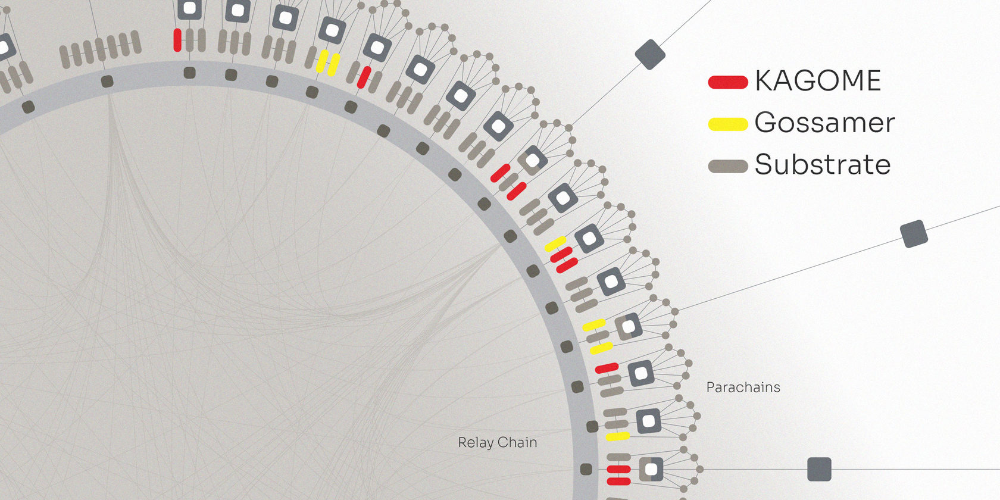
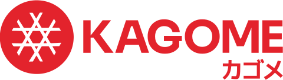

KAGOME Press Release

PRESS RELEASE

Soramitsu Co., Ltd. 
Tokyo, Japan

[info@soramitsu.co.jp](mailto:info@soramitsu.co.jp) 
[soramitsu.co.jp](https://soramitsu.co.jp)

[

**Download PDF**

](https://soramitsu.co.jp/kagome-press-release/pdf)

**FOR IMMEDIATE RELEASE** 
Thursday, October 22, 2020 

# KAGOME, a C++ Implementation of the Polkadot Host

What Is KAGOME? 
 
KAGOME is a C++ implementation of the [Polkadot Host](https://polkadot.network/technology/), built by SORAMITSU with the support of a [Web3 Foundation grant](https://medium.com/web3foundation/w3f-grants-soramitsu-to-implement-polkadot-runtime-environment-in-c-cf3baa08cbe6). SORAMITSU has extensive development capabilities and a history of delivering sophisticated blockchain-based solutions to [central](https://soramitsu.co.jp/centralbanking) and [commercial banks](https://www.newswire.com/news/applications-of-soramitsus-sora-platform-and-hyperledger-iroha-for-20902012), [exchanges](https://d3ledger.com/), and [universities](https://soramitsu.co.jp/byacco), among other clients. The core distributed ledger technology underpinning these solutions is [Hyperledger Iroha](https://www.hyperledger.org/use/iroha), a blockchain platform that is part of the Linux Foundation's Hyperledger Project and which SORAMITSU is a major contributor to and maintainer of. Using Polkadot, Hyperledger Iroha aims to seamlessly and securely connect with public and private chains, oracles, and future technologies, thereby closing the current interoperability gap among enterprise blockchains. 
 
KAGOME will complement parallel development work in [Rust](https://github.com/paritytech/polkadot), [Golang](https://github.com/ChainSafe/gossamer), and [Javascript](https://github.com/polkadot-js), contributing to the overall resilience of the Polkadot ecosystem and opening up access to the large, well-established, and enterprise-friendly C++ developer community (estimated at 4.4 million). The Web3 grant also covers a C++ implementation of the libp2p modular networking stack. 

What Is the Polkadot Host? 
 
The Polkadot Host is a framework for developing and running blockchains, including the Polkadot Relay Chain, which enables cross-chain interoperability. It provides several reusable components, including a Wasm interpreter, a consensus layer, a networking layer (libp2p), and APIs – all of which are described in detail in the following section. 

What Are KAGOME's Features? 
 
KAGOME implements the [Polkadot Host Specification](https://github.com/w3f/polkadot-spec/tree/master/host-spec). The specification itself has been created and supported by the Web3 foundation team, and aims to describe the Polkadot protocol for different client implementers in order to achieve cross-compatibility between them. 
 
KAGOME's features include: 

* **WASM Interpreter**: Allows execution of the Polkadot runtime, written in Rust and compiled to WebAssembly. Executing the Polkadot runtime allows KAGOME to execute and validate Polkadot's extrinsics in a compatible manner. To achieve compatibility, KAGOME exposes to the runtime a list of host APIs needed mostly for storage manipulations, memory allocations, and various cryptographic algorithms. KAGOME uses [Binaryen](https://github.com/WebAssembly/binaryen) to execute runtime code provided in WebAssembly. 
 
* **Consensus algorithms**: KAGOME implements Polkadot's hybrid consensus, which consists of BABE and GRANDPA. 
 * BABE (Blind Assignment for Blockchain Extension): a block production mechanism to determine which validator is eligible to produce a block. To determine block producers in every slot, validators use a VRF (verifiable random function) to compute random values that should be less than a certain threshold. In every slot there might be several block producers; therefore, forks are possible.
 * GRANDPA (GHOST-based Recursive ANcestor Deriving Prefix Agreement): a finalization mechanism that resolves forks. It is based on a pBFT-like consensus algorithm, which in contrast to the original pBFT finalizes chains instead of every block.
* **Storage**: KAGOME uses the LevelDB key-value database to persist chain data locally. This data is divided into: 
 * **BlockStorage**: blockchain data is composed of block headers, bodies, and justifications. Headers are used to verify blockchain state; bodies contain lists of extrinsics belonging to corresponding headers; and justifications store consensus proofs. 
 
 * **State trie**: a Patricia Merkle trie implementation that stores chain states. 
 
* **P2P networking**: SORAMITSU developed a [C++ implementation of libp2p](https://github.com/libp2p/cpp-libp2p), which is used for inter-client communication. Libp2p is a peer-to-peer modular networking stack that has most of the components required to build decentralized networks. Libp2p was proposed and specified by Protocol Labs, and is used in IPFS, Filecoin, Polkadot, Ethereum 2.0, and some other projects. At the moment, the C++ implementation supports TCP transport, Secio security protocols, and MPlex and Yamux muxers, as well as Identify and Ping protocols. 
 
* **User APIs**: KAGOME aims to provide Polkadot's JSON-RPC APIs in order to achieve compatibility with its user apps, for instance the Polkadot JS apps. To this end, KAGOME provides two services: 
 * HTTP JSON-RPC service
 * WebSocket JSON-RPC service

How Do We Test Conformance Against Other Implementations? 
 
W3F maintains conformance tests between the Substrate (Rust), KAGOME (C++), and Gossamer (Golang) Host implementations. These implementations are continuously checked for compatibility against one another. Currently, the following checks have been passed: 
 
● SCALE Codec Encoding 
● State Trie Hashing 
● Polkadot Host API 
 
The [Polkadot Conformance Testsuite](https://github.com/w3f/polkadot-spec/tree/master/test) uses Julia scripts that execute different host adapters to check conformance between implementations using the same input data. 

What Is Next for KAGOME? 
 
The next important milestone, scheduled for the end of Autumn 2020, is a full syncing node. This milestone includes the following features: 
 
**● Host API**: a list of WebAssembly import functions allowing execution of Polkadot blocks. 
● **Libp2p**: the cpp-libp2p library will be extended with Noise security protocol, which is currently used to secure connections between Polkadot peers. 
● **JSON-RPC interfaces**: necessary RPCs for Polkadot JS compatibility. 
● **Substream protocols**: sync and transaction protocols are required to fetch blocks from Substrate-based networks and propagate transactions in such networks. 
 
Achieving this milestone should enable syncing with both Polkadot and Kusama. After the syncing node features are done, the team will proceed with implementing features necessary for the validating node milestone, which is scheduled for early 2021: 
 
**● BABE secondary blocks**: secondary blocks are needed when no peer has produced blocks during a slot. 
● **Validating node network protocols**: substream protocols for block announcements and GRANDPA messages are required to participate in Polkadot consensus. 
● **Polkadot deployer integration**: the Polkadot deployer eases spinning up Substrate-based networks. The KAGOME CLI will be updated to integrate with the Polkadot deployer. 
 
Throughout the development process, the KAGOME team hopes to expand the C++ community's awareness of and involvement in Polkadot development. This plays into our long-term goal of better addressing the need for interoperability. As blockchain-based solutions move from the margins to the center of IT infrastructures in the private and public sectors alike, we anticipate that our work on KAGOME and similar projects will play a crucial role not only in the cryptocurrency community, but also in the integration and improvement of information and communications ecosystems worldwide. 

Interested in Learning More? 
● Check out the KAGOME documentation: [kagome.readthedocs.io](http://kagome.readthedocs.io/) to learn how to use KAGOME 
● Take a look at some [open issues](https://github.com/soramitsu/kagome/issues/) and the [features board](https://github.com/soramitsu/kagome/projects/1) on [KAGOME's GitHub](https://github.com/soramitsu/kagome)

About SORAMITSU 
 
SORAMITSU is a Japanese fintech company with expertise in creating blockchain-based infrastructure, payment systems, and identity solutions. 
 
● Together with the National Bank of Cambodia, SORAMITSU developed [Bakong](https://bakong.nbc.org.kh/), the world's first blockchain-based CBDC and retail payments system to be launched by a central bank. 
● SORAMITSU is one of the main contributors to [Hyperledger Iroha](https://www.hyperledger.org/use/iroha), an open-source permissioned blockchain platform aimed at helping businesses and financial institutions manage their digital assets and identities. Hyperledger Iroha is part of the Linux Foundation's Hyperledger Project. 
● SORAMITSU received a Web3 Foundation grant to develop [KAGOME](https://medium.com/web3foundation/w3f-grants-soramitsu-to-implement-polkadot-runtime-environment-in-c-cf3baa08cbe6), the C++ implementation of the Polkadot Host, as well as [Polkaswap](https://polkaswap.io/), a decentralized token exchange platform. 
● The company has also developed SORA, a groundbreaking decentralized economic system aimed at changing the way goods and services are brought to market. See [www.sora.org](http://www.sora.org/) for more information, then download the app from the Google Play Store or the AppStore on iOS. 
 
To learn more about SORAMITSU's technologies and vision, visit [soramitsu.co.jp](https://soramitsu.co.jp/). 

**KAGOME Logo** 

* * *
