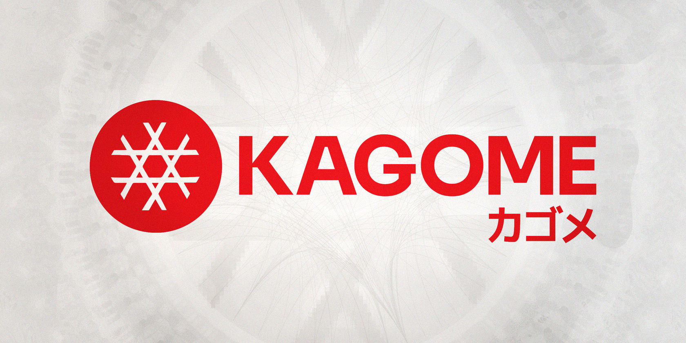
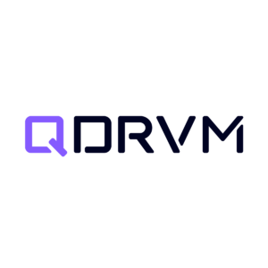

KAGOME: Excellence, Vision, and Continued Collaboration

PRESS RELEASE

SORAMITSU Co., Ltd. 
Shibuya-ku, Tokyo, Japan

[info@soramitsu.co.jp](mailto:info@soramitsu.co.jp) 
[soramitsu.co.jp](https://soramitsu.co.jp)

**FOR IMMEDIATE RELEASE 
**Wednesday, August 30, 2023 

# KAGOME: Excellence, Vision, and Continued Collaboration

## → SORAMITSU, a global technology innovator recognised for its revolutionary blockchain-based solutions that push humanity forward, announces the departure of the KAGOME team to form Quadrivium, an independent company focused on blockchain protocol development — the two companies shall partner to accelerate the development of KAGOME

Quadrivium is a new company growing out of the SORAMITSU Group, led by Kamil Salakhiev, previously the SORAMITSU Labs CEO, who has been leading the KAGOME project team since its inception.

**KAGOME Legacy**

KAGOME is destined to play a vital part in maintaining the Polkadot network security by bringing client diversity to the network. Through KAGOME and other initiatives, SORAMITSU and the Web3 Foundation have had a close collaborative history, with SORAMITSU founder Dr. Makoto Takemiya introducing KAGOME at DotCon Berlin in 2019, presenting side by side with Dr. Gavin Wood.

KAGOME has become the leading alternative Polkadot relay chain client implementation. It is the only non-Substrate-based validator that secures the Westend test network and has joined the [Kusama Thousand Validators Program](https://thousand-validators.kusama.network/). By understanding the end vision of the Polkadot protocol, the KAGOME team brings innovations and optimizations to the protocol while maintaining compatibility with other client implementations in the ecosystem. Kamil Salakhiev presented this at Polkadot Decoded 2023 in Copenhagen earlier this year.

**Partnership with Web3 Foundation**

The potential of KAGOME was recognised early on by the [Web3 Foundation](https://web3.foundation/). Over the years, SORAMITSU received subsequent [Web3 Foundation, Polkadot and Kusama treasury grants](https://medium.com/web3foundation/w3f-grants-soramitsu-to-implement-polkadot-runtime-environment-in-c-cf3baa08cbe6) to build KAGOME, consistently delivering development milestones and achieving the goals, in close cooperation with the W3F and many projects building on Substrate, such as [Polkaswap](https://polkaswap.io/), [Fearless Wallet](https://fearlesswallet.io/), and [SORA](https://sora.org/) to name a few. These grants symbolise an endorsement of KAGOME's capability to improve the Polkadot ecosystem by adding diversity to the network's host implementations, thereby making the network more resilient.

KAGOME is more than just a host implementation; it is a visionary project that has the potential to be a cornerstone in the burgeoning world of decentralised networks. Through its efficiency, flexibility, and focus on interoperability, KAGOME promises to be an invaluable asset to the Polkadot ecosystem. By pushing the boundaries of what's possible, SORAMITSU and Quadrivium keep contributing to Polkadot, helping to redefine the future of blockchain technology. 

**SORAMITSU and Quadrivium — Forging a Collaborative Path**

The transition of the KAGOME team to Quadrivium enables this technology to accelerate its roadmap and further achieve its goals through a company dedicated to its development and constant improvement. SORAMITSU extends its deep appreciation to Kamil Salakhiev and the KAGOME team for their unwavering commitment and excellence in software creation. Kamil's technological acumen has significantly driven the project's trajectory.

As KAGOME steps into a new chapter, SORAMITSU remains anchored in its mission to innovate and revolutionise fintech for the benefit of humanity through groundbreaking work such as the infrastructure backbone of the SORA decentralised economy and work with central banks across the globe, with a keen focus on Asia and the Pacific supported by the Japanese government.

“

_I am deeply honoured and grateful to have been a part of the SORAMITSU team for over six years. I want to express my sincere appreciation to SORAMITSU for their support of the next chapter of the KAGOME project. I am excited to embark on this new adventure with Quadrivium, and I look forward to continuing to collaborate with SORAMITSU in the future._

**Kamil Salakhiev,** Founder and CEO, Quadrivium LLC

Establishing Quadrivium signifies a new adventure for Mr. Salakhiev along with continued collaboration with SORAMITSU. The two entities eagerly look forward to a robust and productive interaction that will continue to benefit the blockchain space as a whole. The original KAGOME development team will continue implementing KAGOME and maintain C++ Libp2p as part of Quadrivium. SORAMITSU will continue providing DevOps and QA support to ensure KAGOME's quality, performance and conformance with the Polkadot protocol.

“

_Our core values are centered around building technology that puts humanity first. Decentralised technologies pioneered in Polkadot are and will continue to play an important role in helping to maintain personal liberties and empower the individual. By making the Polkadot ecosystem more resilient through alternative implementations, KAGOME will help ensure that systemic risks are minimised and allow builders to create their dApps in the Polkadot ecosystem without worry. While SORAMITSU remains dedicated to dApp development on SORA, especially the Polkaswap DEX, Quadrivium will specialise in creating the secure infrastructure underlying everything in the Polkadot ecosystem. 
_

**Makoto Takemiya, PhD,** CEO, SORAMITSU Group

Harnessing shared insights and synergistic energies, they will continue to elevate the blockchain space further. The Quadrivium team's expertise in game development, math, and cryptography, combined with their experience working with Libp2p and Polkadot protocols, positions them uniquely to develop robust, performant, and secure blockchain infrastructure such as client implementations, networking tools, and ZK-tech.

“

_Our mission at SORAMITSU is to leverage the full power of decentralised technology to raise humanity's wealth and well-being as a whole. Kamil's steadfast leadership is a testament to those values, a service career: doing big and challenging things that can help the world and users alike, embodying the ethos that is SORAMITSU's capacity for innovation and impact. We look forward to working with Quadrivium on shared goals and meaningful challenges in the years ahead. 
_

**Andrew Wong,** COO, SORAMITSU Group

* * *

**About SORAMITSU**

[soramitsu.co.jp](https://soramitsu.co.jp)

SORAMITSU is an award-winning global financial technology company with expertise in developing blockchain-based solutions for digital asset and identity management. Our mission is to use blockchain to promote innovation and solve pressing societal challenges. 

Utilising blockchain, SORAMITSU has developed a digital currency infrastructure backbone for the [National Bank of Cambodia](https://soramitsu.co.jp/bakong-press-release), a CBDC Proof-of-Concept [with the Bank of the Lao PDR](https://soramitsu.co.jp/dlak-cbdc), a closed-loop [payment system for the University of Aizu](https://soramitsu.co.jp/byacco) in Japan, an identity verification system prototype for Bank Central Asia in Indonesia, shortlisted in the [Monetary Authority of Singapore CBDC Challenge](https://soramitsu.co.jp/global-central-bank-digital-currency-challenge/), participated in Asia-Pacific's first proof-of-concept test of a cross-border multi-currency security settlement system using distributed ledger technology with the Asian Development Bank, and in collaboration with the Risk Assurance Group and Orillion Solutions developed the technology core of the [Fraud Intelligence Blockchain](https://soramitsu.co.jp/soramitsu-and-rag). 
 
SORAMITSU is an active contributor to many open source projects, such as [Klaytn](https://soramitsu.co.jp/klaytn-dex), South Korea's leading Layer-1 blockchain, [KAGOME](https://github.com/soramitsu/kagome), the C++ [Polkadot](https://polkadot.network/) Host implementation, the [SORA](https://sora.org/) crypto-economic system, the [Polkaswap](https://polkaswap.io/) DEX, and the DeFi wallet, [Fearless Wallet](https://fearlesswallet.io/). SORAMITSU also collaborated with Filecoin to develop FUHON, a C++ implementation of their protocol. In addition, SORAMITSU is the developer of and major contributor to the open-source blockchain platform [Hyperledger Iroha](https://www.hyperledger.org/use/iroha), a project of Hyperledger Foundation, part of the Linux Foundation, tailored for enterprise and public-sector use. As founding contributors to the Hyperledger Project and cooperation partners of the Web3 Foundation, SORAMITSU is building the digital infrastructure of the future. 
 
Based on these experiences, SORAMITSU aims to deploy cutting-edge technology on a global level in order to expedite financial inclusion and health, mitigate economic inefficiencies, and contribute to the fulfilment of the Sustainable Development Goals. 

* * *

**About Quadrivium**

Quadrivium is a blockchain infrastructure development company founded in 2023. The company specialises in the development of blockchain clients, peer-to-peer networking tools, and zk-cryptography. Quadrivium develops KAGOME Polkadot Host implementation, in partnership with the Web3 Foundation and SORAMITSU. The company also maintains the C++ libp2p library. 
 
Quadrivium's mission is to build the infrastructure for a decentralised future. The company believes that blockchain technology has the potential to revolutionise many industries, and it is committed to developing the open-source tools and services that will make this possible. 

* * *

SEE ALSO:

**SORAMITSU Takes the Lead in Building an Asian Digital Payment Network** 
Following the recent article by Nikkei Asia, SORAMITSU is pleased to confirm its active involvement in pioneering a cross-border payment system for Asian countries, anchored by Bakong, Cambodia's central bank blockchain infrastructure-based offering. 

[

Learn more

](https://soramitsu.co.jp/asian-digital-payment-network)

Follow SORAMITSU's [news and latest partnerships and developments here](https://soramitsu.co.jp/#news)_._ 

GET IN TOUCH AND FOLLOW:

* 
* 
* 
* 
* 

* * *
