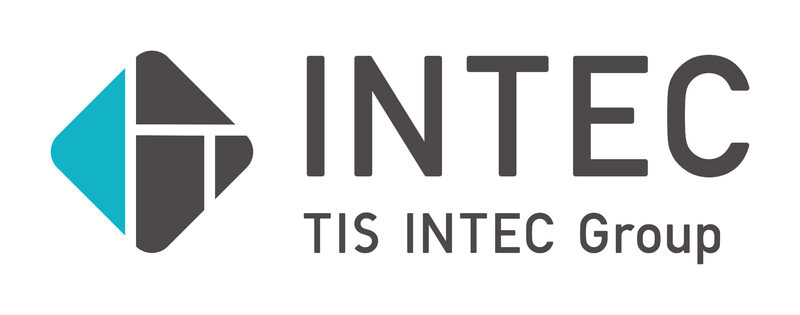

SORAMITSU (Kh)

* * *

**SORAMITSU** — Designing a Better World Through Decentralized Technologies

SORAMITSU's clients count on us to help them design and launch their next-generation financial applications, at a lower cost and in record time

[Introducing Bakong](https://soramitsu.co.jp/centralbanking)

We are pleased to announce Bakong, the collaboration between SORAMITSU and the National Bank of Cambodia. Bakong is Cambodia's only integrated payment system that allows you to do everything - e-wallets, mobile payments, online banking and financial applications - all in one place. 

សូរ៉ាមីតស៊ឹ (Soramitsu) គឺជាក្រុមហ៊ុនបច្ចេកវិទ្យា ប្លក់ឆេន (Blockchain) ដែលមានទីតាំងនៅប្រទេសជប៉ុន ។ យើងផ្តោតសំខាន់លើការអភិវឌ្ឍន៍ផ្នែកអត្តសញ្ញាណអេឡិចត្រូនិចសម្រាប់ប្លក់ឆេន (blockchains) ។

**ករណីសិក្សា**

[

Hyperledger Iroha

](https://soramitsu.co.jp/iroha)

Hyperledger Iroha is a next-generation permissioned blockchain platform, aimed at helping businesses and financial institutions manage digital assets. Soramitsu was the original developer of Hyperledger Iroha and contributed it to the Linux Foundation's Hyperledger Project. 
 
Hyperledger Iroha is written in C++, making it ideal for use cases where high performance and reliability are needed, or for embedded systems. 
 
Soramitsu uses Hyperledger Iroha to create services for users, including mobile applications for managing digital assets, identity, and contracts. Through our use of Hyperledger Iroha, we hope to contribute to a safer and more efficient society. 
 
As the initial developer and main contributor, Soramitsu provides technical and business support for Hyperledger Iroha. 
Please [contact us](mailto:info@soramitsu.co.jp) if you need support for Hyperledger Iroha. 

Learn more

[

Bakong

](https://soramitsu.co.jp/centralbanking)

A collaboration between Soramitsu and the National Bank of Cambodia, Bakong is a next-generation [Real-Time Gross Payments System](https://soramitsu.co.jp/centralbanking) that promotes financial inclusion through a friendly yet powerful [iOS](https://apps.apple.com/us/app/bakong/id1440829141) and [Android](https://play.google.com/store/apps/details?id=jp.co.soramitsu.bakong&hl=en_US) app. 
 
**RTGPS** - is the revolutionary and unique DLT core solution that allows for real-time gross domestic and cross-border payments between any and all account holders on a single platform. 
 
The Bakong central bank digital currency (CBDC) is a secure alternative to paper bank notes designed to function within the parameters required by the banking system. 
 
Using a secure and standardized digital currency as a means of payment can increase trust and confidence in the payment system. 

Learn more

[

Medium

](https://medium.com/tokyo-fintech/soramitsu-builds-cambodian-digital-currency-payments-system-137a06d341f0)

[

KAGOME

](https://www.youtube.com/watch?v=181mk2xvBZ4&list=PLOyWqupZ-WGsfympTCEcAd42zTXT3xxTO&index=5)

KAGOME is a C++ implementation of the [Polkadot Host](https://wiki.polkadot.network/docs/en/learn-polkadot-host#docsNav) developed by Soramitsu and funded by a [Web3 Foundation grant](https://github.com/w3f/Web3-collaboration/blob/master/grants/grants.md). 
 
With KAGOME, all SORAMITSU projects can be connected to blockchains supporting Polkadot, thus becoming a part of the next-generation decentralized web.

Learn more

[

Github

](https://github.com/soramitsu/kagome)

[Klaytn DEX](https://soramitsu.co.jp/soramitsu-klaytn)

SORAMITSU is partnering with the Klaytn Foundation to develop the backbone architecture and design for the first open-source decentralized exchange on the Klaytn blockchain. This technical collaboration seeks to promote decentralization and open source technologies that will allow Klaytn to be at the forefront of innovation through the implementation of future-proof decentralized exchange infrastructure. 
 
The SORAMITSU team will develop the open-source decentralized exchange in close collaboration with the Klaytn Foundation, with each milestone documented for the Klaytn Improvement Reserve. This collaboration is the first in many that seek to promote open source technologies and decentralization on the Klaytn chain by implementing a backbone architecture that is future-proof and scalable.

Press Release

[

Learn More

](https://klaytn.foundation/)

[

Fearless Wallet

](https://fearlesswallet.io)

SORAMITSU is releasing the Fearless Wallet, a new wallet tailor-made for peer-to-peer transactions on the [Kusama](https://kusama.network) and [Polkadot](https://polkadot.network/) networks. 
 
The Fearless Wallet is unique on both technical and user-experience levels. Future revisions will incorporate advanced features — such as staking, governance, Polkaswap DEX integration, and the ability to buy KSM/DOT via credit card or payment service — within the context of a modern interface designed with simplicity and elegance in mind. 
 
The goal is to expand access to decentralized finance by radically improving the usability of the notoriously complex functions of present-day wallets. 

Learn more

[

SORA

](https://sora.org)

SORA is both a new economic system that decentralizes the concept of a central bank as well as a network that implements a parachain to the [Polkadot](https://polkadot.network/) relay chain and ecosystem, with in-built tools focused on DeFi. The Polkaswap decentralized exchange is being built on the SORA Network. 
 
The SORA Network excels at providing tools for decentralized applications that use digital assets, such as atomic token swaps, bridging tokens to other blockchains, and creating programmatic rules involving digital assets. 
 
Using the SORA App for [iOS](https://apps.apple.com/us/app/sora-dae/id1457566711) and [Android](https://play.google.com/store/apps/details?id=jp.co.soramitsu.sora), users can send and receive VAL tokens and invite users to join the ecosystem. 
Join our [Telegram Chat](https://t.me/sora_xor). 

Learn more

[

Github

](https://github.com/sora-xor)

[

FUHON

](https://filecoin.io/blog/announcing-filecoin-implementations-in-rust-and-c++/)

[Filecoin](https://filecoin.io/blog/announcing-filecoin-implementations-in-rust-and-c++/) has announced two additional implementations of the Filecoin protocol: [forest](https://github.com/ChainSafe/forest) – being implemented in Rust by ChainSafe, and [FUHON](https://github.com/filecoin-project/cpp-filecoin) – being implemented in C++ by SORAMITSU. These implementations are in active development, and are now fully open for anyone to use or contribute to. Check them out on GitHub! 
 

Learn more

[

Github

](https://github.com/filecoin-project/cpp-filecoin)

[

Byacco

](https://soramitsu.co.jp/byacco)

Byacco is the first local digital coin originally developed for the University of Aizu, Fukushima Prefecture, Japan. It is based on blockchain technology for more secure and reliable payments. Byacco is the first local payment solution based on a high-end Distributed Ledger Technology developed by SORAMITSU. Join us in the future of cashless payments!

Learn more

[

Github

](https://github.com/soramitsu/kagome)

[

BCA

](https://www.newswire.com/news/applications-of-soramitsus-sora-platform-and-hyperledger-iroha-for-20902012)

Soramitsu and PT Bank Central Asia Tbk (BCA) tested a self-sovereign identity solution for companies in the BCA Group, using the open source distributed ledger (blockchain) Hyperledger Iroha. The solution is based on the advanced concepts of decentralized digital identifiers, verifiable claims and cryptographic algorithms that will lower the costs of the KYC procedures while speeding up the customer onboarding process and other business processes. 
 
BCA is one of the leading commercial banks in Indonesia with a core focus on transaction banking business and providing loan facilities and solutions to the corporate, commercial and SME and consumer segments. At the end of September 2018, BCA had the privilege of serving 18.5 million customer accounts, processing millions of transactions every day through 1,243 branches, 17,440 ATMs and more than 500,000 EDC machines, as well as transactions made over the 24-hour internet and mobile banking systems. 
 

Learn more

[SORAMITSU](https://soramitsu.co.jp/) has collaborated with the [Web3 Foundation](https://web3.foundation/) since 2018, receiving multiple grants to implement [Kagome](https://medium.com/web3foundation/w3f-grants-soramitsu-to-implement-polkadot-runtime-environment-in-c-cf3baa08cbe6), the Polkadot Host in the C++ programming language; build the [Fearless wallet](https://fearlesswallet.io/) for Kusama; and contribute to [Polkaswap](https://polkaswap.io/), a non-custodial AMM-DEX protocol for the Polkadot and Kusama ecosystem. The the [SORA Network](https://sora.org/) is also going to become a parachain of the Polkadot and Kusama relay chains. 
 
We maintain validators on the Polkadot and Kusama networks, so please feel free to nominate us! 

[

Nominate on Polkadot and Kusama

](https://soramitsu.co.jp/validator)

Recent news

[view more NEW](https://soramitsu.co.jp/page8085384.html)s \>

ដៃគូរជាក់លាក់

[

ចូលជាដៃគូរ

](#popup:myform)

ក្រុមស្នូល

* [ម៉ាកូតុ តាគេមីយៈ, បណ្ឌិត 
 ](https://www.linkedin.com/in/makoto-takemiya/)
 
 សហស្ថាបនិក / សហនាយកប្រតិបត្តិ / វិស្វករប្លក់ឆេន (blockchain) 
 
* [យឿ អូកាដាក់ 
 ](https://www.linkedin.com/in/ryu-okada-69080628/)
 
 សហស្ថាបនិក 
 
* [អ៊ិកកេ ម៉ាសឹដាក់ 
 ](https://www.linkedin.com/in/ikkei-matsuda-松田一敬-74549735/)
 
 សហស្ថាបនិក / នាយកសូរ៉ា
 
* [ខាហ្សឹម៉ាសាក់ មាយ៉ាចាវ៉ាក់ 
 ](https://www.linkedin.com/in/kazumasa-miyazawa-52955564/)
 
 នាយកសូរ៉ា (Sora) 
 

* [Dmitriy Creed](https://www.linkedin.com/in/creed-2/) 
 
 CEO of Soramitsu Labs 
 
 Head of the DevOps and Security departments. Professor of Practice in the Innopolis University. M.S. in SNE, Innopolis University 
 
* [Andrew Wong](https://jp.linkedin.com/in/andrew-o-wong-2ab209) 
 
 Chief Operating Officer 
 
 Andrew is a product focused technology leader, serving in management roles at both Liquid Group Inc, Yahoo! and 8 Securities (acquired by Sofi). He is an advisor and board member to several Silicon Valley based startups. 
 
* [Katsuhiro Otake](https://jp.linkedin.com/in/katsuhiro-otake-4166359b) 
 
 Chief Financial Officer 
 
 Katsuhiro Otake is the former CFO of Liquid Group Inc. after serving as managing roles in finance and operations for international financial institutions, such as Goldman Sachs, Merrill Lynch, Royal Bank of Scotland, and Australia and New Zealand Bank. 
 
* [Tarmo Vannas](https://www.linkedin.com/in/tarmovannas/)
 
 Chief Design Officer 
 
 Tarmo has over 25 years professional experience across various roles focusing on design and technology. He was the former Head of Design & Brand for a high-end branding and crypto consultancy firm before joining SORAMITSU. 
 

* [សឹកាសា អូជីមៈ 
 ](https://www.linkedin.com/in/ryu-okada-69080628/)
 
 នាយកសូរ៉ា (Sora) 
 
* [សាតូស្ស៊ី ហ៊ីរ៉ូតាក់ 
 ](https://www.linkedin.com/in/satoshihirota/)
 
 អ្នកប្រឹក្សា
 
* ណូបួ ណាកាម៉ួរៈ 
 
 អ្នកប្រឹក្សា
 
* Travin Keith 
 
 ទីប្រឹក្សាឯករាជ្យរបស់សូរ៉ា 
 
 Travin Keith is a Co-Founder of Immunefi, a bug bounty platform focused on cryptocurrencies, and STOKR, a fundraising platform utilizing blockchain technology. He also co-authored the Hyperledger White Paper and participated in the Blockchain4EU Initiative with the European Commission, as well as speaks regularly across various events around the world.
 

* លោក ម៉ាសៃយូគិ ស៊ីមមូរ៉ៈ (Masayuki Shimura)
 
 ទីប្រឹក្សាឯករាជ្យរបស់សូរ៉ា (Sora) 
 
 លោក ម៉ាសៃយូគិ ស៊ីមមូរ៉ៈ (Masayuki Shimura) គឺជានាយកប្រតិបត្តិរបស់ Shimura&Partners ហើយលោកក៏ជានាយករបស់ក្រុមហ៊ុន BASE Inc និងជាអតីតនាយកគ្រប់គ្រងជាន់ខ្ពស់នៃសាជីវកម្មធនាគារ Sumitomo Mitsui (Sumitomo Mitsui Banking Corporation) ។ 
 
* Hideto Ozaki
 
 ទីប្រឹក្សាឯករាជ្យរបស់សូរ៉ា (Sora) 
 
 Hideto Ozaki is Outside Director of Sanden Holdings Corporation, Dean of School of Lean Management, Shanghai Jiao Da Education Group and Management Advisor of Nile Corporation (China). He also was former General Manager of Finance Div. of Toyota Motor Corporation and former CEO of Toyota Financial Services Corporation. 
 
* Haraguchi Tsunekazu
 
 ទីប្រឹក្សាឯករាជ្យរបស់សូរ៉ា (Sora) 
 
 Tsunekazu Haraguchi is Advisor and former CEO of AEON Bank, Ltd. and former CEO of AEON Financial Service Co., Ltd. He also was Director-General of the Financial Bureau of Ministry of Finance, Director-General of the Planning and Coordination Bureau of Financial Services Agency and Vice President of the former National Life Finance Corporation. 
 

ទាក់ទងមកពួកយើង

Link Square 16F, 5-27-5 Sendagaya, Shibuya-ku, Tokyo, Japan, 151-0051 
 
Email: [info@soramitsu.co.jp](mailto:info@soramitsu.co.jp)

* 
* 
* 
* 
* 

[Japan Blockchain 
Association](http://www.jba-web.jp)

[Global Blockchain 
Business Council](https://gbbcouncil.org)

[Fintech association of Japan](http://www.fintechjapan.org)

សមាជិកគួរអោយសរសើរនៃ:

© 2023 SORAMITSU CO., LTD.

* [Terms & Conditions](https://soramitsu.co.jp/terms)

© 2023 SORAMITSU CO., LTD.

Back to top
