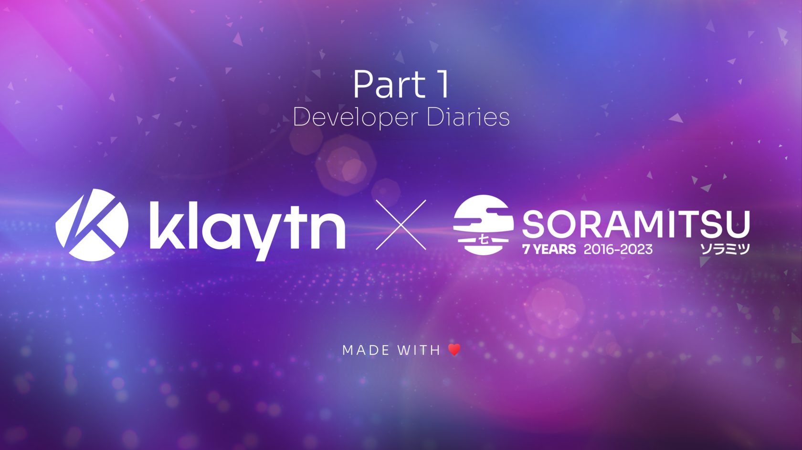
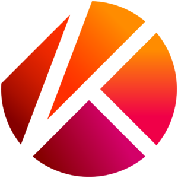

SORAMITSU Developer Diaries

PRESS RELEASE

SORAMITSU Co., Ltd. 
Shibuya-ku, Tokyo, Japan

[info@soramitsu.co.jp](mailto:info@soramitsu.co.jp) 
[soramitsu.co.jp](https://soramitsu.co.jp)

**FOR IMMEDIATE RELEASE 
**Tuesday, May 23, 2023 

# SORAMITSU Developer Diaries

## → The Importance of a Decentralized Exchange in the Klaytn Ecosystem

**Executive Summary** 
 

* DEXs have become increasingly popular in the blockchain industry due to their ability to offer users greater privacy, security, and control over their assets

 
Decentralized exchanges (DEX) have been gaining popularity in the world of blockchain-based ecosystems and economies in recent years. They offer users a way to trade digital assets without relying on centralized intermediaries, providing increased security, privacy, and control over their funds. The open-source DEX was designed by SORAMITSU to offer users a fast, secure, and reliable way to trade Klaytn-based assets. 
 
In this 3 piece series of articles, we will take a closer look at the open-source Klaytn-DEX project, exploring its features, benefits, and potential use in the broader blockchain ecosystem. In the first part, we examine the differences between centralized and decentralized exchanges, and outline some of the challenges and opportunities that lie ahead for DEXs, as they continue to disrupt traditional financial systems and usher in a new era of decentralized finance (DeFi). In part 2, we will cover some interesting use cases that DEXes can bring to projects building in the Klaytn ecosystem, and finally in part 3 we cover the importance of DEXes and the innovations that are becoming game-changers in the web3 gaming industry. 

**DEX vs CEX** 
 
When it comes to cryptocurrency exchanges, there are two main types: centralized exchanges (CEX) and decentralized exchanges (DEX). While both allow users to trade cryptocurrencies, they have significant differences in terms of how they operate, the level of control users have, and the risks involved. Let's take a closer look at the differences between DEX and CEX. 
 
 
**Centralized Exchanges** 
 
Centralized exchanges (CEX) are operated by a central authority, such as a company or corporation. They are the most common type of exchange and are similar to traditional stock exchanges. In a CEX, users deposit their funds into the exchange's wallet, and the exchange facilitates trades between buyers and sellers. 
 
One of the main advantages of a CEX is that they tend to have a higher trading volume, which means that users can often buy or sell cryptocurrencies at a more favorable price. They also typically offer a wider range of trading pairs and have more advanced trading tools. Another benefit is that CEX has offramp services, which means that users can sell their crypto assets for fiat and withdraw the money to a previously verified bank account. Ultimately, a CEX is a good place for someone new to Web3 to begin, as the process is easy and the wallet is custodied, so there is less place for losses due to user inexperience. 
 
However, the downside of a CEX is that users have to trust the exchange to hold their funds and execute trades fairly. If an exchange is hacked or goes bankrupt, users' funds can be lost or stolen. Additionally, CEXs are often subject to regulatory scrutiny, and users may need to provide personal information and go through a KYC (know your customer) process to use them, as well as to register payment and withdrawal methods. 
 
 
**Decentralized Exchanges** 
 
Decentralized exchanges operate without a central authority, meaning that users have more control over their funds and trades. They are built on blockchain technology and use smart contracts to execute trades. In a DEX, users connect their cryptocurrency wallets to the exchange and trade directly with other users. 
 
One of the main advantages of a DEX is that users have full control over their funds and private keys, which reduces the risk of theft or hacking. Additionally, users do not need to go through a KYC process to use a DEX, which provides greater privacy. 
 
However, DEXs tend to have a lower trading volume than CEXs, which can result in less liquidity and higher trading fees. They also typically have a more limited range of trading pairs and less advanced trading tools. 
 
Another potential downside of a DEX is that trades can be slower to execute due to the time required to confirm transactions on the blockchain. Additionally, if a user makes a mistake when entering a trade, there is no central authority to reverse or correct the transaction, and unlike the centralized exchanges, users cannot directly withdraw their funds to fiat. 
 
**Read more in Part 2 of the SORAMITSU Developer Diaries, available next week****.** 

* * *

****About Klaytn****

[klaytn.foundation](https://klaytn.foundation/)

Klaytn is an open-source public blockchain designed for tomorrow's on-chain world. With the lowest latency amongst leading blockchains and a developer-friendly environment, Klaytn provides a seamless experience for developers and users alike. Since its launch in June 2019, Klaytn has grown to become South Korea's de-facto Web3 ecosystem and one of the largest in the world, with a user base of millions generating over a billion transactions to date across over 300 DApps. Find out more at [https://klaytn.foundation/](https://klaytn.foundation/)

**About SORAMITSU**

[soramitsu.co.jp](https://soramitsu.co.jp)

SORAMITSU is an award-winning global financial technology company with expertise in developing blockchain-based solutions for digital asset and identity management. Our mission is to use blockchain to promote innovation and solve pressing societal challenges. 
 
SORAMITSU is the developer of and major contributor to the open-source blockchain platform [Hyperledger Iroha](https://www.hyperledger.org/use/iroha), which is tailored for enterprise and public-sector use. Hyperledger Iroha, a project of Hyperledger Foundation, part of the Linux Foundation, has a permissions system that is scalable and performant. 

Utilizing blockchain, SORAMITSU has developed a digital currency for the [National Bank of Cambodia](https://soramitsu.co.jp/bakong-press-release), a CBDC Proof-of-Concept [with the Bank of the Lao PDR](https://soramitsu.co.jp/dlak-cbdc), a closed-loop payment system for the University of Aizu in Japan, an identity verification system prototype for Bank Central Asia in Indonesia, we were finalists in the [Monetary Authority of Singapore CBDC Challenge](https://soramitsu.co.jp/global-central-bank-digital-currency-challenge/), and are currently participating in Asia-Pacific's first proof-of-concept test of a cross-border, multi-currency security settlement system using distributed ledger technology with the Asian Development Bank. We have also conducted proof-of-concept tests for several major Japanese enterprises, and are active contributors to open source projects, such as [Klaytn](https://soramitsu.co.jp/klaytn-dex), South Korea's leading Layer-1 blockchain, [KAGOME](https://github.com/soramitsu/kagome), the C++ [Polkadot](https://polkadot.network/) Host implementation, the [SORA](https://sora.org/) crypto-economic system, the [Polkaswap](https://polkaswap.io/) DEX, and the DeFi wallet, [Fearless Wallet](https://fearlesswallet.io/). 
 
Based on these experiences, SORAMITSU aims to deploy cutting-edge technology on a global level in order to expedite financial inclusion and health, mitigate economic inefficiencies, and contribute to the fulfilment of the Sustainable Development Goals. 

* * *

SEE ALSO:

**SORAMITSU Success Stories: The Working Partnership with the Klaytn Foundation** 
After concluding the development of an open-source decentralized exchange backbone for the Klaytn network, we reflect on the experience of working with Klaytn's governance to build for the community. 

[

Learn more

](https://soramitsu.co.jp/klaytn-partnership-success-story)

Follow SORAMITSU's [news and latest partnerships and developments here](https://soramitsu.co.jp/#news)_._ 

GET IN TOUCH AND FOLLOW:

* * *
