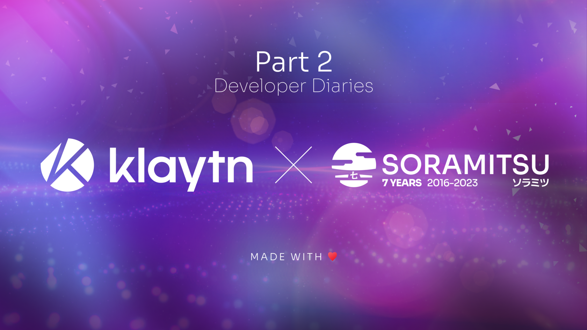

SORAMITSU Developer Diaries

PRESS RELEASE

SORAMITSU Co., Ltd. 
Shibuya-ku, Tokyo, Japan

[info@soramitsu.co.jp](mailto:info@soramitsu.co.jp) 
[soramitsu.co.jp](https://soramitsu.co.jp)

**FOR IMMEDIATE RELEASE 
**Tuesday, May 30, 2023 

# SORAMITSU Developer Diaries

## → The Importance of a Decentralized Exchange in the Klaytn Ecosystem

**Executive Summary** 
 

* Through aggregator platforms, asset management platforms, and IDO platforms, DEXs can provide greater liquidity and allow project owners to adjust tokenomics to better align with user needs.

**First open-source DEX in Klaytn** 
 
Built by SORAMITSU for the Klaytn community, the open source DEX is a powerful yet intuitive blueprint of the capabilities that decentralized finance can provide a network. We take a moment to distinguish that it is open-source because there are already DEXs operating in Klaytn. In its first iteration, the open-source DEX has asset management features, an exchange to swap tokens, provide liquidity and participate in governance, as well as informative features that can be adapted to the exchange operator's needs. 
 
As aforementioned, the open source DEX does not have an operator, which allows teams building on Klaytn to fork and implement it as their own, having built it for the Klaytn community as a white-label solution so that teams building on the network have an exchange infrastructure that is easy to use and tailored to Klaytn network specifications, yet powerful and capable to satisfy the requirements each team may have, from governance to liquidity provision. The open source DEX has also been tried and tested by the Klaytn community, with the feedback and suggestions having been implemented before the end of the testing cycle. 
 
The [Klaytn-DEX](https://github.com/klaytn/klaytn-service-sdk) was implemented as a set of best practices which could help the DEX-operator or company who will run it amplify a project's tokenomics. Below is the list of features currently available in the open-source DEX: 
 

* **Platform token** - A token that represents the DEX. For example, KSP is the platform token for [KLAYswap](https://klayswap.com/), UNI - for Uniswap, or PSWAP for Polkaswap.
* **Liquidity provision** - the main feature of each DEX is liquidity provision. The open source DEX was implemented based on the Uniswap v2 model where it is available for everyone to deposit liquidity.
* **Swaps** - the core feature of a DEX is the swap operation that works based on automated market-making (AMM). It was implemented to support ERC-20 and KIP-7 tokens that circulate in the Klaytn network.
* **Farming pools** - farming contracts are a good option to adjust tokenomics to a project's needs. It allows DEX-operators to create farming pools distributing liquidity provision tokens and awarding liquidity providers with platform tokens.
* **Staking pools** - staking contracts are another option to attract users and give them opportunities to earn rewards. A DEX-operator can create a staking pool where users can stake the platform token and earn rewards in another token (ERC-20 or KIP-7).
* **Small governance** - this is a tool that allows direct communication with the community to hear their ideas, suggestions and proposals. Based on this governance, community members can create a voting process backed by [Snapshot.org](https://snapshot.org/#/toniya.eth).

 
 
**DeFi** 
 
**Asset Management** 
 
An asset management platform enables users to manage their on-chain assets, including cryptocurrencies, and other digital assets. These platforms typically provide a range of tools and services designed to help users buy, sell, and manage their assets, as well as track their portfolio performance and analyze market trends. 
 
Asset management platforms may also offer features such as wallet integration, price alerts, and investment insights, as well as access to decentralized finance (DeFi) applications such as lending and borrowing platforms, decentralized exchanges (DEXs), and liquidity pools. 
 
Here are some ways in which an asset management platform can be used in a DEX: 
 

1. **Token Swaps**: A DEX can be used to swap one cryptocurrency for another. This can be useful for asset management platforms that offer a diverse range of tokens or investment products. Instead of having to go through a centralized exchange to swap tokens, users can do it directly on the platform, making the process faster and more efficient.
2. **Liquidity Provision**: Asset management platforms can use DEXs to provide liquidity for their tokens. By listing their tokens on a DEX, they can allow users to trade them directly on the platform, increasing the liquidity of the tokens and making it easier for users to buy and sell them.
3. **Yield Farming**: Yield farming is a process for users to earn rewards or tokens by providing liquidity to a DEX. Asset management platforms can use yield farming to incentivize users to provide liquidity for their tokens on a DEX, helping to increase the liquidity of the tokens and providing users with a way to earn passive income.

 
Overall, asset management platforms are an essential component of the rapidly evolving crypto ecosystem, helping to make digital asset management more accessible, secure, and user-friendly to investors of all levels. 
 
 
**Aggregators** 
 
Aggregators are platforms that allow users to compare prices and liquidity offerings across multiple exchanges and liquidity pools. 
 
Although integrating a DEX into an aggregator can still offer users access to a wider range of digital assets and trading pairs, aggregation is more effective and provides users with better trading experiences if liquidity pairs are spread across DEXes. By leveraging a DEX's range of liquidity pools, an aggregator can provide users a greater number of trading options than if they were limited to a single CEX or DEX with a limited amount of tokens onboarded. 
 
Moreover, incorporating an aggregator into a DEX can provide users with increased security and privacy. By using a DEX, users retain full control over their assets, eliminating the need to trust a centralized exchange with their funds. Another benefit of incorporating a DEX into an aggregator is that it can help improve token availability and exchange value as this encourages users to create their own trading pairs for the exchange to aggregate during trades, which results in a better experience for users, as well as rewards for liquidity providers. 
 
Since DEXs are decentralized and built on blockchain technology, they can be accessed by anyone with an internet connection, which can help to increase the number of users and trading volume on the platform. 
 
 
**IDO platform** 
 
Another good example of DEX usage is an Initial DEX Offering (IDO) platform. These platforms allow cryptocurrency projects to launch their tokens directly to users through a decentralized exchange (DEX). IDO platforms have gained popularity in the cryptocurrency industry as a way for innovative projects to raise funds and gain exposure to the broader market without relying on traditional fundraising methods. It also opens opportunities for users to buy tokens from new projects (**_after due diligence and research_**). 
 
The primary advantage of using an IDO platform is that it allows projects to reach a wider audience of potential investors, regardless of their location. This is because IDO platforms are decentralized and accessible from anywhere in the world, making it easier for would-be investors to participate in the token sale. 
 
Integrating a DEX with an IDO platform can provide several benefits for project owners. Firstly, after a successful token sale, project owners can deposit the initial pool liquidity on the DEX, providing users with greater liquidity and making it easier to trade the token. This can help increase the value of the token and promote greater adoption among users. 
 
In addition, by leveraging the power of a DEX, IDO platform owners can adjust tokenomics to better align with the needs of their users. This can help to create a more sustainable ecosystem for the token and promote greater usage and adoption over time. 
 
Overall, integrating a DEX with an IDO platform can provide project owners with a range of benefits that can help to drive the success of their token. By providing users with greater liquidity, more efficient trading, and a more user-friendly experience, IDO platform owners can help to create a more vibrant and sustainable ecosystem for their token over the long term. 
 
**_It is important to mention however that there are projects that may launch tokens without the user's interest at heart. Unfortunately, the crypto space is ripe with scams looking to take money from users easily, therefore due diligence and research into a project's utility and fundamentals is recommended before participating in any IDO activity. The DEX is not responsible for any lost funds, therefore the user must be extra careful before making any significant investment._** 
 
**Stay tuned for the final part of the SORAMITSU Developer Diaries released next week.**

* * *

****About Klaytn****

[klaytn.foundation](https://klaytn.foundation/)

Klaytn is an open-source public blockchain designed for tomorrow's on-chain world. With the lowest latency amongst leading blockchains and a developer-friendly environment, Klaytn provides a seamless experience for developers and users alike. Since its launch in June 2019, Klaytn has grown to become South Korea's de-facto Web3 ecosystem and one of the largest in the world, with a user base of millions generating over a billion transactions to date across over 300 DApps. Find out more at [https://klaytn.foundation/](https://klaytn.foundation/)

**About SORAMITSU**

[soramitsu.co.jp](https://soramitsu.co.jp)

SORAMITSU is an award-winning global financial technology company with expertise in developing blockchain-based solutions for digital asset and identity management. Our mission is to use blockchain to promote innovation and solve pressing societal challenges. 
 
SORAMITSU is the developer of and major contributor to the open-source blockchain platform [Hyperledger Iroha](https://www.hyperledger.org/use/iroha), which is tailored for enterprise and public-sector use. Hyperledger Iroha, a project of Hyperledger Foundation, part of the Linux Foundation, has a permissions system that is scalable and performant. 

Utilizing blockchain, SORAMITSU has developed a digital currency for the [National Bank of Cambodia](https://soramitsu.co.jp/bakong-press-release), a CBDC Proof-of-Concept [with the Bank of the Lao PDR](https://soramitsu.co.jp/dlak-cbdc), a closed-loop payment system for the University of Aizu in Japan, an identity verification system prototype for Bank Central Asia in Indonesia, we were finalists in the [Monetary Authority of Singapore CBDC Challenge](https://soramitsu.co.jp/global-central-bank-digital-currency-challenge/), and are currently participating in Asia-Pacific's first proof-of-concept test of a cross-border, multi-currency security settlement system using distributed ledger technology with the Asian Development Bank. We have also conducted proof-of-concept tests for several major Japanese enterprises, and are active contributors to open source projects, such as [Klaytn](https://soramitsu.co.jp/klaytn-dex), South Korea's leading Layer-1 blockchain, [KAGOME](https://github.com/soramitsu/kagome), the C++ [Polkadot](https://polkadot.network/) Host implementation, the [SORA](https://sora.org/) crypto-economic system, the [Polkaswap](https://polkaswap.io/) DEX, and the DeFi wallet, [Fearless Wallet](https://fearlesswallet.io/). 
 
Based on these experiences, SORAMITSU aims to deploy cutting-edge technology on a global level in order to expedite financial inclusion and health, mitigate economic inefficiencies, and contribute to the fulfilment of the Sustainable Development Goals. 

* * *

SEE ALSO:

**SORAMITSU Developer Diaries** 
The Importance of a Decentralized Exchange in the Klaytn Ecosystem 

[

Learn more

](https://soramitsu.co.jp/klaytn-dev-diaries-1)

Follow SORAMITSU's [news and latest partnerships and developments here](https://soramitsu.co.jp/#news)_._ 

GET IN TOUCH AND FOLLOW:

* * *
