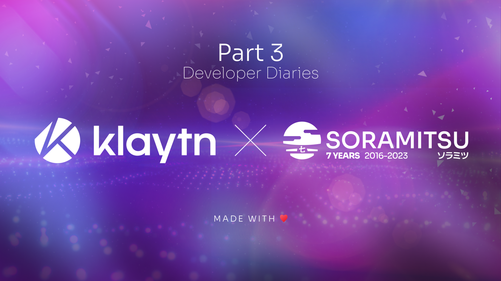

SORAMITSU Developer Diaries

PRESS RELEASE

SORAMITSU Co., Ltd. 
Shibuya-ku, Tokyo, Japan

[info@soramitsu.co.jp](mailto:info@soramitsu.co.jp) 
[soramitsu.co.jp](https://soramitsu.co.jp)

**FOR IMMEDIATE RELEASE 
**Tuesday, June 06, 2023 

# SORAMITSU Developer Diaries

## → The Importance of a Decentralized Exchange in the Klaytn Ecosystem

**Executive Summary** 
 

* In web3 games, DEXs can help players monetize their in-game assets and earn cryptocurrency rewards.

**GameFi** 
 
**Game integration** 
 
GameFi is seen as a natural evolution of the gaming industry, which focuses on creating engaging and rewarding experiences for players. By integrating blockchain and DeFi protocols into the gaming experience, GameFi is creating a new category of games that offer players the opportunity to earn real-world rewards while enjoying their favorite games or be able to trade, earn and sell in-game assets, thus monetizing on their time and effort (_grind_) 
 
The integration of a DEX into web3 games can offer several benefits for game developers and players alike. Here are some possible ways that this integration could take place: 
 

* **Game asset trading**: Players could trade their in-game assets on a DEX, allowing them to monetize their gaming achievements and earn cryptocurrency for their efforts.
* **Liquidity provision**: Game developers could deposit a portion of their in-game asset in a pool on the DEX, creating liquidity and allowing players to easily trade their assets without needing to leave the game.
* **Governance tokens**: Game developers could issue governance tokens that are distributed to players based on their in-game achievements. These tokens could then be used to vote on game development decisions or to earn a portion of the game's revenue.
* **Staking**: Players could stake their in-game assets in a DeFi protocol, such as a liquidity pool or yield farm, to earn additional rewards. These rewards could be in the form of cryptocurrency or in-game item

 
Overall, integrating web3 games and DEXs can create a more immersive and rewarding gaming experience for players while also promoting greater usage and adoption of decentralized finance protocols. As the gaming and DeFi industries continue to evolve and grow, we can expect to see more innovative ways of integrating these two sectors in the future. 
 
 
**To Conclude** 
 
DEX integration in Klaytn blockchain applications has the potential to drive greater adoption and usage of decentralized finance protocols. By providing users with greater control over their assets and enabling more efficient trading, DEXs help create a more decentralized and equitable financial ecosystem for all, while rewarding users for the time and effort invested. 
 
Thanks to decentralized finance offerings such as asset management, aggregators and IDO platforms, Web3 is helping users gain more financial independence and through GameFi, the amount of time and efforts invested in the "grind" can have tangible benefits for seasoned gamers. 
 
Dr. Sangmin Seo, Representative Director of Klaytn Foundation mentions: 

* * *

_The Klaytn Foundation is committed to providing robust technology infrastructure, with an emphasis on expanding relevant capabilities that achieve our goal of giving developers complete visibility into the possibilities within the Klaytn Ecosystem and beyond. The DEX Open-Source code has the potential to power a number of possibilities; and we're pleased with the work SORAMITSU has done to build, improve, and provide insights that enable developers and users to drive utility into the ecosystem._

 

Dr. Sangmin Seo

Representative Director of Klaytn Foundation

* * *

Andrew Wong, COO of SORAMITSU Group mentions about the open-source DEX:

* * *

 

**Andrew Wong**

COO of SORAMITSU Group

_We are extremely pleased to be working with the Klaytn Foundation, the governance counsel, developers, and community members to build, provide, and drive innovative possibilities. Open Source plays a key role in helping us transition towards a world powered by decentralized technologies. SORAMITSU providing the underlying infrastructure to enable developers to build and globally deliver intelligent use cases will open up new pathways to grow utility in a sustainable way._

* * *

Klaytn is currently at the forefront of blockchain technology and gaming, so the integration of decentralized finance is a step forward for gamers and creators, cementing their position in Web3 and revolutionizing the industries while at the same time fostering inclusion and opportunities for all of its users.

* * *

****About Klaytn****

[klaytn.foundation](https://klaytn.foundation/)

Klaytn is an open-source public blockchain designed for tomorrow's on-chain world. With the lowest latency amongst leading blockchains and a developer-friendly environment, Klaytn provides a seamless experience for developers and users alike. Since its launch in June 2019, Klaytn has grown to become South Korea's de-facto Web3 ecosystem and one of the largest in the world, with a user base of millions generating over a billion transactions to date across over 300 DApps. Find out more at [https://klaytn.foundation/](https://klaytn.foundation/)

**About SORAMITSU**

[soramitsu.co.jp](https://soramitsu.co.jp)

SORAMITSU is an award-winning global financial technology company with expertise in developing blockchain-based solutions for digital asset and identity management. Our mission is to use blockchain to promote innovation and solve pressing societal challenges. 
 
SORAMITSU is the developer of and major contributor to the open-source blockchain platform [Hyperledger Iroha](https://www.hyperledger.org/use/iroha), which is tailored for enterprise and public-sector use. Hyperledger Iroha, a project of Hyperledger Foundation, part of the Linux Foundation, has a permissions system that is scalable and performant. 

Utilizing blockchain, SORAMITSU has developed a digital currency for the [National Bank of Cambodia](https://soramitsu.co.jp/bakong-press-release), a CBDC Proof-of-Concept [with the Bank of the Lao PDR](https://soramitsu.co.jp/dlak-cbdc), a closed-loop payment system for the University of Aizu in Japan, an identity verification system prototype for Bank Central Asia in Indonesia, we were finalists in the [Monetary Authority of Singapore CBDC Challenge](https://soramitsu.co.jp/global-central-bank-digital-currency-challenge/), and are currently participating in Asia-Pacific's first proof-of-concept test of a cross-border, multi-currency security settlement system using distributed ledger technology with the Asian Development Bank. We have also conducted proof-of-concept tests for several major Japanese enterprises, and are active contributors to open source projects, such as [Klaytn](https://soramitsu.co.jp/klaytn-dex), South Korea's leading Layer-1 blockchain, [KAGOME](https://github.com/soramitsu/kagome), the C++ [Polkadot](https://polkadot.network/) Host implementation, the [SORA](https://sora.org/) crypto-economic system, the [Polkaswap](https://polkaswap.io/) DEX, and the DeFi wallet, [Fearless Wallet](https://fearlesswallet.io/). 
 
Based on these experiences, SORAMITSU aims to deploy cutting-edge technology on a global level in order to expedite financial inclusion and health, mitigate economic inefficiencies, and contribute to the fulfilment of the Sustainable Development Goals. 

* * *

SEE ALSO:

**SORAMITSU Developer Diaries** 
The Importance of a Decentralized Exchange in the Klaytn Ecosystem 

[

Learn more

](https://soramitsu.co.jp/klaytn-dev-diaries-2)

Follow SORAMITSU's [news and latest partnerships and developments here](https://soramitsu.co.jp/#news)_._ 

GET IN TOUCH AND FOLLOW:

* 
* 
* 
* 
* 

* * *
