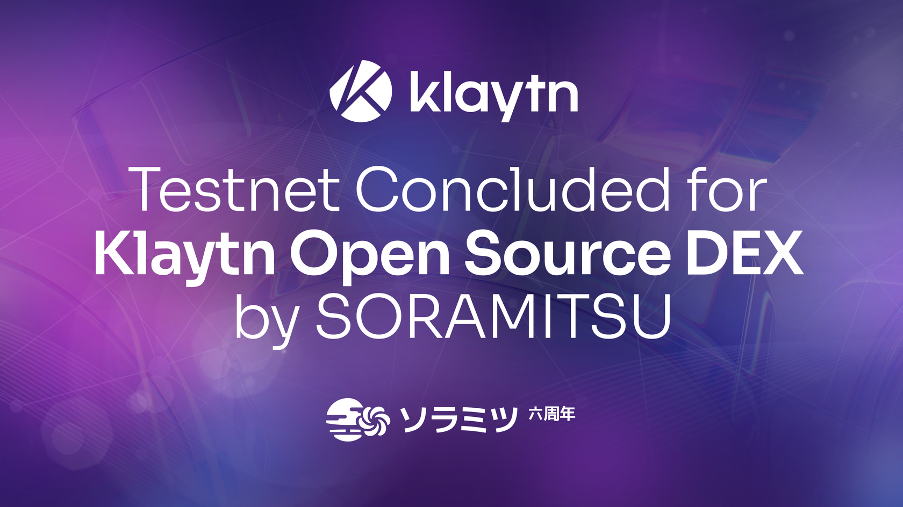
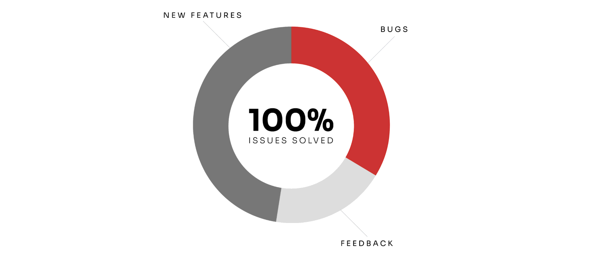

SORAMITSU and Klaytn Collaboration: Testnet for Open Source Decentralized Exchange Infrastructure Completed

PRESS RELEASE

SORAMITSU Co., Ltd. 
Shibuya-ku, Tokyo, Japan

[info@soramitsu.co.jp](mailto:info@soramitsu.co.jp) 
[soramitsu.co.jp](https://soramitsu.co.jp)

**FOR IMMEDIATE RELEASE 
**Thursday, February 02, 2023 

# SORAMITSU and Klaytn Collaboration: Testnet for Open Source Decentralized Exchange Infrastructure Completed

## → Klaytn’s trusted technology partner SORAMITSU has just concluded a successful testnet for the open-source DEX infrastructure built for the community.

The testnet for the SORAMITSU-built DEX infrastructure for the Klaytn network was successfully completed on the 20th of January 2023. The infrastructure, which was completed in [November 2022](https://soramitsu.co.jp/klaytn-dex), allows users to swap tokens, stake and provide liquidity, mint tokens, participate in decentralized governance, and monitor the exchange's activities through dashboards, with all these functionalities being open-source and decentralized. 
 
The Klaytn community was actively involved in the testnet, with [154 issues raised and resolved on Github](https://github.com/klaytn/klaytn-dex-frontend/issues?q=is%3Aissue+is%3Aclosed). Out of these, 52 were bugs, and 73 were new feature requests, which were addressed in a release on the 19th of December and the 11th of January. Additionally, some of the issues raised were in fact encouraging feedback from the Klaytn community, of which we are wholeheartedly grateful. 
 
The scope of the updates was compiled in a [changelog](https://github.com/klaytn/klaytn-dex-frontend/blob/dev/release/Klaytn%20Open-Source%20Dex%20Development%20Update%20Vol%201.md) that was then made available to the Klaytn community. 

Completing this DEX backbone is an accomplishment that cements SORAMITSU's status as a premier tech provider to the Klaytn network, and through the use of open-source and decentralized technologies, the network and its users benefit from robust, safe, and future-proof software, as well as a trustworthy liquidity hub for the Klaytn economy.

* * *

__The Klaytn ecosystem is known to be one of the world's most advanced blockchains; pushing the boundaries in the metaverse, gaming and creator economy. The conclusion of the DEX public testnet release marks a significant accomplishment for the SORAMITSU and Klaytn teams._ _My hope is that this can empower a new wave of potential operators and companies to start their Web3 journey on Klaytn. We look forward to_ _building future collaborations within the Klaytn ecosystem.__

 

Andrew Wong

COO, SORAMITSU Group 
 

* * *

 

Victor Vanichkov

Klaytn DEX Project Engineering Lead, SORAMITSU 

_Klaytn is a huge ecosystem with a big community. This advantage allowed us to successfully test the DEX with huge community interest._ _I would like to separately acknowledge the support granted to us by Klaytn Ecosystem members, the Klaytn team, and testnet participants._ _I believe that this kind of interaction will allow us to build new web3 technological solutions based on the Klaytn blockchain in the future._ 

* * *

_The successful testnet completion for our open-source DEX, built by our trusted partner SORAMITSU, is a testament to the strength and active participation of our community. Their valuable feedback, including 154 issues raised and resolved on Github, has played a crucial role in shaping and improving the functionality of this open-source and decentralized infrastructure. We are grateful for their engagement and look forward to continued cooperation to grow the Klaytn ecosystem._

 

Dr. Sangmin Seo

Representative Director, Klaytn Foundation 

**Interested in implementing the open-source DEX in your project? Read Klaytn's user guide on how to deploy a DEX [here](https://github.com/klaytn/klaytn-dex-frontend/blob/dev/docs/deploy.md) and access the open-source DEX code [here](https://github.com/klaytn/klaytn-dex-frontend).** 

* * *

**About Klaytn** 
 
Klaytn is a public blockchain focused on the metaverse, gamefi, and the creator economy. Officially launched in June 2019, it is the dominant blockchain platform in South Korea and is now undergoing global business expansion from its international base in Singapore, led by the Klaytn Foundation. 
 
Since unveiling its metaverse roadmap in early 2022, the Ethereum-equivalent L1 chain has seen many well-known companies come onboard its metaverse—including game developer and publishing powerhouses: Netmarble and Neowiz. It recently ramped up efforts to lay the foundation for the metaverse and to expand use cases. 
 
Find out more at [https://klaytn.foundation/](https://klaytn.foundation/) 
 
 
**About SORAMITSU** 
 
SORAMITSU is an award-winning global financial technology company with expertise in developing blockchain-based solutions for digital asset and identity management. Our mission is to use blockchain to promote innovation and solve pressing societal challenges. 
 
SORAMITSU is the developer of and major contributor to the open-source blockchain platform [Hyperledger Iroha](https://www.hyperledger.org/use/iroha), which is tailored for enterprise and public-sector use. Hyperledger Iroha, a project of Hyperledger Foundation, part of the Linux Foundation, has a permissions system that is scalable and performant. 
 
Utilizing blockchain, SORAMITSU has developed a digital currency for the [National Bank of Cambodia](https://soramitsu.co.jp/bakong-press-release), a closed-loop payment system for the University of Aizu in Japan, an identity verification system prototype for Bank Central Asia in Indonesia, we were finalists in the [Monetary Authority of Singapore CBDC Challenge](https://soramitsu.co.jp/global-central-bank-digital-currency-challenge/), and are currently participating in Asia-Pacific's first proof-of-concept test of a cross-border, multi-currency security settlement system using distributed ledger technology with the Asian Development Bank. We have also conducted proof-of-concept tests for several major Japanese enterprises, and are active contributors to open-source projects, such as [KAGOME](https://github.com/soramitsu/kagome), the C++ Polkadot Host implementation, the [SORA cryptoeconomic system](https://sora.org/), the Polkaswap DEX, and the DeFi wallet, Fearless Wallet. 
 
Based on these experiences, SORAMITSU aims to deploy cutting-edge technology on a global level in order to expedite financial inclusion and health, mitigate economic inefficiencies, and contribute to the fulfillment of the Sustainable Development Goals.
