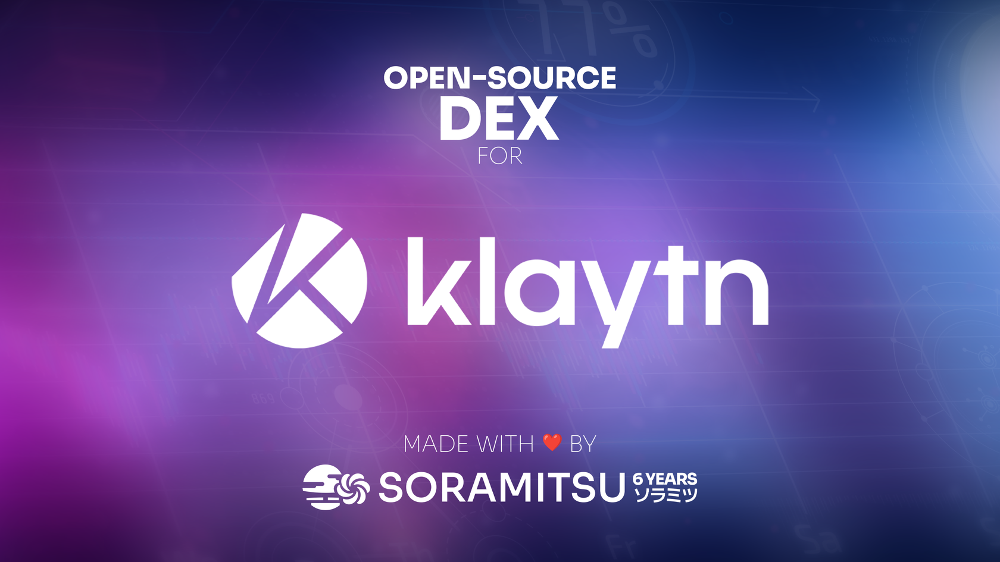

Klaytn Open Source DEX by SORAMITSU

PRESS RELEASE

SORAMITSU Co., Ltd. 
Shibuya-ku, Tokyo, Japan

[info@soramitsu.co.jp](mailto:info@soramitsu.co.jp) 
[soramitsu.co.jp](https://soramitsu.co.jp)

**FOR IMMEDIATE RELEASE 
**Tuesday, November 29, 2022 

# Klaytn Open Source DEX by SORAMITSU

## → SORAMITSU and Klaytn Collaboration: Development of Open Source Decentralized Exchange Infrastructure Completed.

**Further strengthening SORAMITSU's place as a trusted technology partner to the Klaytn network, development on the open-source decentralized exchange infrastructure is complete and will be available for users to test. 
** 

As a follow-up to the [release in March this year](https://soramitsu.co.jp/soramitsu-klaytn), where the development of the open-source DEX infrastructure was presented, it is our pleasure to announce that the open-source DEX infrastructure is complete. The open-source release, proposed to the [Klaytn Improvement Reserve](https://kir.klaytn.foundation/t/the-13th-kir-open-source-decentralized-exchange-project-proposal-by-soramitsu/420), is a great addition to the Klaytn network as it will empower decentralization and help keep the network at the forefront of technological developments. 
 
The SORAMITSU-developed open-source DEX infrastructure progress was documented in milestones presented to the Klaytn community through the [KIR](https://kir.klaytn.foundation/). The DEX backbone will be available for a dex operator to implement tokenomics and provide liquidity. The DEX will initially feature fungible token swapping, staking and liquidity provision, token-based governance, and token minting. There will also be dashboards to monitor the dex, providing valuable information to Klaytn network users. Additionally, the DEX infrastructure will be available for [public testing](https://dex.baobab.klaytn.net) from November 29th, 2022 till January 20th, 2023. 

* * *

 

Victor Vanichkov

Klaytn DEX Project Engineering Lead, SORAMITSU Group

_"_Open-source is a game changer in the software development industry. Web3 is a technology that revolutionized the 21st century. We combined best practices from both of them into the Klaytn-DEX project — the first open-source DEX in the Klaytn ecosystem._"_ 

* * *

_"_We couldn't be more proud to partner with the Klaytn Community to advance their ongoing globalization effort. Our focus on building for the long term, together with our unique combination of assets, technology, and people, will enable both SORAMITSU and Klaytn to achieve our shared vision for a decentralized tomorrow._"_

 

Andrew Wong

COO, SORAMITSU Group

* * *

 

Sangmin Seo

Chief Klaytn Officer, Krust Universe 
Director, Klaytn Foundation

_"_We are pleased with the progress made on the Open Source DEX by SORAMITSU. This is a significant milestone and a testament to providing our ecosystem possibilities that create further interoperability, and decentralization within the Klaytn Metaverse_."_ 

* * *

* The [decentralized exchange infrastructure is available here](https://dex.baobab.klaytn.net/).
* The [testnet user guide](https://github.com/klaytn/klaytn-dex-frontend/blob/dev/docs/guide.md) and [tutorial video](https://youtu.be/CtxpSEXyOQM) will get you started
* Please use this feedback form to report about any issues or unexpected experience encountered with the Klaytn testnet DEX: [https://github.com/klaytn/klaytn-dex-frontend/issues/new/choose](https://github.com/klaytn/klaytn-dex-frontend/issues/new/choose) 
 
 On behalf of the #SORAMITSU team, thank you for your support. ⛩️

**About Klaytn 
** 
Klaytn is a global public blockchain platform developed by Ground X, the blockchain subsidiary of the leading South Korean Internet company, Kakao. Klaytn is a service-centric blockchain platform providing an intuitive development environment and friendly end-user experience. It is built upon solid reliability and significant stability with substantial service development for mass adoption. The platform allows real-world applications of large scale to be produced right away so that our end-users can make full use of services without much expertise in blockchain or cryptocurrency. Learn more about Klaytn [on their website](https://klaytn.com/). 

**About SORAMITSU** 
 
SORAMITSU is an award-winning global financial technology company with expertise in developing blockchain-based solutions for digital asset and identity management. Our mission is to use blockchain to promote innovation and solve pressing societal challenges. 
 
SORAMITSU is the developer of and major contributor to the open-source blockchain platform [Hyperledger Iroha](https://www.hyperledger.org/use/iroha), which is tailored for enterprise and public-sector use. Part of the Linux Foundation's Hyperledger Project, the Iroha blockchain's flexible permissions system and scalable, performant architecture suit it to digital asset and identity management in high-traffic, multi-stakeholder environments. 
 
Utilizing blockchain, SORAMITSU has developed a digital currency for the [National Bank of Cambodia](https://soramitsu.co.jp/bakong-press-release), a closed-loop payment system for the University of Aizu in Japan, an identity verification system prototype for Bank Central Asia in Indonesia, we were finalists in the [Monetary Authority of Singapore CBDC Challenge](https://soramitsu.co.jp/global-central-bank-digital-currency-challenge/), and are currently participating in Asia-Pacific's first proof-of-concept test of a cross-border, multi-currency security settlement system using distributed ledger technology with the Asian Development Bank. We have also conducted proof-of-concept tests for several major Japanese enterprises, and are active contributors to open source projects, such as [KAGOME](https://github.com/soramitsu/kagome), the C++ Polkadot Host implementation, the [SORA](https://sora.org/) cryptoeconomic system, the [Polkaswap](https://polkaswap.io) DEX, and the DeFi wallet, [Fearless Wallet](https://fearlesswallet.io). 
 
Based on these experiences, SORAMITSU aims to deploy cutting-edge technology on a global level in order to expedite financial inclusion and health, mitigate economic inefficiencies, and contribute to the fulfillment of the Sustainable Development Goals. 

* * *
