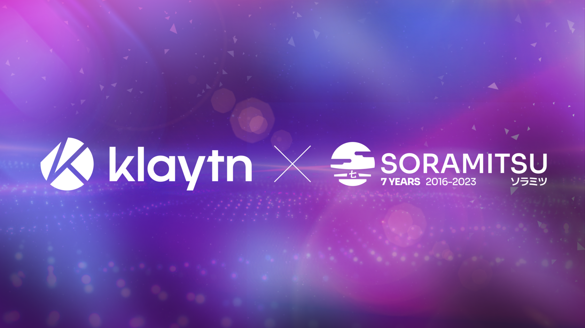

SORAMITSU Success Stories: The Working Partnership with the Klaytn Foundation

PRESS RELEASE

SORAMITSU Co., Ltd. 
Shibuya-ku, Tokyo, Japan

[info@soramitsu.co.jp](mailto:info@soramitsu.co.jp) 
[soramitsu.co.jp](https://soramitsu.co.jp)

**FOR IMMEDIATE RELEASE 
**Thursday, April 06, 2023 

# SORAMITSU Success Stories: The Working Partnership with the Klaytn Foundation

## → After concluding the development of an open-source decentralized exchange backbone for the Klaytn network, we reflect on the experience of working with Klaytn’s governance to build for the community.

In February 2023, we [announced the successful conclusion of the decentralized exchange](https://soramitsu.co.jp/klaytn-dex-testnet-completed) testnet. The entire Klaytn community rallied around the effort of helping us test the recently built infrastructure and its features, as well as letting us know what improvements they want to see added. All the community support and feedback led to us [providing another release](https://github.com/soramitsu/klaytn-dex-frontend/blob/master/release/Klaytn%20Open-Source%20Dex%20Development%20Update%20Vol%201.md) that addressed the community's findings and polished some features. 
 
All of this would not have been possible without the support of the Klaytn Foundation and the Klaytn Governance Council, who worked with us every step of the way to design and implement infrastructure that was needed by the community, which helps foster decentralization and inclusivity in the network. The foundation's attention and support toward organizing working sessions and proposal reviews are unmatched in the Web3 space, and the care they put into ensuring the community receives the best possible infrastructure and works with the best teams to provide it is exemplary of the space. 
 
 
**SORAMITSU as a Trusted Technology Partner** 
 
Given the current market conditions, community-run treasuries are finding it more difficult to fund projects that will increase the network's value, partly because of the elevated cost to develop and the lack of trust in technology providers. Although taking the money and running is a fringe case that is less prevalent in the blockchain ecosystem, other factors such as keeping to deadlines, which may seem like a simple enough concept, can make or break the outcomes of these projects. And while there are milestones and reports involved, in many cases they fail to materialize. 
 
SORAMITSU earned the trust of the Klaytn Foundation and the community through hard work and dedication, as well as a commitment to fulfilling the deadlines set during the proposal phases of the project. We are proud to say that during the entire development process, all the deadlines were met and the reports were duly submitted for community scrutiny. This achievement, along with the value alignment between SORAMITSU and Klaytn, made for a successful project and most importantly, helped achieve trust from the community, which, in the current environment, is extremely difficult to build. 
 
 
**Working with the Best in the Ecosystem** 
 
The Klaytn ecosystem is extremely robust and well-positioned. They work with the best technology providers across the board, and we are proud to be included in this list. Working with other world-class companies, to ensure that everything built is up to the network's standards and most importantly, safe enough to support the staggering amount of transactions made on a daily basis requires every line of code to be audited. 
 
Our experience collaborating with a Klaytn ecosystem auditor such as [Quantstamp](https://quantstamp.com/) helped us appreciate the dedication to community safety that is constantly worked toward achieving. 

“

_Klaytn is a technically advanced blockchain with big support for new projects, ranging from infrastructure to funding. It has a very developer-friendly community, which is oriented toward the principles of decentralization and open-source development. I am very glad that our vision for future evolutions is aligned to Klaytn's and based on Web3 ideals._

**Viktor Vanichkov,** SORAMITSU Engineering Lead in the Klaytn Ecosystem expressed about the collaboration

“

_The Klaytn Community is composed of the most judicious, innovative, and remarkable individuals in the Web3 ecosystem. They inspire us individually and as a company to be the best versions of ourselves. It is a daunting task, but we remain driven and singular in our mission to strengthen the Klaytn Ecosystem's utility and advance the merits and benefits of decentralized technologies. The current times demand it of us, and we will rise to that occasion every day._

**[Andrew Wong](https://www.linkedin.com/in/andrew-o-wong-2ab209/),** COO of SORAMITSU Group

**To Conclude** 
 
At SORAMITSU we strive to develop blockchain software based on the values of decentralization and with the purpose of leaving our mark on the improvement of humanity. With over a hundred years of experience in the areas of blockchain, finance, economics and design, we pioneer technologies that will foster inclusivity, promote innovation and ultimately, improve people's quality of life. With those values in mind, working with the Klaytn network was a great experience that helped us advance in our mission, and we look forward to future developments. 

* * *

**About SORAMITSU**

[soramitsu.co.jp](https://soramitsu.co.jp)

SORAMITSU is an award-winning global financial technology company with expertise in developing blockchain-based solutions for digital asset and identity management. Our mission is to use blockchain to promote innovation and solve pressing societal challenges. 
 
SORAMITSU is the developer of and major contributor to the open-source blockchain platform [Hyperledger Iroha](https://www.hyperledger.org/use/iroha), which is tailored for enterprise and public-sector use. Hyperledger Iroha, a project of Hyperledger Foundation, part of the Linux Foundation, has a permissions system that is scalable and performant. 

Utilizing blockchain, SORAMITSU has developed a digital currency for the [National Bank of Cambodia](https://soramitsu.co.jp/bakong-press-release), a CBDC Proof-of-Concept [with the Bank of the Lao PDR](https://soramitsu.co.jp/dlak-cbdc), a closed-loop payment system for the University of Aizu in Japan, an identity verification system prototype for Bank Central Asia in Indonesia, we were finalists in the [Monetary Authority of Singapore CBDC Challenge](https://soramitsu.co.jp/global-central-bank-digital-currency-challenge/), and are currently participating in Asia-Pacific's first proof-of-concept test of a cross-border, multi-currency security settlement system using distributed ledger technology with the Asian Development Bank. We have also conducted proof-of-concept tests for several major Japanese enterprises, and are active contributors to open source projects, such as [Klaytn](https://soramitsu.co.jp/klaytn-dex), South Korea's leading Layer-1 blockchain, [KAGOME](https://github.com/soramitsu/kagome), the C++ [Polkadot](https://polkadot.network/) Host implementation, the [SORA](https://sora.org/) crypto-economic system, the [Polkaswap](https://polkaswap.io/) DEX, and the DeFi wallet, [Fearless Wallet](https://fearlesswallet.io/). 
 
Based on these experiences, SORAMITSU aims to deploy cutting-edge technology on a global level in order to expedite financial inclusion and health, mitigate economic inefficiencies, and contribute to the fulfilment of the Sustainable Development Goals. 

* * *

SEE ALSO:

**Supporting the Asian Fintech Momentum Through Central Bank Digital Assets and Digital Risk Management** 
As the West lags behind with innovation and policy, Asian countries such as Cambodia and Lao PDR place themselves at the forefront of implementing blockchain-based financial technologies. 

[

Learn more

](https://soramitsu.co.jp/asia-fintech)

Follow SORAMITSU's [news and latest partnerships and developments here](https://soramitsu.co.jp/#news)_._ 

GET IN TOUCH AND FOLLOW:

* * *
