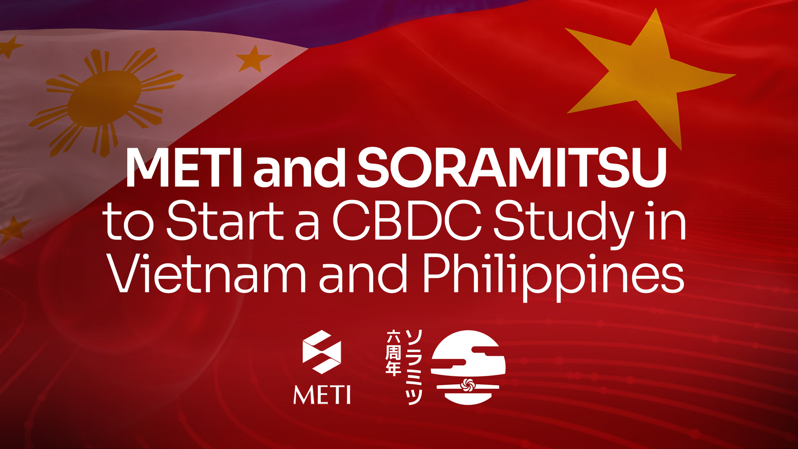

Japanese Ministry of Economy, Trade and Industry to initiate CBDC research with SORAMITSU in Vietnam, Fiji, and the Philippines

PRESS RELEASE

SORAMITSU Co., Ltd. 
Shibuya-ku, Tokyo, Japan

[info@soramitsu.co.jp](mailto:info@soramitsu.co.jp) 
[soramitsu.co.jp](https://soramitsu.co.jp)

**FOR IMMEDIATE RELEASE 
**Tuesday, June 21, 2022 

# Japanese Ministry of Economy, Trade and Industry to initiate CBDC research with SORAMITSU in Vietnam, Fiji, and the Philippines

## → SORAMITSU Co., Ltd. (President: Kazumasa Miyazawa; Head Office: Shibuya-ku, Tokyo; hereinafter referred to as "SORAMITSU") has been selected by the Japanese Ministry of Economy, Trade and Industry (METI) for the FY2022 Feasibility Study Project for Overseas Development of High Quality Infrastructure and Energy Infrastructure.

Japanese Ministry of Economy, Trade and Industry to initiate CBDC research with SORAMITSU in Vietnam, Fiji, and the Philippines

Following up on our ongoing work in Cambodia and Laos, SORAMITSU will conduct a feasibility study on the introduction of central bank digital currencies (CBDCs) across the Asia Pacific region. Specifically, we will work together with the central banks in Vietnam, Fiji, the Philippines, and other countries to survey stakeholder needs and assess the prospects for introducing CBDC. 
 
In Cambodia, a digital currency has already been introduced, whereas in Laos, a feasibility study on the introduction of CBDC is currently underway in partnership with the Japan International Cooperation Agency (JICA). Drawing on expertise gained in Cambodia and Laos, the present study will expand the scope of knowledge on CBDC drivers, barriers, and relevant socioeconomic conditions in a wider range of target countries. 

**Cambodia's Bakong System: A Best Practice With International Relevance 
 
**In 2018, SORAMITSU began work with the National Bank of Cambodia on Bakong, a digital currency and backbone payment infrastructure based on Hyperledger Iroha, an open-source distributed ledger technology (i.e., blockchain) which we developed. Bakong was piloted in 2019 and brought into use nationwide in 2020. Currently, Bakong is used to process both wholesale payments (large interbank transfers) and retail payments between everyday consumers and businesses. According to the National Bank of Cambodia, as of November 2021, around 7.9 million people had participated in Bakong transactions – meaning that in the year since Bakong's launch, it has been used by nearly half of the Cambodian population (16.7 million). 
 
Additionally, more than 270,000 previously unbanked or underbanked rural Cambodians have opened Bakong accounts, enabling them to send and receive payments instantly and at no cost. Bakong has also enabled the streamlining of cross-border financial infrastructure with neighbouring countries Malaysia and Thailand, reducing the fees and hassles associated with traditional international remittances. These achievements establish Bakong as a significant validation of the capacity of digital currencies to improve economic efficiency, boost financial inclusion, and reduce burdens on vulnerable populations such as migrants. 

**Extending Expertise From Cambodia to the APEC Region — By Way of Japan 
** 
In 2021, on the basis of our experience in Cambodia, SORAMITSU was selected by Japan International Cooperation Agency to lead a study in Laos on the feasibility and potential systemic benefits of introducing a CBDC using a Bakong-like architecture. In active cooperation with the Bank of the Lao P.D.R., we are making steady progress in our research on the state of banking and microfinance in the country, as well as on the current state of financial infrastructure and strategies for improving it. The central bank has expressed particular interest in the use of blockchain and other advanced financial technologies in which SORAMITSU has expertise, and has formed a project team to explore pathways to introducing a CBDC. 
 
We are honoured to announce that our APEC CBDC research has recently been selected by the Japanese Ministry of Economy, Trade and Industry (METI) for extension under its FY2022 Feasibility Study Project for Overseas Development of High-Quality Infrastructure and Energy Infrastructure. Working from a basis of technological expertise and concrete implementation experience, we will approach central banks and financial authorities in Vietnam, Fiji, the Philippines, and other Asia Pacific countries to investigate financial infrastructural conditions, socioeconomic and policy needs, and the capacity of CBDC to address such needs. In cases which are assessed as high-potential, additional research will delve into the technical feasibility and potential socioeconomic impacts of specific CBDC models. 

**About SORAMITSU 
 
**SORAMITSU is a Japanese fintech company with expertise in developing blockchain-based solutions for digital asset and identity management. Our mission is to use blockchain to promote innovation to solve pressing societal challenges. 
 
SORAMITSU is the developer of and major contributor to the open-source blockchain platform [Hyperledger Iroha](https://www.hyperledger.org/use/iroha), which is tailored for enterprise and public-sector use. Part of the Linux Foundation's Hyperledger Project, the Iroha blockchain's flexible permissions system and scalable, performant architecture suit it to digital asset and identity management in high-traffic, multi-stakeholder environments. 
 
Utilizing blockchain, SORAMITSU has developed a digital currency for the [National Bank of Cambodia](https://soramitsu.co.jp/bakong-press-release), a securities custody transfer system prototype for the Moscow Stock Exchange Group, a closed-loop payment system for the University of Aizu in Japan, and an identity verification system prototype for Bank Central Asia in Indonesia. We have also conducted proof-of-concept tests for several major Japanese enterprises, and are active contributors to open source projects, such as the [SORA cryptoeconomic system](https://sora.org/), the Polkaswap DEX, and the DeFi wallet, Fearless Wallet. 
 
Based on these experiences, SORAMITSU aims to deploy cutting-edge technology on a global level in order to expedite financial inclusion and health, mitigate economic inefficiencies, and contribute to economic growth and development 

Press Enquiries 
Press Contact: Kazumasa Miyazawa, President 
Email: [press@soramitsu.co.jp](mailto:press@soramitsu.co.jp) 
 
Soramitsu Co., Ltd. 
Link Square Shinjuku 16F, 5-27-5 Sendagaya, 
Shibuya-ku, Tokyo, JAPAN 150-0001 
TEL: 050-5526-4670 
[https://soramitsu.co.jp](https://soramitsu.co.jp/ja)

* * *
