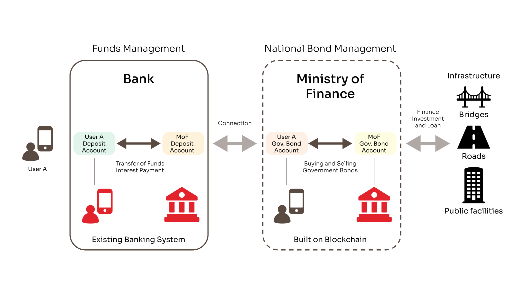

SORAMITSU Initiates Development of Palau’s Blockchain-Based Savings Bond System and Papua New Guinea's CBDC PoC

PRESS RELEASE

SORAMITSU Co., Ltd. 
Shibuya-ku, Tokyo, Japan

[info@soramitsu.co.jp](mailto:info@soramitsu.co.jp) 
[soramitsu.co.jp](https://soramitsu.co.jp)

**FOR IMMEDIATE RELEASE** 
Tuesday, July 16, 2024

# SORAMITSU Initiates Development of Palau’s Blockchain-Based Savings Bond System and Papua New Guinea's CBDC Proof-of-Concept

## → As Part of METI Japan’s "Global South Future-Oriented Co-Creation Project"

SORAMITSU has been selected for a project under the Government of Japan's Ministry of Economy, Trade and Industry’s 2023 supplementary budget entitled “Subsidy for Global South Future-Oriented Co-Creation Projects (Indirect Subsidy Project Related to the Survey on the Overseas Deployment of Infrastructure by Japanese Companies).”

Following successful initiatives in Cambodia, Laos, the Solomon Islands, and Fiji, SORAMITSU will develop and commence a **system to issue, manage, and operate savings bonds using blockchain in Palau**, an Asia-Pacific island country.

In addition to the work in Palau, SORAMITSU will also work with the **Central Bank of Papua New Guinea to conduct a central bank digital currency (CBDC) proof-of-concept** and aim to build a common platform for across the Pacific Island region using SORAMITSU’s blockchain technology.

In Cambodia, SORAMITSU has already implemented a payment system using blockchain technology. At the same time, in Lao PDR, SORAMITSU conducted a preliminary survey and a proof of concept for CBDC with the support of the Japan International Cooperation Agency (JICA). Last year, SORAMITSU conducted research to enhance financial systems and improve cross-border payments by introducing CBDCs in Vietnam, Indonesia, Fiji, and the Solomon Islands. In addition, the [CBDC PoC in the Solomon Islands](https://soramitsu.co.jp/bokolo-cash) was well-received.

SORAMITSU, at the request of the Ministry of Finance of Palau, will develop and commence a savings bond system and its application using [Hyperledger Iroha](https://www.hyperledger.org/projects/iroha) blockchain technology. Although US dollars are the circulating currency in Palau, and banks in the US (such as those in Hawaii and Guam) absorb residents' funds as deposits, these funds are utilized in the mainland US rather than for economic growth or infrastructure in Palau. To address this issue, the Palauan Ministry of Finance plans to issue savings bonds to diversify methods of national finance and to use the absorbed funds for economic growth and infrastructure investments like bridges, roads, and public facilities, with the support of SORAMITSU's technology.

The benefits of using blockchain to construct a savings bond issuance and management system are: 
 

1. Prevention of counterfeiting, tampering, and impersonation, leading to enhanced security.
2. In the future, introducing technologies such as CBDCs (including those potentially issued in the mainland US) using blockchain could make the purchase and sale of savings bonds more efficient through smart contracts and other technologies.
3. Reduction in the savings bond issuance management system's construction, operational costs, and fees.

Palau Blockchain Savings Bond Issuance Management System

* * *

SORAMITSU will also conduct a CBDC proof-of-concept in Papua New Guinea at the central bank's request. Financial inclusion remains a significant challenge in the country, where some areas are plagued by instability, violence, and frequent occurrences of robberies and muggings. SORAMITSU is exploring digital technologies that will allow recovery of funds after such incidents using blockchain technology to address these issues.

Moreover, as the Pacific Island nations each have relatively small populations and economies, the burden of introducing and maintaining infrastructure for IT systems is significant. Therefore, SORAMITSU is aiming to develop an architecture that allows for a more cost-effective and efficient introduction of financial instruments like CBDCs and savings bonds by constructing a common platform using secure, permissionless blockchain technology, powered by Hyperledger Iroha.

Working together with the National Bank of Cambodia, SORAMITSU helped develop the payment system Bakong, [operational since October 2020 in Cambodia](https://soramitsu.co.jp/bakong-press-release). Bakong is being used for both wholesale transactions among major banks and retail payments for daily transfers and payments by citizens and businesses. According to the National Bank of Cambodia, by the end of December 2023, Bakong had reached approximately 10.9 million users, spreading to about two-thirds of the population (16.7 million) in just three years. The total payments processed through Bakong in 2023 were approximately $23 billion, equivalent to 74% of Cambodia’s GDP that year.

Moreover, in rural areas, over 50% of residents use Bakong, allowing them to make payments and transfers immediately and inexpensively, contributing significantly to financial inclusion. Cash that was dormant in rural areas has been turned into bank deposits through Bakong, revitalizing the economy by being utilized for infrastructure and financing for small and medium-sized enterprises.

In countries around Cambodia such as Thailand, Vietnam, and Laos, the Bakong app is linked to their domestic payment systems so users can scan QR codes to make instant, cross-border payments and transfers, significantly reducing the fees and time associated with traditional international remittances.

Taken together, SORAMITSU continues to create and deploy next-generation financial infrastructure that will lay the foundation for the future of the global financial system.

* * *

**About SORAMITSU**

[soramitsu.co.jp](https://soramitsu.co.jp)

SORAMITSU is an award-winning global financial technology company with expertise in developing blockchain-based solutions for digital asset and identity management. Our mission is to use blockchain to promote innovation and solve pressing societal challenges. 

Utilising blockchain, SORAMITSU has developed a digital currency infrastructure backbone for the [National Bank of Cambodia](https://soramitsu.co.jp/bakong-press-release), a CBDC Proof-of-Concept [with the Bank of the Lao PDR](https://soramitsu.co.jp/dlak-cbdc) and [with the Central Bank of Solomon Islands](https://soramitsu.co.jp/bokolo-cash), a closed-loop [payment system for the University of Aizu](https://soramitsu.co.jp/byacco) in Japan, an identity verification system prototype for Bank Central Asia in Indonesia, shortlisted in the [Monetary Authority of Singapore CBDC Challenge](https://soramitsu.co.jp/global-central-bank-digital-currency-challenge/), participated in Asia-Pacific's first proof-of-concept test of a cross-border multi-currency security settlement system using distributed ledger technology with the Asian Development Bank, and in collaboration with the Risk Assurance Group and Orillion Solutions developed the technology core of the [Fraud Intelligence Blockchain](https://fraudintelligencelimited.com/). 
 
SORAMITSU is an active contributor to many open source projects, such as [Klaytn](https://soramitsu.co.jp/klaytn-dex), South Korea's leading Layer-1 blockchain, [KAGOME](https://github.com/soramitsu/kagome), the C++ [Polkadot](https://polkadot.network/) Host implementation, the [SORA](https://sora.org/) crypto-economic system, the [Polkaswap](https://polkaswap.io/) DEX, and the DeFi wallet, [Fearless Wallet](https://fearlesswallet.io/). SORAMITSU also collaborated with Filecoin to develop FUHON, a C++ implementation of their protocol. In addition, SORAMITSU is the developer of and major contributor to the open-source blockchain platform [Hyperledger Iroha](https://www.hyperledger.org/use/iroha), a project of Hyperledger Foundation, part of the Linux Foundation, tailored for enterprise and public-sector use. As founding contributors to the Hyperledger Project and cooperation partners of the Web3 Foundation, SORAMITSU is building the digital infrastructure of the future. 
 
Based on these experiences, SORAMITSU aims to deploy cutting-edge technology on a global scale in order to expedite financial inclusion and health, mitigate economic inefficiencies, and contribute to the fulfilment of the Sustainable Development Goals.

* * *

SEE ALSO:

**Celebrating 8 Years of SORAMITSU** 
SORAMITSU Celebrates 8 Years of Creating a Better World Through Decentralised Technologies. 

[Learn more](https://soramitsu.co.jp/eight-years)

**Central Bank of Solomon Islands Collaborates with Soramitsu on CBDC PoC Project** 
The Central Bank of Solomon Islands (CBSI) and Soramitsu have begun a Proof-of-Concept (PoC) for a Central Bank Digital Currency (CBDC).

[Learn more](https://soramitsu.co.jp/bokolo-cash)

Follow SORAMITSU's [news and latest partnerships and developments here](https://soramitsu.co.jp/#news)_._ 

GET IN TOUCH AND FOLLOW:

* 
* 
* 
* 
* 

* * *

[Japan Blockchain 
Association](http://www.jba-web.jp)

[Global Blockchain 
Business Council](https://gbbcouncil.org)

[LF Decentralized Trust](https://www.lfdecentralizedtrust.org/)

[Fintech association of Japan](http://www.fintechjapan.org)

Proud member of:
