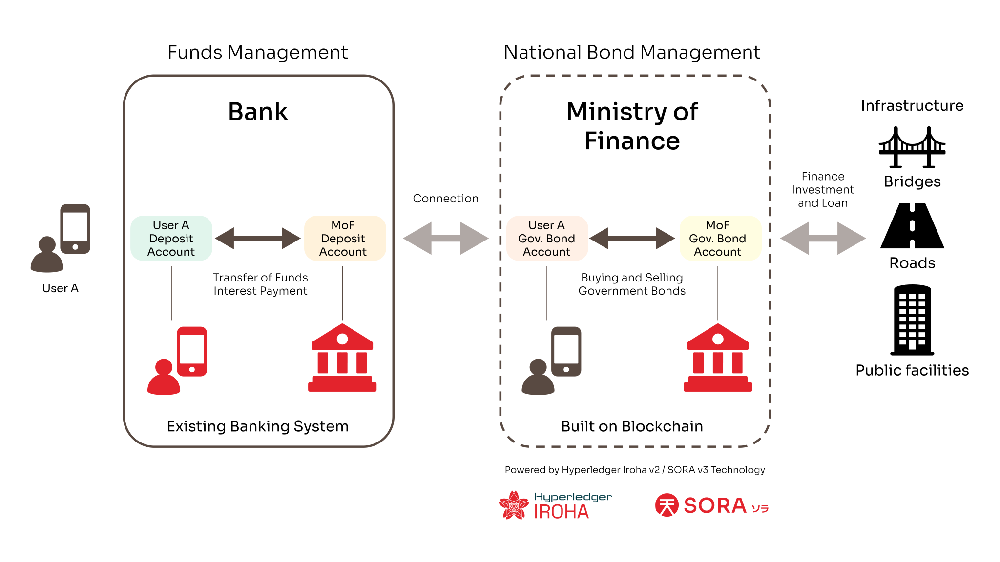

Palau Launches Blockchain-Based Savings Bonds Prototype System with Soramitsu, Supported by Japan’s METI and the Palauan Government

PRESS RELEASE

Soramitsu Co., Ltd. 
Shibuya-ku, Tokyo, Japan

[info@soramitsu.co.jp](mailto:info@soramitsu.co.jp) 
[soramitsu.co.jp](https://soramitsu.co.jp)

**FOR IMMEDIATE RELEASE** 
Monday, Ocotber 7, 2024

# Palau Launches Blockchain-Based Savings Bonds Prototype System with Soramitsu, Supported by Japan’s METI and the Palauan Government

## → In collaboration with Soramitsu and Japan’s Ministry of Economy, Trade, and Industry (METI), the Government of Palau has officially launched a blockchain-based savings bond prototype system named Palau Invest, marking a significant step in proactively securing the country’s financial future.

[METI](https://www.meti.go.jp/english/index.html)’s "Global South Future-Oriented Co-Creation Project" sponsored this initiative, showcasing Japan's commitment to empowering emerging economies through cutting-edge Japanese technology.

Investing in Palau, For Palau, and By Palau

Digital savings bonds give Palauan citizens a simple way to invest in their own country while earning yield from the benefits of those investments. Funds raised through the bonds will be used to fuel activities including national infrastructure projects such as bridges, roads, and public facilities, ultimately benefiting Palau’s economic growth, which will lead to many trickle-down effects that will benefit all Palauans.

**Surangel Whipps Jr.** 
 
H.E. President of Palau, at the Palau Invest launch ceremony in Palau on September 30th, which was held in conjunction with Palau’s 30th Independence Day celebrations

_“The significance of this moment extends beyond the creation of a new financial product and digital platform. The savings bonds initiative enables us to fund key projects – such as housing, SME development, roads, and other essential services – with capital sourced domestically. These projects are not just critical to infrastructure, but they also generate spillover effects that ripple throughout and within our local economy. By investing in these areas, we stimulate job creation, enhance business opportunities, and foster a more vibrant economic environment. This initiative represents a broader effort by Palau to take greater control of its financial future – one where we determine the direction of our development and invest directly in our nation’s growth.,”_ said H.E. President Surangel Whipps Jr.

**Kaleb Udui Jr.** 
 
Minister of Finance of Palau, at the Palau Invest launch ceremony in Palau on September 30th, which was held in conjunction with Palau’s 30th Independence Day celebrations

Minister of Finance Kaleb Udui Jr., states _“Today’s launch marks an important milestone in the Ministry’s broader effort to promote financial inclusion and innovation. One of our goals at the Ministry of Finance has always been to expand access to different financial tools and empower more citizens to invest in our nation’s development. This digital savings bonds platform is part of a larger initiative that includes ongoing efforts in strengthening our financial systems and improving access to investment opportunities for every Palauan.”_

**Public Demonstration Phase Before Bond Issuance**

The savings bond prototype system is complete, and a public demonstration system has been launched, so the people of Palau can learn about the system and educate themselves before bonds are issued by the Ministry of Finance of Palau. Once the bond issuance criteria are finalized by the Ministry of Finance and approved by the Government of Palau, the digital savings bonds will be issued and any Palauan citizen will be able to buy them from the comfort of their phone via a mobile app.

**Blockchain Application to Improve Financial Landscape**

This project operates on [SORA](https://sora.org/) v3 Hub Chain’s Hyperledger [Iroha 2](https://iroha.tech/)\-based network, an open source blockchain platform that uses the latest technology to make it easy to program decentralized apps that are fast and highly preformant. Hyperledger Iroha 2’s innovative technology is best in class and is more than capable of processing the transactional needs of everyone in Palau, and by using the SORA v3 Hub Chain platform, Palau can issue blockchain-based bonds without spending significant costs to run the infrastructure.

**Global Significance and Future Prospects**

Beyond Palau, Soramitsu has successfully deployed blockchain-based financial systems across the Asia-Pacific region, including successful CBDC initiatives in Cambodia, Laos, and the Solomon Islands; the Hyperledger Iroha-powered Bakong CBDC, in particular, processes more than USD $300 million daily. These projects are part of a broader vision to build a shared financial platform across Pacific Island nations, enabling easier access to modern financial services at reduced costs through blockchain technology.

**Dr. Makoto Takemiya** 
 
Group CEO and Co-Founder of Soramitsu, at the Palau Invest launch ceremony in Palau on September 30th, which was held in conjunction with Palau’s 30th Independence Day celebrations

_"At Soramitsu, our mission has always been to leverage cutting-edge blockchain technology to create meaningful change in the world’s financial systems. The Palau Blockchain-Based Savings Bond project is a testament to how we can apply decentralized technology to bring efficiency, security, and transparency to national economies. By working closely with the Ministry of Finance of Palau and Japan’s METI, we are revolutionizing how nations manage their finances and taking significant steps toward improving financial accessibility and promoting the well-being of citizens. This project showcases Soramitsu’s commitment to driving innovation that fosters economic growth and social progress for the global community."_ — Dr. Makoto Takemiya, Group CEO and Co-Founder of Soramitsu.

**Nobuo Nishigata** 
 
Assistant Deputy Chief Cabinet Secretary of Japan, at the Palau Invest launch ceremony in Palau on September 30th, which was held in conjunction with Palau’s 30th Independence Day celebrations

**Hiroyuki Orikasa** 
 
Ambassador of Japan to Palau, at the Palau Invest launch ceremony in Palau on September 30th, which was held in conjunction with Palau’s 30th Independence Day celebrations

With the support of Palau’s government, including the Honorable President Surangel Whipps Jr. and Honorable Minister of Finance Kaleb Udui Jr., and the Japanese METI, the Palau Invest blockchain-based, digital savings bond system represents the beginning of a new era of financial accessibility in Palau, leveraging blockchain to reshape how nations can manage their finances for public good.

* * *

* * *

**About Soramitsu**

[soramitsu.co.jp](https://soramitsu.co.jp)

Soramitsu is an award-winning global financial technology company with expertise in developing blockchain-based solutions for digital asset and identity management. Our mission is to use blockchain to promote innovation and solve pressing societal challenges.

Utilising blockchain, Soramitsu has developed a digital currency infrastructure backbone for the [National Bank of Cambodia](https://soramitsu.co.jp/bakong-press-release), a CBDC Proof-of-Concept [with the Bank of the Lao PDR](https://soramitsu.co.jp/dlak-cbdc) and [with the Central Bank of Solomon Islands](https://soramitsu.co.jp/bokolo-cash), a closed-loop [payment system for the University of Aizu](https://soramitsu.co.jp/byacco) in Japan, an identity verification system prototype for Bank Central Asia in Indonesia, shortlisted in the [Monetary Authority of Singapore CBDC Challenge](https://soramitsu.co.jp/global-central-bank-digital-currency-challenge/), participated in Asia-Pacific's first proof-of-concept test of a cross-border multi-currency security settlement system using distributed ledger technology with the Asian Development Bank, and in collaboration with the Risk Assurance Group and Orillion Solutions developed the technology core of the [Fraud Intelligence Blockchain](https://fraudintelligencelimited.com/). 
 
Soramitsu is an active contributor to many open source projects, such as [Klaytn](https://soramitsu.co.jp/klaytn-dex), South Korea's leading Layer-1 blockchain, [KAGOME](https://github.com/soramitsu/kagome), the C++ [Polkadot](https://polkadot.network/) Host implementation, the [SORA](https://sora.org/) crypto-economic system, the [Polkaswap](https://polkaswap.io/) DEX, and the DeFi wallet, [Fearless Wallet](https://fearlesswallet.io/). Soramitsu also collaborated with Filecoin to develop FUHON, a C++ implementation of their protocol. In addition, Soramitsu is the developer of and major contributor to the open-source blockchain platform [Hyperledger Iroha](https://www.hyperledger.org/use/iroha), a project of Hyperledger Foundation, part of the Linux Foundation, tailored for enterprise and public-sector use. As founding contributors to the Hyperledger Project and cooperation partners of the Web3 Foundation, Soramitsu is building the digital infrastructure of the future. 
 
Based on these experiences, Soramitsu aims to deploy cutting-edge technology on a global scale in order to expedite financial inclusion and health, mitigate economic inefficiencies, and contribute to the fulfilment of the Sustainable Development Goals.

* * *

SEE ALSO:

**SORAMITSU and the Nigerian Institute of Social and Economic Research (NISER) have entered into a strategic partnership** 
SORAMITSU and NISER collaborate for the promotion of blockchain technology research, capacity building and application in Nigeria

[Learn more](https://soramitsu.co.jp/niser-partnership)

Follow Soramitsu's [news and latest partnerships and developments here](https://soramitsu.co.jp/#news)_._

GET IN TOUCH AND FOLLOW:

* 
* 
* 
* 
* 

* * *

[Japan Blockchain 
Association](http://www.jba-web.jp)

[Global Blockchain 
Business Council](https://gbbcouncil.org)

[LF Decentralized Trust](https://www.lfdecentralizedtrust.org/)

[Fintech association of Japan](http://www.fintechjapan.org)

Proud member of:
