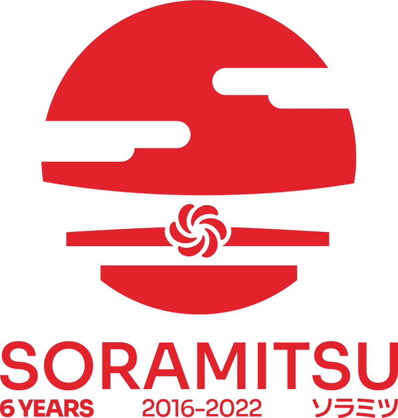
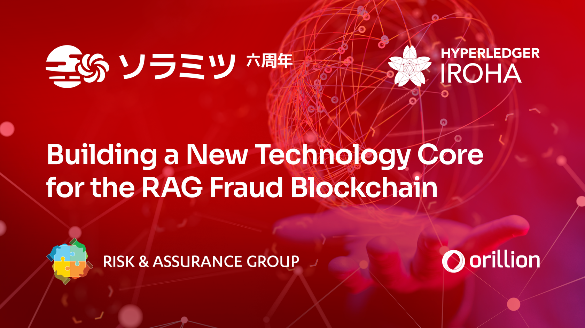
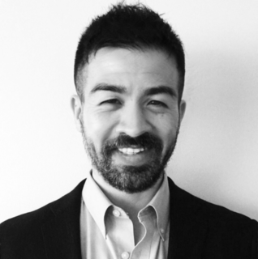

Japanese Next-Gen Developer Builds New Technology Core for the RAG Fraud Blockchain

PRESS RELEASE

SORAMITSU Co., Ltd. 
Shibuya-ku, Tokyo, Japan

[info@soramitsu.co.jp](mailto:info@soramitsu.co.jp) 
[soramitsu.co.jp](https://soramitsu.co.jp)

**FOR IMMEDIATE RELEASE 
**Tuesday, October 20, 2022 

# Japanese Next-Gen Developer Builds New Technology Core for the RAG Fraud Blockchain

## → SORAMITSU are experts at creating blockchains that are secure and scalable whilst supporting tokenization and permissioned access.

The rapid growth of the RAG Wangiri Blockchain, a consortium where telcos use a distributed ledger to exchange intelligence about wangiri fraud, has led to the redevelopment of its technology core by [SORAMITSU](https://soramitsu.co.jp/), expert developers of permissioned blockchains. Based in Tokyo and Zug, SORAMITSU are the authors of [Hyperledger Iroha](https://www.youtube.com/watch?v=U6XwGlfJLGA), a form of blockchain that only allows data to be shared with peers under specified conditions, making it ideal for solutions that rely on controlled access to sensitive data. The new core has simultaneously been redesigned to permit the exchange of data concerning an expanding range of frauds, leading the service to be renamed the RAG Fraud Blockchain. 
 
SORAMITSU has partnered with the [Risk & Assurance Group (RAG)](https://riskandassurancegroup.org/) and [Orillion Solutions](https://www.orillionsolutions.com/), the original developers of the RAG Wangiri Blockchain, by taking a stake in a new joint venture company that owns the rights to the technology created for the consortium. This next-generation blockchain ledger will lever SORAMITSU's expertise in delivering solutions that require real-time updates, unimpeachable trust, and the use of tokens to earn and buy rights within the blockchain ecosystem. This will further RAG's vision of creating a fraud intelligence exchange where telcos that actively contribute their data will earn the right for continued free access, whilst other firms and organizations including software vendors and law enforcement agencies may pay for access or else be granted visibility of strictly limited subsets of the common ledger. 
 
SORAMITSU has considerable experience of developing secure and scalable blockchain-based solutions for the electronic communications and financial sectors. In 2018 they were selected by the National Bank of Cambodia to provide the core for Bakong, the world's first blockchain-based, central-bank-operated national payment infrastructure. Bakong has run successfully with real money and no security issues since 2019, prompting SORAMITSU's recognition with a FinTech & RegTech Global Award in 2020 and a Japan Financial Innovation Award in 2021. Other SORAMITSU collaborations involve the authentication and settlement of transactions with commercial banks, universities and securities depositories in Indonesia, Slovenia, Japan and Russia as well as providing the technology for decentralized peer-to-peer financial transactions on both Android and iOS mobile phones. 
 
The following aspects of Hyperledger Iroha make it ideal for the RAG Fraud Blockchain. 
 

* _Security and resilience:_ Iroha has been audited by Nettitude and stress-tested as a component of system-critical financial infrastructure. Its Byzantine fault tolerant consensus mechanism ensures that data will remain secure even if multiple nodes are compromised by accidents or bad actors.
* _Computational efficiency and scalability:_ Iroha's approach to blockchain is straightforward: be a blockchain, not an operating system. Its parsimonious architecture offers high speed, throughput, and scalability without a loss of functionality or security. This is crucial given the volume of data that a worldwide anti-fraud consortium can expect to generate and process.
* _Flexibility and user-centricity:_ Iroha's roles-based permission system will expedite services and functions tailored to multiple stakeholder groups: multinationals, wholesale carriers, retail service providers, regulators, LEAs, IGOs, NGOs, etc.
* _Modularity and extensibility:_ Iroha is an open-source contribution to the Hyperledger project, which means that user data will never be locked in with a single technology provider. A simple command line interface offers a low barrier to entry, while SDKs in multiple languages provide complex development options for experienced users. Iroha v2 incorporates a new smart contract layer, enabling conditional functions to be designed in response to consortium member needs.

 

The migration to the new core also opens the door to important new features. 
 

* Development of the event record tokenization scheme to enable fair and reliable incentivisation of peer contributions.
* Debut of a redesigned user interface and a front-end enriched with new analytics and data visualizations.

 

The Hyperledger Project has much in common with RAG's anti-fraud initiative: both are community-led initiatives which synergize the practical knowledge of many professionals dedicated to making technology work for the common good. SORAMITSU contributed Hyperledger Iroha to the public out of a commitment to this vision, and has taken the lead in maintaining it out of confidence that the quality of their efforts will attract the right kind of business partners. The work of the business partners confirms SORAMITSU shares RAG's passion for cooperation, creativity, and technical precision. 
 
SORAMITSU Chief Operating Officer Andrew Wong said of the new partnership: 

* * *

_As the original developers of Hyperledger Iroha, we are honored to work with both RAG and Orillion to fight telecoms fraud, whilst illustrating the powerful uses and scalability of blockchain technology. We are excited to help build a more secure future for telecoms and the billions of people who trust and depend on their services._

 

Andrew Wong

COO, SORAMITSU Group 
 

* * *

Katsuhiro Otake, Chief Financial Officer of SORAMITSU explained why they backed this venture.

* * *

 

Katsuhiro Otake

CFO, SORAMITSU Group 
 

_The management team of SORAMITSU is building its corporate value through two strategies: generating fee revenues and investing in the product mix and business franchise. 
 
The RAG Fraud Blockchain represents a significant investment in the telecommunications community by SORAMITSU. As you know, the first-round of applications developed using blockchain and distributed ledger technology were focused towards financial and banking services; this was what Satoshi Nakamoto designed Bitcoin for, and this was where SORAMITSU built its reputation as a start-up enterprise. The main battlefield of the next round of development will set the agenda in different industries, such as providing solutions to the problems faced by telecommunication businesses. 
 
This new product and business franchise shall place SORAMITSU in a position to provide technology that creates bridges for data, value and fraud intelligence between telecommunications and other business sectors. Because of this, we expect the RAG Fraud Blockchain will become a keystone of the infrastructure of the future._ 

* * *

The technology to pool intelligence is affordable and realizable. It can be built in such a way that telcos could port the data to other systems, and responsibility for governance given to a new organization, if they feel the consortium is not being run to their satisfaction. We needed developers with the will to construct the technology, and SORAMITSU have stepped up. Now it is up to telcos to find the courage to use fraud intelligence for the common good. The turbulence caused by an onslaught of telecoms fraud means the good of the community is now synonymous with the interests of any telco that intends to be in business by the end of this decade, because the alternative is to allow customers to increasingly turn away from their phones as they become disaffected. This is a potential turning point in the history of fraud management. Please help us to make it happen. 
 
Apply for access to the RAG Fraud Blockchain on behalf of your business by registering with the [web portal](https://fraudblockchain.riskandassurancegroup.org/). 
 

* * *

Originally posted in [https://commsrisk.com/japanese-next-gen-blockchain-developer-builds-new-technology-core-for-the-rag-fraud-blockch](https://commsrisk.com/japanese-next-gen-blockchain-developer-builds-new-technology-core-for-the-rag-fraud-blockch)
