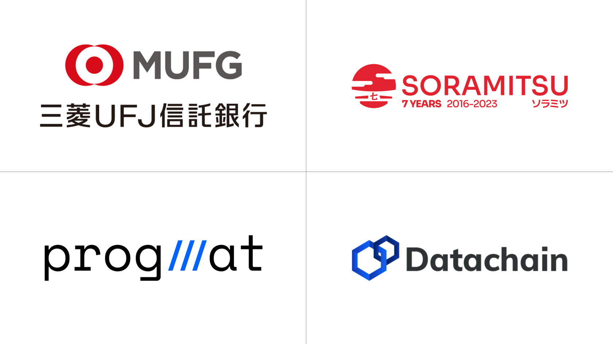
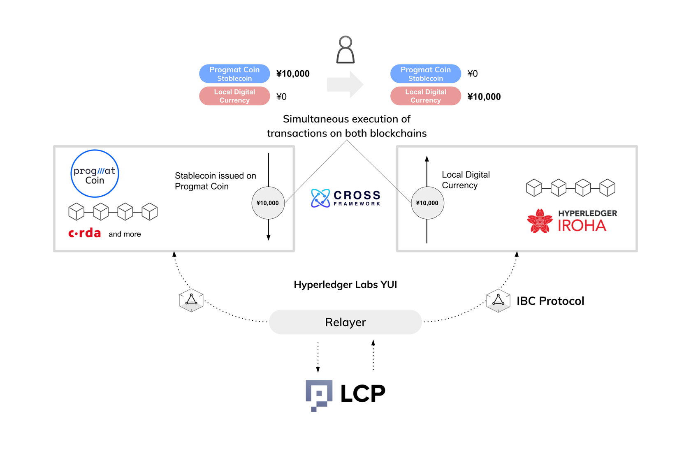
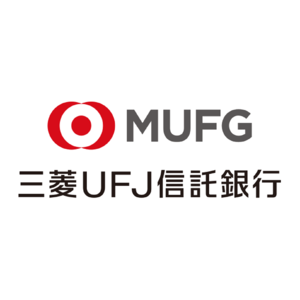

Technology Alliance to Enable Smooth Mutual Transfer and Exchange of a Wide Variety of Stablecoins in Japan

PRESS RELEASE

SORAMITSU Co., Ltd. 
Shibuya-ku, Tokyo, Japan

[info@soramitsu.co.jp](mailto:info@soramitsu.co.jp) 
[soramitsu.co.jp](https://soramitsu.co.jp)

**FOR IMMEDIATE RELEASE 
**Tuesday, March 28, 2023 

**Datachain Corporation 
Mitsubishi UFJ Trust and Banking Corporation 
SORAMITSU Corporation** 

# Technology Alliance to Enable Smooth Mutual Transfer and Exchange of a Wide Variety of Stablecoins in Japan

## → Datachain, Mitsubishi UFJ Trust and Banking Corporation, and SORAMITSU Announce a Technology Alliance to Enable Smooth Mutual Transfer and Exchange of a Wide Variety of Stablecoins to be Issued in Japan.

Datachain, Inc. (headquartered in Minato-ku, Tokyo; Tetsushi Hisata, President; hereinafter "Datachain"), Mitsubishi UFJ Trust and Banking Corporation (headquartered in Chiyoda-ku, Tokyo; Iwao Nagashima, President; hereinafter "Mitsubishi UFJ Trust and Banking") and SORAMITSU Co., Ltd. (headquartered in Shibuya-ku, Tokyo; Kazumasa Miyazawa, President & CEO; hereinafter referred to as "SORAMITSU") launched a technical alliance on March 28 to realize smooth mutual transfer and exchange between a wide variety of stablecoins to be issued in Japan. 

In this initiative, we will conduct proof of concept using various stablecoins issued using the stablecoin issuance and management platform "[Progmat Coin](https://www.tr.mufg.jp/progmat/)" led by Mitsubishi UFJ Trust and Banking, and regional digital currencies by regional banks which are being considered using open source blockchain platform [Hyperledger Iroha](https://iroha.tech) that SORAMITSU contributes to development. For interconnection between different blockchains, we plan to use YUI, IBC1, LCP, etc., which are contributed by Datachain.

In 2022, Japan led the world's developed nations in passing a revision of the Payment Services Act defining a stablecoin as an "electronic means of payment." The bill is scheduled to go into effect in 2023, creating excitement in what could be called the "first year of stablecoin."

In light of such trends, this initiative aims to realize the mutual transfer of different digital money (PVP settlement2) on a heterogeneous blockchain infrastructure using stablecoins issued using Progmat Coin, a stablecoin issuance and management platform led by Mitsubishi UFJ Trust and Banking Corporation, and local digital currencies issued using Hyperledger Iroha that SORAMITSU contributes to development.

This will enable smooth mutual transfers and exchanges among the various stablecoins and local digital currencies that are planned to be issued by various banks and other institutions in the future, aiming to improve efficiency and reduce fees for interbank, business, and personal remittances. In the future, we will also consider cross-border remittance efficiency and fee reductions through mutual transfers and exchanges with overseas CBDCs, etc.

Progmat Coin, a stablecoin issuance and management platform led by Mitsubishi UFJ Trust and Banking Corporation, uses Corda as a distributed ledger for transfer records, in compliance with the new legislation that will begin in 2023, through a trust scheme. We plan to issue both "Permissioned stablecoins" and "Permissionless stablecoins" using so-called public blockchains such as Ethereum.

SORAMITSU has contributed to the development of Hyperledger Iroha, an open-source blockchain platform led by The Linux Foundation, and Hyperledger Iroha has been used as a platform for issuing CBDC and local digital currencies in Japan and overseas, including the official launch of the [Central Bank Digital Currency "Bakong" in the Kingdom of Cambodia](https://soramitsu.co.jp/bakong-press-release) and [CBDC proof of concept called "DLAK/Digital Lao Keep" in Lao PDR](https://soramitsu.co.jp/dlak-cbdc). SORAMITSU is also [working with the Asian Development Bank (Philippines)](https://soramitsu.co.jp/blockchain-based-cross-border-securities-settlement-system) and other organizations to connect different blockchains and conduct proof of concept for international securities settlement.

In order to achieve mutual transfer of multiple stablecoins / digital money on different blockchains such as Corda and Hyperledger Iroha, technology is needed to interconnect both blockchains and execute transactions on both blockchains simultaneously.

Such connections between multiple blockchains include "YUI," a blockchain interoperability project led by Datachain in research and development, "IBC," a messaging protocol adopted by YUI, It is planned to use middleware such as "LCP" that enables interoperability.

Stablecoins are expected to minimize friction in the settlement of securities and other digital assets and NFTs, as well as to be used for international remittances and micropayments, thereby improving the convenience of various payment scenarios.

By connecting different blockchains in a secure and practical way, we will maximize the potential of stablecoins and build the world's most advanced use cases to create a financial infrastructure that will be used globally.

* * *

**1 — IBC:** Abbreviation for Inter-blockchain communication, a specification standard to ensure interoperability between blockchains, which is being developed by the Interchain Foundation and the Cosmos project. 
 
**2 PVP settlement:** Abbreviation for Payment Versus Payment settlement. Simultaneous settlement between different currencies. 

(Hereafter, only Datachain Inc.) 
Datachain Inc. is a subsidiary of Speee Corporation (Head office: Minato-ku, Tokyo; President: Hideki Otsuka; TSE Standard Market: 4499). 
The names of companies, products and services mentioned herein are the trademarks or registered trademarks of their respective owners. 

* * *

**About Datachain**

[datachain.jp](https://datachain.jp)

Company name: Datachain Corporation 
Established: March 2018 
Location : 3-2-1 Roppongi, Minato-ku, Tokyo 
Representative: Tetsushi Hisada, Representative Director 

* * *

**About Mitsubishi UFJ Trust and Banking Corporation (and "Progmat")**

[tr.mufg.jp](https://tr.mufg.jp)[ 
tr.mufg.jp/progmat](https://tr.mufg.jp/progmat)

Company Name : Mitsubishi UFJ Trust and Banking Corporation 
Established : March 10, 1927 
Location : 1-4-5 Marunouchi, Chiyoda-ku, Tokyo 
Representative: Iwao Nagashima, President & CEO 

* * *

**About SORAMITSU**

[soramitsu.co.jp](https://soramitsu.co.jp)

SORAMITSU is an award-winning global financial technology company with expertise in developing blockchain-based solutions for digital asset and identity management. Our mission is to use blockchain to promote innovation and solve pressing societal challenges. 
 
SORAMITSU is the developer of and major contributor to the open-source blockchain platform [Hyperledger Iroha](https://www.hyperledger.org/use/iroha), which is tailored for enterprise and public-sector use. Hyperledger Iroha, a project of Hyperledger Foundation, part of the Linux Foundation, has a permissions system that is scalable and performant. 

Utilizing blockchain, SORAMITSU has developed a digital currency for the [National Bank of Cambodia](https://soramitsu.co.jp/bakong-press-release), a CBDC Proof-of-Concept [with the Bank of the Lao PDR](https://soramitsu.co.jp/dlak-cbdc), a closed-loop payment system for the University of Aizu in Japan, an identity verification system prototype for Bank Central Asia in Indonesia, we were finalists in the [Monetary Authority of Singapore CBDC Challenge](https://soramitsu.co.jp/global-central-bank-digital-currency-challenge/), and are currently participating in Asia-Pacific's first proof-of-concept test of a cross-border, multi-currency security settlement system using distributed ledger technology with the Asian Development Bank. We have also conducted proof-of-concept tests for several major Japanese enterprises, and are active contributors to open source projects, such as [Klaytn](https://soramitsu.co.jp/klaytn-dex), South Korea's leading Layer-1 blockchain, [KAGOME](https://github.com/soramitsu/kagome), the C++ [Polkadot](https://polkadot.network/) Host implementation, the [SORA](https://sora.org/) crypto-economic system, the [Polkaswap](https://polkaswap.io/) DEX, and the DeFi wallet, [Fearless Wallet](https://fearlesswallet.io/). 
 
Based on these experiences, SORAMITSU aims to deploy cutting-edge technology on a global level in order to expedite financial inclusion and health, mitigate economic inefficiencies, and contribute to the fulfilment of the Sustainable Development Goals. 

* * *

SEE ALSO:

**Japanese Next-Gen Developer Builds New Technology Core for the RAG Fraud Blockchain** 
SORAMITSU are experts at creating blockchains that are secure and scalable whilst supporting tokenization and permissioned access. 

[

Learn more

](https://soramitsu.co.jp/soramitsu-and-rag)

Follow SORAMITSU's [news and latest partnerships and developments here](https://soramitsu.co.jp/#news)_._ 

GET IN TOUCH AND FOLLOW:

* * *
