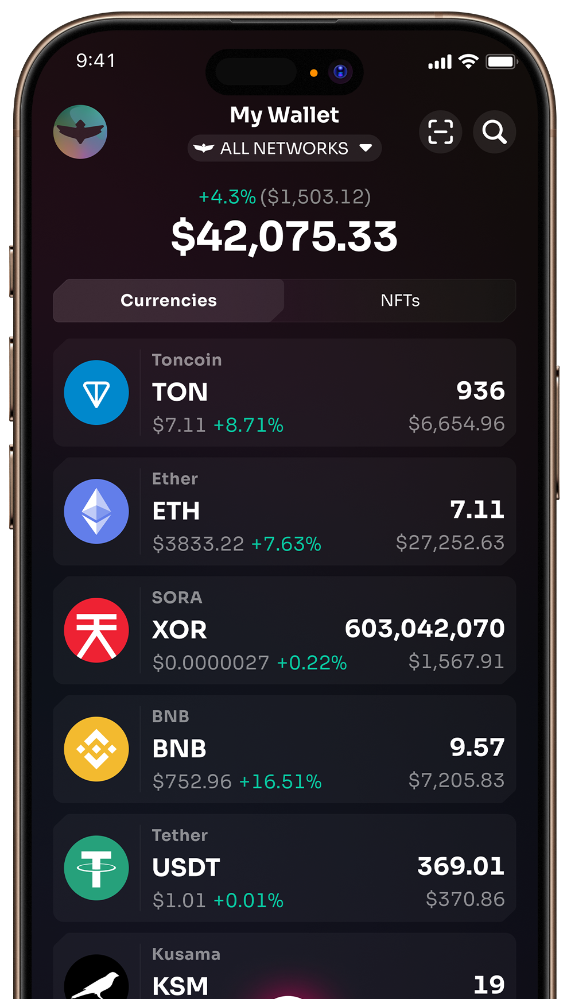
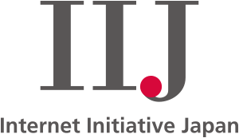
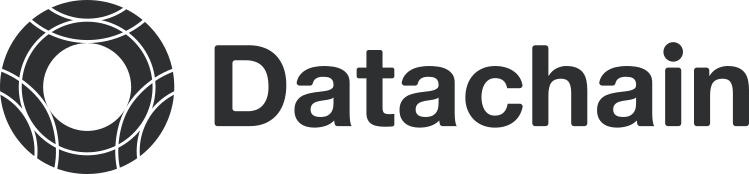

Soramitsu is an award-winning blockchain technology leader revolutionizing global payments, empowering governments, advancing Web3 infrastructure and transforming telecoms.

We use only necessary cookies to ensure you get the best experience

OK

[Get in touch](#contact)

# Shaping Tomorrow, Today

Soramitsu is an award-winning blockchain technology leader, **|**

[Learn more](#about) [Get in touch](#contact)

About

Soramitsu bridges cutting-edge blockchain technology with real-world business and governmental needs.

Our expertise includes:

* Creating national payment systems
 
 Bakong is Cambodia's next-generation Real-Time Gross Payments System that promotes financial inclusion and allows you to do everything — digital wallets, mobile payments, online banking and financial applications — all in one place.
 
 [Learn more](https://soramitsu.co.jp/bakong-press-release)
 
* Building CBDCs for governments
 
 Bokolo Cash is a blockchain-based CBDC platform that enables secure, efficient financial transactions and has successfully simulated cross-border transactions via a bridge to public blockchains.
 
 [Learn more](https://soramitsu.co.jp/bokolo-cash)
 
* Developing blockchain-based savings bonds
 
 Palau Invest is a blockchain-based digital savings bond system designed to empower Palauan citizens to invest in national infrastructure projects, promoting economic growth and financial inclusion, developed by Soramitsu in collaboration with the Government of Palau.
 
 [Learn more](https://soramitsu.co.jp/palauinvest)
 
* Transforming telecom with decentralization
 
 Fraud Intelligence Limited stands as the global leader and trusted authority in shared fraud intelligence. Backed by a powerful consortium of telecom operators and vendors, it is co-led by Soramitsu and Orillion, united by a shared mission to combat fraud effectively.
 
 [Learn more](https://fraudintelligencelimited.com/)
 
* Developing tailored Web3 solutions
 
 Zenswap is a cross-chain liquidity platform being developed by Soramitsu as a joint venture with Analog, enabling seamless and secure asset swaps across multiple blockchains using USDC-based routing and advanced interoperability technology.
 
 [Learn more](https://zenswap.io/)
 

250K+ users | 80+ networks

## The Fearless DeFi Wallet

Fearless Wallet makes DeFi simple for beginners and unlocks advanced features for pros. Learn more at **[fearlesswallet.io](https://fearlesswallet.io/)** 
 
Made with ❤️ by Soramitsu

## Our services

Soramitsu is an award-winning global financial technology company specializing in developing blockchain-based solutions for digital asset management, digital identity, and financial infrastructure. With extensive experience in creating central bank digital currency (CBDC) systems, secure payment platforms, identity verification solutions, and multi-currency settlement systems, Soramitsu leverages blockchain technology to address societal challenges and drive innovation. 
 
As an active contributor to open-source projects, Soramitsu has played a key role in developing blockchain frameworks such as Hyperledger Iroha and major crypto-economic systems like SORA and Polkaswap. Soramitsu also collaborates with industry leaders to enhance blockchain technology, focusing on enterprise, public sector, and DeFi applications. Our mission is to deploy advanced technology globally to promote financial inclusion, economic efficiency, and sustainable development.

* ### Blockchain and Web3 Development
 
 * **Digital Asset Solutions:** Create central bank digital currencie systems (CBDCs), private tokens, asset tokenization platforms, and integrate secure wallets.
 
 
 
 * **Web3 and DeFi Expertise:** Develop cutting-edge decentralized exchange (DEX) platforms, staking mechanisms, cross-chain bridges, and seamless TradFi-DeFi integrations.
 
 
 
 * **Enterprise Blockchain Solutions:** Enhance operational efficiency in logistics, finance, and supply chains with bespoke blockchain solutions.
 
 
 
 * **Security and Audits:** Perform comprehensive smart contract and blockchain system audits to ensure robust and reliable operations.
 
* ### DevOps, QA, and Security
 
 * Comprehensive support across **DevOps, QA, and Security** to streamline product delivery.
 
 
 
 * **Infrastructure Automation:** Implement automated systems to enhance efficiency and reduce operational costs.
 
 
 
 * **Scalable and Stable Solutions:** Deliver tailored approaches that prioritize scalability and product reliability.
 
* ### Corporate Training
 
 * **Customized Training Programs:** Offer Web3, Blockchain, DevOps, Security, and QA training tailored to your team’s skill levels.
 
 
 
 * **All Experience Levels:** Cater to beginners and advanced learners with hands-on, practical modules.
 
* ### Outstaffing and Recruitment
 
 * **Expert Talent Pool:** Access top-tier professionals in blockchain, Web3, DevOps, QA, frontend, and backend development.
 
 
 
 * **Rigorous Screening:** Ensure the perfect fit with customized recruitment solutions and thorough candidate evaluations.
 
* ### Product Design, UX/UI, and Brand Experience
 
 * **Product Design:** Craft innovative designs that align with user needs and business goals.
 
 
 
 * **UX/UI Design:** Create intuitive interfaces and seamless user experiences to maximize engagement.
 
 
 
 * **Brand Experience:** Build cohesive, impactful brand identities that resonate across platforms and channels.
 
* ### Marketing, Ecosystem Growth, Tokenomics and Education
 
 * **Marketing Strategies:** Design and execute targeted campaigns to amplify product visibility and drive growth.
 
 
 
 * **Ecosystem Growth:** Implement strategies to nurture and expand blockchain networks through partnerships, community building, and developer engagement.
 
 
 
 * **Tokenomics Design:** Develop sustainable token economic models to support your blockchain project’s ecosystem.
 
 
 
 * **Education Initiatives:** Empower communities with accessible educational content to promote Web3 adoption and ecosystem participation.
 

RECOGNITION

Awards

We are honored and grateful to have received recognition for our groundbreaking work.

SELECTED CASE STUDIES

Our groundbreaking projects

From the creation of advanced blockchain frameworks and national payment systems to cross-border solutions, telecom fraud prevention, and decentralized autonomous economies, our projects define the future of fintech and DeFi.

* Iroha
* Bakong
* FIL
* SORA
* Polkaswap
* Fearless
* ADAR
* Klaytn
* Byacco
* Kagome
* Fuhon

Hyperledger Iroha 2 — The World's Most Advanced Blockchain Framework

Discover Hyperledger Iroha 2, the world's most advanced blockchain framework, powering CBDCs, cryptocurrencies, and DeFi. Simple, yet powerful to use, Hyperledger Iroha 2 is designed for simplicity, security, and flexibility. Hyperledger Iroha 2 is powering a better world, using decentralized technologies. 
 
Soramitsu was the original developer of Hyperledger Iroha and contributed it to the Linux Foundation's (now [LF Decentralized Trust](https://www.lfdecentralizedtrust.org/)) Hyperledger Project. 
 
Soramitsu uses Hyperledger Iroha 2 to create services for users, including mobile applications for managing digital assets, identity, and contracts. Through our use of Hyperledger Iroha, we hope to contribute to a safer and more efficient society. 
 
As the initial developer and main contributor, Soramitsu provides technical and business support for Hyperledger Iroha. Please contact us if you need support for Hyperledger Iroha.

[Learn more](https://iroha.tech/)

Bakong — Next-Gen Real-Time Gross Payments System

A collaboration between Soramitsu and the National Bank of Cambodia, Bakong is a next-generation Real-Time Gross Payments System that promotes financial inclusion through a friendly yet powerful iOS and Android app. 
 
RTGPS is the revolutionary and unique DLT core solution that allows for real-time gross domestic and cross-border payments between any and all account holders on a single platform. 
 
The Bakong central bank digital currency (CBDC) is a secure alternative to paper bank notes designed to function within the parameters required by the banking system. 
 
Using a secure and standardized digital currency as a means of payment can increase trust and confidence in the payment system.

[Learn more](https://www.lfdecentralizedtrust.org/case-studies/soramitsu-case-study)

Fraud Intelligence Limited — The undisputed leader and trusted source of shared fraud intelligence globally

Fraud Intelligence Limited is a joint venture between Soramitsu, Orillion and other leading parties, dedicated to building an ecosystem that empowers our customers to fight fraud in a cooperative way, with the vision to become the most sought after and trusted source of shared fraud intelligence globally. 
 
The new fraud blockchain has been built using Hyperledger Iroha, an industry-leading distributed ledger technology originally developed by Soramitsu and contributed to the Hyperledger Foundation, which is an open sourced permissioned blockchain distinguished by a secure and scalable architecture; this is the same cutting edge technology that is used by central and private commercial banks to manage digital currencies. 
 
The fraud blockchain continues the same ethos that was established with its predecessor, the wangiri blockchain, where telcos can download fraud data for free by earning credits from the intelligence they have uploaded. The big difference to telcos is they will now have the opportunity to exchange intelligence about a greater variety of crimes that will keep expanding over time.

[Learn more](https://fraudintelligencelimited.com/)

SORA: The First Blockchain Monetary System

SORA is an adaptive, non-debt-based monetary framework built to enable economic monetary stability for financially vulnerable countries.

[Learn more](https://sora.org/)

Polkaswap — Trade with Style and Freedom

Experience the future of DeFi on Polkaswap — your gateway to interoperable, fast, and secure crypto trading.

[Learn more](https://about.polkaswap.io/)

The Fearless DeFi Wallet

Fearless Wallet makes DeFi simple for beginners and unlocks advanced features for pros.

[Learn more](https://fearlesswallet.io/)

ADAR: Advanced Digital Asset Routing

ADAR simplifies the payment process for small and mid-size businesses by making it easy and cost-effective to pay large numbers of global suppliers and employees on a recurring basis.

[Learn more](https://adar.com/)

Klaytn Open-Source DEX

Developed as a white-label DEX under Klaytn community grant KIR#13 in the Klaytn ecosystem, enhancing liquidity and accessibility in the Klaytn network and cementing Soramitsu's role as a trusted technology provider for the biggest blockchain network in Korea.

[Learn more](https://soramitsu.co.jp/klaytn-partnership-success-story)

Introducing Byacco — a unique local payment system for the University of Aizu, Japan.

Byacco is the first local digital coin originally developed for the University of Aizu, Japan. It is based on blockchain technology for more secure and reliable payments. Byacco is the first local payment solution based on a high-end Distributed Ledger Technology designed and developed by Soramitsu.

[Learn more](https://soramitsu.co.jp/byacco)

KAGOME, a C++ Implementation of the Polkadot Host

KAGOME is a C++ implementation of the Polkadot Host developed by Soramitsu and funded by a Web3 Foundation grant. 
 
KAGOME will complement parallel development work in Rust, Golang, and Javascript, contributing to the overall resilience of the Polkadot ecosystem and opening up access to the large, well-established, and enterprise-friendly C++ developer community (estimated at 4.4 million). The Web3 grant also covers a C++ implementation of the libp2p modular networking stack. 
 
With KAGOME, all Soramitsu projects can be connected to blockchains supporting Polkadot, thus becoming a part of the next-generation decentralized web.

[Learn more](https://soramitsu.co.jp/kagome-press-release)

Fuhon — C++ implementation of the Filecoin protocol

Filecoin has announced two additional implementations of the Filecoin protocol: Forest – being implemented in Rust by ChainSafe, and Fuhon – being implemented in C++ by Soramitsu. These implementations are in active development, and are now fully open for anyone to use or contribute to. Check them out on GitHub!

[Learn more](https://github.com/filecoin-project/cpp-filecoin)

## Meet our team

With an established presence in six countries and team members across ~30 more, our 120+ professionals bring diverse expertise and experience, forming a global workforce committed to advancing decentralized technologies for a better world.

* 
 
 Makoto Takemiya, PhD
 
 **CEO | Co-Founder | Blockchain Engineer** 
 Before founding Soramitsu, Makoto worked as a research engineer at ATR's Department of Neuroinformatics. He has authored over 20 peer-reviewed scientific papers. Additionally, he has worked on various blockchain projects in the past. He holds a PhD from University of Tokyo.
 
* 
 
 Ryu Okada
 
 **Co-Founder | Group Chairman** 
 Ryu Okada is a Co-founder and Chairman of Soramitsu. He worked as a Consultant at Deloitte, was a Founder of an e-commerce startup and financial consulting company, and holds a Japan CPA license.
 
* 
 
 Ikkei Matsuda
 
 **Co-Founder | SORA Director** 
 Ikkei Matsuda is the CEO of SARR, LLC, an accelerator for high-tech startups and the former Founder and CEO of Hokkaido Venture Capital.
 
* 
 
 Kazumasa Miyazawa
 
 **President of Soramitsu Japan** 
 Kazumasa Miyazawa is the creator of Edy electronic money and former board member of Rakuten Edy.
 
* 
 
 Andrew Wong
 
 **Chief Operating Officer** 
 Andrew is a product focused technology leader, serving in management roles at both Liquid Group Inc, Yahoo! and 8 Securities (acquired by Sofi). He is an advisor and board member to several Silicon Valley based startups.
 
* 
 
 Dmitriy Creed
 
 **CEO of Soramitsu Labs** 
 Head of the DevOps and Security departments for the Soramitsu Group. Professor of Practice at the Innopolis University. M.S. in SNE from the Innopolis University.
 
* 
 
 Tarmo Vannas
 
 **Chief Design Officer** 
 Head of Product Design and Brand Experience for the Soramitsu Group. Tarmo has over 25 years professional experience across various roles focusing on design and technology. Former Design and Brand Consultant for tech and crypto startups.
 
* 
 
 Travin Keith
 
 **Advisor** 
 Co-founder of Immunefi, a crypto bug bounty platform, and STOKR, a blockchain-based fundraising platform. Co-authored the Hyperledger White Paper, participated in the Blockchain4EU Initiative with the European Commission, and speaks regularly across events worldwide.
 
* 
 
 Tsukasa Ojima
 
 **Advisor** 
 Tsukasa Ojima is the former Vice President of Sanwa Bank California and a former Nomura Securities Executive.
 
* 
 
 Masayuki Shimura
 
 **Advisor** 
 Masayuki Shimura is CEO of Shimura & Partners, director of BASE Inc. and the former Senior Managing Director of Sumitomo Mitsui Banking Corporation.
 
* 
 
 Hideto Ozaki
 
 **Advisor** 
 Hideto Ozaki is Outside Director of Sanden Holdings Corporation, Dean of School of Lean Management, Shanghai Jiao Da Education Group and Management Advisor of Nile Corporation (China). He also was former General Manager of Finance Div. of Toyota Motor Corporation and former CEO of Toyota Financial Services Corporation.
 
* 
 
 Haraguchi Tsunekazu
 
 **Advisor** 
 Tsunekazu Haraguchi is Advisor and former CEO of AEON Bank, Ltd. and former CEO of AEON Financial Service Co., Ltd. He also was Director-General of the Financial Bureau of Ministry of Finance, Director-General of the Planning and Coordination Bureau of Financial Services Agency and Vice President of the former National Life Finance Corporation.
 
* 
 
 Satoshi Hirota
 
 **Advisor** 
 Satoshi Hirota is the Founding Partner at HCA Law Office.
 
* 
 
 Nobuo Nakamura
 
 **Advisor**
 

* 80+
 
 engineers with extensive expertise in blockchain development
 
* 10M+
 
 users served through payment systems
 
* 8+
 
 years of company experience in the blockchain industry
 

## Our partners

We are honored to collaborate with industry leaders and innovators driving blockchain technology forward, fostering financial inclusion, and delivering transformative solutions worldwide. Our partners include central banks and government agencies, helping us develop CBDCs and national payment systems; technology companies and consortia, driving advanced blockchain solutions; financial institutions and startups, fostering innovative fintech products; and academic and research institutions, conducting pioneering technological research.

What our clients say about us

Michael O’Keeffe

Head of Sales and Customer Success at [Immunefi](https://immunefi.com/)

SORAMITSU exceeded our expectations in sharing their knowledge. SORAMITSU listened to our needs and created and presented a comprehensive curriculum. They were prepared, attentive, and responsive to the questions and follow-ups/action items.

Anthony Sani

Co-Founder of [Fraud Intelligence Limited](https://fraudintelligencelimited.com/) and CEO of [Orillion Solutions](https://www.orillionsolutions.com/)

The joint venture was founded on the principles that tackling telco fraud requires both a collective yet creative effort. Through our partners at SORAMITSU: We're excited about what we can bring to strengthen the lives of fraud intelligence professionals everywhere, and to protect users globally.

Sangmin Seo

Chairman at [Kaia](https://www.kaia.io/) DLT Foundation (previously Klaytn Foundation)

We are pleased with the progress made on the Open Source DEX by SORAMITSU. This is a significant milestone and a testament to providing our ecosystem possibilities that create further interoperability, and decentralization within the Klaytn Metaverse.

Michael O’Keeffe

Head of Sales and Customer Success at [Immunefi](https://immunefi.com/)

SORAMITSU exceeded our expectations in sharing their knowledge. SORAMITSU listened to our needs and created and presented a comprehensive curriculum. They were prepared, attentive, and responsive to the questions and follow-ups/action items.

Anthony Sani

Co-Founder of [Fraud Intelligence Limited](https://fraudintelligencelimited.com/) and CEO of [Orillion Solutions](https://www.orillionsolutions.com/)

The joint venture was founded on the principles that tackling telco fraud requires both a collective yet creative effort. Through our partners at SORAMITSU: We're excited about what we can bring to strengthen the lives of fraud intelligence professionals everywhere, and to protect users globally.

Sangmin Seo

Chairman at [Kaia](https://www.kaia.io/) DLT Foundation (previously Klaytn Foundation)

We are pleased with the progress made on the Open Source DEX by SORAMITSU. This is a significant milestone and a testament to providing our ecosystem possibilities that create further interoperability, and decentralization within the Klaytn Metaverse.

## News

Latest news and press releases from Soramitsu

Load more

* * *

## Ready to explore innovative solutions?

Get in touch with us today! Email us at [service@soramitsu.co.jp](mailto:service@soramitsu.co.jp) or fill out the form to schedule a free consultation with one of our experts. Let's bring your vision to life!

Send

By clicking Send you agree to our [Terms and Conditions](/terms) and [Privacy Policy](/privacy)

[Japan Blockchain 
Association](http://www.jba-web.jp)

[Global Blockchain 
Business Council](https://gbbcouncil.org)

[LF Decentralized Trust](https://www.lfdecentralizedtrust.org/)

[Fintech association of Japan](http://www.fintechjapan.org)

Proud member of:

Soramitsu Co. Ltd., Link Square Shinjuku 16F, 5-27-5, Sendagaya, Shibuya-ku, Tokyo, Japan, 151-0051 
 
Soramitsu Helvetia AG c/o Diego Compostella, Oberneuhofstrasse 5, 6341 Baar, Switzerland 
 
[Privacy Policy](/privacy) 
[Terms and Conditions](/terms) 
 
© 2016-2025 SORAMITSU. 
All Rights Reserved.

* [About](#about)
* [Services](#services)
* [Awards](#awards)

* [Case Studies](#casestudies)
* [Partners](#partners)
* [Team](#team)

* [News](#news)
* [Careers](/jobs)
* [Contact](#contact)

* 
* 
* 
* 
* 

Back to top
